# Repeating Earthquake Activity at RCM

## Waveforms
[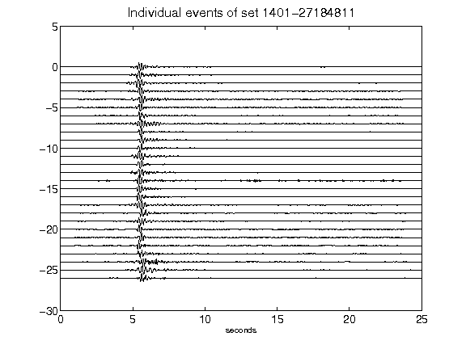](figures/1401-27184811_AllEv.png)[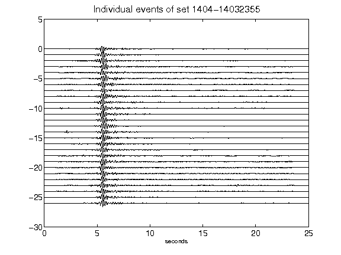](figures/1404-14032355_AllEv.png)[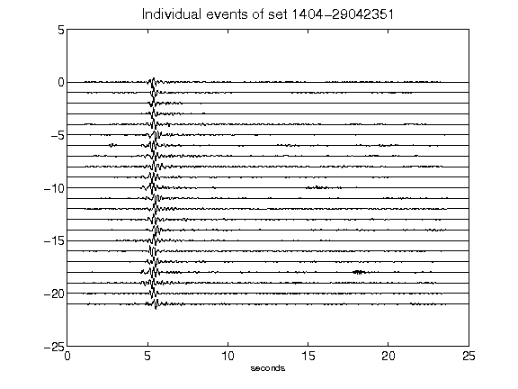](figures/1404-29042351_AllEv.png)[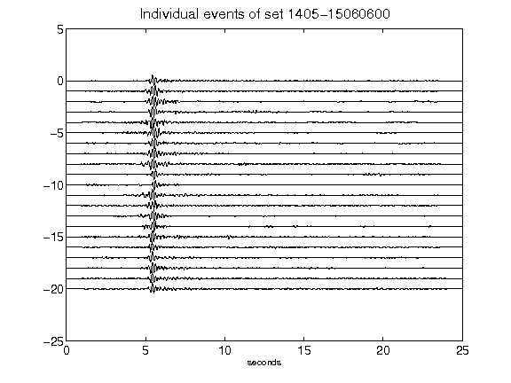](figures/1405-15060600_AllEv.png)[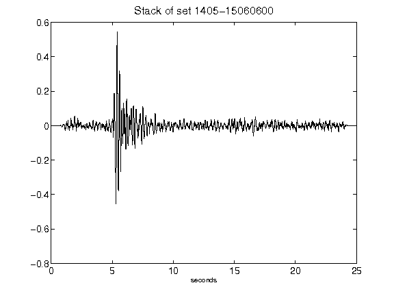](figures/1405-15060600_Stack.png)[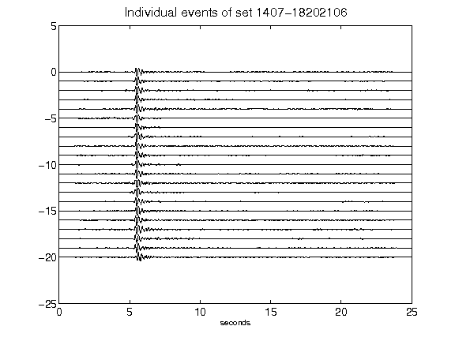](figures/1407-18202106_AllEv.png)[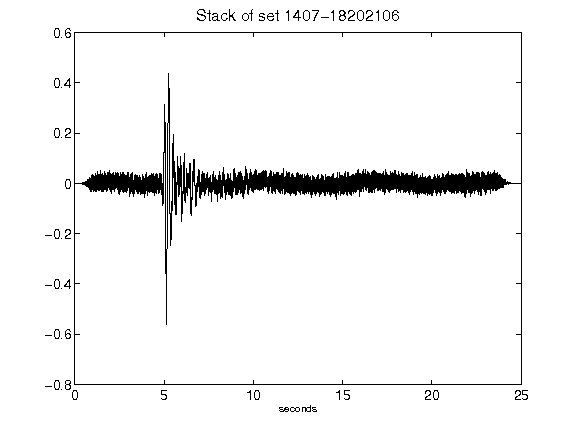](figures/1407-18202106_Stack.png)[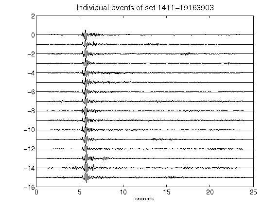](figures/1411-19163903_AllEv.png)[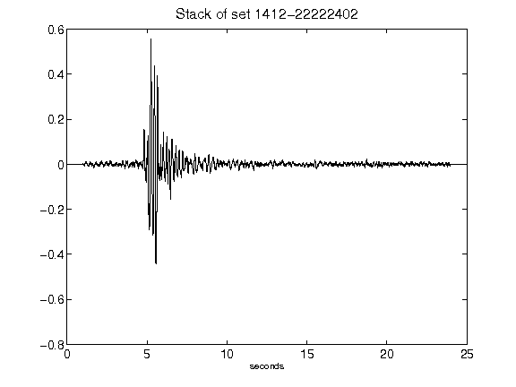](figures/1412-22222402_Stack.png)[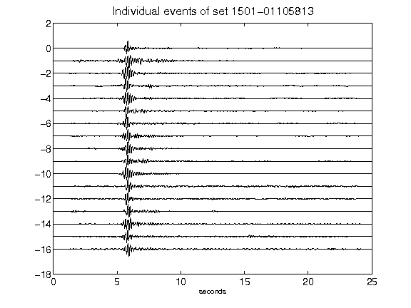](figures/1501-01105813_AllEv.png)[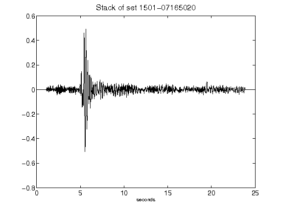](figures/1501-07165020_Stack.png)[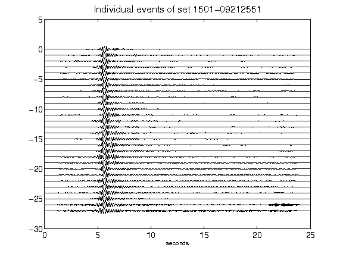](figures/1501-09212551_AllEv.png)[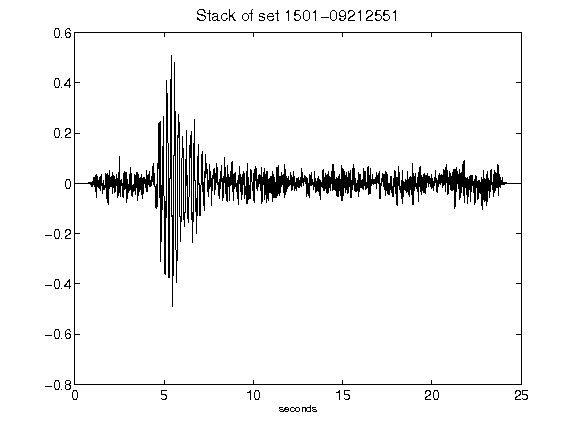](figures/1501-09212551_Stack.png)[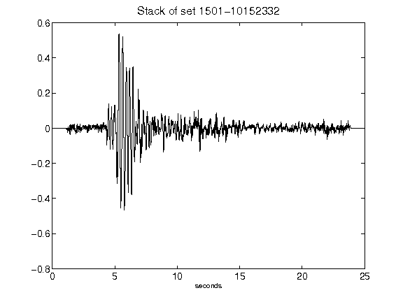](figures/1501-10152332_Stack.png)[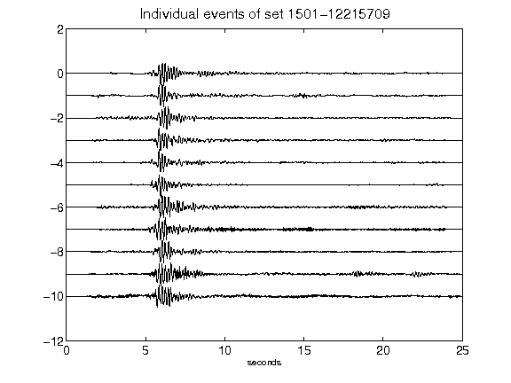](figures/1501-12215709_AllEv.png)[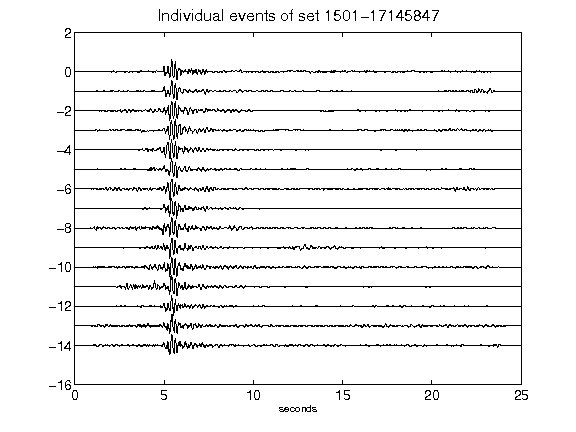](figures/1501-17145847_AllEv.png)[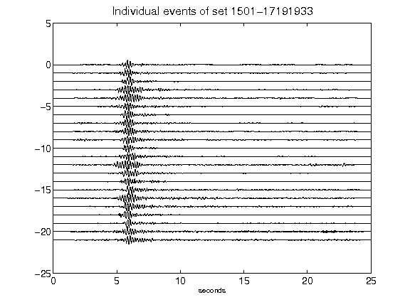](figures/1501-17191933_AllEv.png)[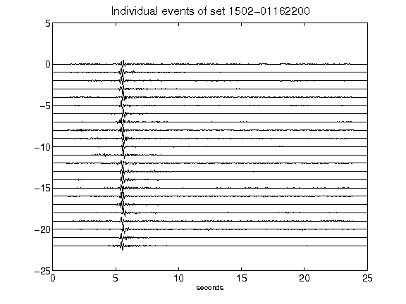](figures/1502-01162200_AllEv.png)[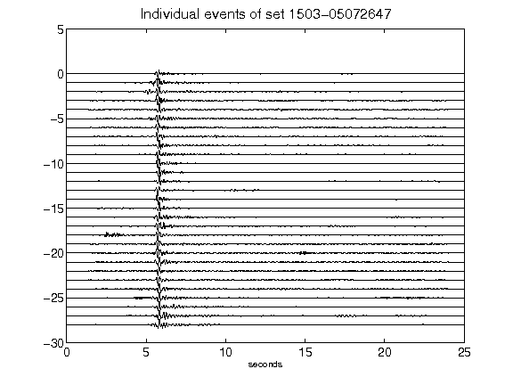](figures/1503-05072647_AllEv.png)[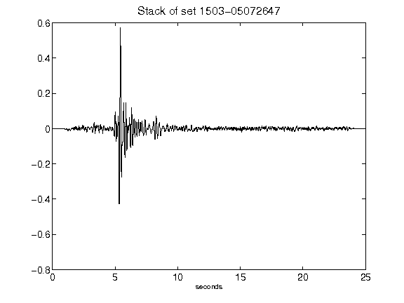](figures/1503-05072647_Stack.png)[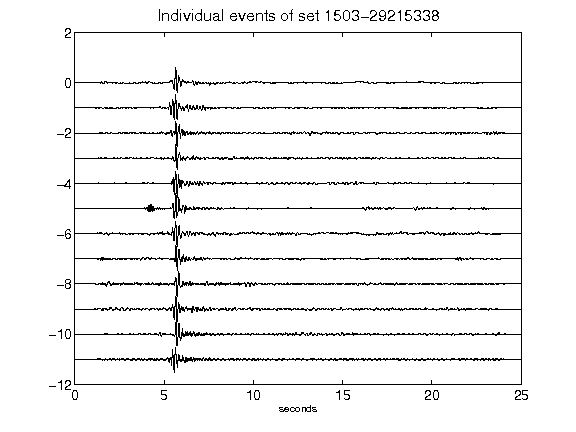](figures/1503-29215338_AllEv.png)[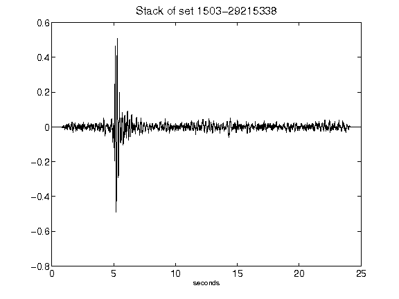](figures/1503-29215338_Stack.png)[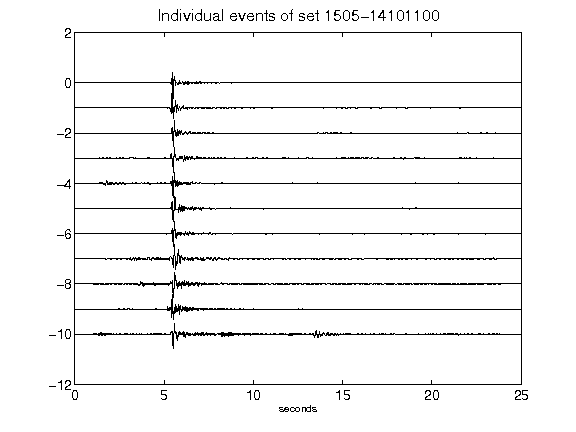](figures/1505-14101100_AllEv.png)[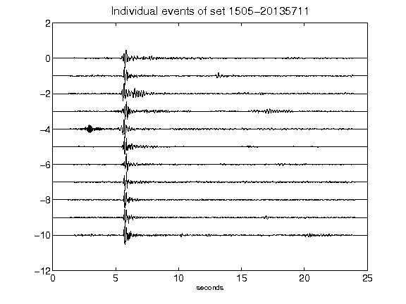](figures/1505-20135711_AllEv.png)[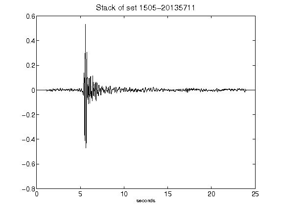](figures/1505-20135711_Stack.png)[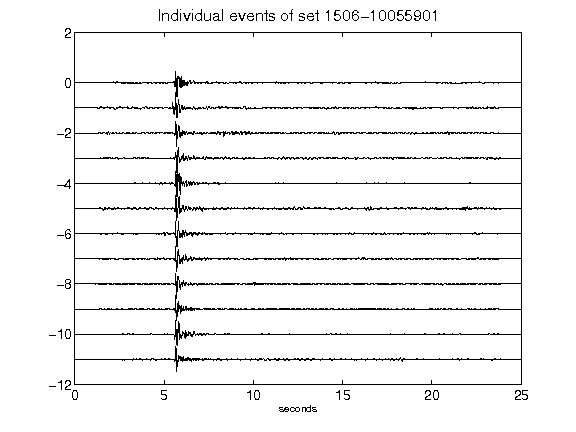](figures/1506-10055901_AllEv.png)[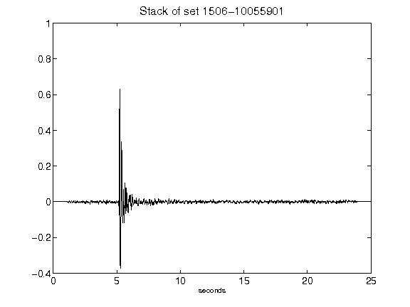](figures/1506-10055901_Stack.png)[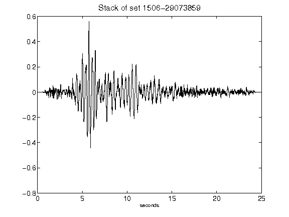](figures/1506-29073859_Stack.png)