# Repeating Earthquake Activity at RCM

## Waveforms
[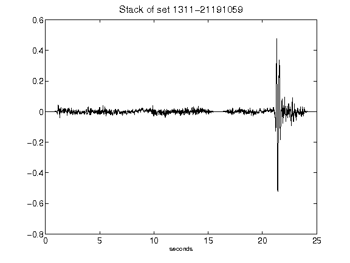](figures/1311-21191059_Stack.png)[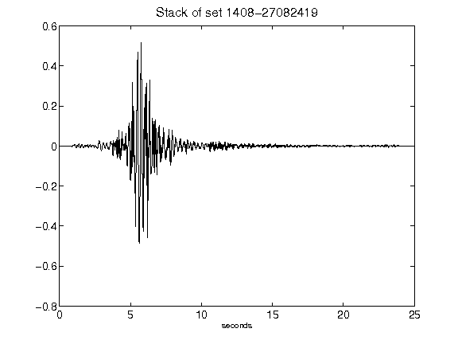](figures/1408-27082419_Stack.png)[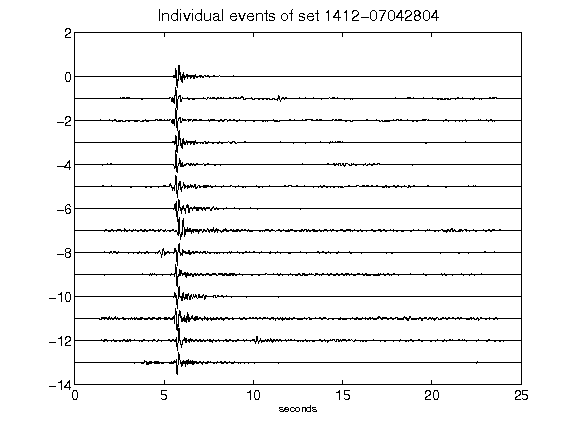](figures/1412-07042804_AllEv.png)[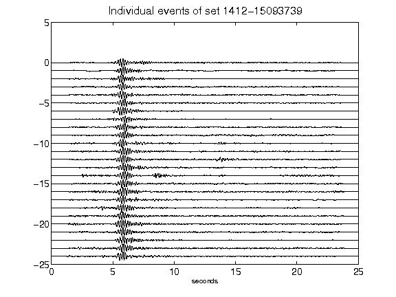](figures/1412-15093739_AllEv.png)[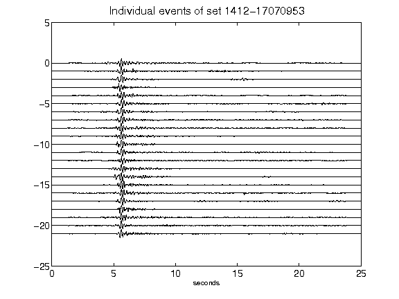](figures/1412-17070953_AllEv.png)[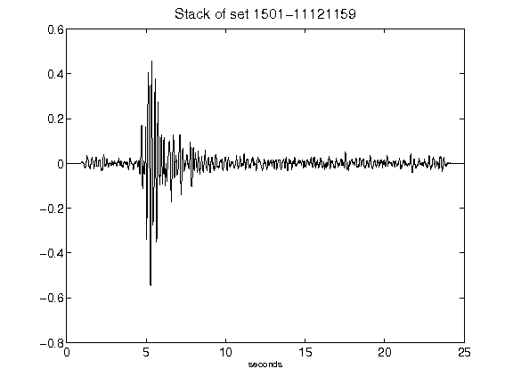](figures/1501-11121159_Stack.png)[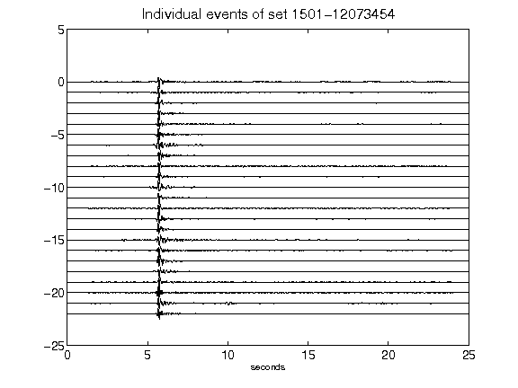](figures/1501-12073454_AllEv.png)[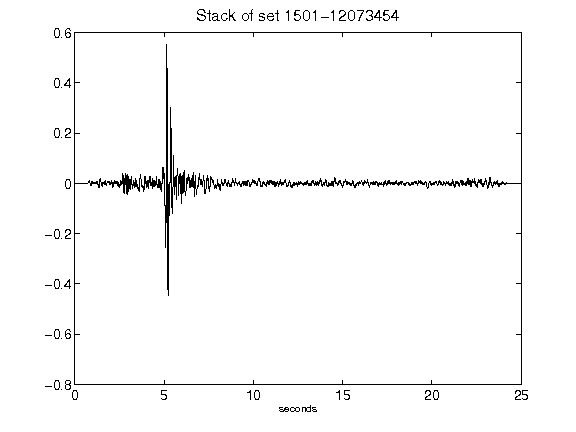](figures/1501-12073454_Stack.png)[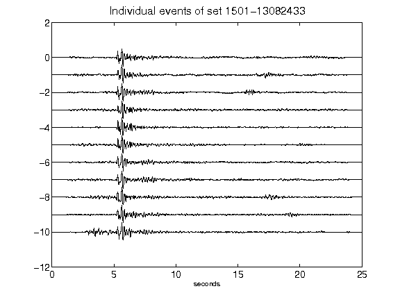](figures/1501-13082433_AllEv.png)[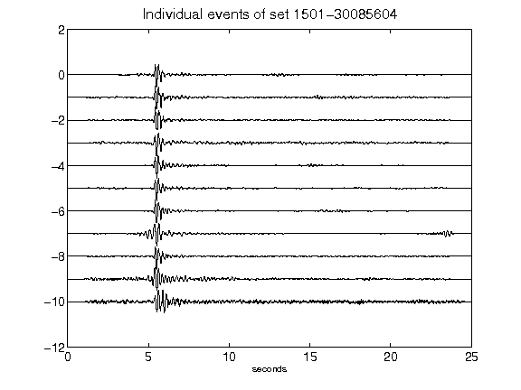](figures/1501-30085604_AllEv.png)[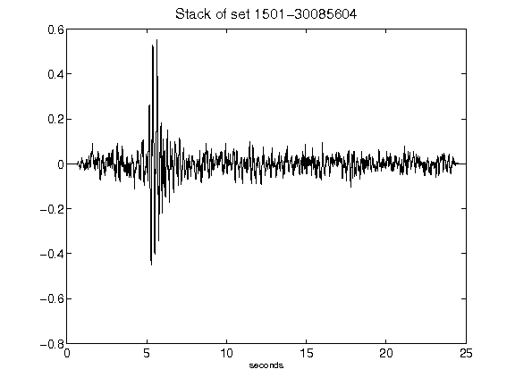](figures/1501-30085604_Stack.png)[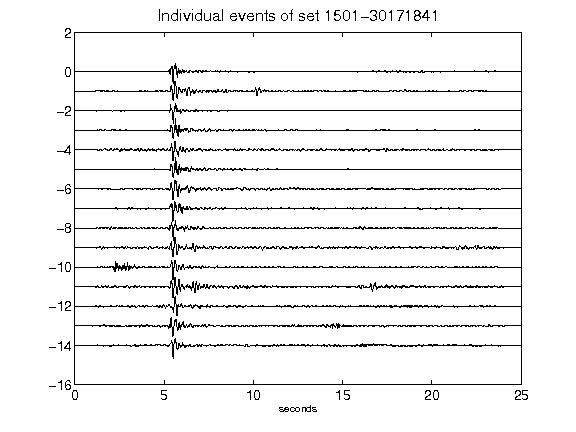](figures/1501-30171841_AllEv.png)[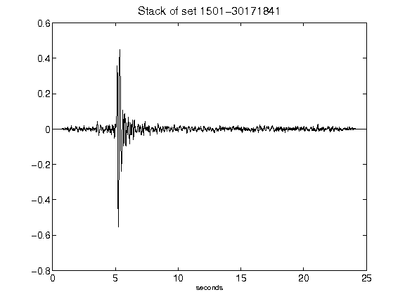](figures/1501-30171841_Stack.png)[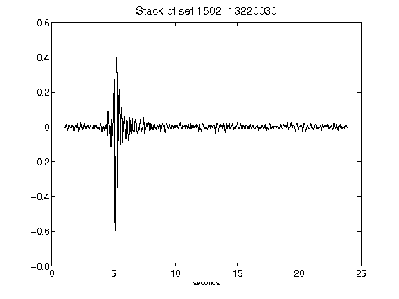](figures/1502-13220030_Stack.png)[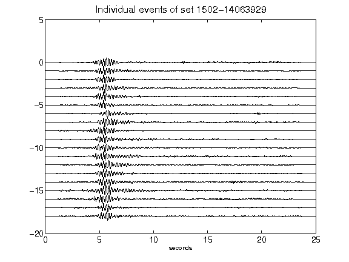](figures/1502-14063929_AllEv.png)[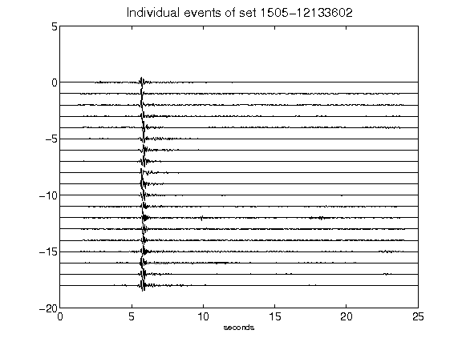](figures/1505-12133602_AllEv.png)[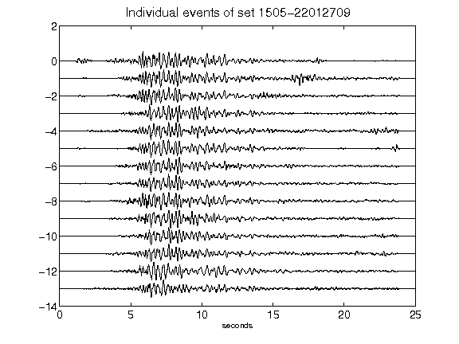](figures/1505-22012709_AllEv.png)[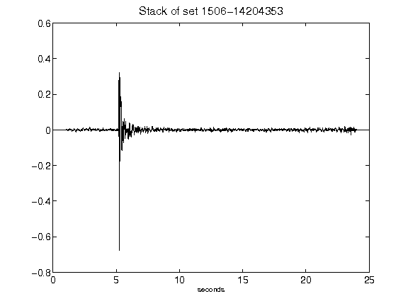](figures/1506-14204353_Stack.png)