# Repeating Earthquake Activity at RCM

## Waveforms
[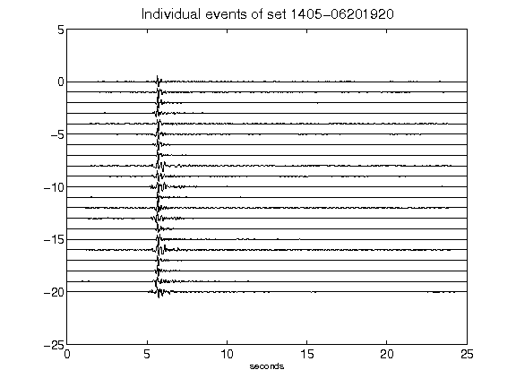](figures/1405-06201920_AllEv.png)[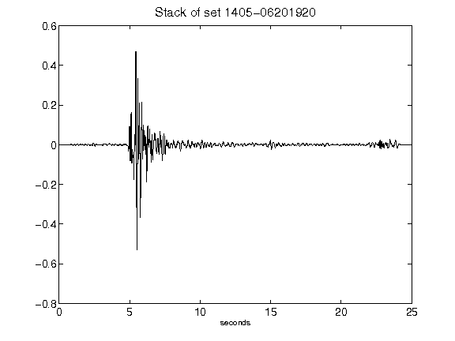](figures/1405-06201920_Stack.png)[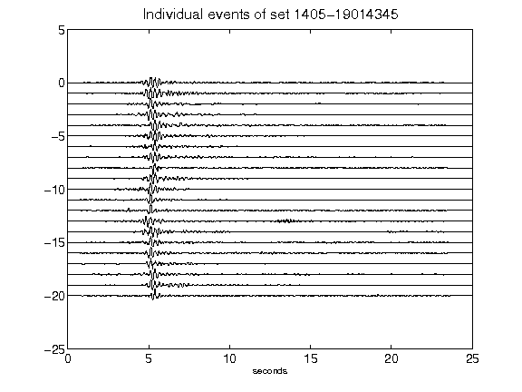](figures/1405-19014345_AllEv.png)[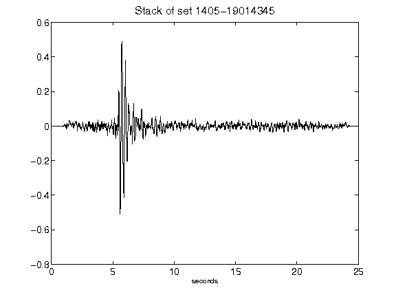](figures/1405-19014345_Stack.png)[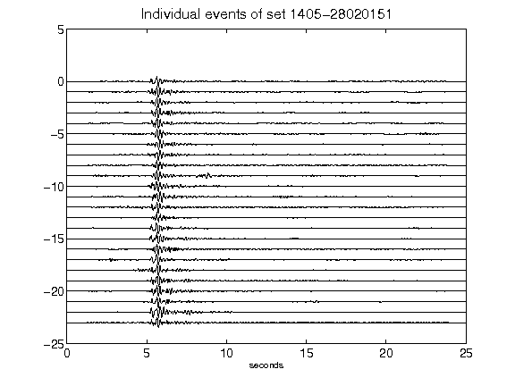](figures/1405-28020151_AllEv.png)[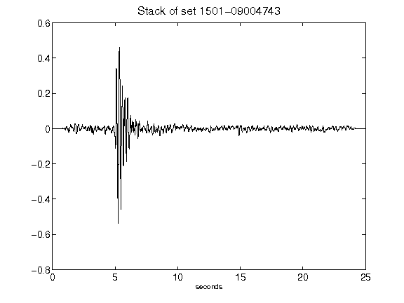](figures/1501-09004743_Stack.png)[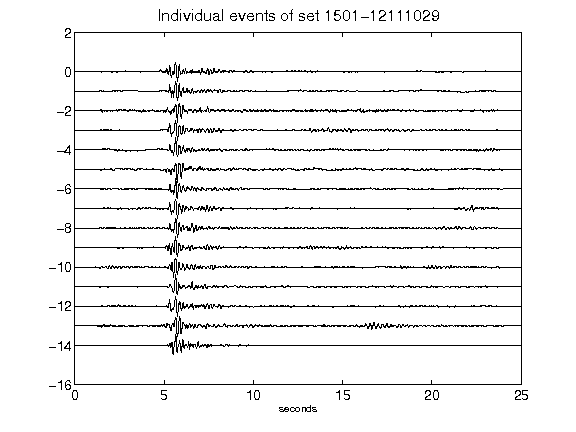](figures/1501-12111029_AllEv.png)[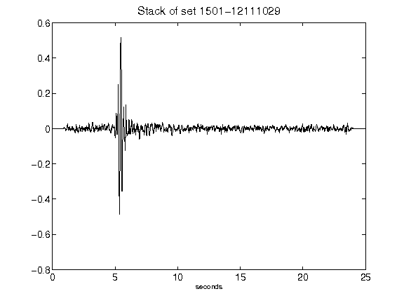](figures/1501-12111029_Stack.png)[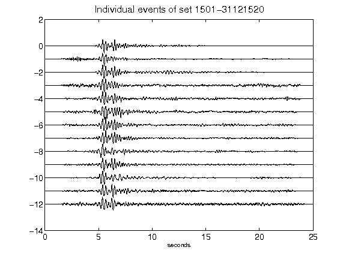](figures/1501-31121520_AllEv.png)[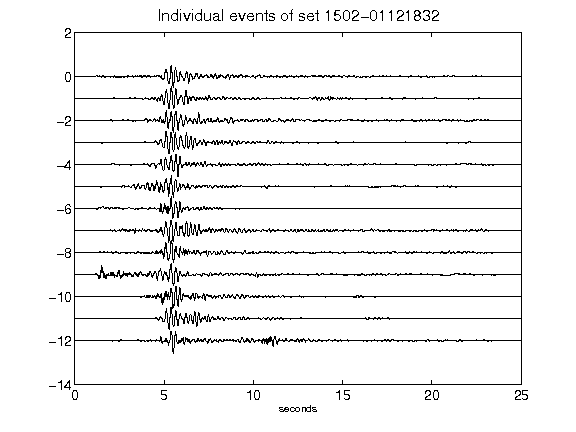](figures/1502-01121832_AllEv.png)[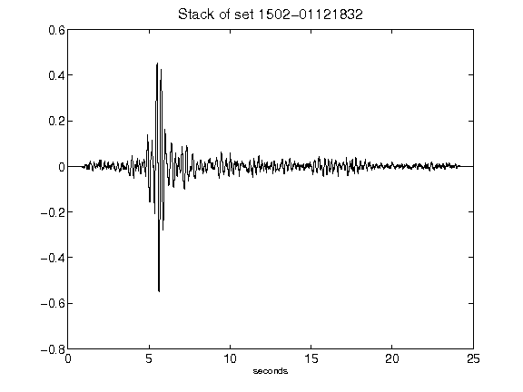](figures/1502-01121832_Stack.png)[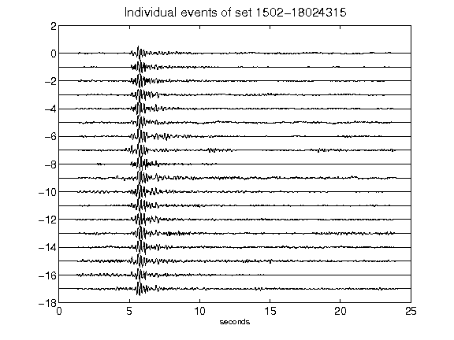](figures/1502-18024315_AllEv.png)[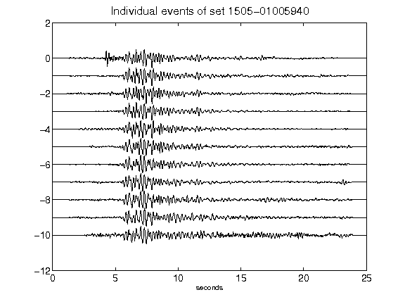](figures/1505-01005940_AllEv.png)[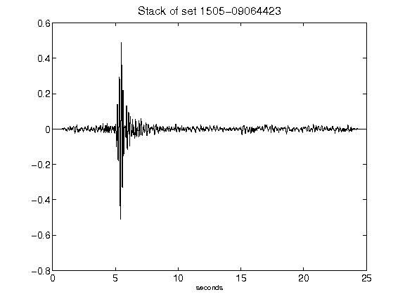](figures/1505-09064423_Stack.png)[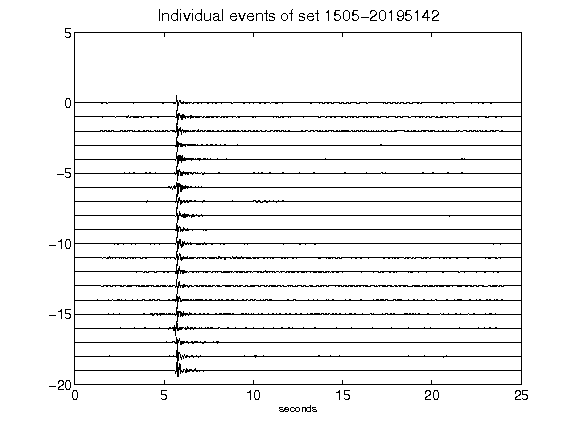](figures/1505-20195142_AllEv.png)[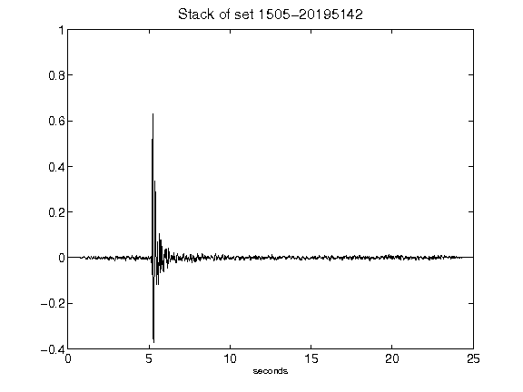](figures/1505-20195142_Stack.png)[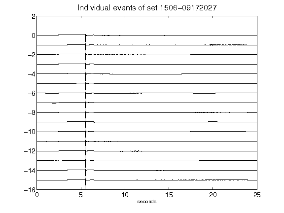](figures/1506-09172027_AllEv.png)[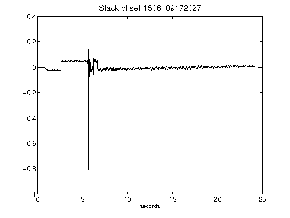](figures/1506-09172027_Stack.png)[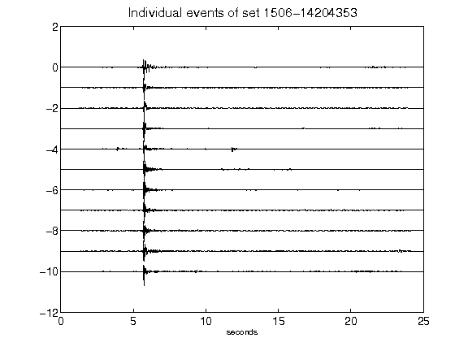](figures/1506-14204353_AllEv.png)