# Repeating Earthquake Activity at RCM

## Waveforms
[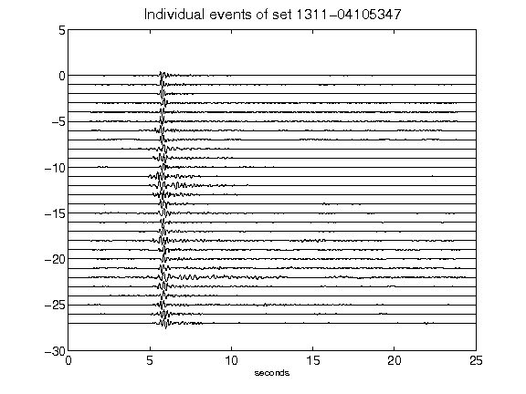](figures/1311-04105347_AllEv.png)[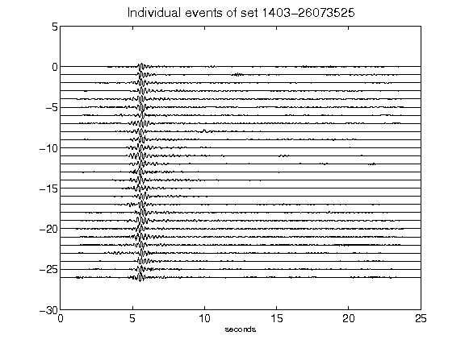](figures/1403-26073525_AllEv.png)[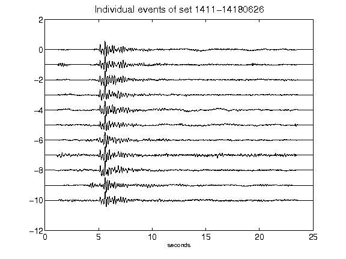](figures/1411-14180626_AllEv.png)[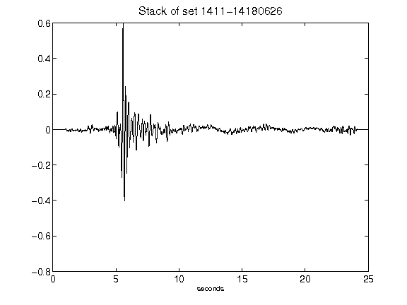](figures/1411-14180626_Stack.png)[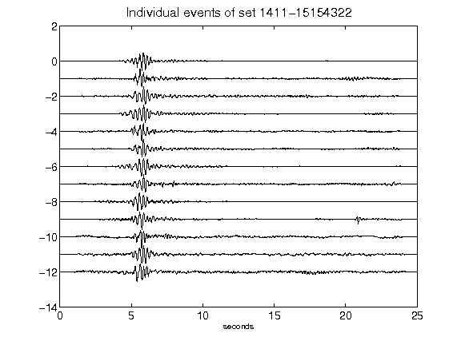](figures/1411-15154322_AllEv.png)[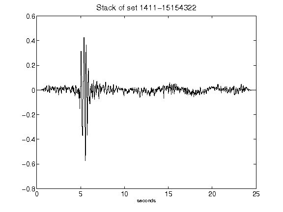](figures/1411-15154322_Stack.png)[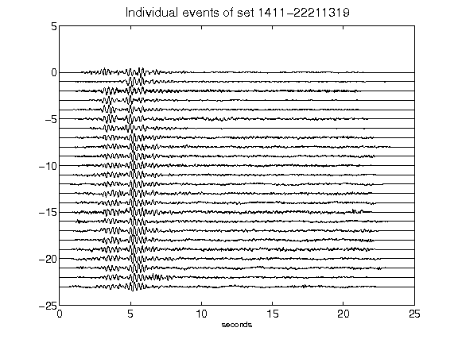](figures/1411-22211319_AllEv.png)[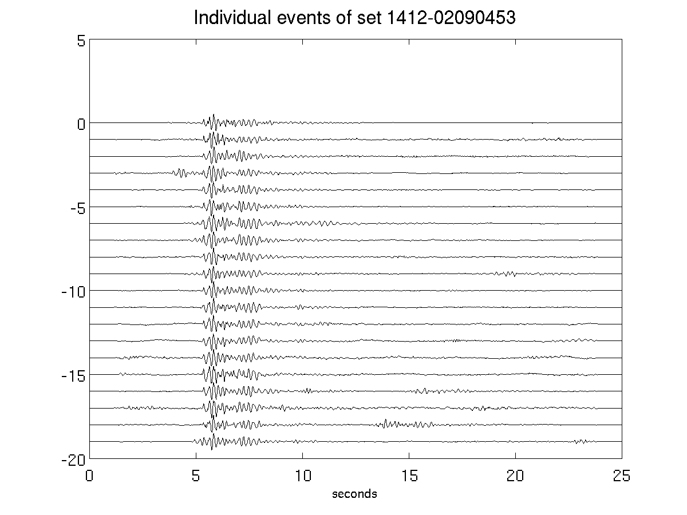](figures/1412-02090453_AllEv.png)[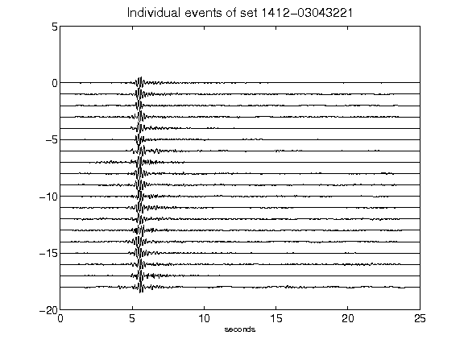](figures/1412-03043221_AllEv.png)[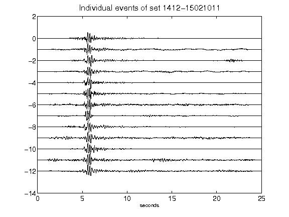](figures/1412-15021011_AllEv.png)[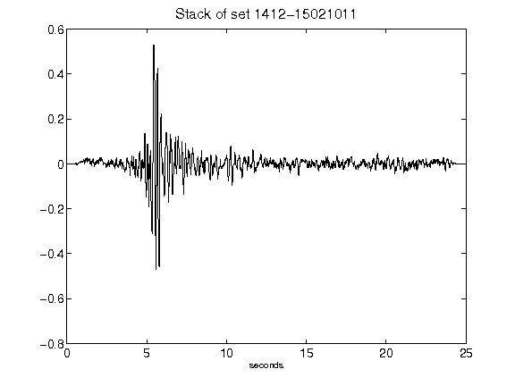](figures/1412-15021011_Stack.png)[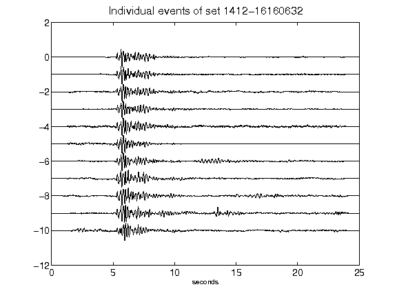](figures/1412-16160632_AllEv.png)[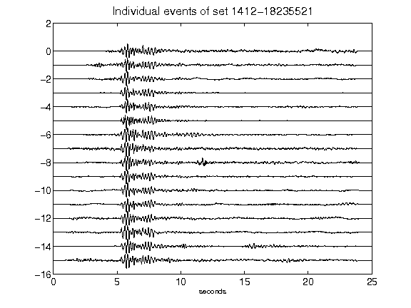](figures/1412-18235521_AllEv.png)[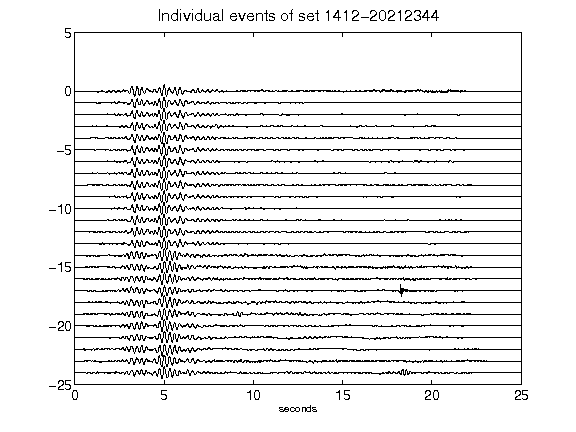](figures/1412-20212344_AllEv.png)[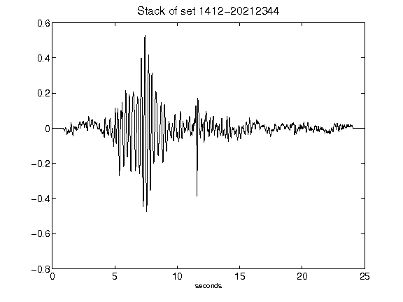](figures/1412-20212344_Stack.png)[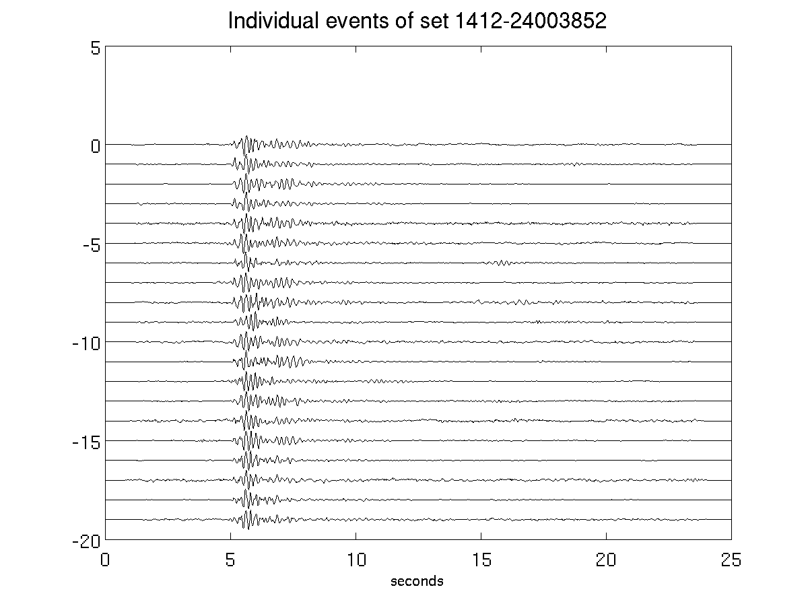](figures/1412-24003852_AllEv.png)[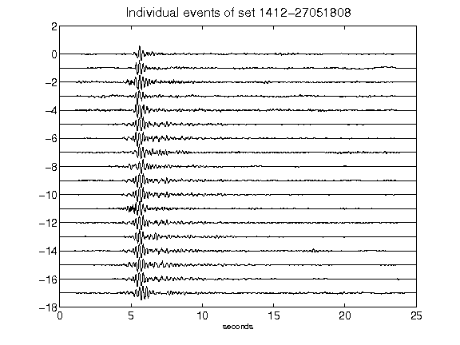](figures/1412-27051808_AllEv.png)[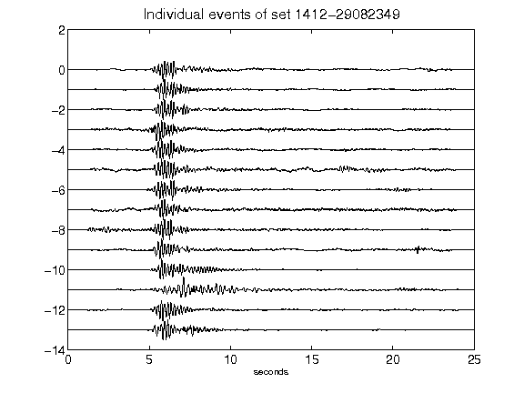](figures/1412-29082349_AllEv.png)[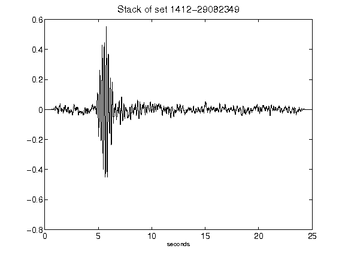](figures/1412-29082349_Stack.png)[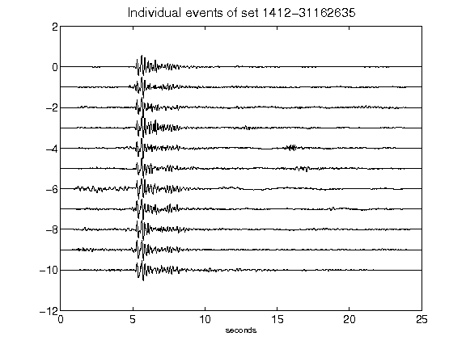](figures/1412-31162635_AllEv.png)[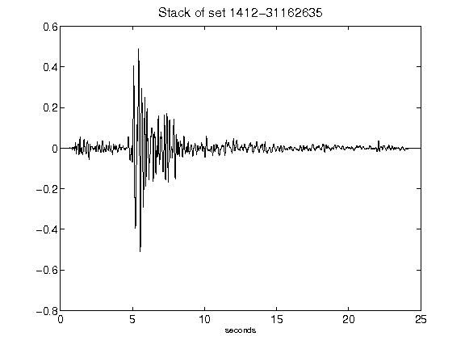](figures/1412-31162635_Stack.png)[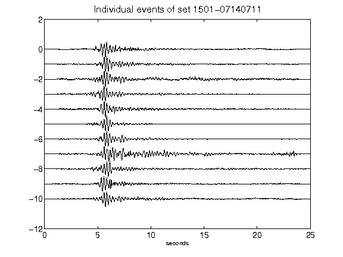](figures/1501-07140711_AllEv.png)[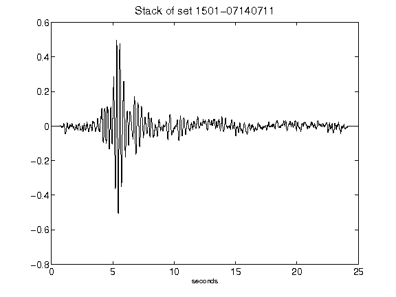](figures/1501-07140711_Stack.png)[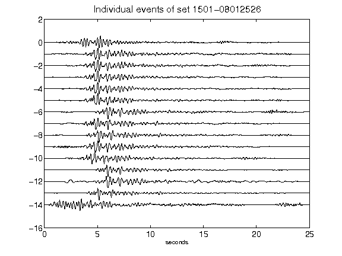](figures/1501-08012526_AllEv.png)[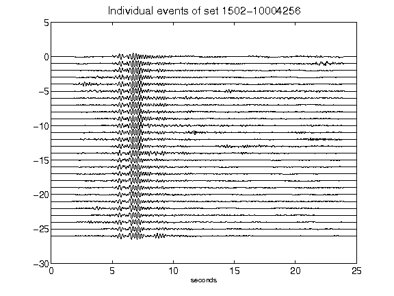](figures/1502-10004256_AllEv.png)[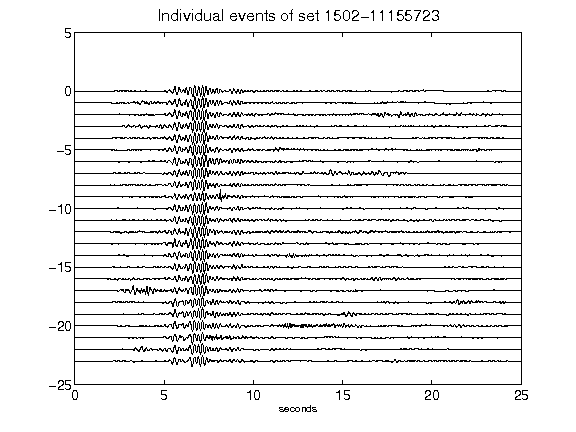](figures/1502-11155723_AllEv.png)[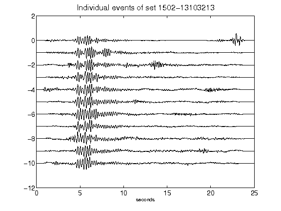](figures/1502-13103213_AllEv.png)[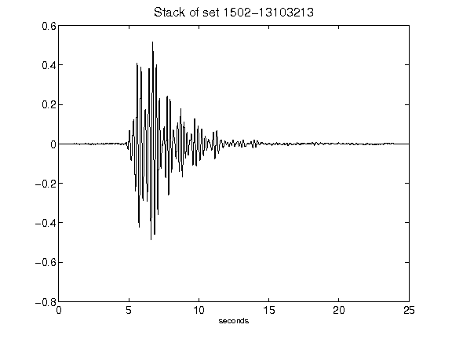](figures/1502-13103213_Stack.png)