# Repeating Earthquake Activity at RCM

## Waveforms
[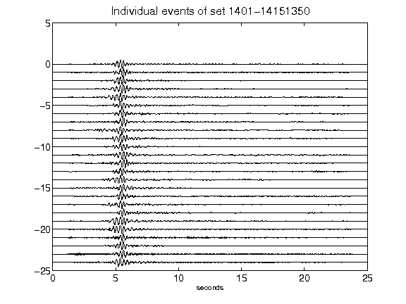](figures/1401-14151350_AllEv.png)[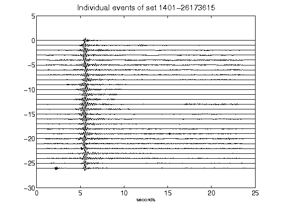](figures/1401-26173615_AllEv.png)[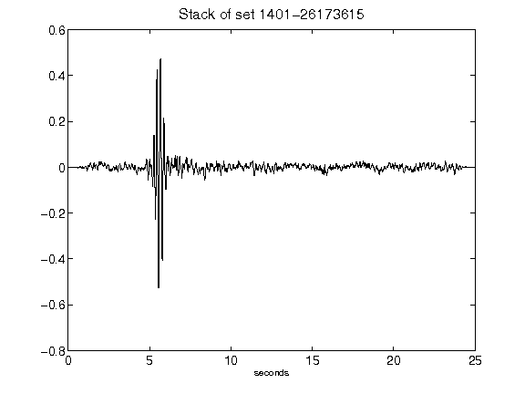](figures/1401-26173615_Stack.png)[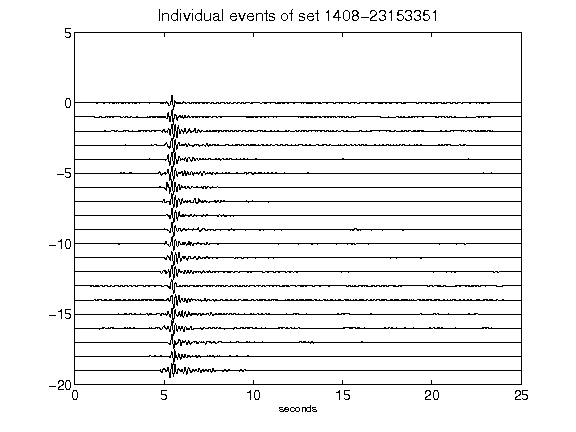](figures/1408-23153351_AllEv.png)[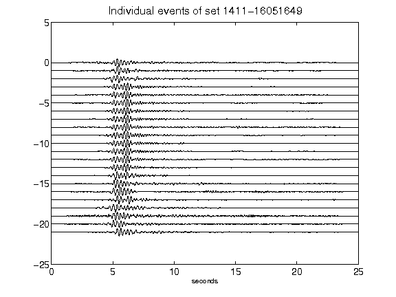](figures/1411-16051649_AllEv.png)[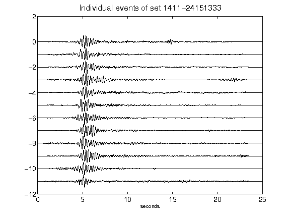](figures/1411-24151333_AllEv.png)[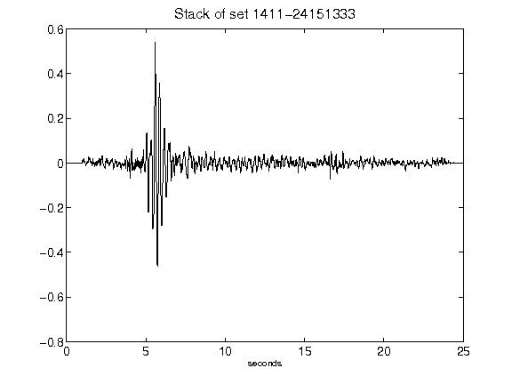](figures/1411-24151333_Stack.png)[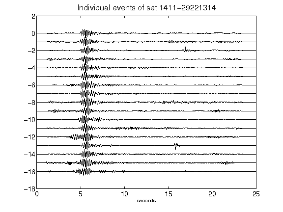](figures/1411-29221314_AllEv.png)[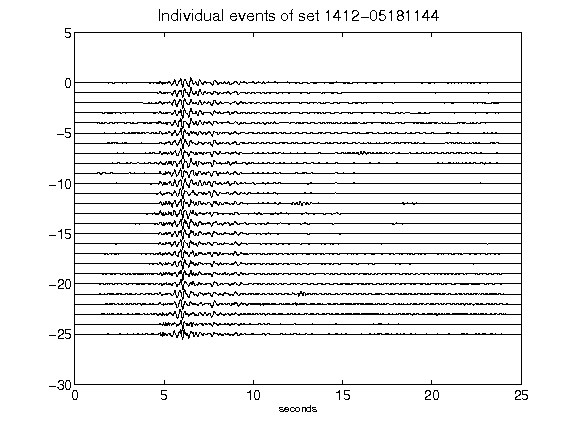](figures/1412-05181144_AllEv.png)[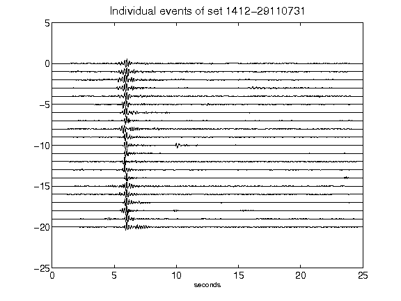](figures/1412-29110731_AllEv.png)[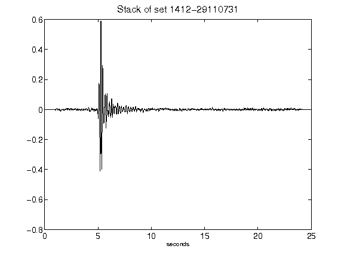](figures/1412-29110731_Stack.png)[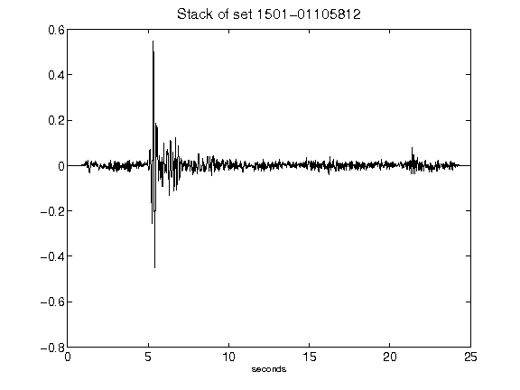](figures/1501-01105812_Stack.png)[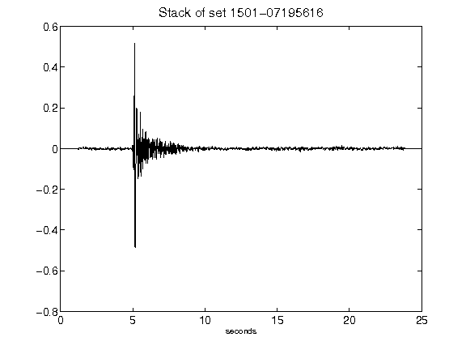](figures/1501-07195616_Stack.png)[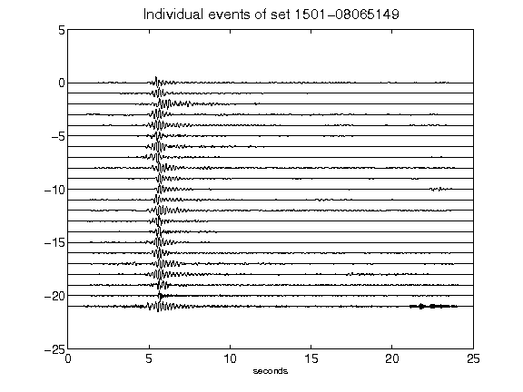](figures/1501-08065149_AllEv.png)[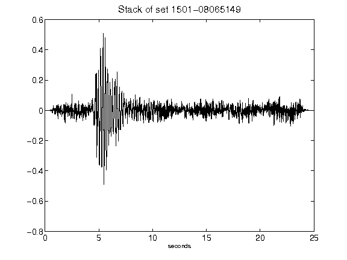](figures/1501-08065149_Stack.png)[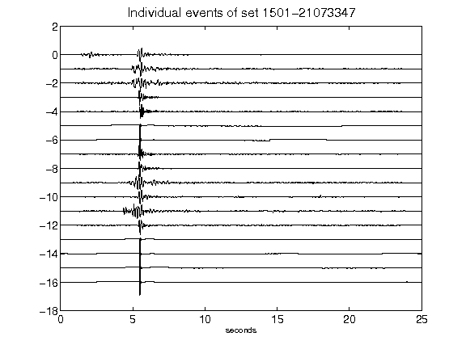](figures/1501-21073347_AllEv.png)[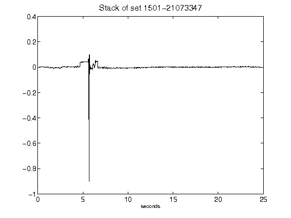](figures/1501-21073347_Stack.png)[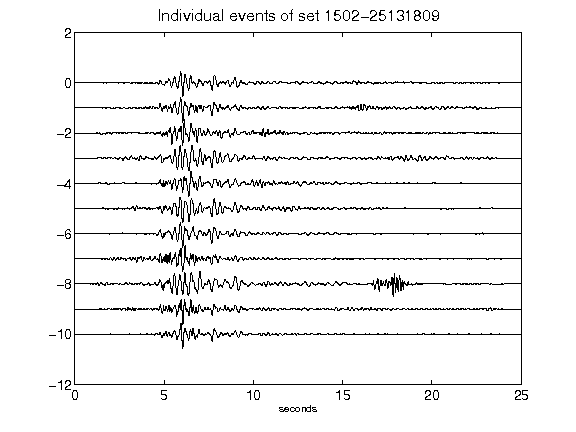](figures/1502-25131809_AllEv.png)[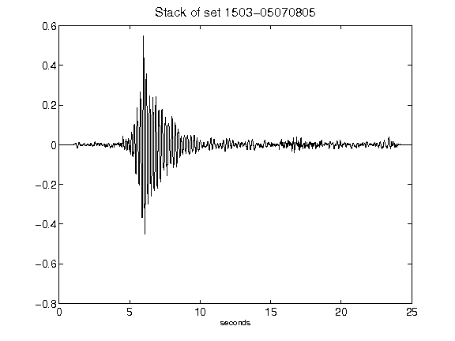](figures/1503-05070805_Stack.png)[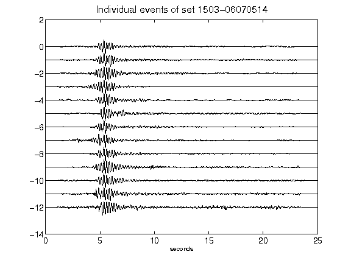](figures/1503-06070514_AllEv.png)[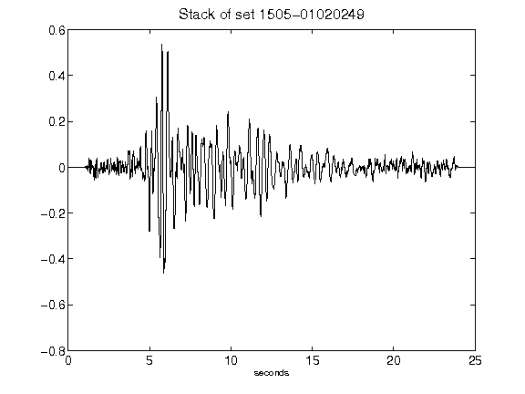](figures/1505-01020249_Stack.png)[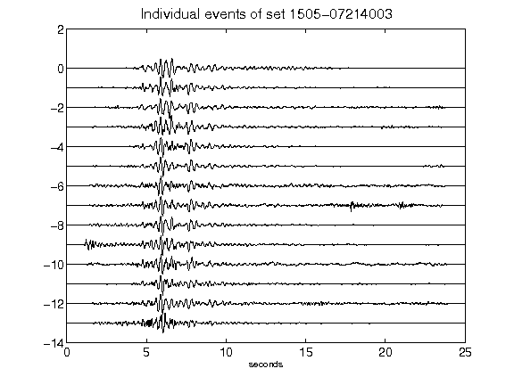](figures/1505-07214003_AllEv.png)[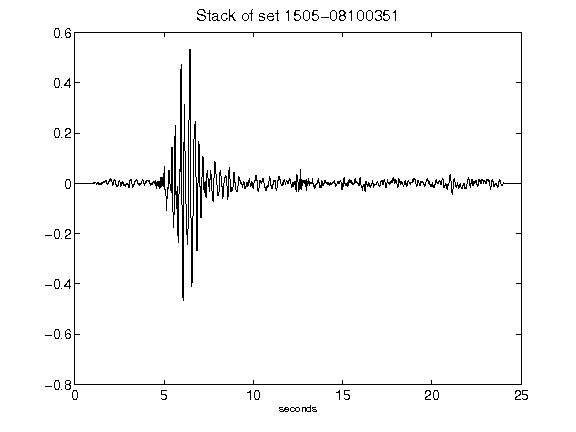](figures/1505-08100351_Stack.png)