# Repeating Earthquake Activity at RCM

## Waveforms
[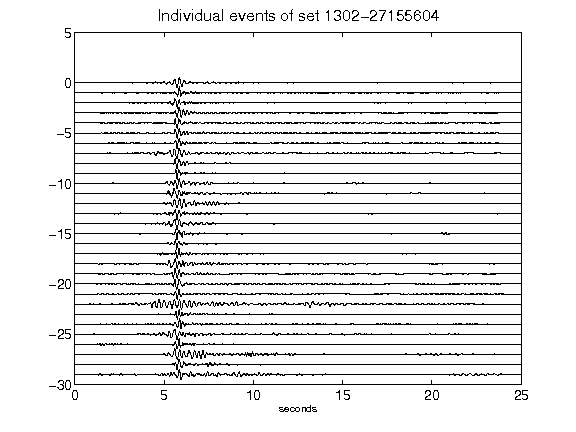](figures/1302-27155604_AllEv.png)[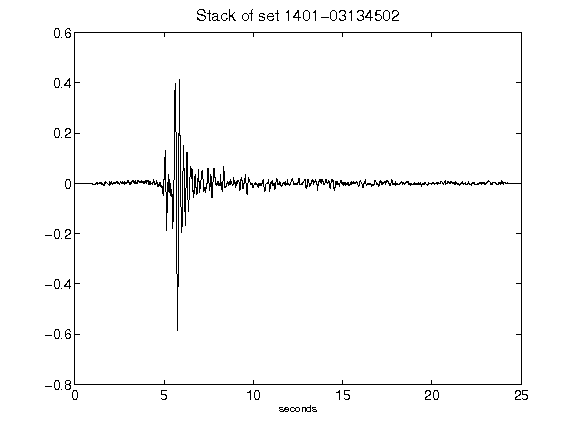](figures/1401-03134502_Stack.png)[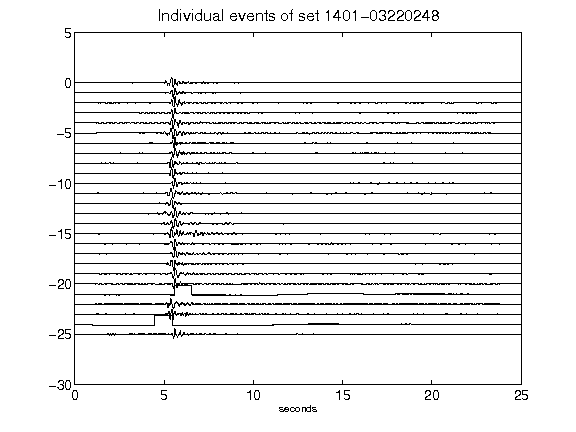](figures/1401-03220248_AllEv.png)[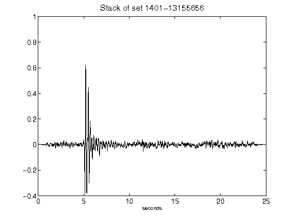](figures/1401-13155656_Stack.png)[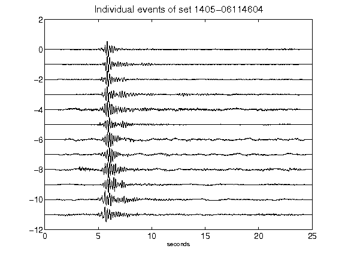](figures/1405-06114604_AllEv.png)[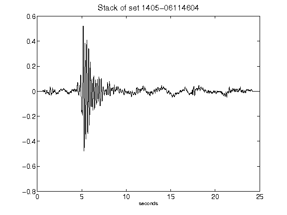](figures/1405-06114604_Stack.png)[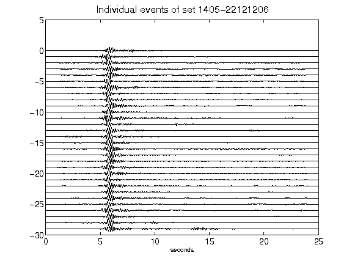](figures/1405-22121206_AllEv.png)[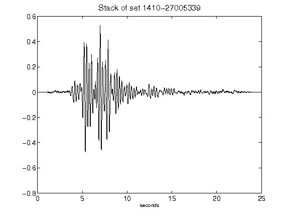](figures/1410-27005339_Stack.png)[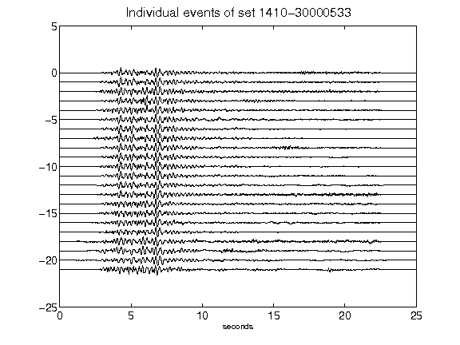](figures/1410-30000533_AllEv.png)[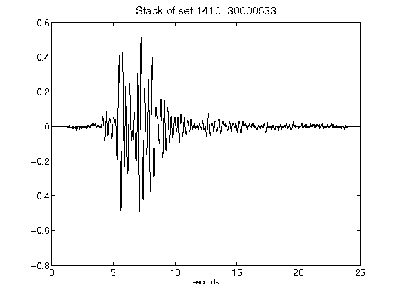](figures/1410-30000533_Stack.png)[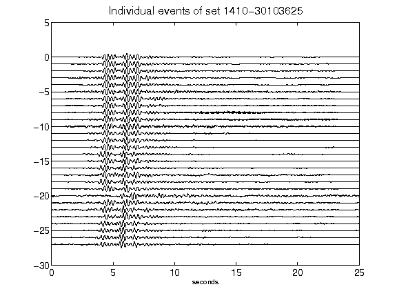](figures/1410-30103625_AllEv.png)[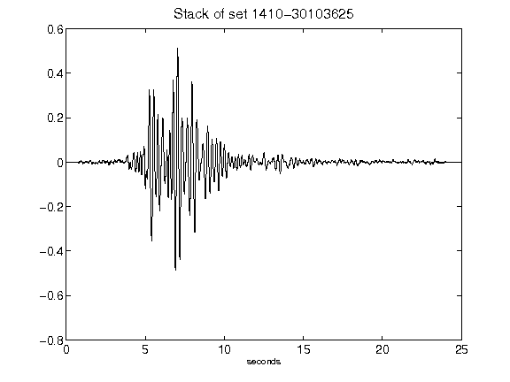](figures/1410-30103625_Stack.png)[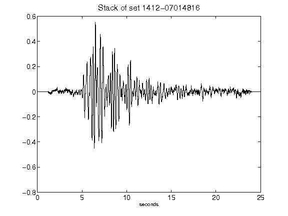](figures/1412-07014816_Stack.png)