# Repeating Earthquake Activity at RCM

## Waveforms
[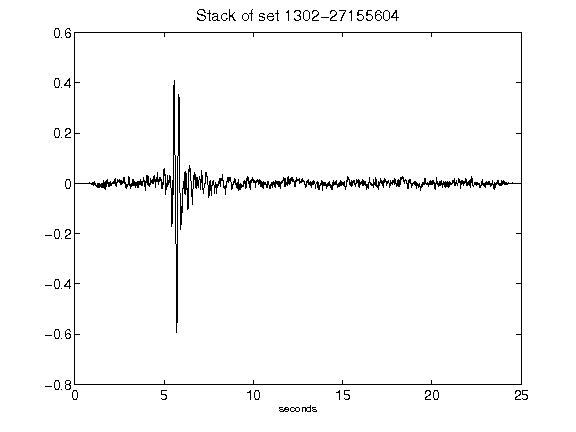](figures/1302-27155604_Stack.png)[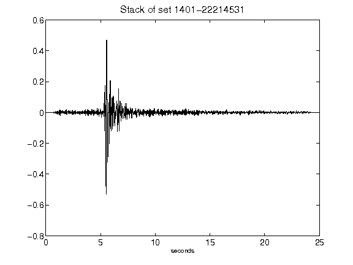](figures/1401-22214531_Stack.png)[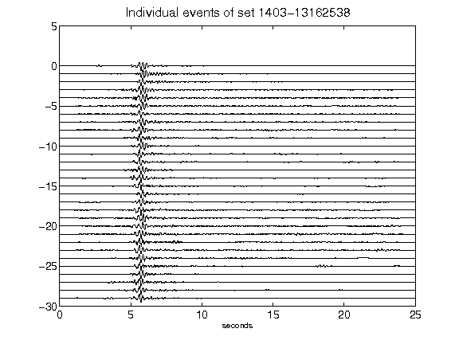](figures/1403-13162538_AllEv.png)[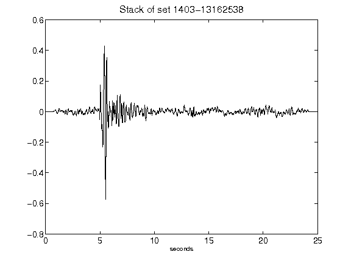](figures/1403-13162538_Stack.png)[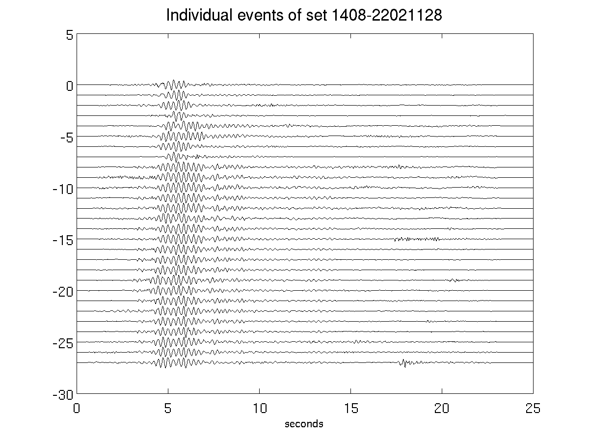](figures/1408-22021128_AllEv.png)[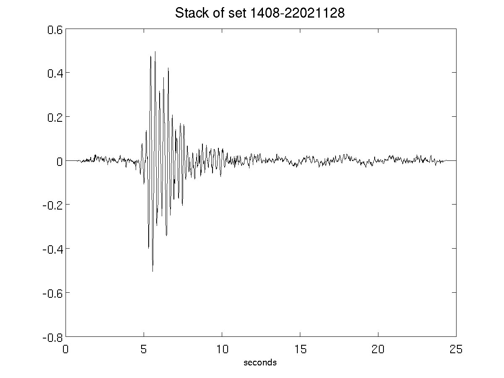](figures/1408-22021128_Stack.png)[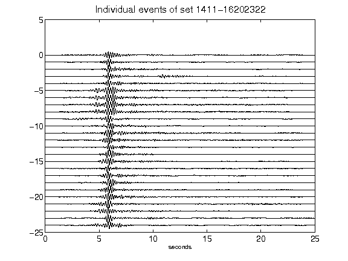](figures/1411-16202322_AllEv.png)[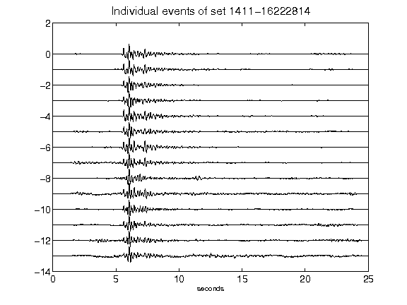](figures/1411-16222814_AllEv.png)[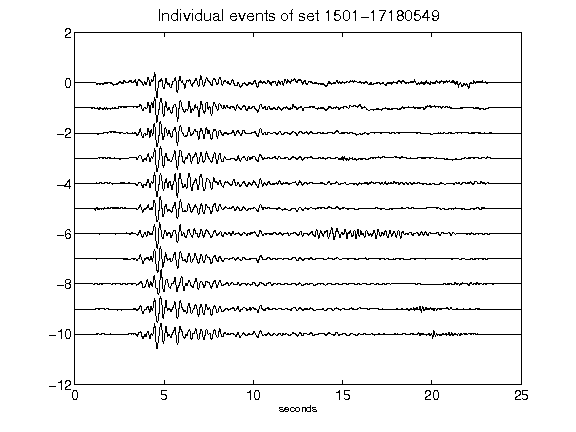](figures/1501-17180549_AllEv.png)[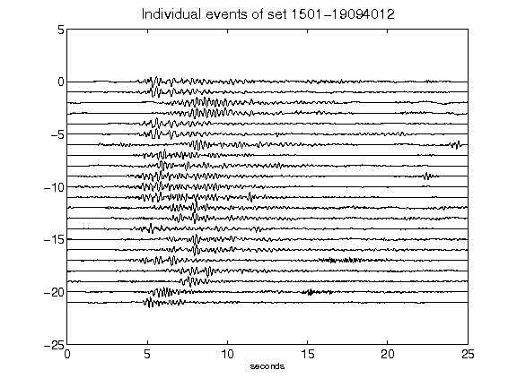](figures/1501-19094012_AllEv.png)[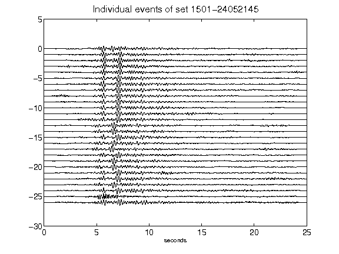](figures/1501-24052145_AllEv.png)[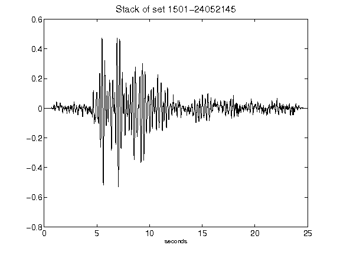](figures/1501-24052145_Stack.png)