# Repeating Earthquake Activity at RCM

## Waveforms
[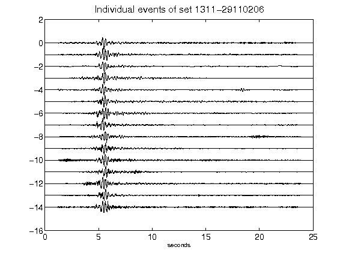](figures/1311-29110206_AllEv.png)[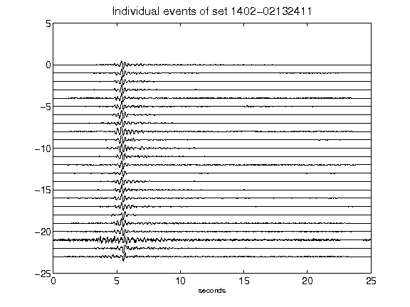](figures/1402-02132411_AllEv.png)[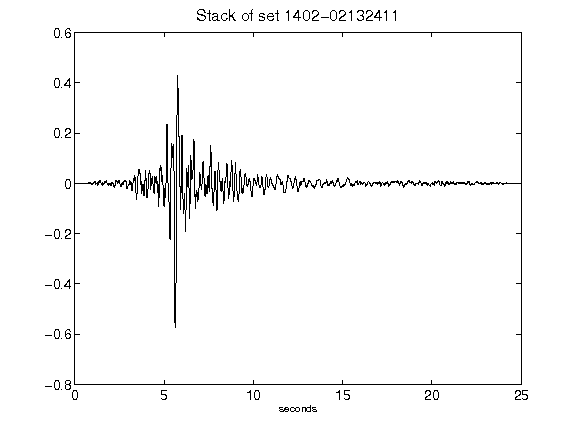](figures/1402-02132411_Stack.png)[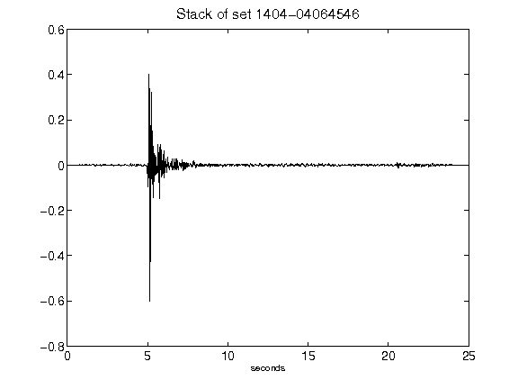](figures/1404-04064546_Stack.png)[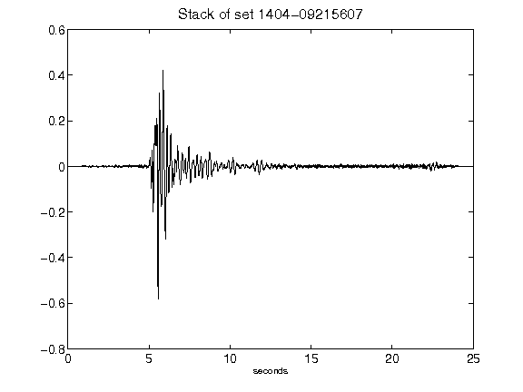](figures/1404-09215607_Stack.png)[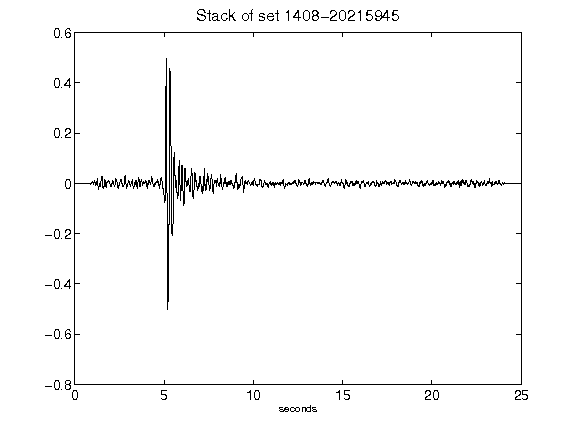](figures/1408-20215945_Stack.png)[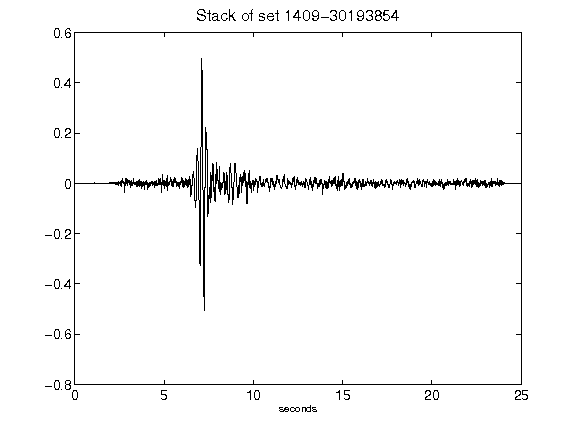](figures/1409-30193854_Stack.png)[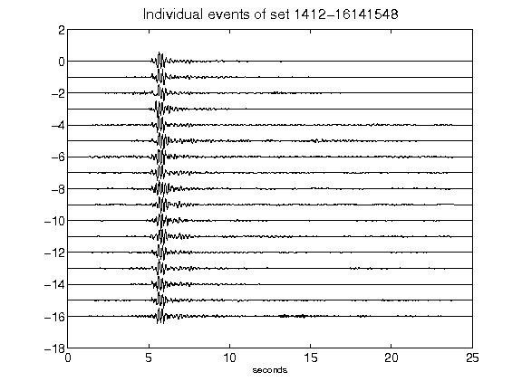](figures/1412-16141548_AllEv.png)[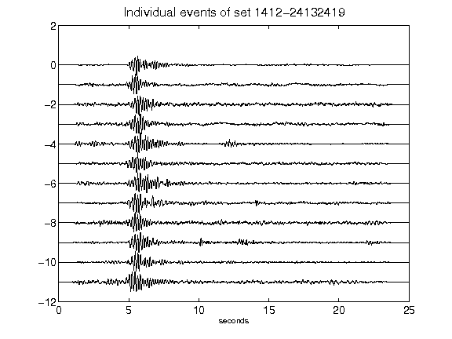](figures/1412-24132419_AllEv.png)[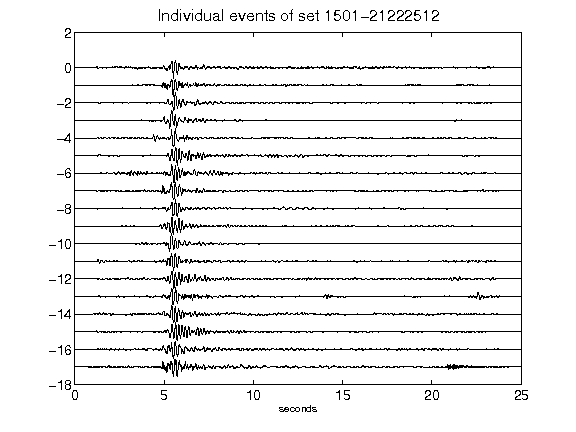](figures/1501-21222512_AllEv.png)[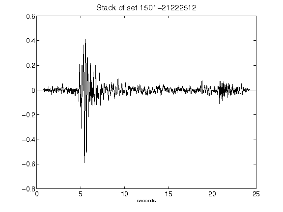](figures/1501-21222512_Stack.png)[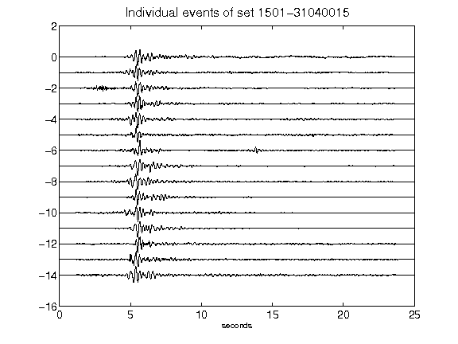](figures/1501-31040015_AllEv.png)[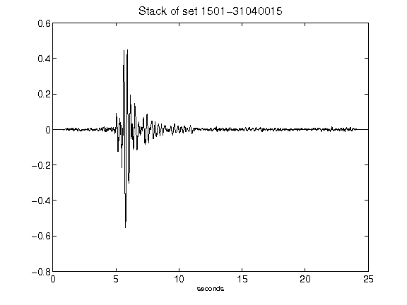](figures/1501-31040015_Stack.png)[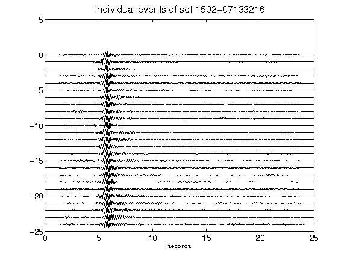](figures/1502-07133216_AllEv.png)[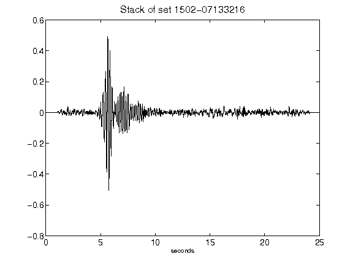](figures/1502-07133216_Stack.png)