# Repeating Earthquake Activity at RCM

## Waveforms
[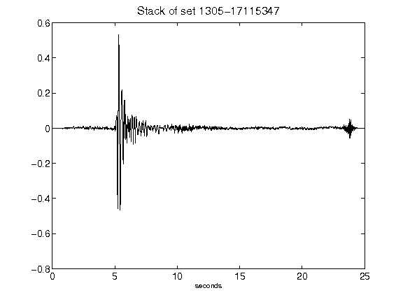](figures/1305-17115347_Stack.png)[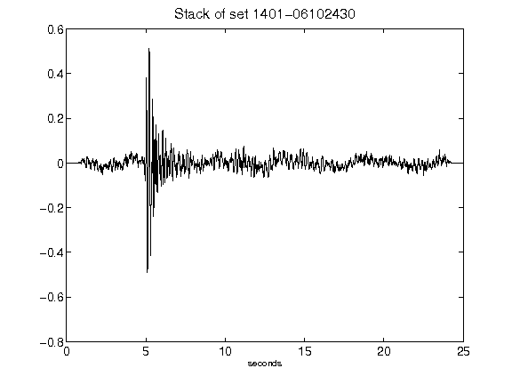](figures/1401-06102430_Stack.png)[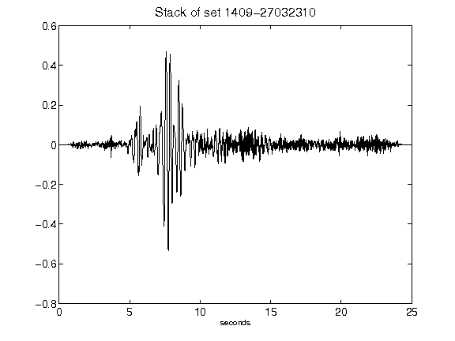](figures/1409-27032310_Stack.png)[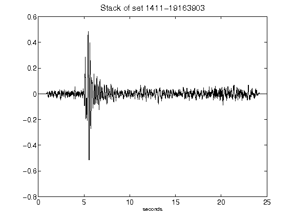](figures/1411-19163903_Stack.png)[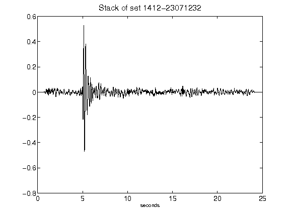](figures/1412-23071232_Stack.png)[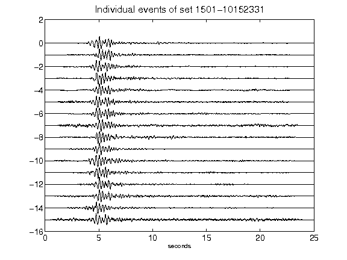](figures/1501-10152331_AllEv.png)[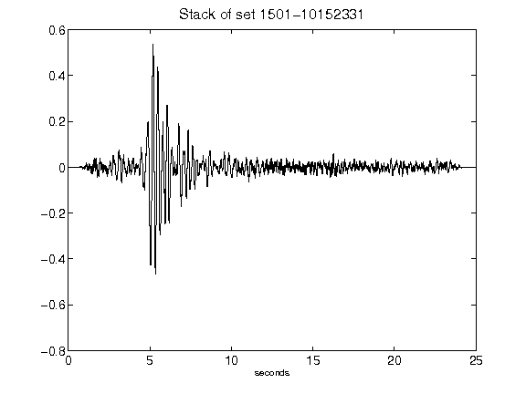](figures/1501-10152331_Stack.png)[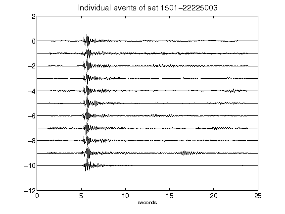](figures/1501-22225003_AllEv.png)[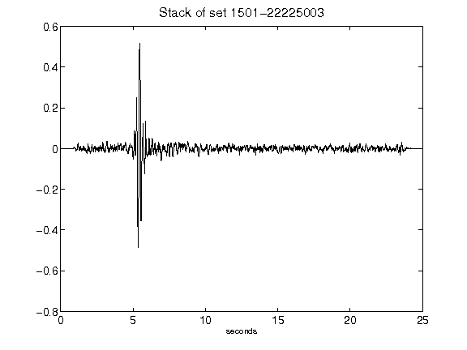](figures/1501-22225003_Stack.png)[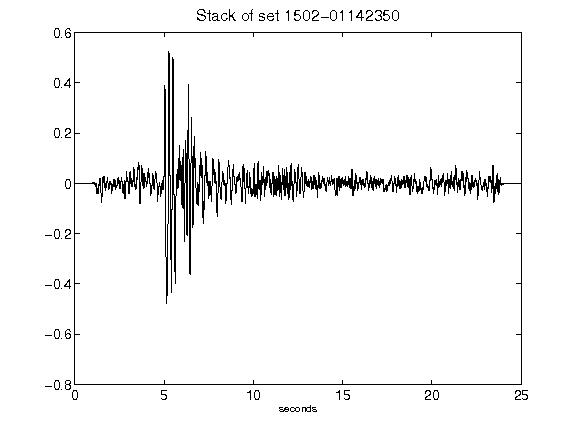](figures/1502-01142350_Stack.png)[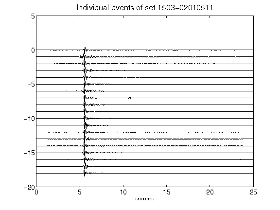](figures/1503-02010511_AllEv.png)[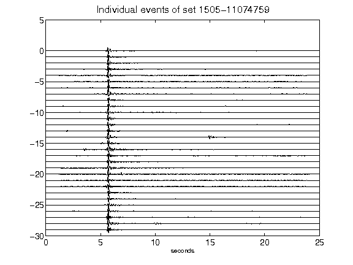](figures/1505-11074759_AllEv.png)[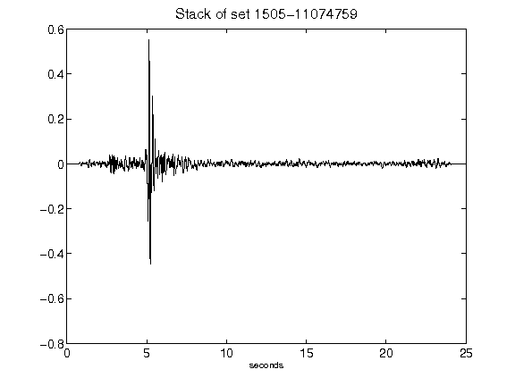](figures/1505-11074759_Stack.png)[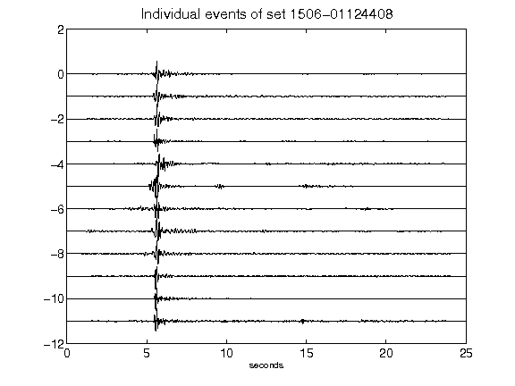](figures/1506-01124408_AllEv.png)[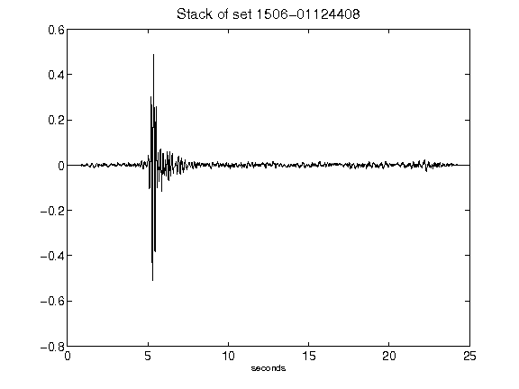](figures/1506-01124408_Stack.png)[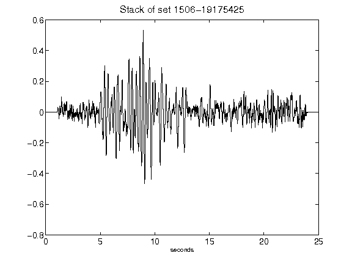](figures/1506-19175425_Stack.png)