# Repeating Earthquake Activity at RCM

## Waveforms
[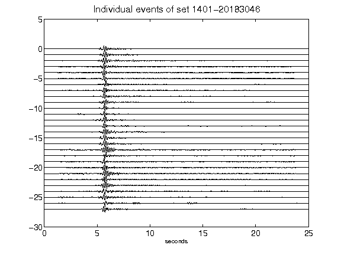](figures/1401-20183046_AllEv.png)[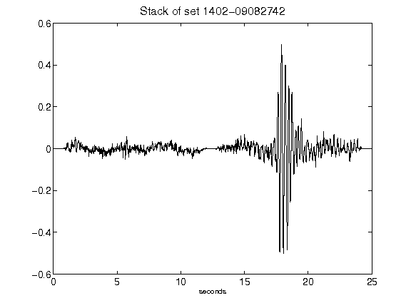](figures/1402-09082742_Stack.png)[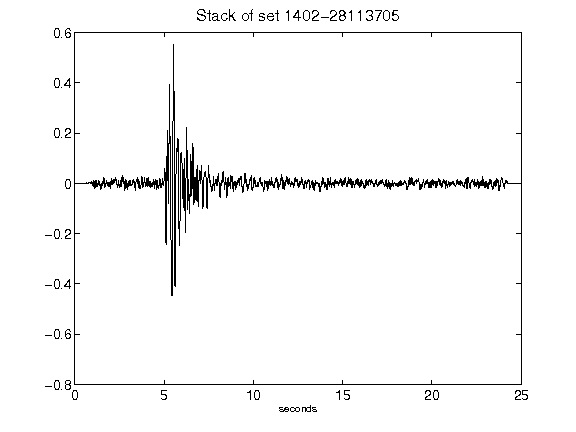](figures/1402-28113705_Stack.png)[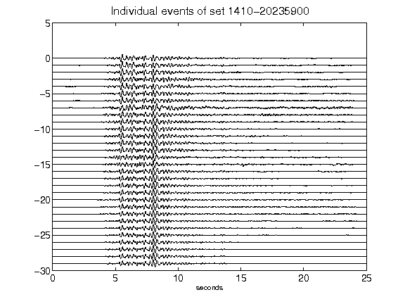](figures/1410-20235900_AllEv.png)[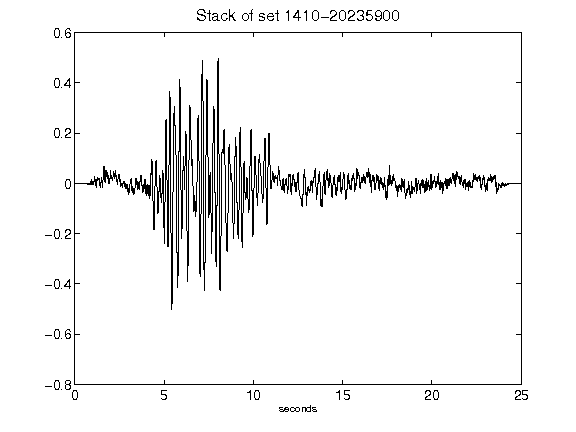](figures/1410-20235900_Stack.png)[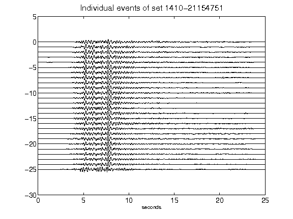](figures/1410-21154751_AllEv.png)[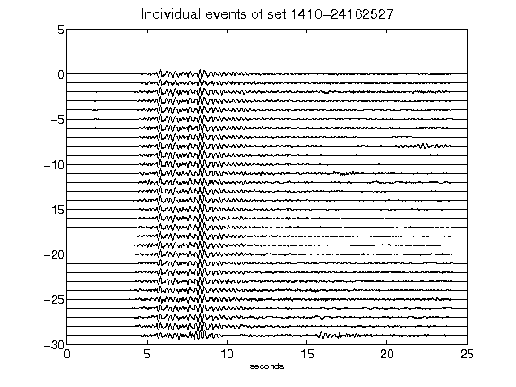](figures/1410-24162527_AllEv.png)[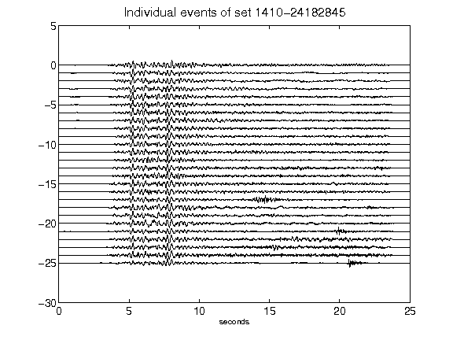](figures/1410-24182845_AllEv.png)[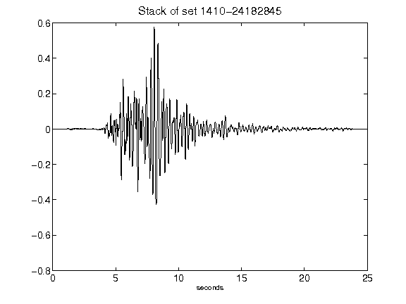](figures/1410-24182845_Stack.png)[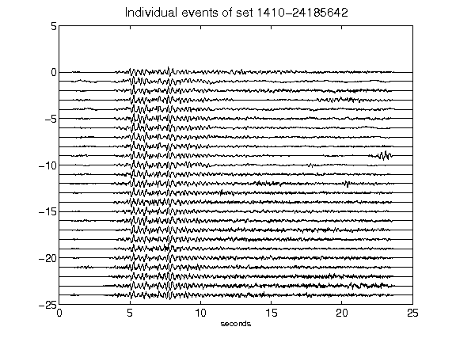](figures/1410-24185642_AllEv.png)[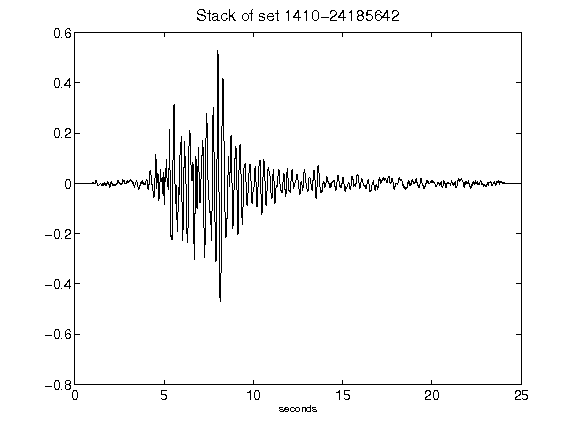](figures/1410-24185642_Stack.png)[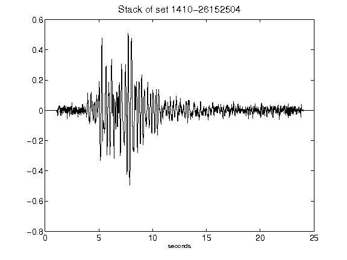](figures/1410-26152504_Stack.png)[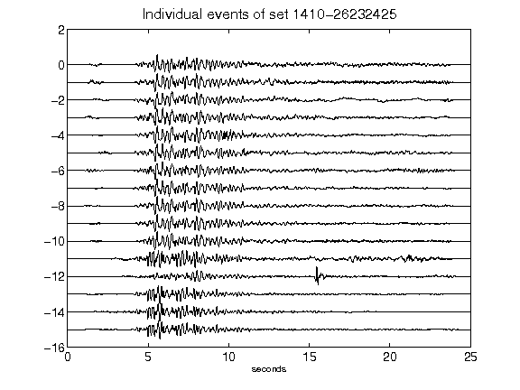](figures/1410-26232425_AllEv.png)[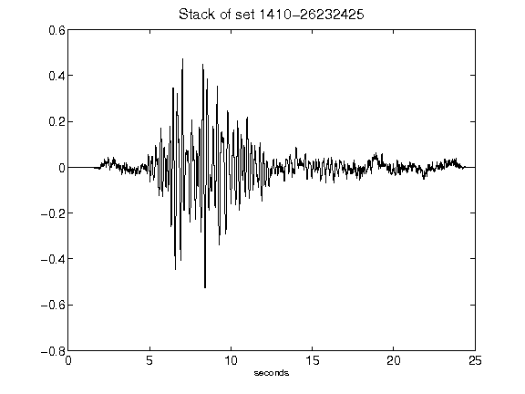](figures/1410-26232425_Stack.png)[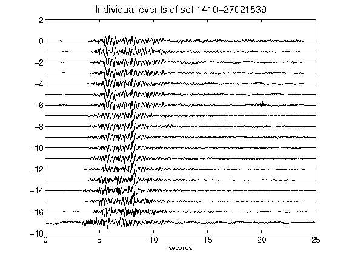](figures/1410-27021539_AllEv.png)[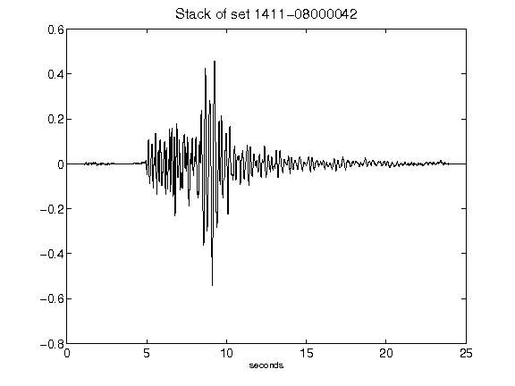](figures/1411-08000042_Stack.png)[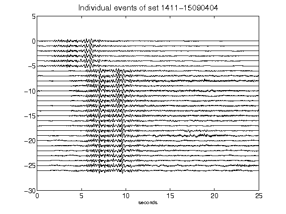](figures/1411-15090404_AllEv.png)[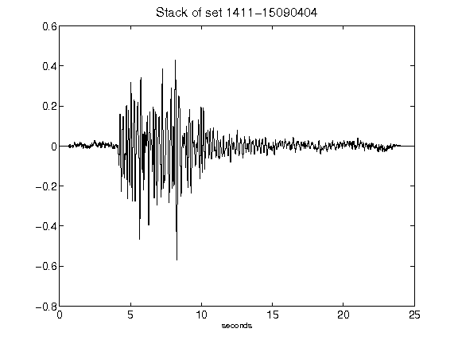](figures/1411-15090404_Stack.png)[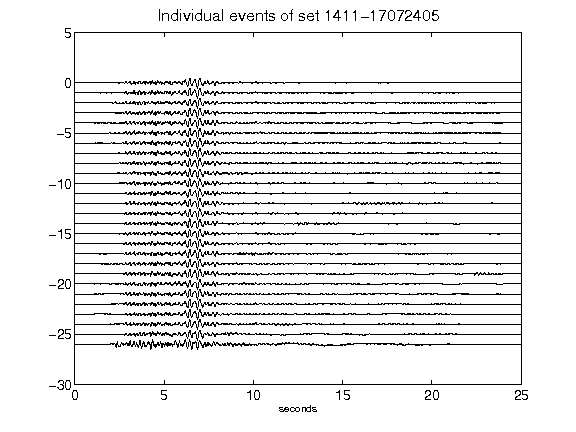](figures/1411-17072405_AllEv.png)[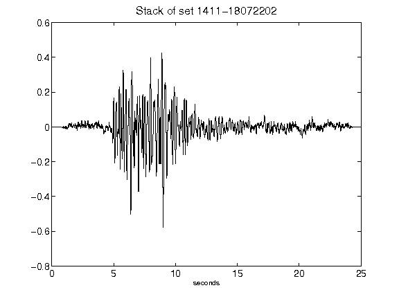](figures/1411-18072202_Stack.png)[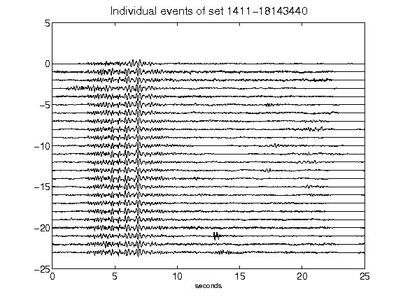](figures/1411-18143440_AllEv.png)[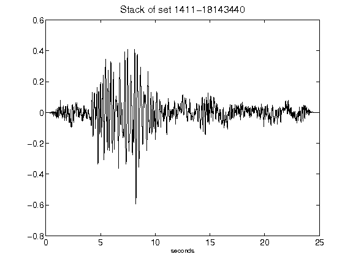](figures/1411-18143440_Stack.png)