# Repeating Earthquake Activity at RCM

## Waveforms
[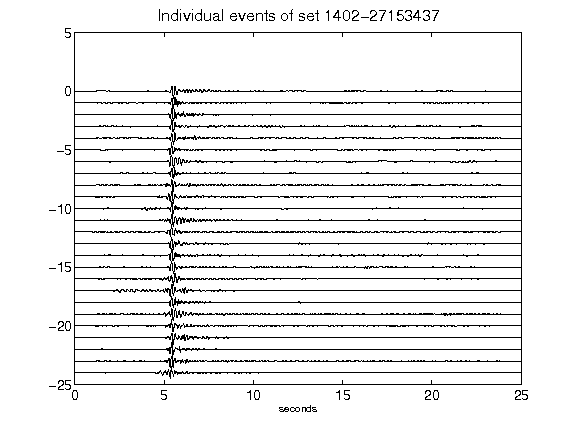](figures/1402-27153437_AllEv.png)[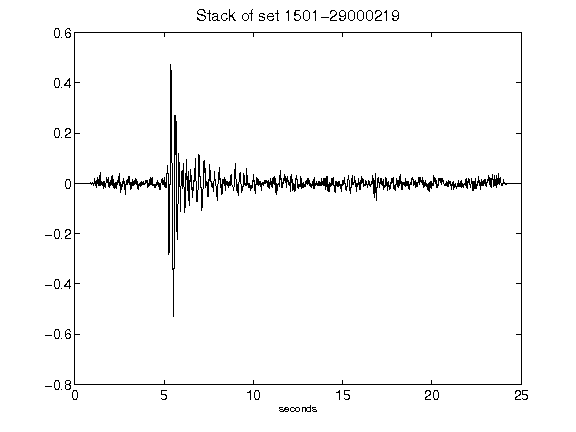](figures/1501-29000219_Stack.png)[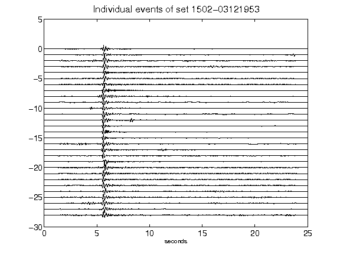](figures/1502-03121953_AllEv.png)[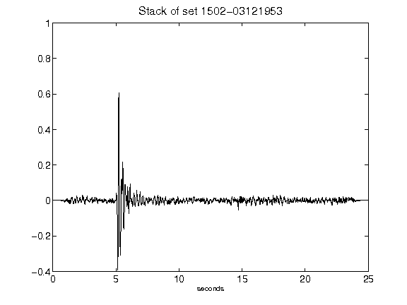](figures/1502-03121953_Stack.png)[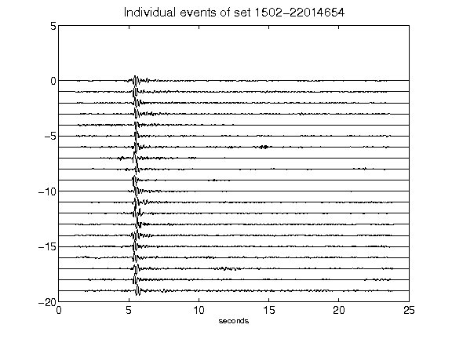](figures/1502-22014654_AllEv.png)[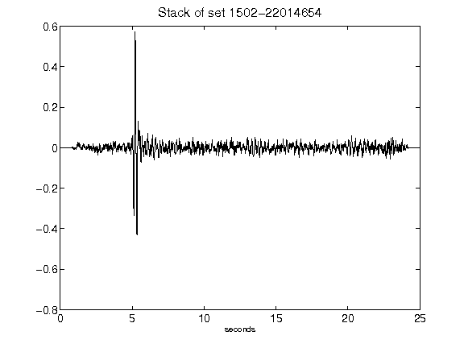](figures/1502-22014654_Stack.png)[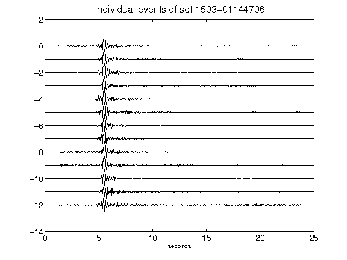](figures/1503-01144706_AllEv.png)[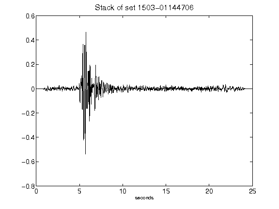](figures/1503-01144706_Stack.png)[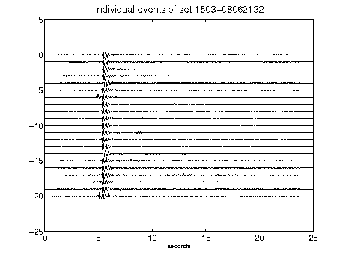](figures/1503-08062132_AllEv.png)[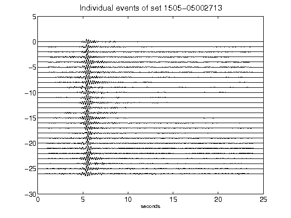](figures/1505-05002713_AllEv.png)[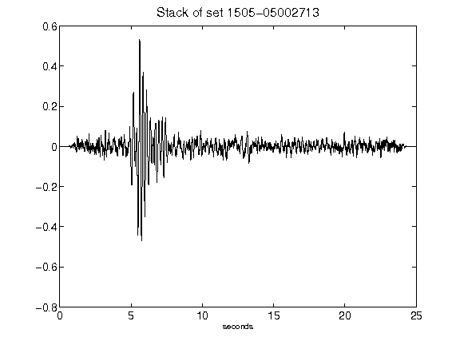](figures/1505-05002713_Stack.png)[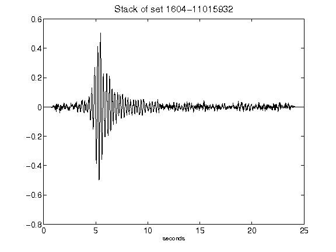](figures/1604-11015932_Stack.png)[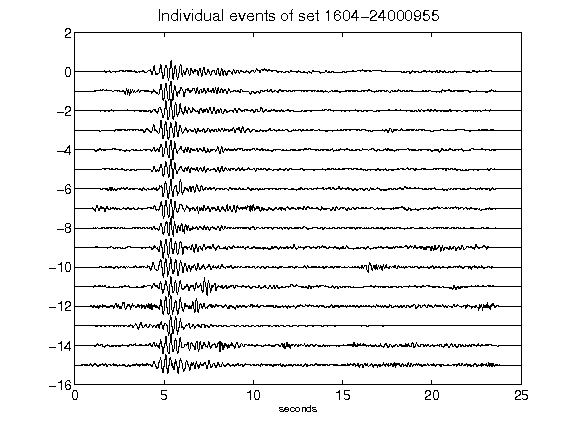](figures/1604-24000955_AllEv.png)[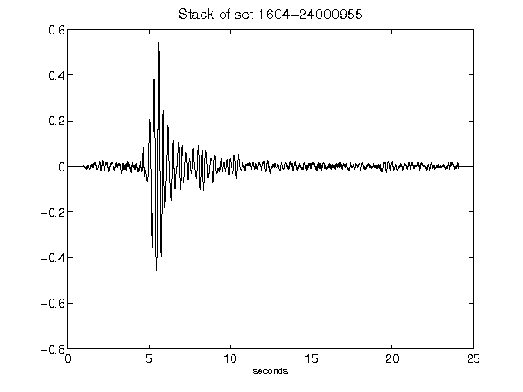](figures/1604-24000955_Stack.png)[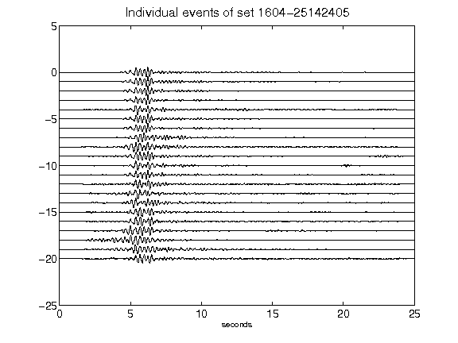](figures/1604-25142405_AllEv.png)[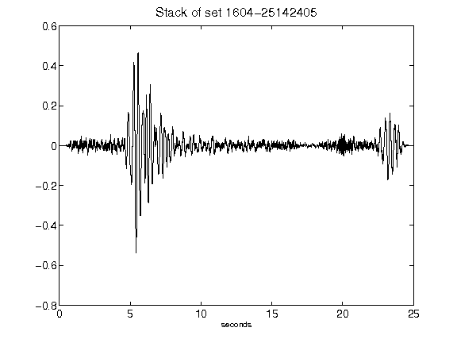](figures/1604-25142405_Stack.png)[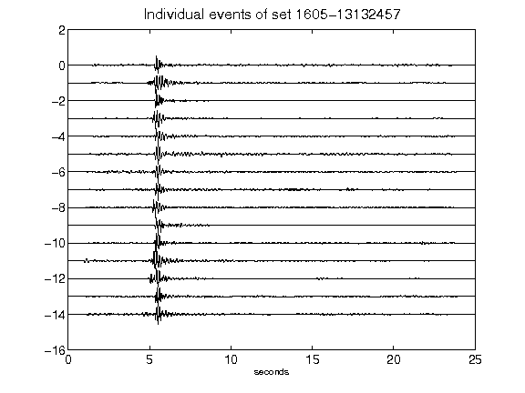](figures/1605-13132457_AllEv.png)[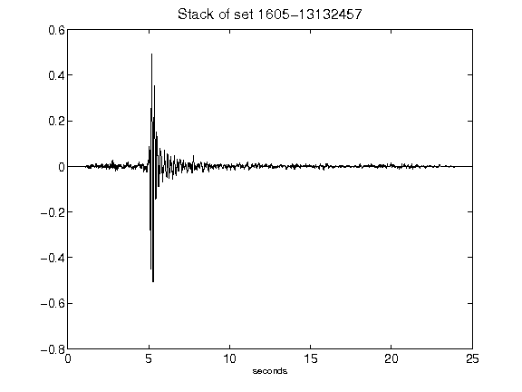](figures/1605-13132457_Stack.png)[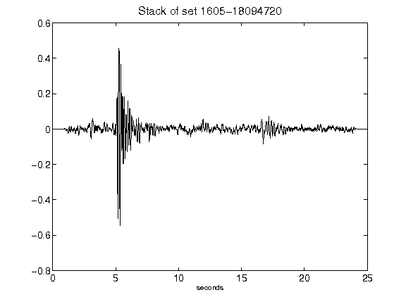](figures/1605-18094720_Stack.png)[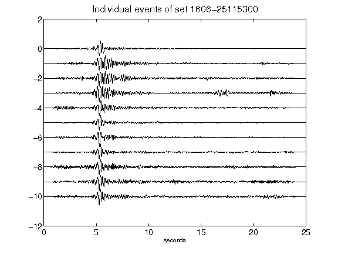](figures/1606-25115300_AllEv.png)[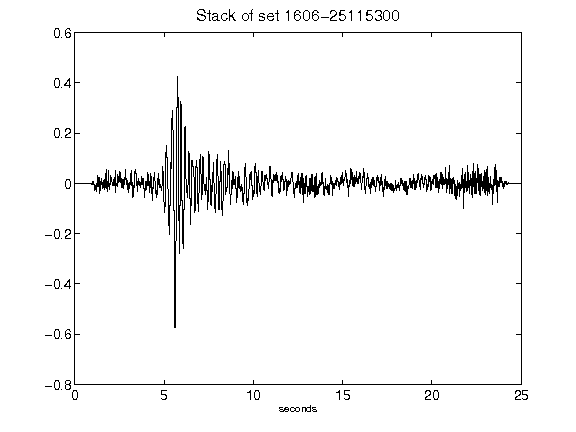](figures/1606-25115300_Stack.png)[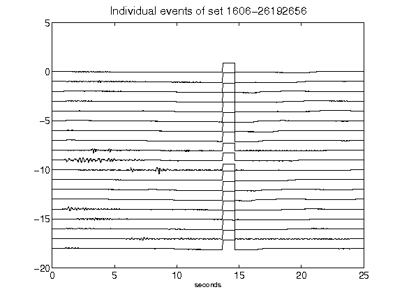](figures/1606-26192656_AllEv.png)[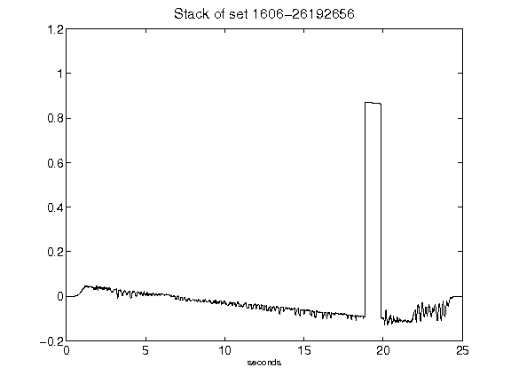](figures/1606-26192656_Stack.png)