# Repeating Earthquake Activity at RCM

## Waveforms
[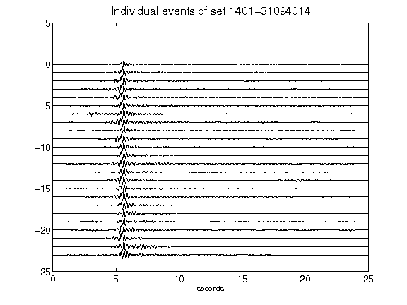](figures/1401-31094014_AllEv.png)[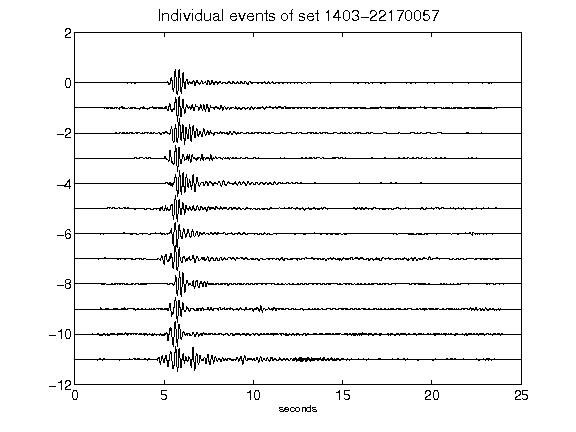](figures/1403-22170057_AllEv.png)[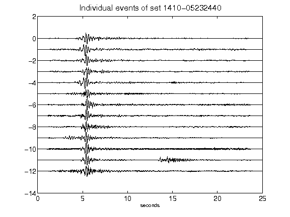](figures/1410-05232440_AllEv.png)[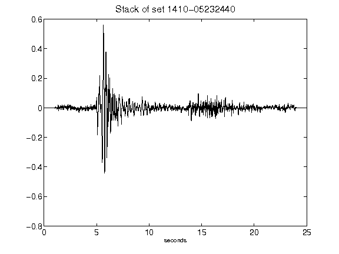](figures/1410-05232440_Stack.png)[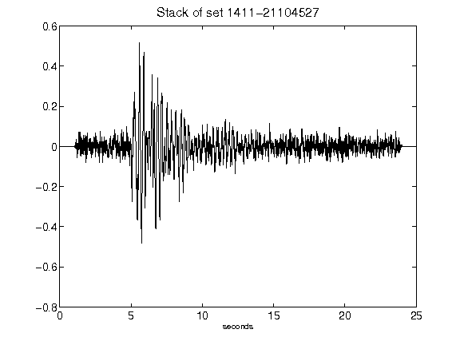](figures/1411-21104527_Stack.png)[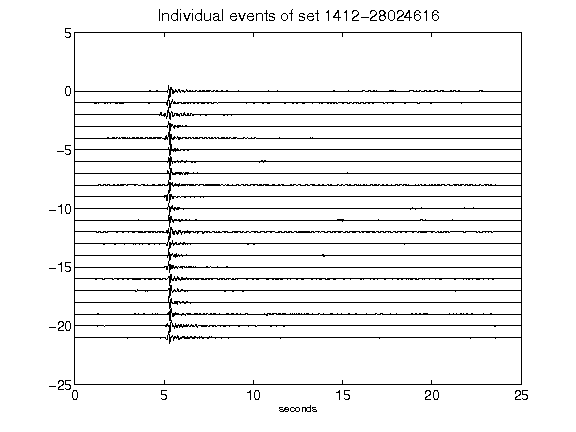](figures/1412-28024616_AllEv.png)[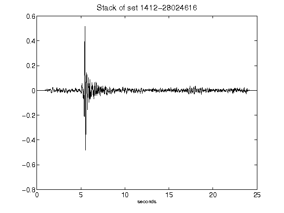](figures/1412-28024616_Stack.png)[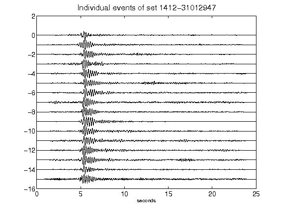](figures/1412-31012947_AllEv.png)[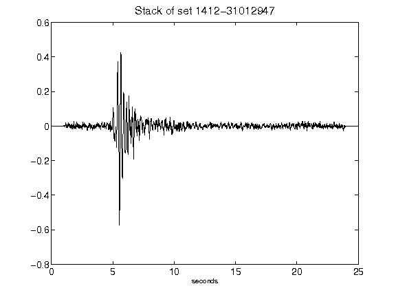](figures/1412-31012947_Stack.png)[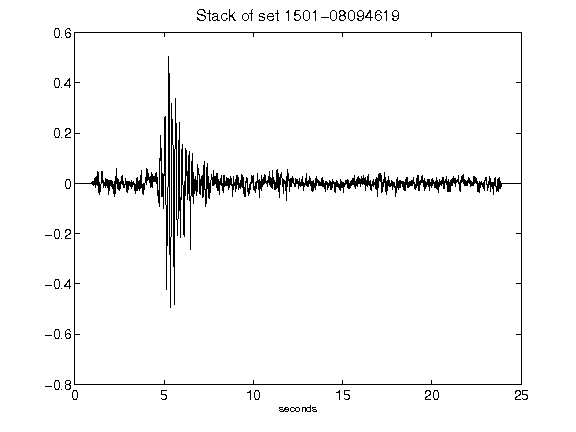](figures/1501-08094619_Stack.png)[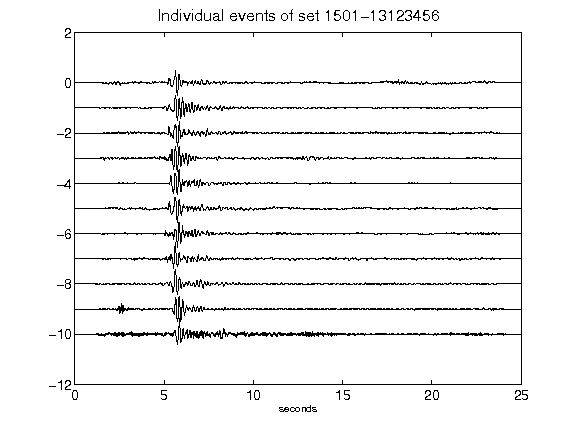](figures/1501-13123456_AllEv.png)[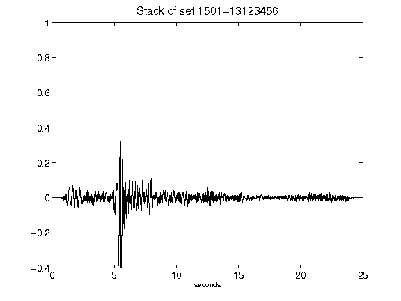](figures/1501-13123456_Stack.png)[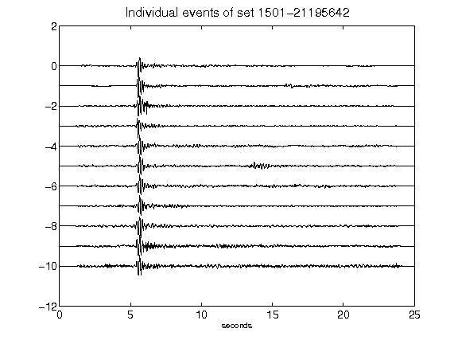](figures/1501-21195642_AllEv.png)[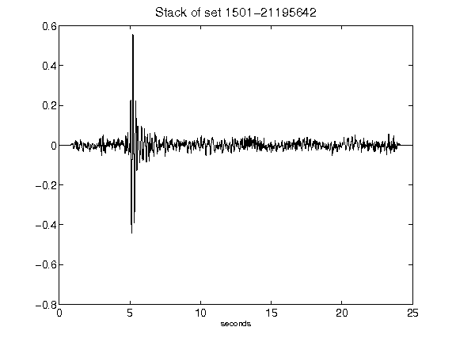](figures/1501-21195642_Stack.png)[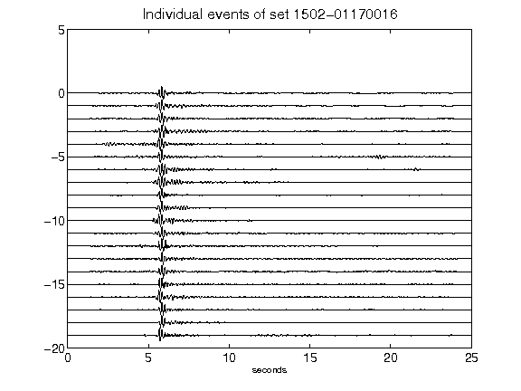](figures/1502-01170016_AllEv.png)[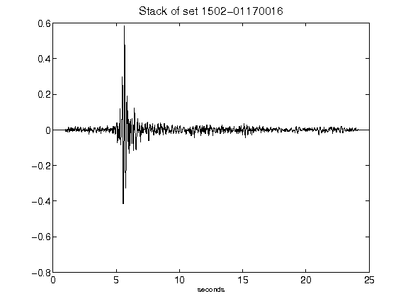](figures/1502-01170016_Stack.png)[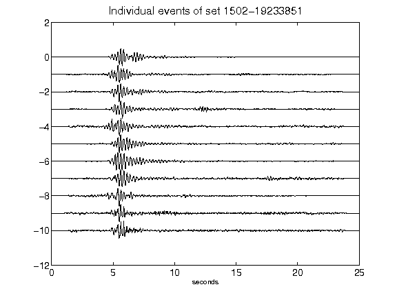](figures/1502-19233851_AllEv.png)[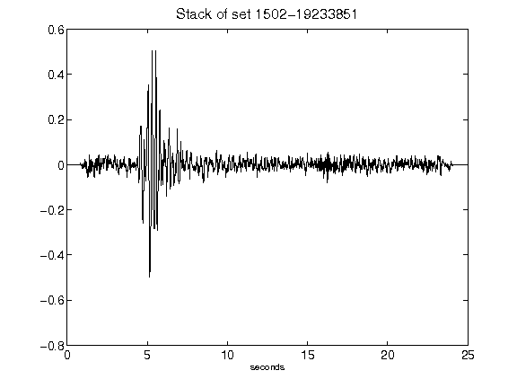](figures/1502-19233851_Stack.png)[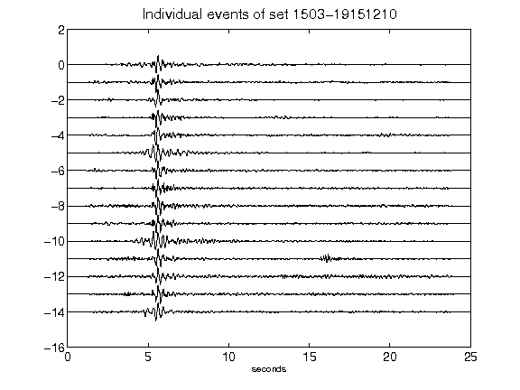](figures/1503-19151210_AllEv.png)[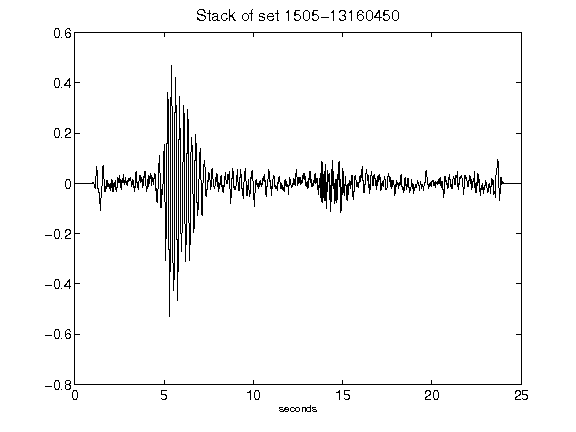](figures/1505-13160450_Stack.png)[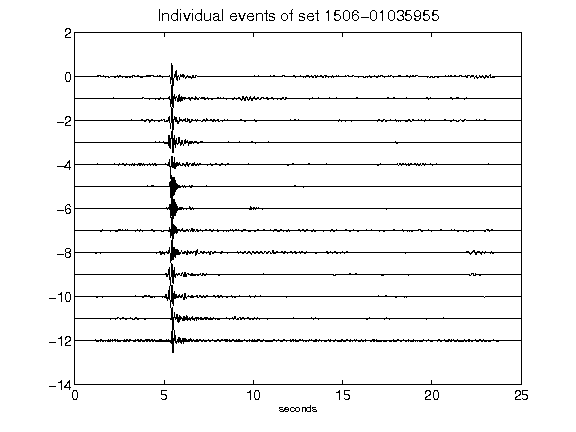](figures/1506-01035955_AllEv.png)[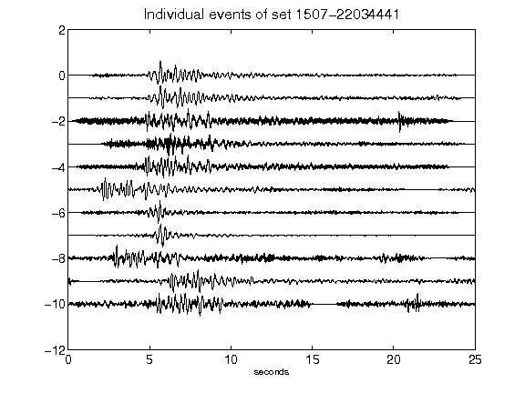](figures/1507-22034441_AllEv.png)[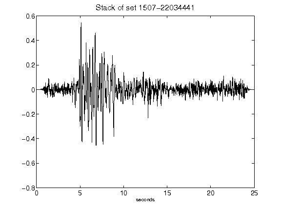](figures/1507-22034441_Stack.png)