# Repeating Earthquake Activity at RCM

## Waveforms
[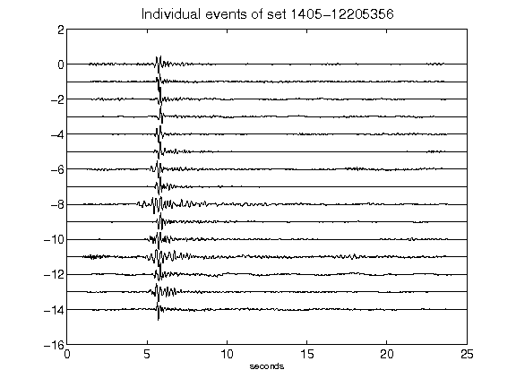](figures/1405-12205356_AllEv.png)[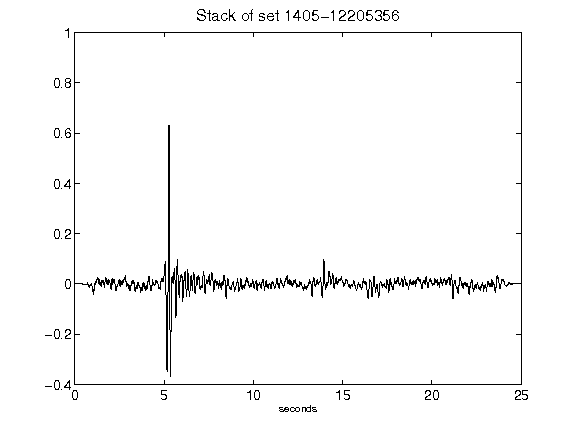](figures/1405-12205356_Stack.png)[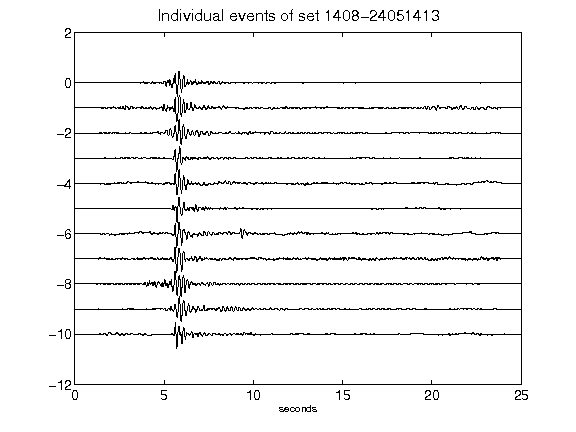](figures/1408-24051413_AllEv.png)[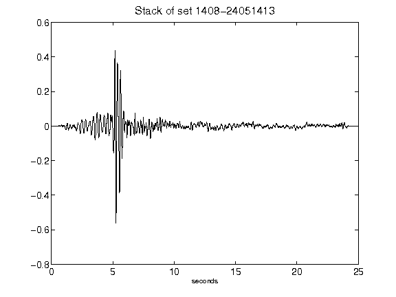](figures/1408-24051413_Stack.png)[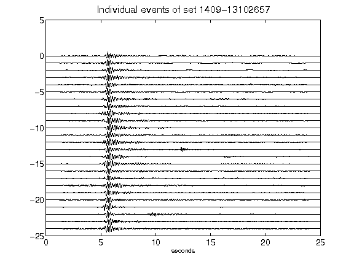](figures/1409-13102657_AllEv.png)[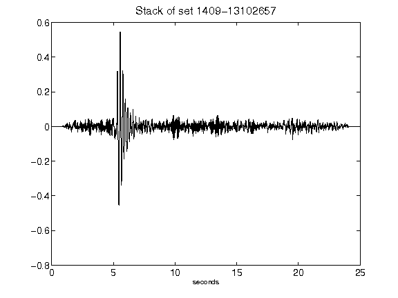](figures/1409-13102657_Stack.png)[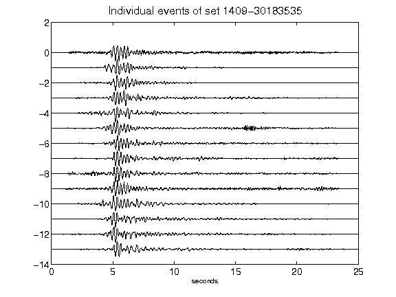](figures/1409-30183535_AllEv.png)[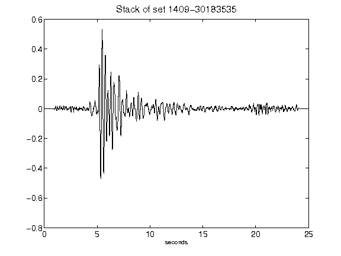](figures/1409-30183535_Stack.png)[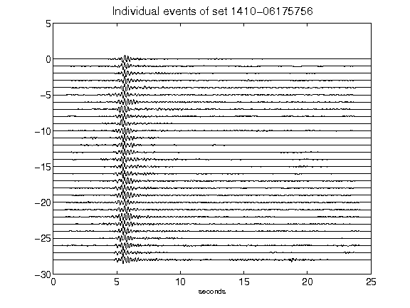](figures/1410-06175756_AllEv.png)[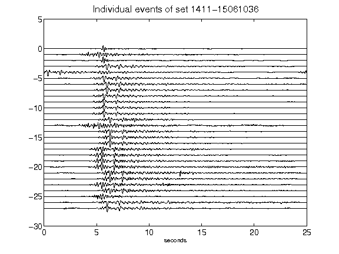](figures/1411-15061036_AllEv.png)[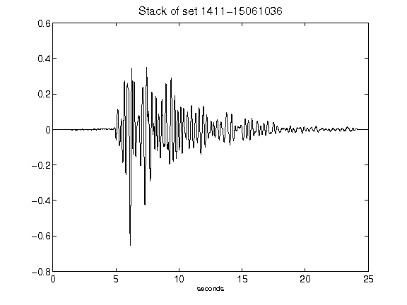](figures/1411-15061036_Stack.png)[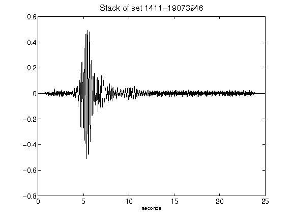](figures/1411-19073946_Stack.png)[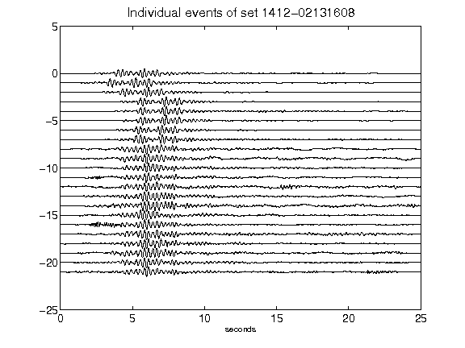](figures/1412-02131608_AllEv.png)[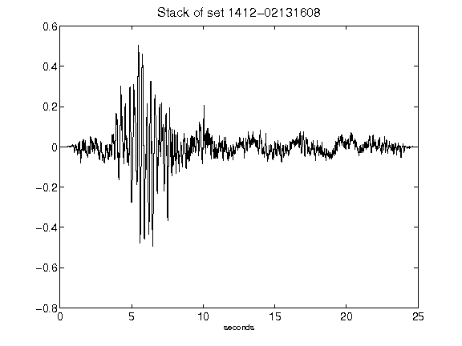](figures/1412-02131608_Stack.png)[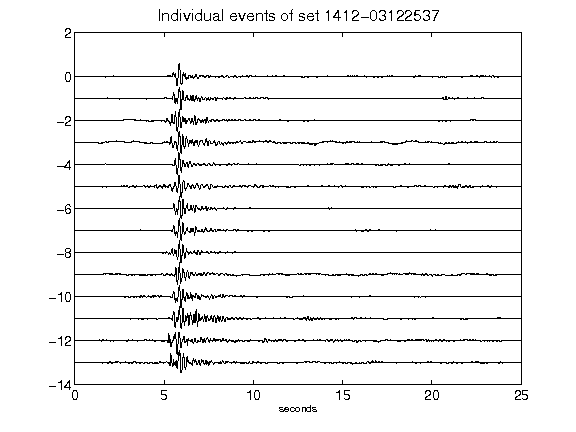](figures/1412-03122537_AllEv.png)[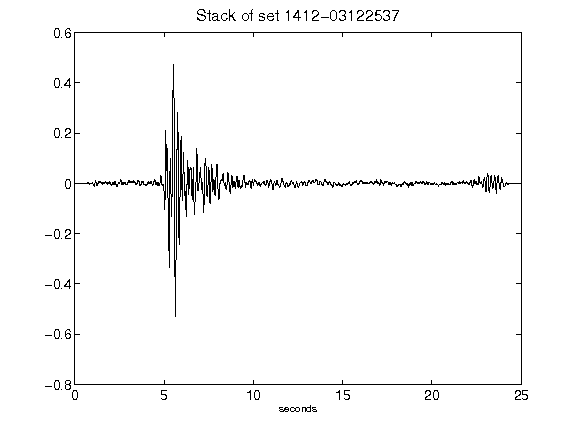](figures/1412-03122537_Stack.png)[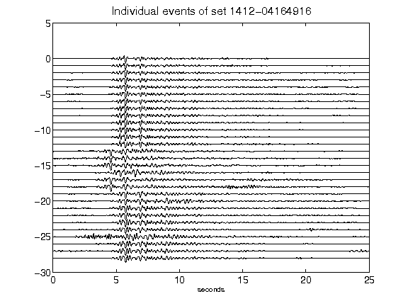](figures/1412-04164916_AllEv.png)[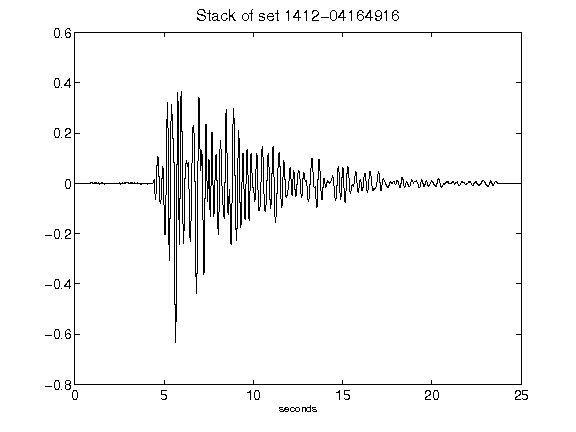](figures/1412-04164916_Stack.png)[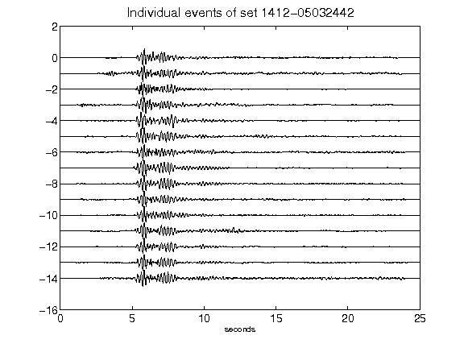](figures/1412-05032442_AllEv.png)[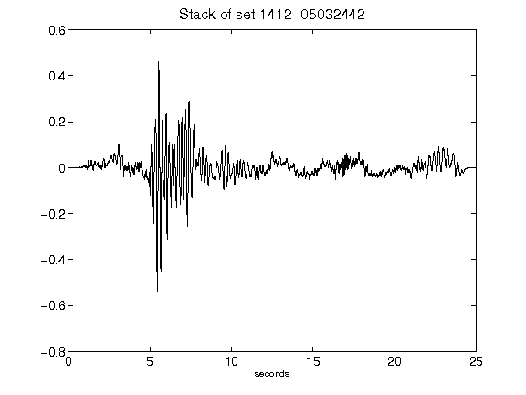](figures/1412-05032442_Stack.png)[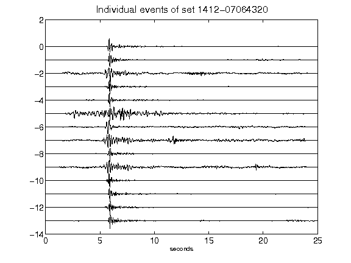](figures/1412-07064320_AllEv.png)[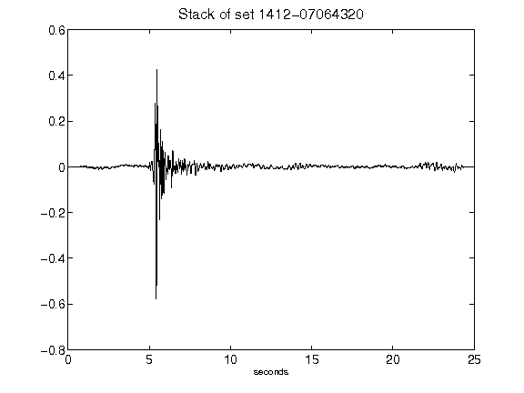](figures/1412-07064320_Stack.png)[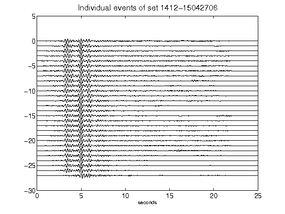](figures/1412-15042706_AllEv.png)[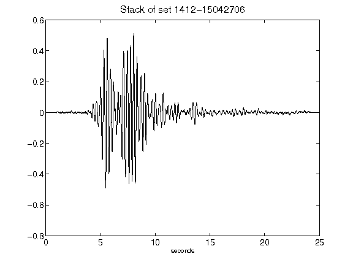](figures/1412-15042706_Stack.png)[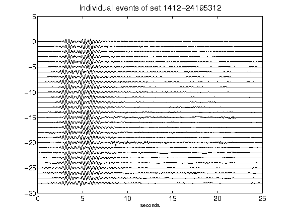](figures/1412-24195312_AllEv.png)[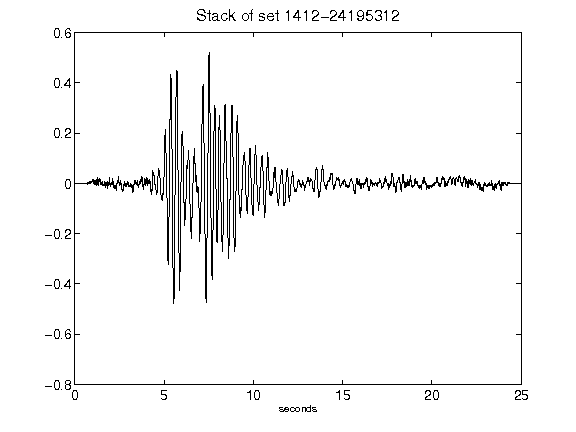](figures/1412-24195312_Stack.png)[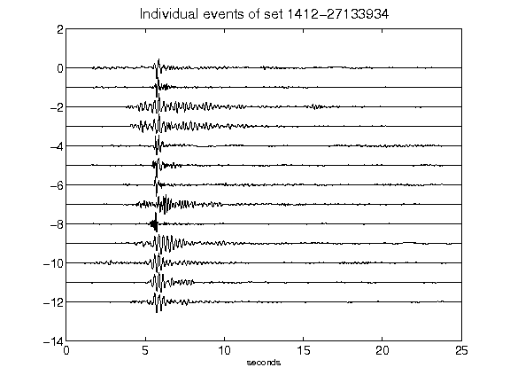](figures/1412-27133934_AllEv.png)[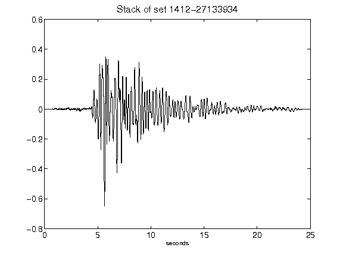](figures/1412-27133934_Stack.png)[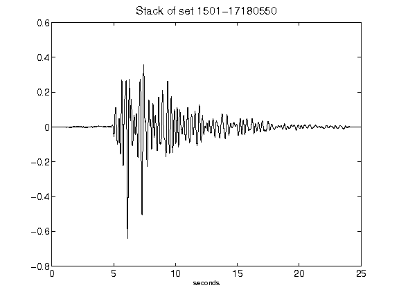](figures/1501-17180550_Stack.png)