# Repeating Earthquake Activity at RCM

## Waveforms
[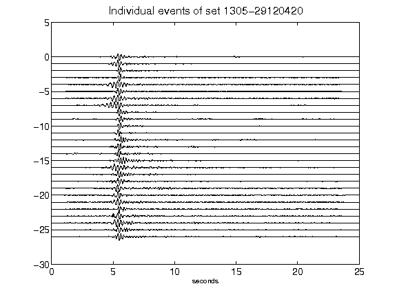](figures/1305-29120420_AllEv.png)[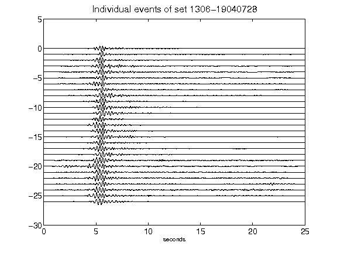](figures/1306-19040728_AllEv.png)[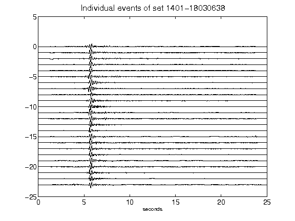](figures/1401-18030638_AllEv.png)[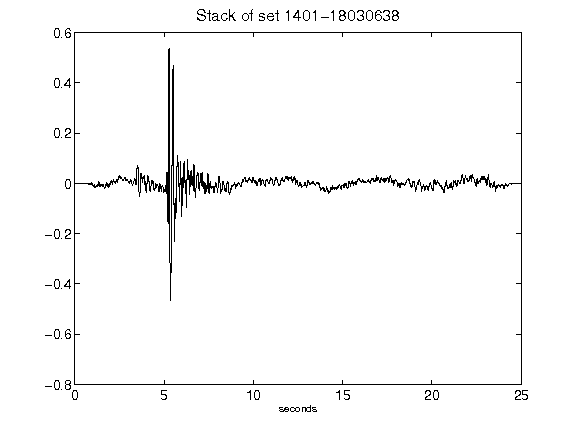](figures/1401-18030638_Stack.png)[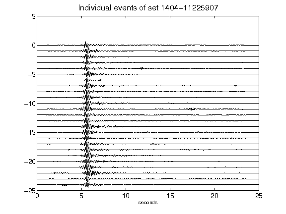](figures/1404-11225907_AllEv.png)[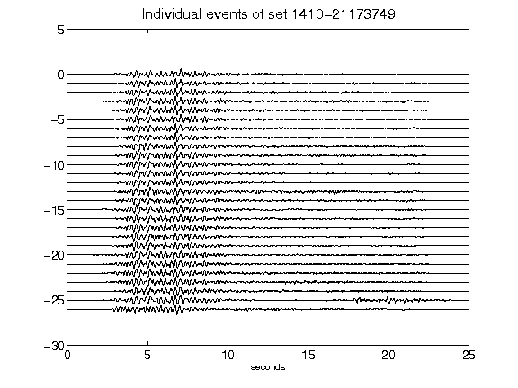](figures/1410-21173749_AllEv.png)[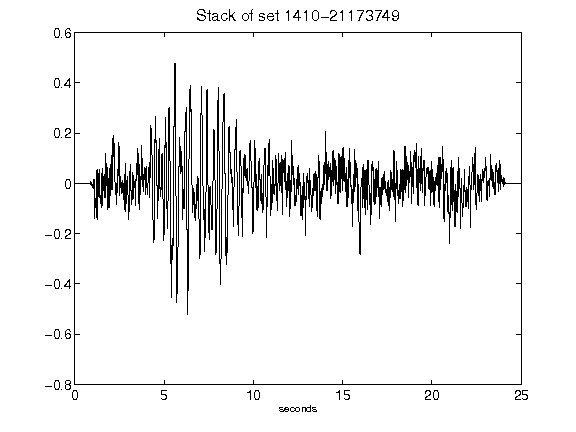](figures/1410-21173749_Stack.png)[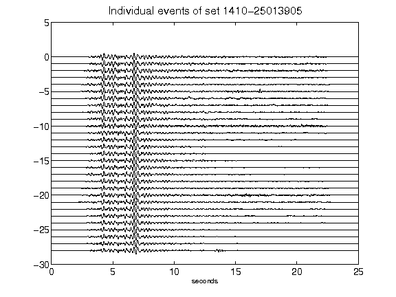](figures/1410-25013905_AllEv.png)[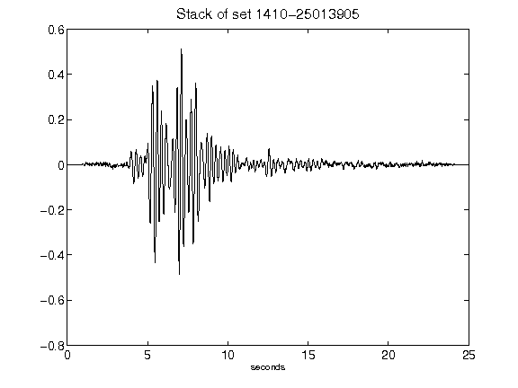](figures/1410-25013905_Stack.png)[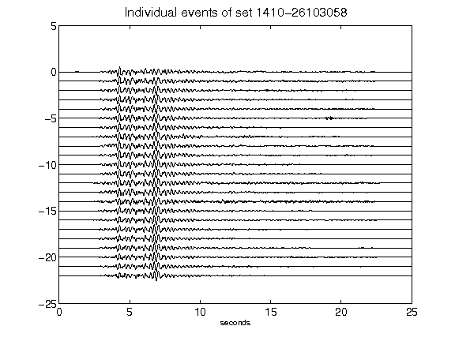](figures/1410-26103058_AllEv.png)[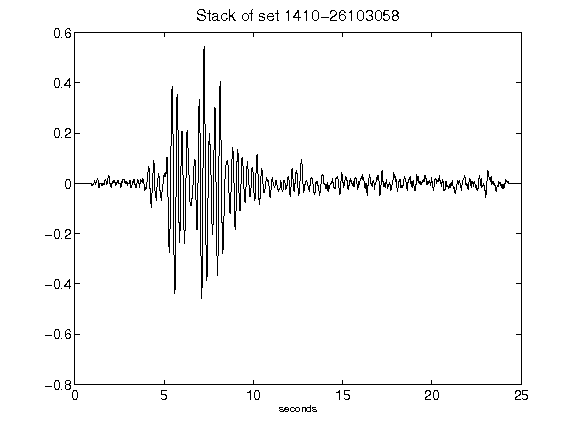](figures/1410-26103058_Stack.png)[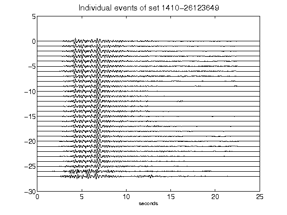](figures/1410-26123649_AllEv.png)[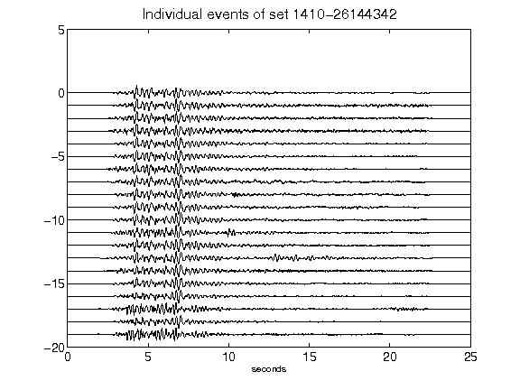](figures/1410-26144342_AllEv.png)[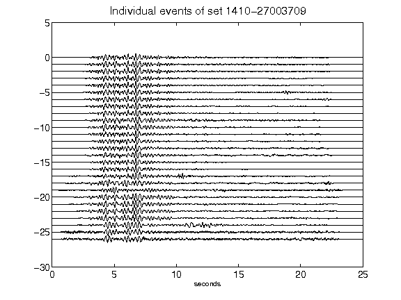](figures/1410-27003709_AllEv.png)[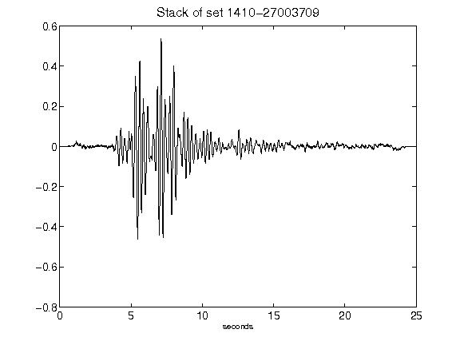](figures/1410-27003709_Stack.png)[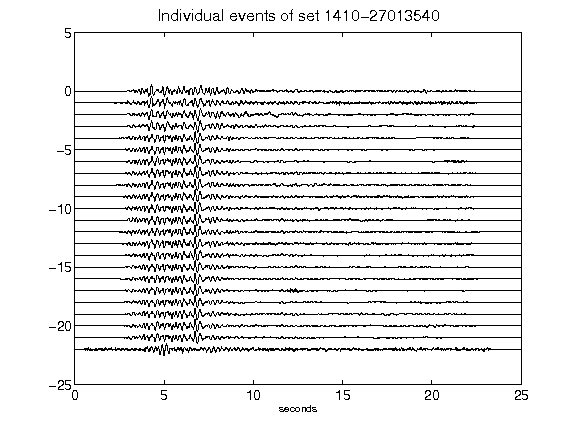](figures/1410-27013540_AllEv.png)[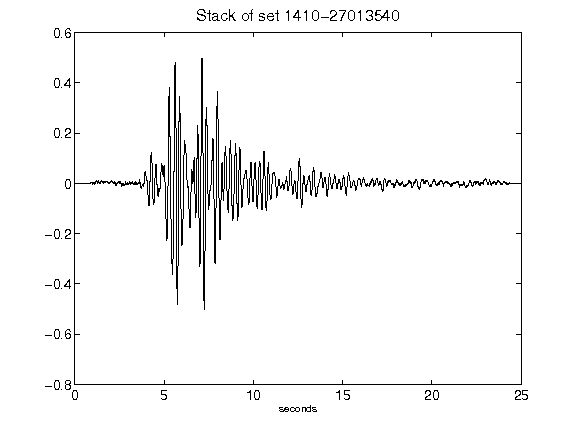](figures/1410-27013540_Stack.png)[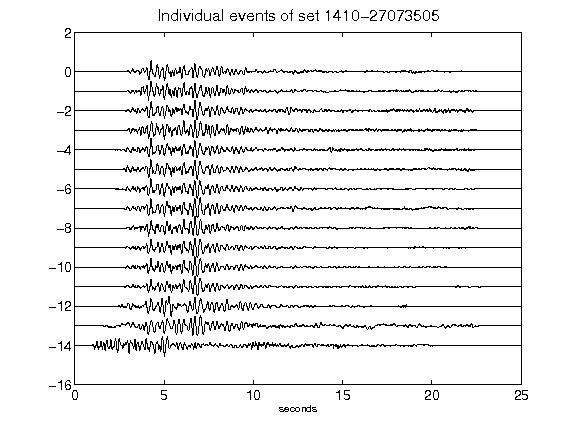](figures/1410-27073505_AllEv.png)[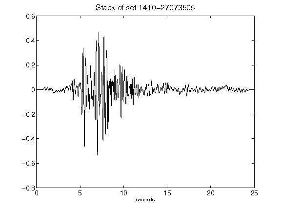](figures/1410-27073505_Stack.png)[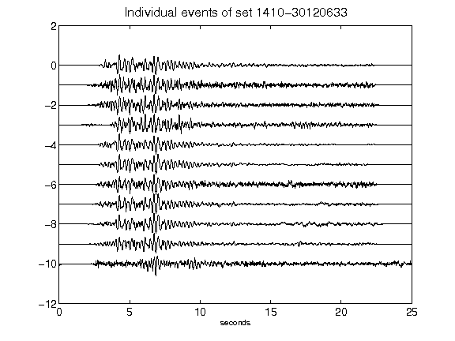](figures/1410-30120633_AllEv.png)[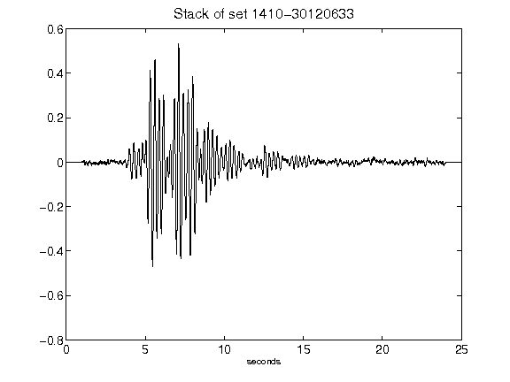](figures/1410-30120633_Stack.png)[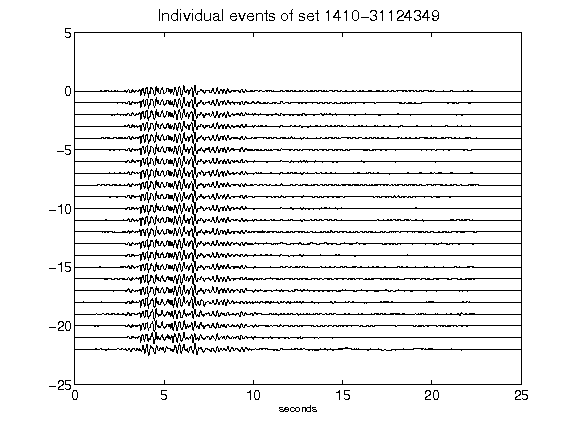](figures/1410-31124349_AllEv.png)[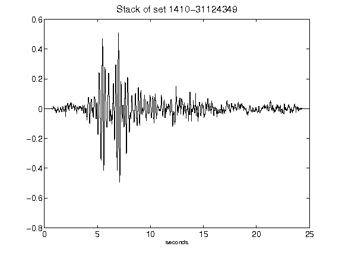](figures/1410-31124349_Stack.png)[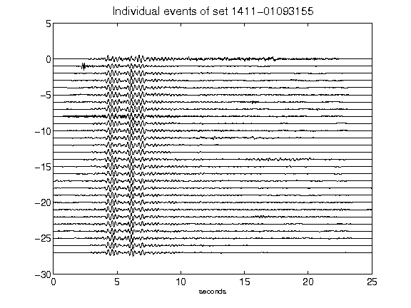](figures/1411-01093155_AllEv.png)[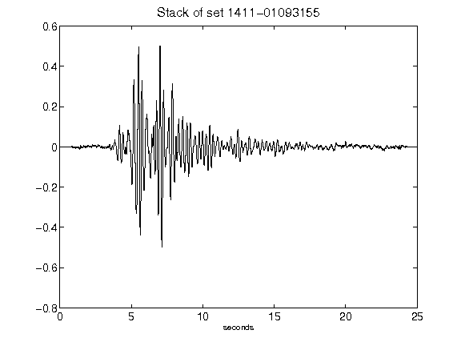](figures/1411-01093155_Stack.png)[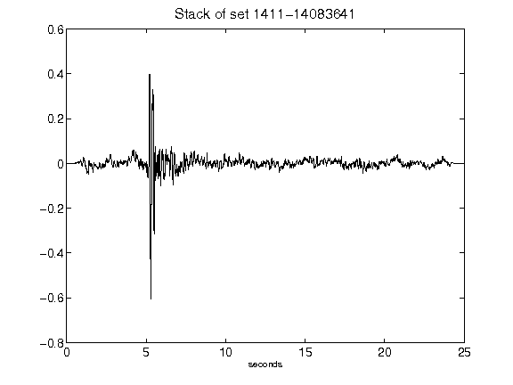](figures/1411-14083641_Stack.png)[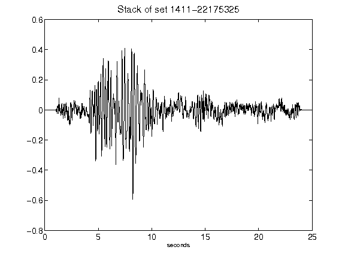](figures/1411-22175325_Stack.png)