# Repeating Earthquake Activity at RCM

## Waveforms
[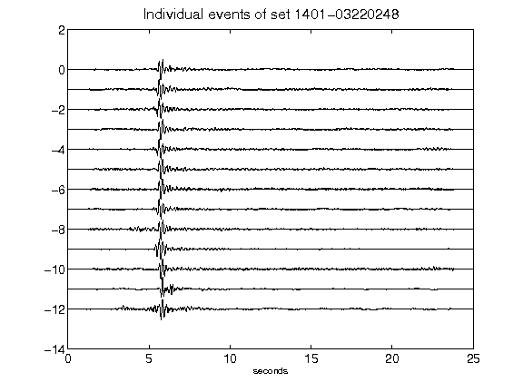](figures/1401-03220248_AllEv.png)[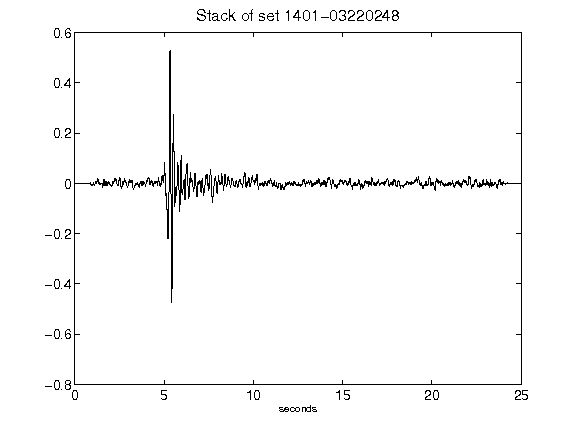](figures/1401-03220248_Stack.png)[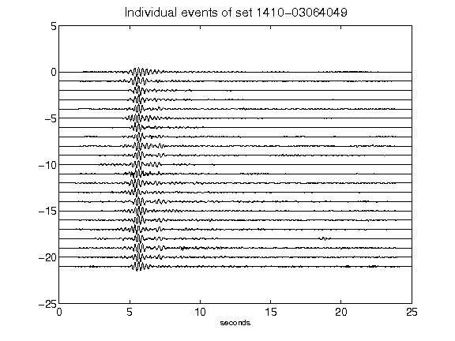](figures/1410-03064049_AllEv.png)[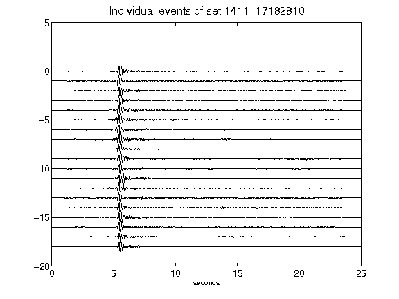](figures/1411-17182810_AllEv.png)[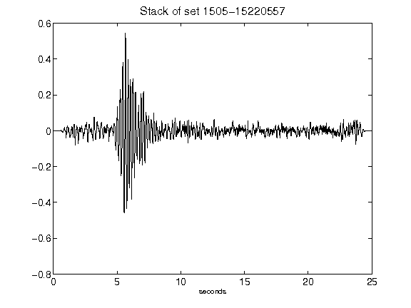](figures/1505-15220557_Stack.png)[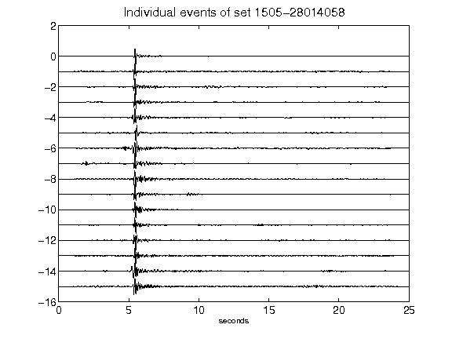](figures/1505-28014058_AllEv.png)[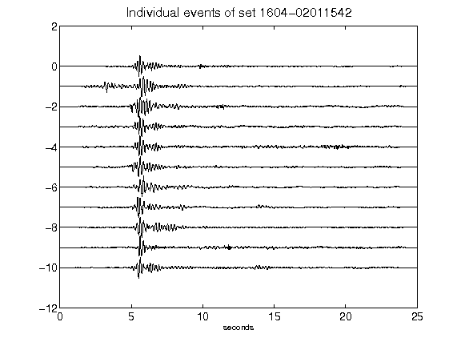](figures/1604-02011542_AllEv.png)[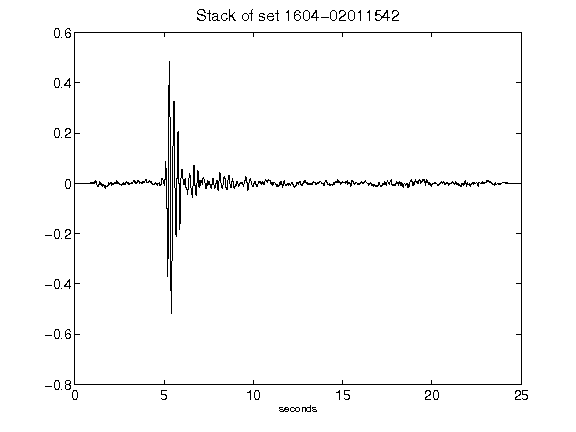](figures/1604-02011542_Stack.png)[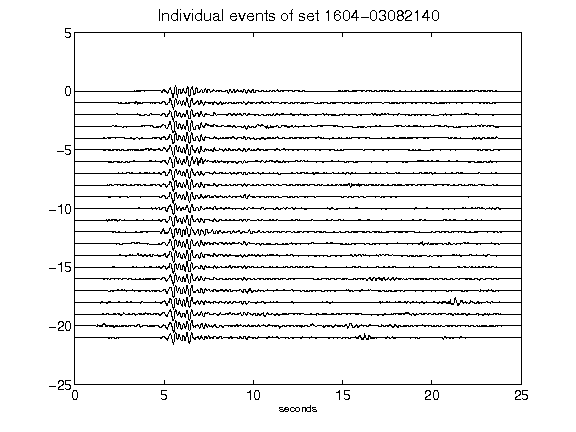](figures/1604-03082140_AllEv.png)[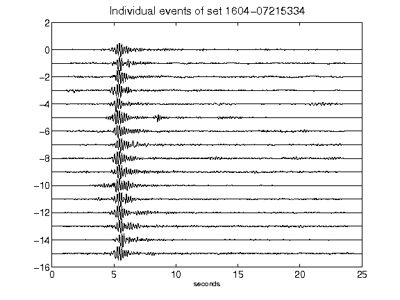](figures/1604-07215334_AllEv.png)[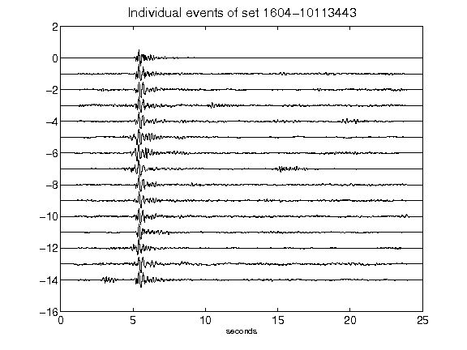](figures/1604-10113443_AllEv.png)[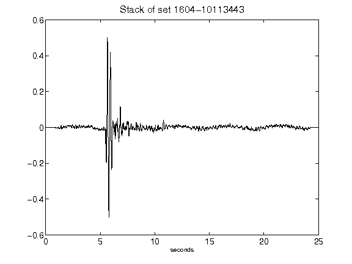](figures/1604-10113443_Stack.png)