# Repeating Earthquake Activity at RCM

## Waveforms
[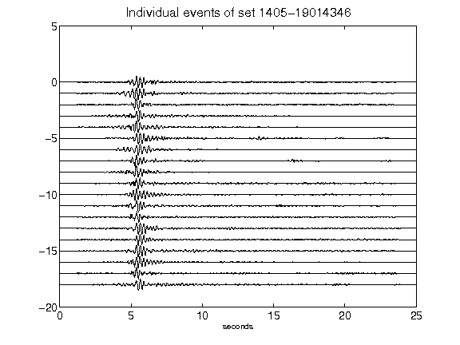](figures/1405-19014346_AllEv.png)[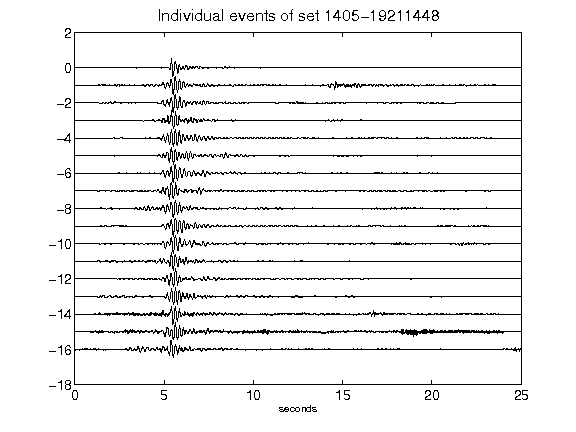](figures/1405-19211448_AllEv.png)[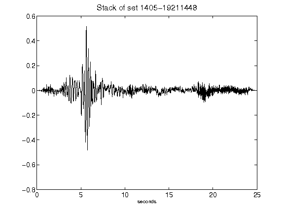](figures/1405-19211448_Stack.png)[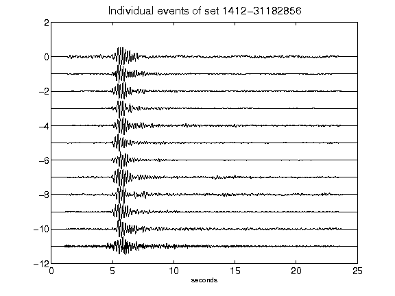](figures/1412-31182856_AllEv.png)[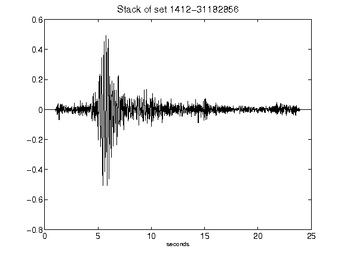](figures/1412-31182856_Stack.png)[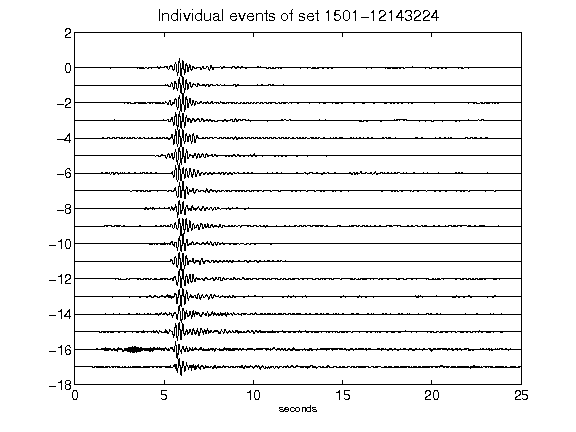](figures/1501-12143224_AllEv.png)[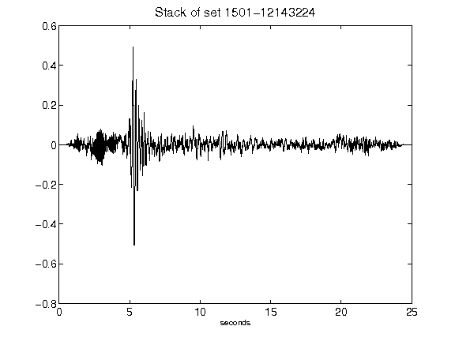](figures/1501-12143224_Stack.png)[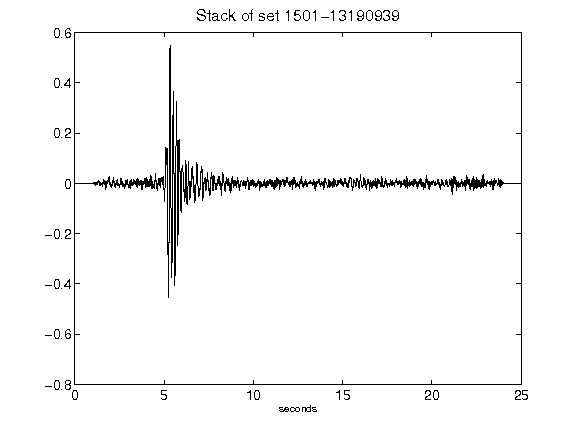](figures/1501-13190939_Stack.png)[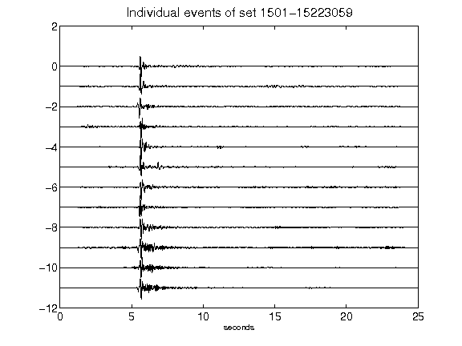](figures/1501-15223059_AllEv.png)[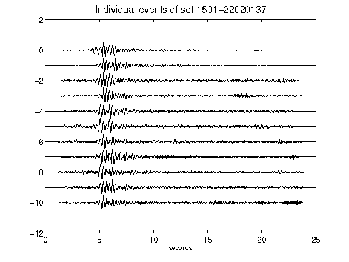](figures/1501-22020137_AllEv.png)[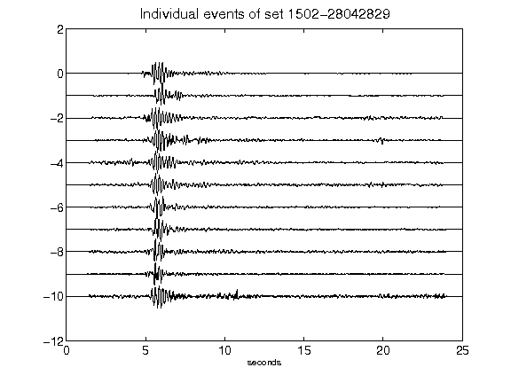](figures/1502-28042829_AllEv.png)