# Repeating Earthquake Activity at RCM

## Waveforms
[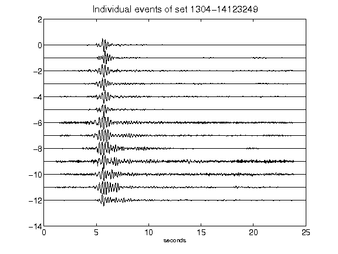](figures/1304-14123249_AllEv.png)[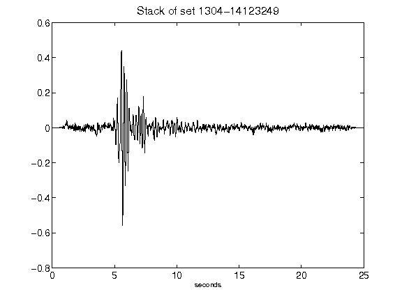](figures/1304-14123249_Stack.png)[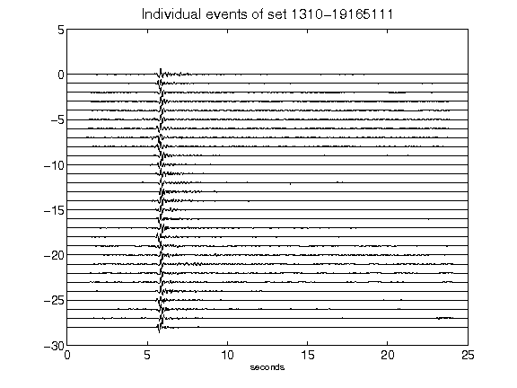](figures/1310-19165111_AllEv.png)[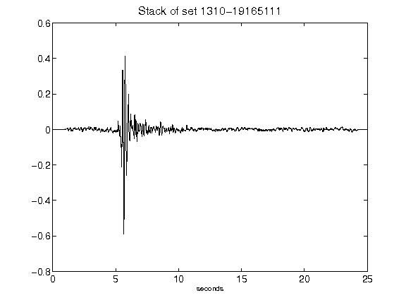](figures/1310-19165111_Stack.png)[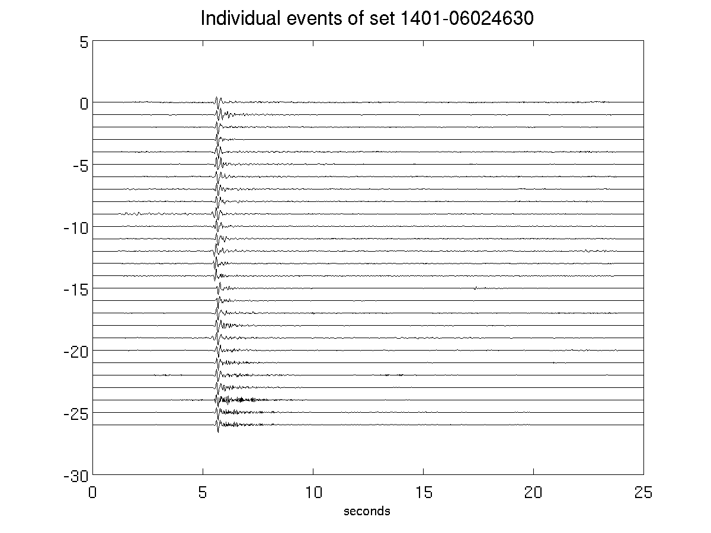](figures/1401-06024630_AllEv.png)[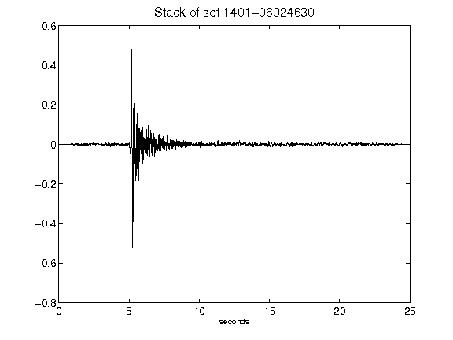](figures/1401-06024630_Stack.png)[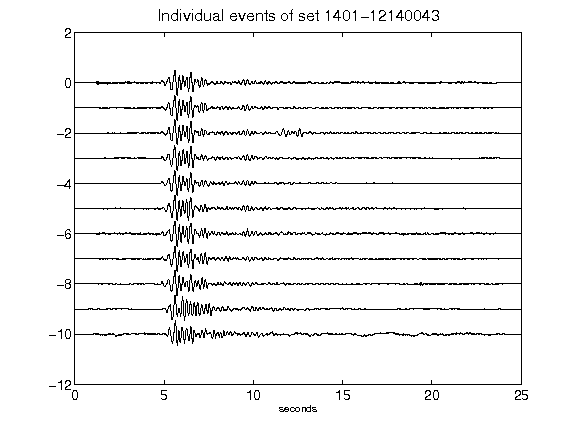](figures/1401-12140043_AllEv.png)[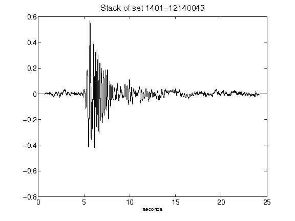](figures/1401-12140043_Stack.png)[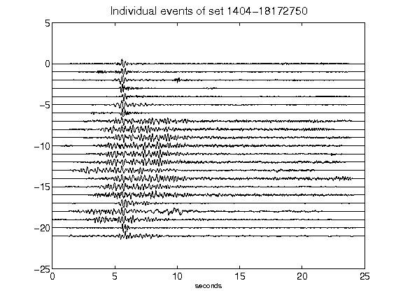](figures/1404-18172750_AllEv.png)[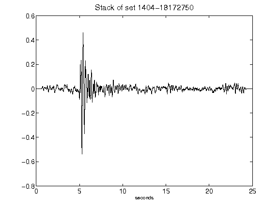](figures/1404-18172750_Stack.png)[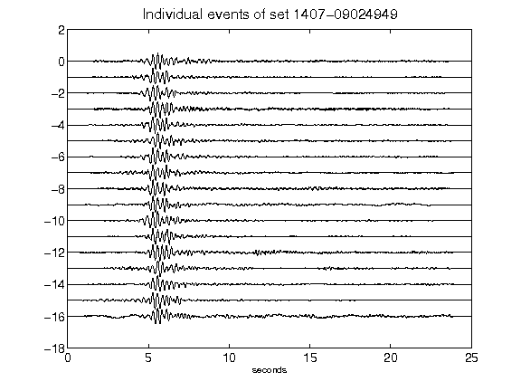](figures/1407-09024949_AllEv.png)[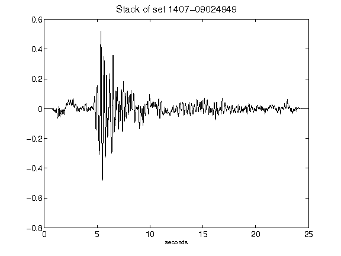](figures/1407-09024949_Stack.png)[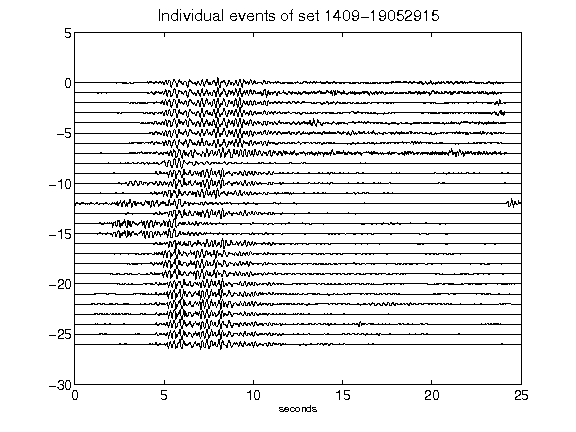](figures/1409-19052915_AllEv.png)[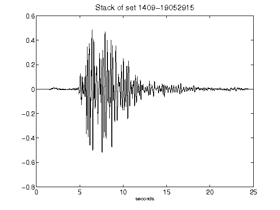](figures/1409-19052915_Stack.png)[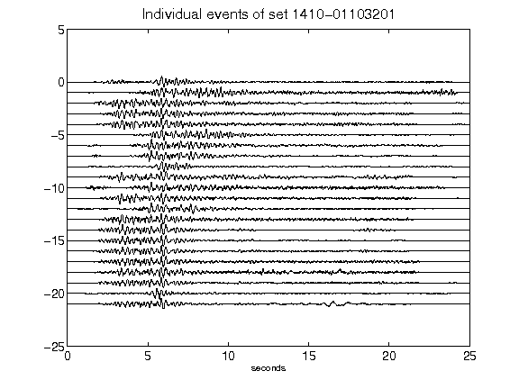](figures/1410-01103201_AllEv.png)[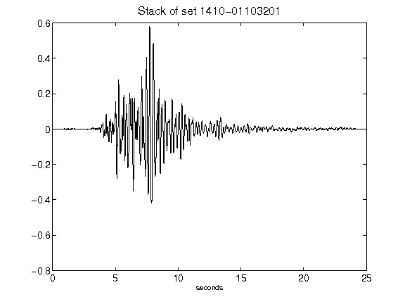](figures/1410-01103201_Stack.png)[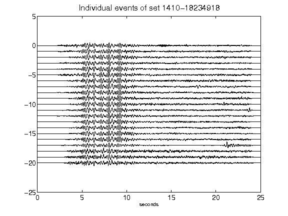](figures/1410-18234918_AllEv.png)[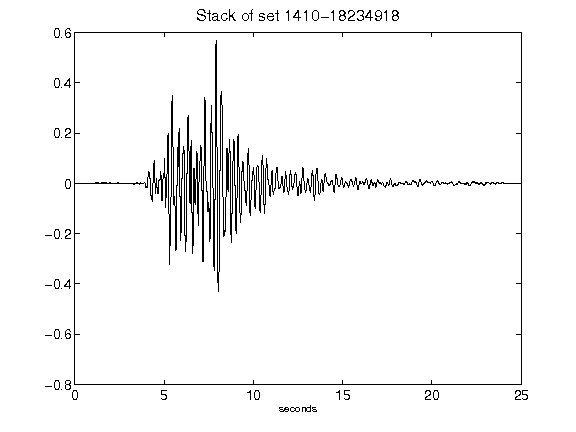](figures/1410-18234918_Stack.png)[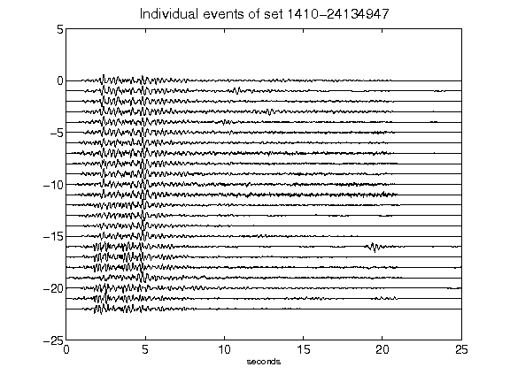](figures/1410-24134947_AllEv.png)[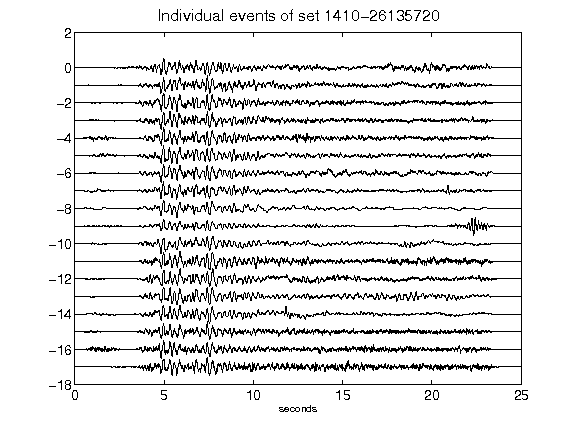](figures/1410-26135720_AllEv.png)[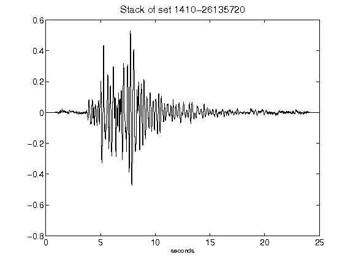](figures/1410-26135720_Stack.png)