# Repeating Earthquake Activity at RCM

## Waveforms
[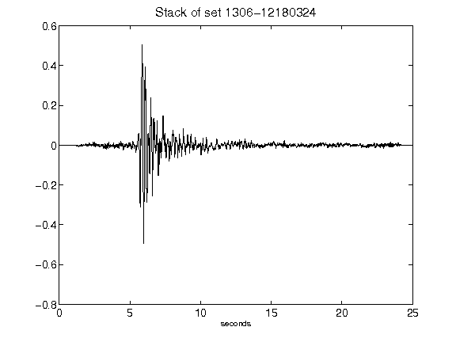](figures/1306-12180324_Stack.png)[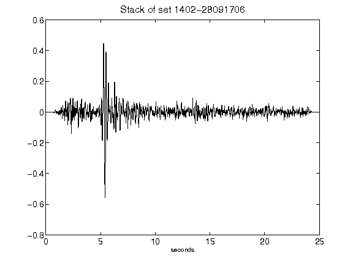](figures/1402-28091706_Stack.png)[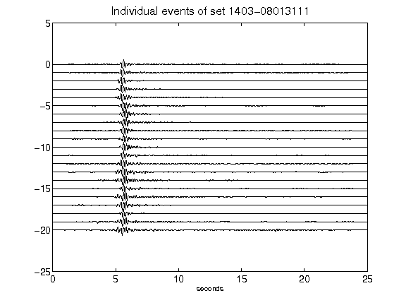](figures/1403-08013111_AllEv.png)[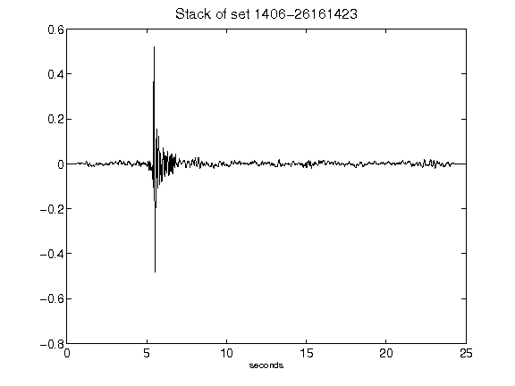](figures/1406-26161423_Stack.png)[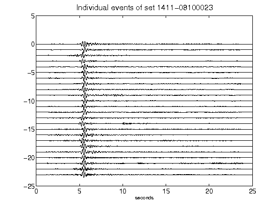](figures/1411-08100023_AllEv.png)[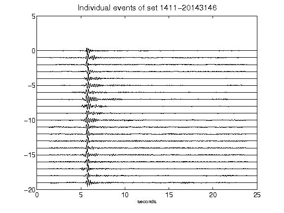](figures/1411-20143146_AllEv.png)[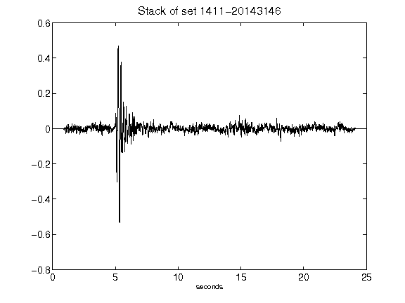](figures/1411-20143146_Stack.png)[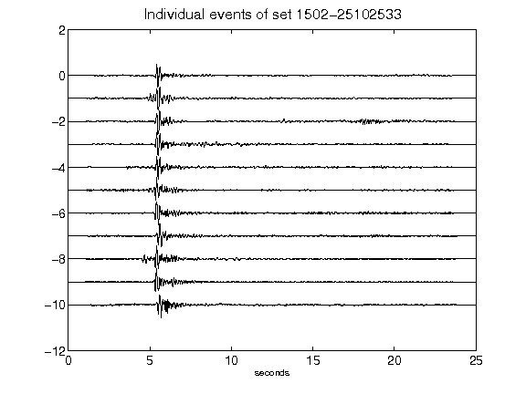](figures/1502-25102533_AllEv.png)[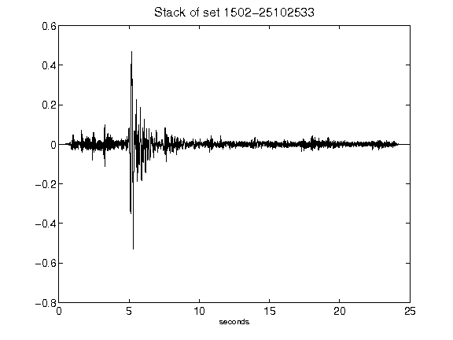](figures/1502-25102533_Stack.png)[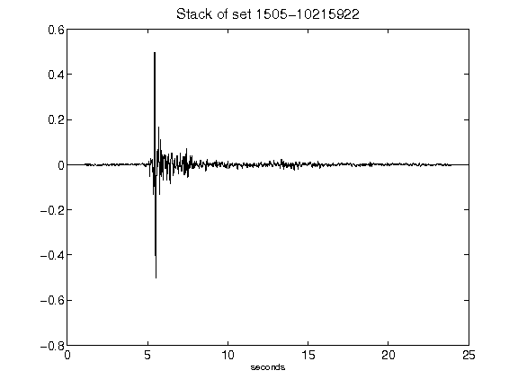](figures/1505-10215922_Stack.png)[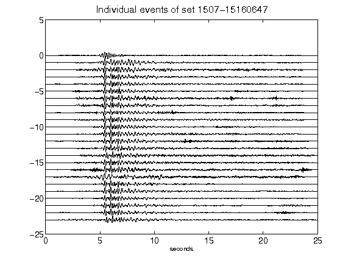](figures/1507-15160647_AllEv.png)[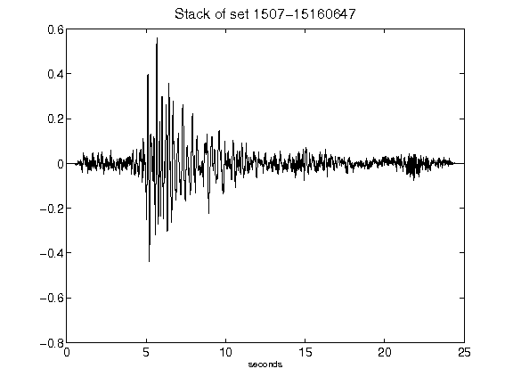](figures/1507-15160647_Stack.png)