# Repeating Earthquake Activity at RCM

## Waveforms
[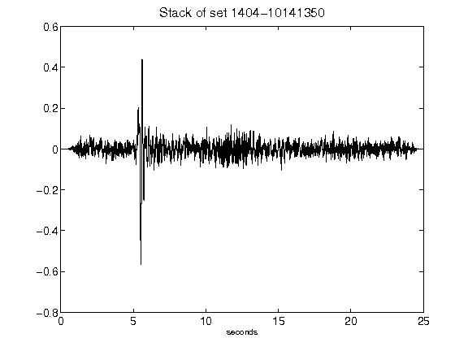](figures/1404-10141350_Stack.png)[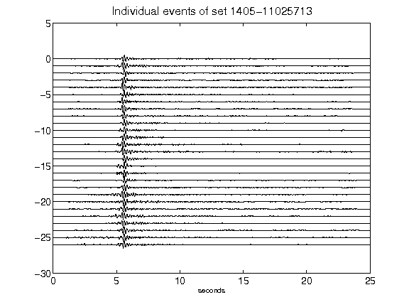](figures/1405-11025713_AllEv.png)[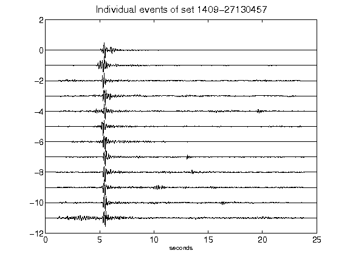](figures/1409-27130457_AllEv.png)[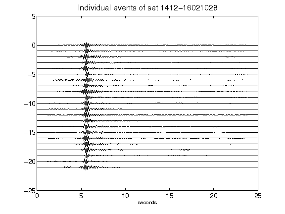](figures/1412-16021028_AllEv.png)[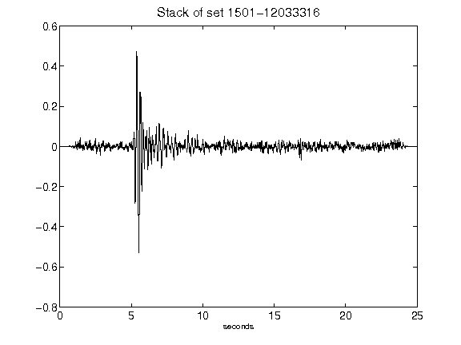](figures/1501-12033316_Stack.png)[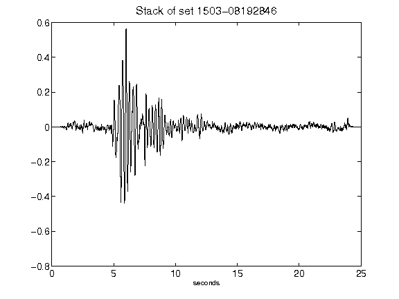](figures/1503-08192846_Stack.png)[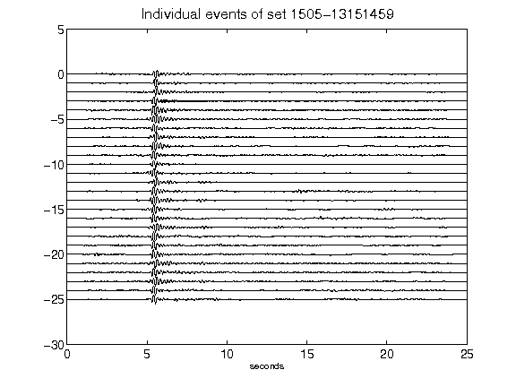](figures/1505-13151459_AllEv.png)[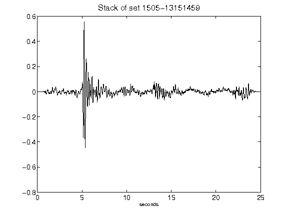](figures/1505-13151459_Stack.png)[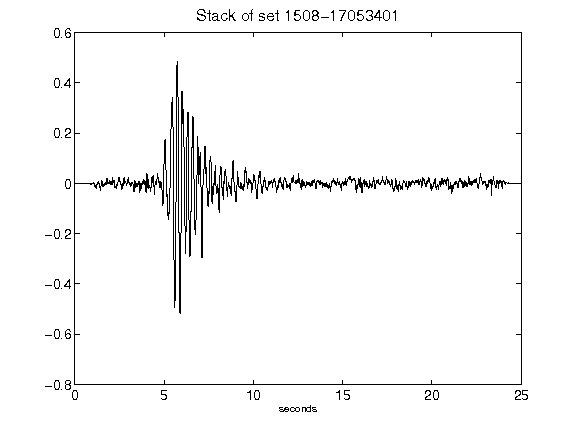](figures/1508-17053401_Stack.png)[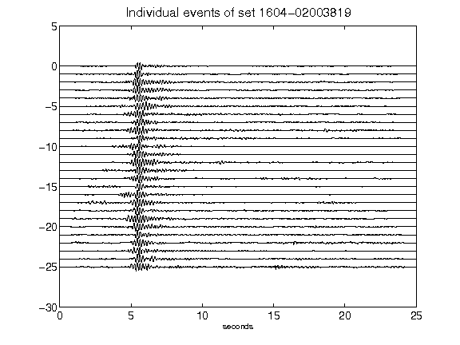](figures/1604-02003819_AllEv.png)[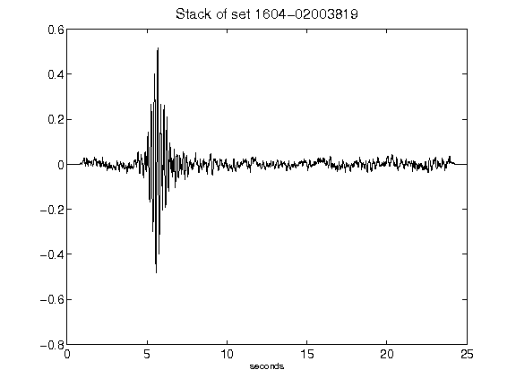](figures/1604-02003819_Stack.png)[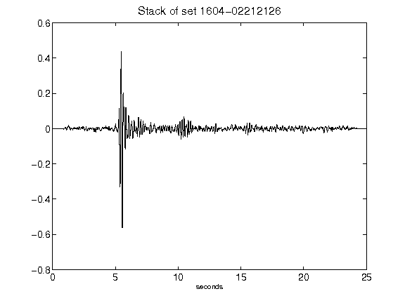](figures/1604-02212126_Stack.png)[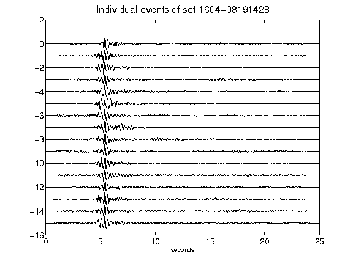](figures/1604-08191428_AllEv.png)[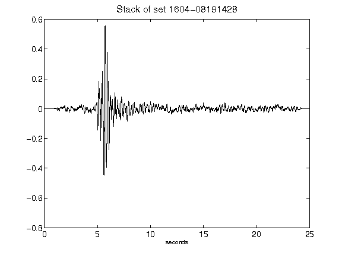](figures/1604-08191428_Stack.png)[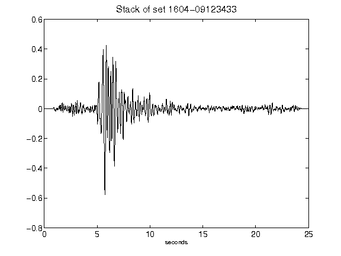](figures/1604-09123433_Stack.png)