# Repeating Earthquake Activity at RCM

## Waveforms
[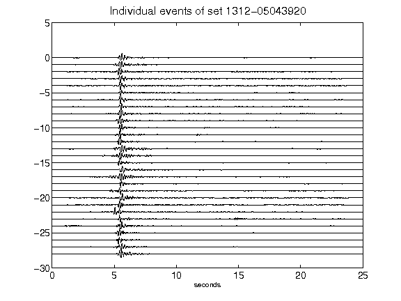](figures/1312-05043920_AllEv.png)[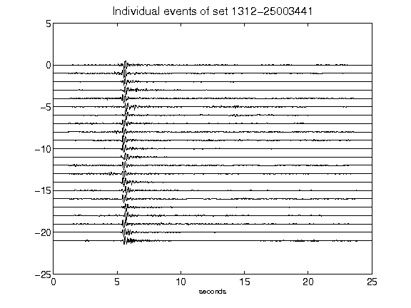](figures/1312-25003441_AllEv.png)[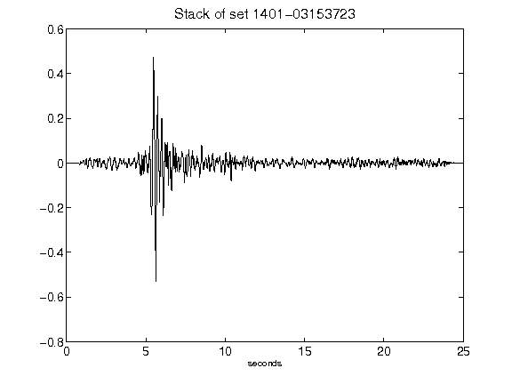](figures/1401-03153723_Stack.png)[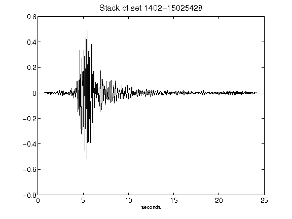](figures/1402-15025428_Stack.png)[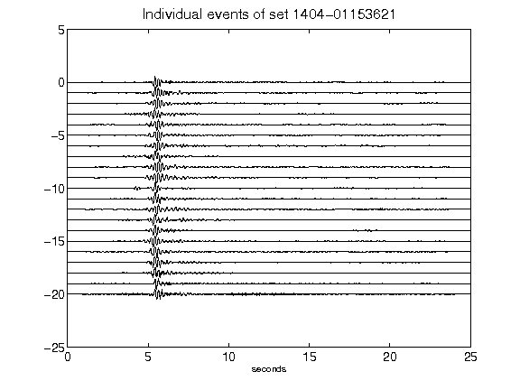](figures/1404-01153621_AllEv.png)[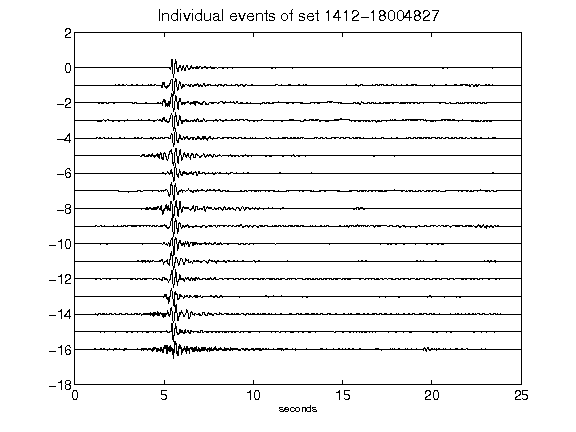](figures/1412-18004827_AllEv.png)[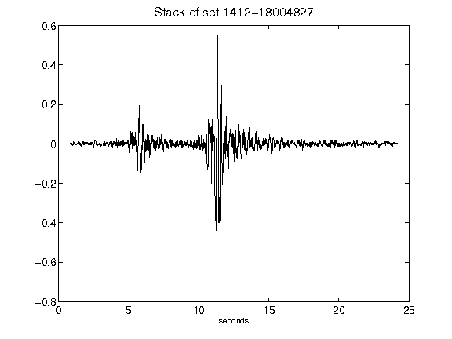](figures/1412-18004827_Stack.png)[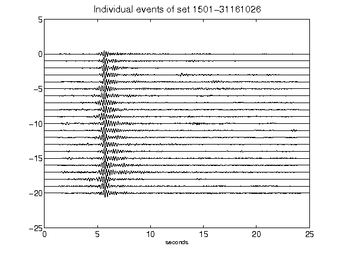](figures/1501-31161026_AllEv.png)[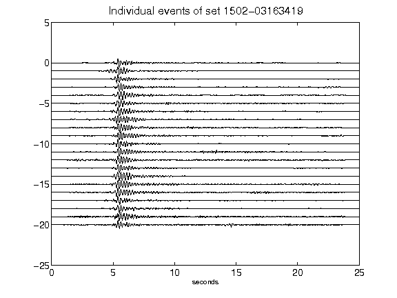](figures/1502-03163419_AllEv.png)[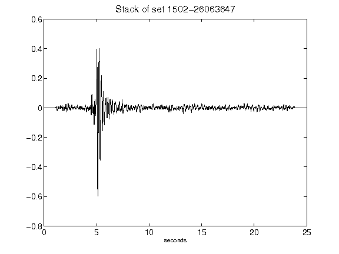](figures/1502-26063647_Stack.png)[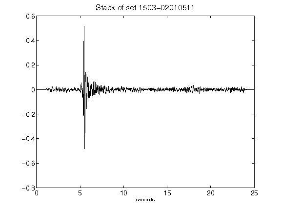](figures/1503-02010511_Stack.png)[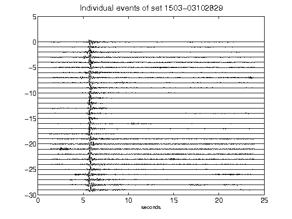](figures/1503-03102829_AllEv.png)[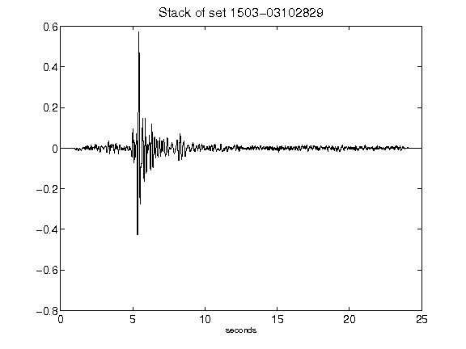](figures/1503-03102829_Stack.png)[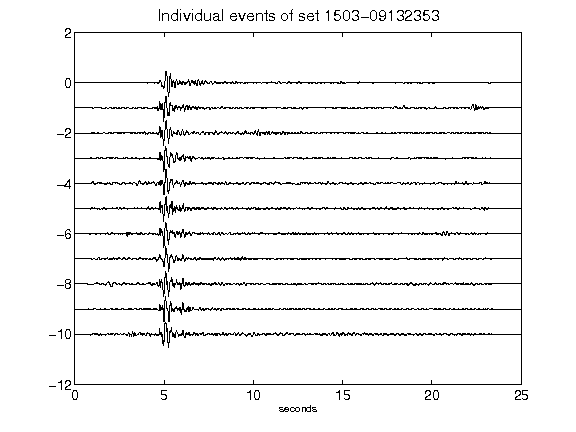](figures/1503-09132353_AllEv.png)[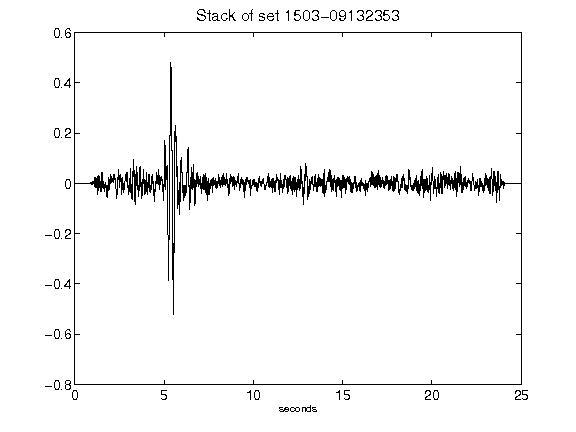](figures/1503-09132353_Stack.png)[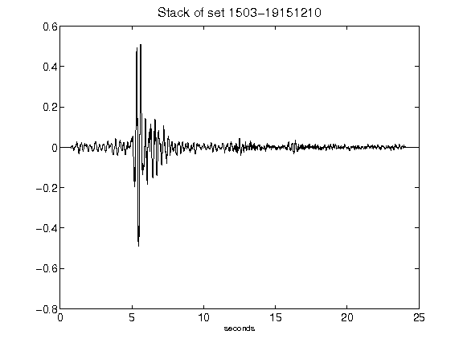](figures/1503-19151210_Stack.png)[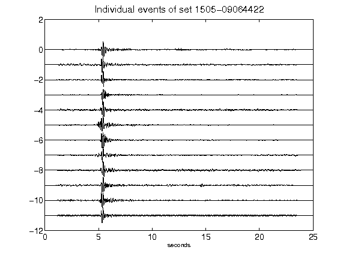](figures/1505-09064422_AllEv.png)[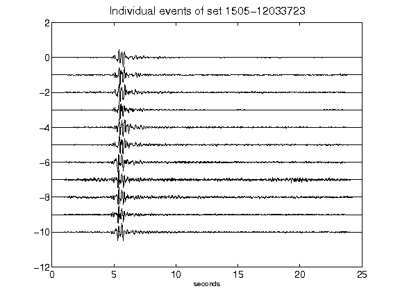](figures/1505-12033723_AllEv.png)[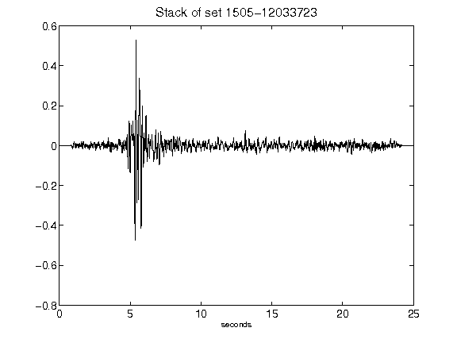](figures/1505-12033723_Stack.png)[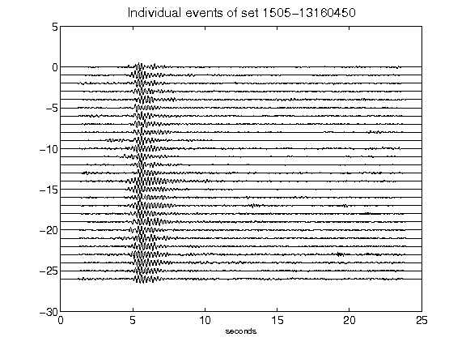](figures/1505-13160450_AllEv.png)