# Repeating Earthquake Activity at RCM

## Waveforms
[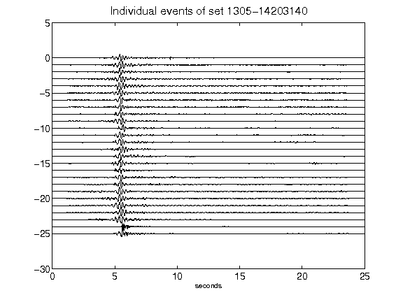](figures/1305-14203140_AllEv.png)[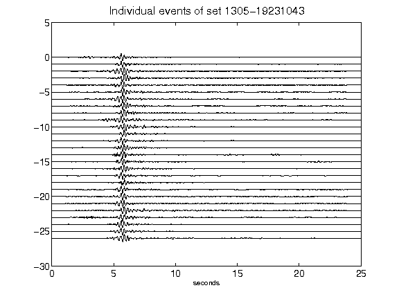](figures/1305-19231043_AllEv.png)[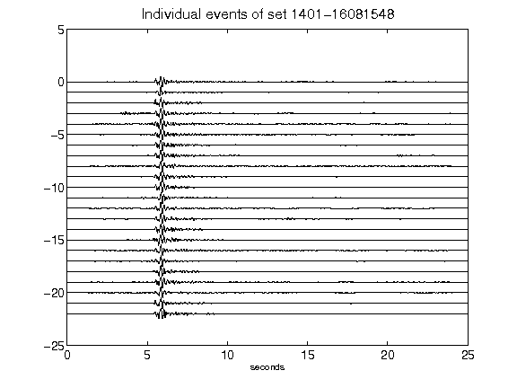](figures/1401-16081548_AllEv.png)[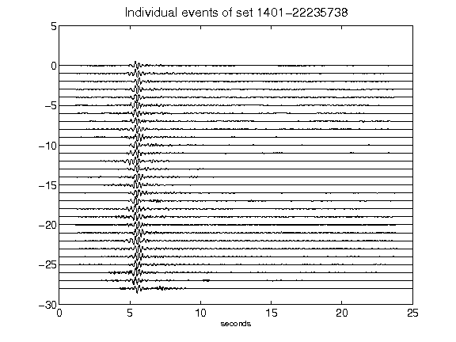](figures/1401-22235738_AllEv.png)[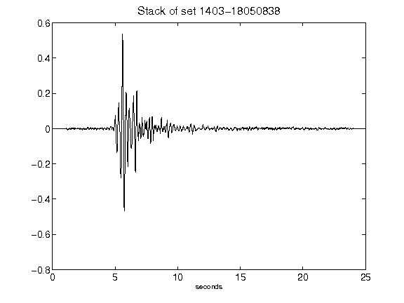](figures/1403-18050838_Stack.png)[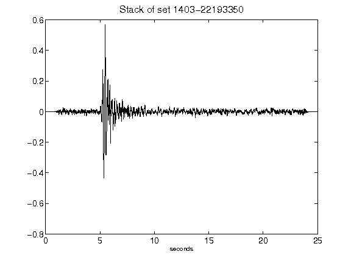](figures/1403-22193350_Stack.png)[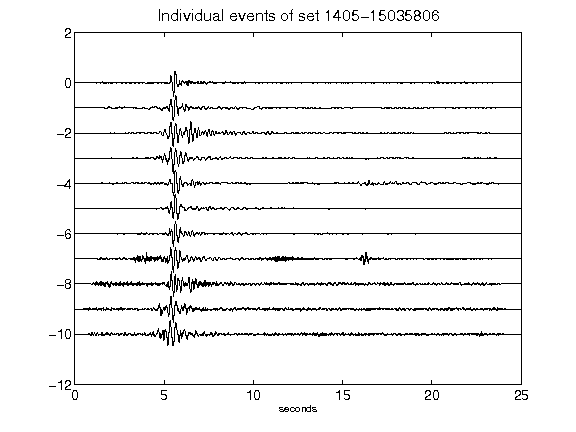](figures/1405-15035806_AllEv.png)[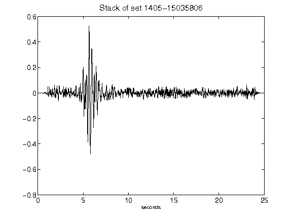](figures/1405-15035806_Stack.png)[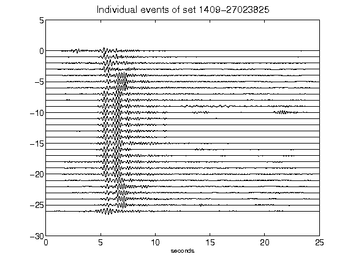](figures/1409-27023825_AllEv.png)[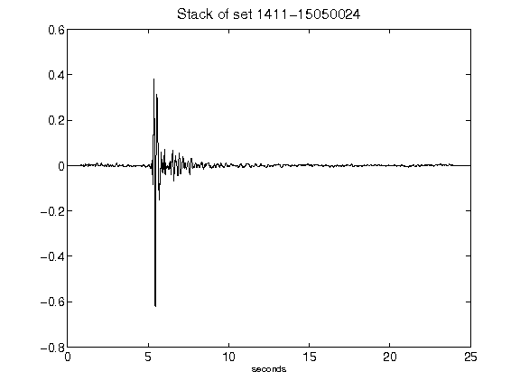](figures/1411-15050024_Stack.png)[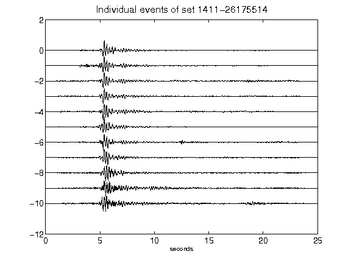](figures/1411-26175514_AllEv.png)[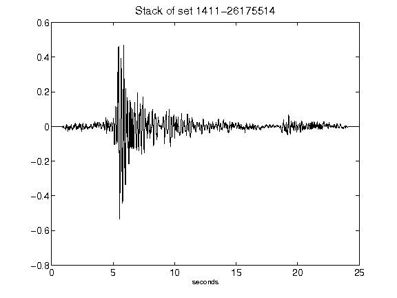](figures/1411-26175514_Stack.png)[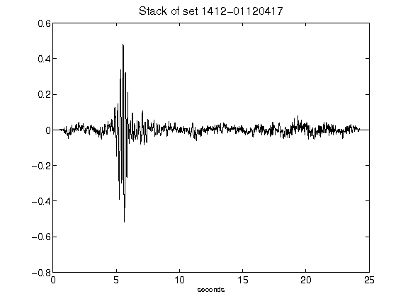](figures/1412-01120417_Stack.png)[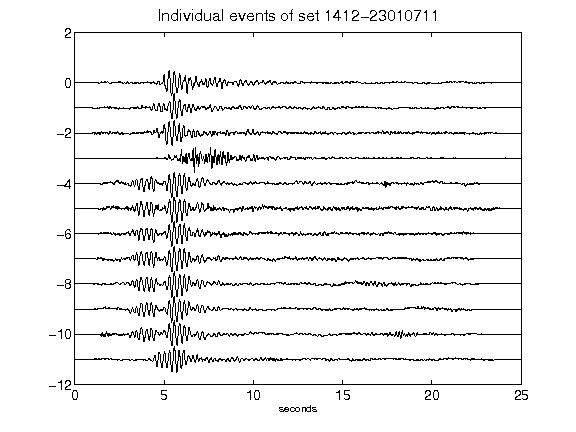](figures/1412-23010711_AllEv.png)[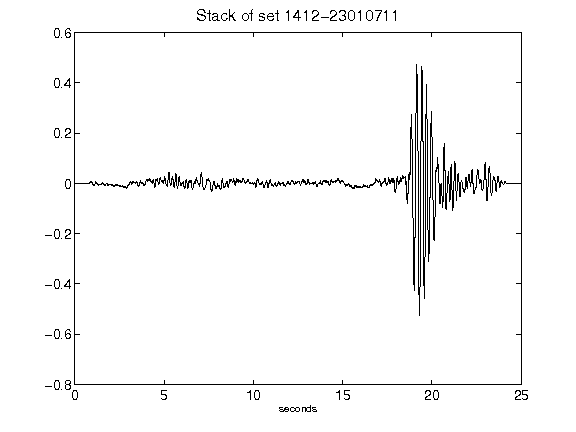](figures/1412-23010711_Stack.png)[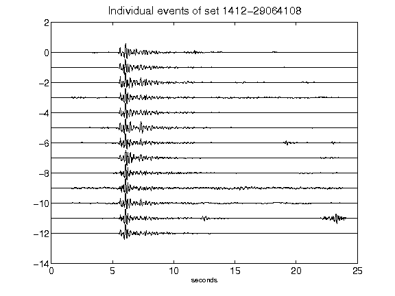](figures/1412-29064108_AllEv.png)[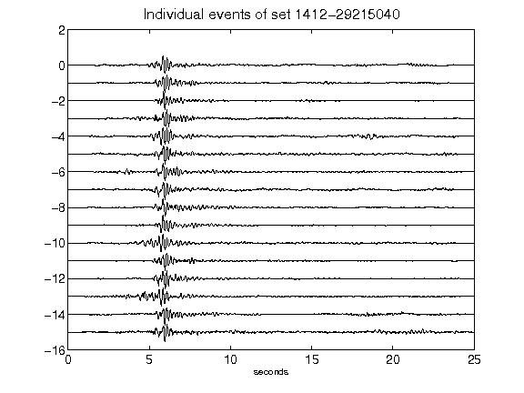](figures/1412-29215040_AllEv.png)[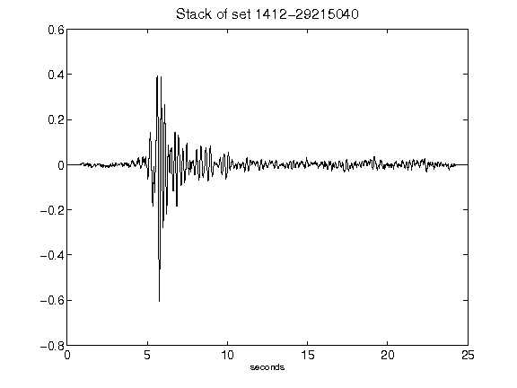](figures/1412-29215040_Stack.png)[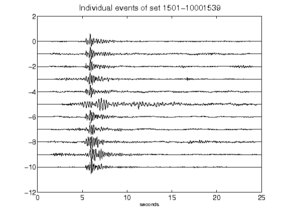](figures/1501-10001539_AllEv.png)[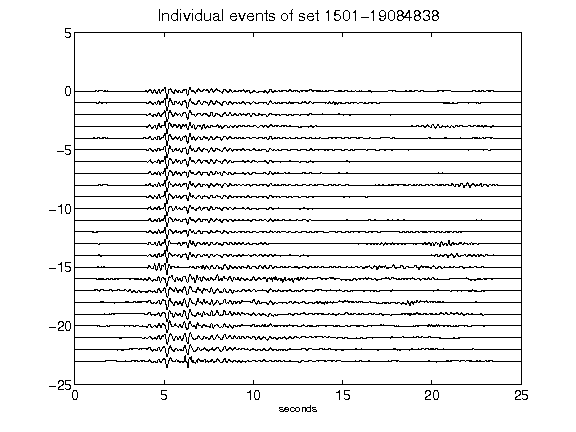](figures/1501-19084838_AllEv.png)[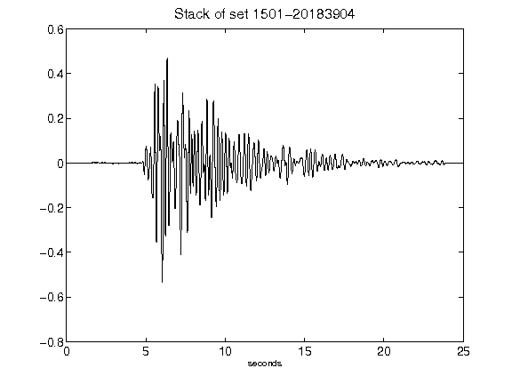](figures/1501-20183904_Stack.png)[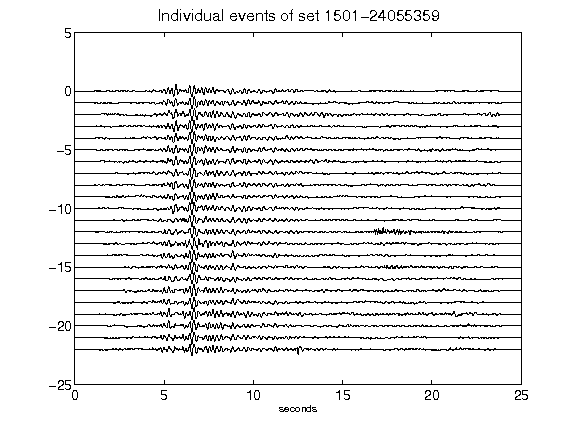](figures/1501-24055359_AllEv.png)