# Repeating Earthquake Activity at RCM
  
  

## Waveforms
[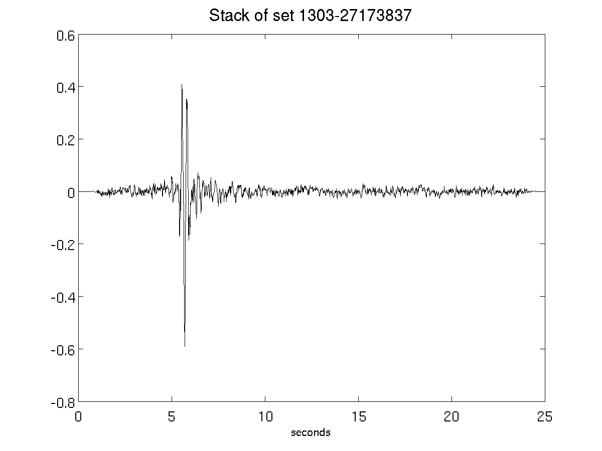](figures/1303-27173837_Stack.png)[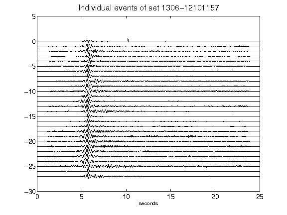](figures/1306-12101157_AllEv.png)[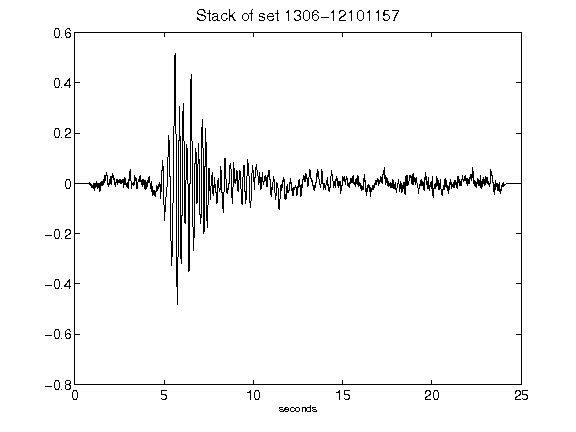](figures/1306-12101157_Stack.png)[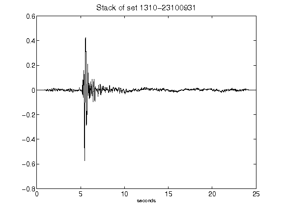](figures/1310-23100931_Stack.png)[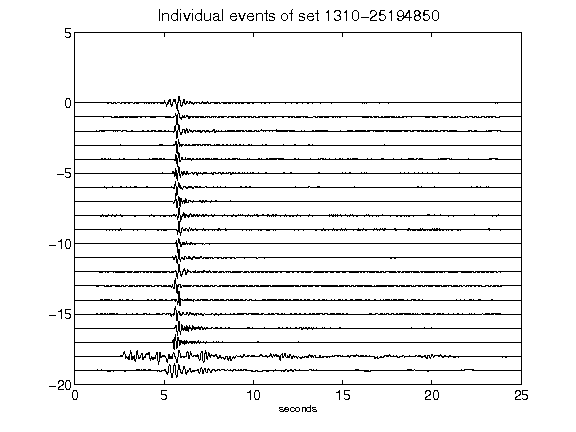](figures/1310-25194850_AllEv.png)[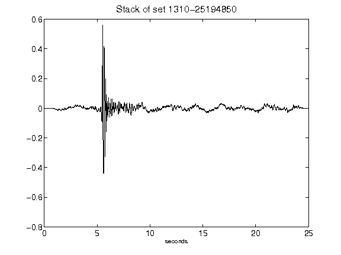](figures/1310-25194850_Stack.png)[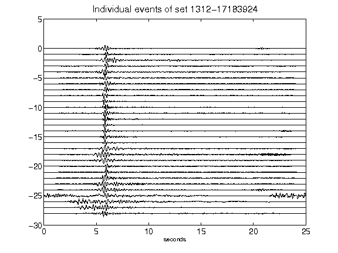](figures/1312-17183924_AllEv.png)[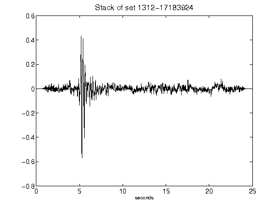](figures/1312-17183924_Stack.png)[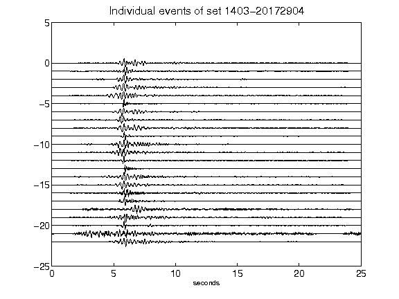](figures/1403-20172904_AllEv.png)[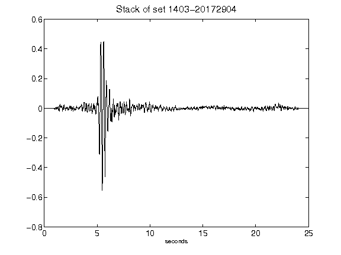](figures/1403-20172904_Stack.png)[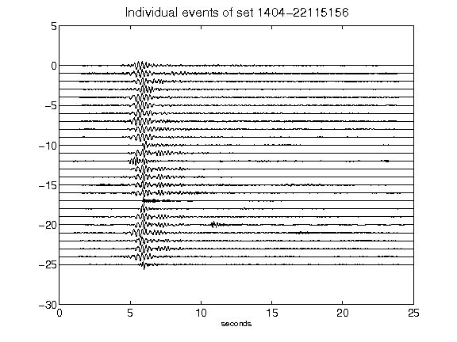](figures/1404-22115156_AllEv.png)[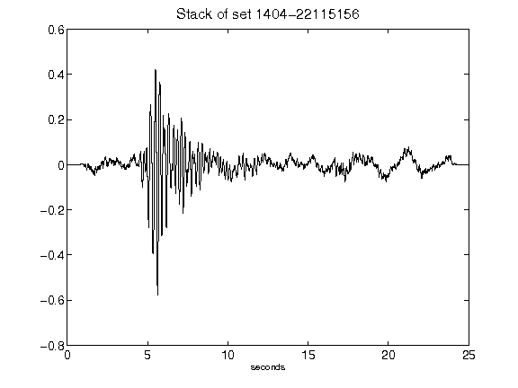](figures/1404-22115156_Stack.png)[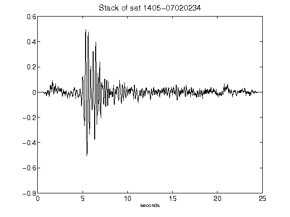](figures/1405-07020234_Stack.png)[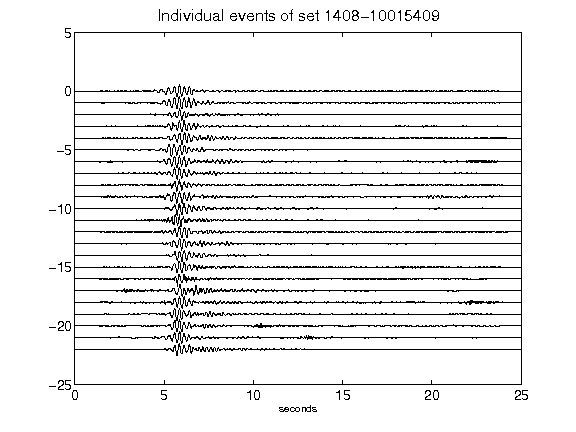](figures/1408-10015409_AllEv.png)[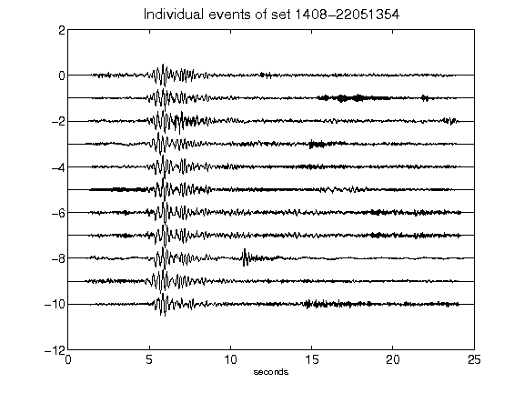](figures/1408-22051354_AllEv.png)[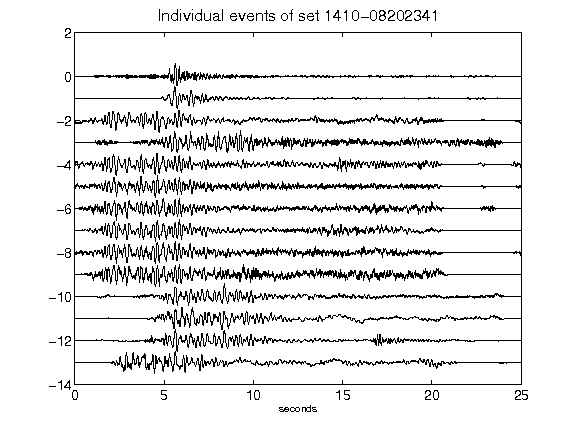](figures/1410-08202341_AllEv.png)[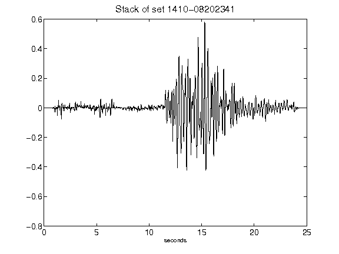](figures/1410-08202341_Stack.png)[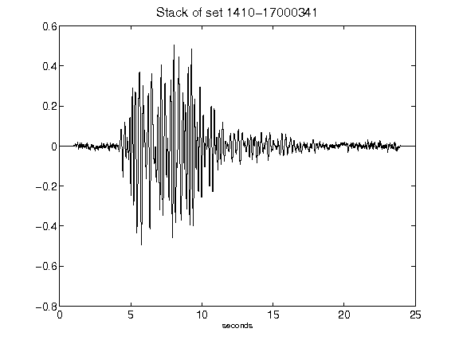](figures/1410-17000341_Stack.png)[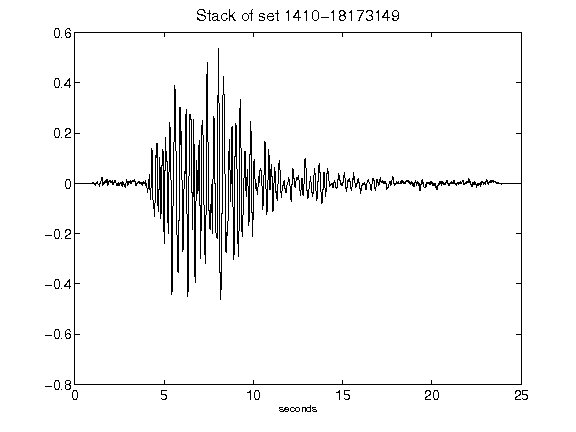](figures/1410-18173149_Stack.png)[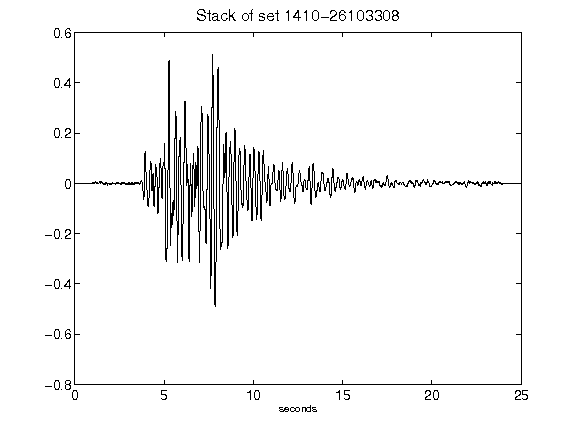](figures/1410-26103308_Stack.png)[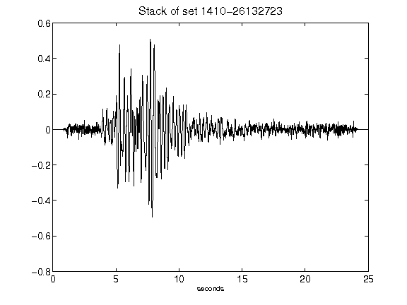](figures/1410-26132723_Stack.png)[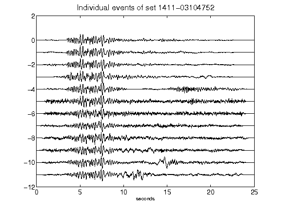](figures/1411-03104752_AllEv.png)