# Repeating Earthquake Activity at RCM

## Waveforms
[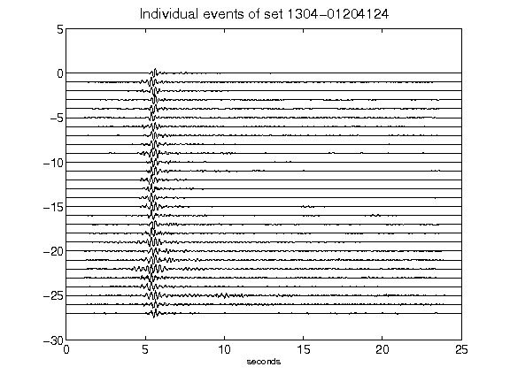](figures/1304-01204124_AllEv.png)[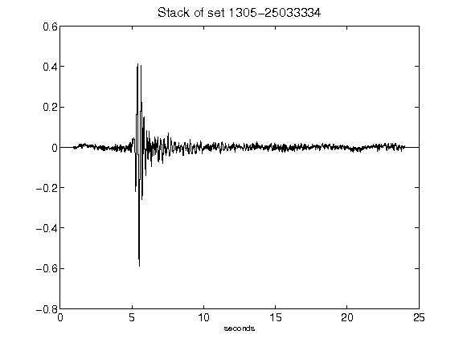](figures/1305-25033334_Stack.png)[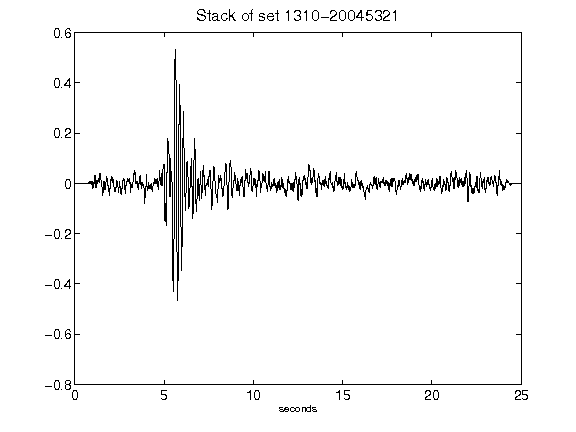](figures/1310-20045321_Stack.png)[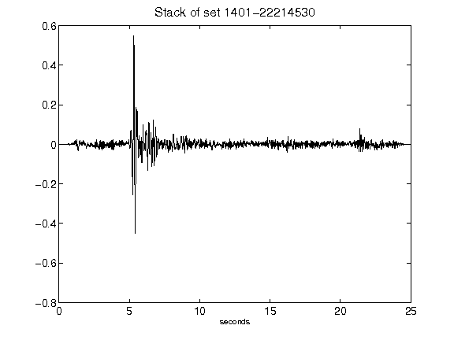](figures/1401-22214530_Stack.png)[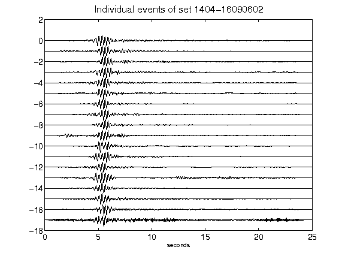](figures/1404-16090602_AllEv.png)[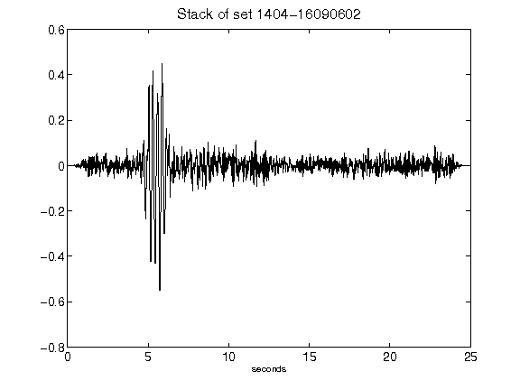](figures/1404-16090602_Stack.png)[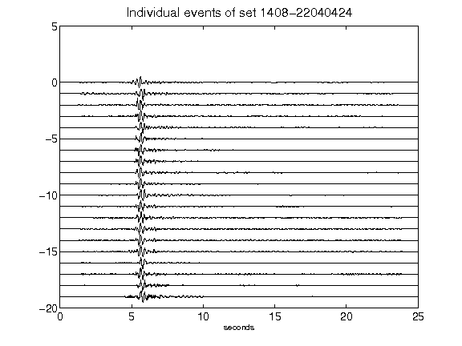](figures/1408-22040424_AllEv.png)[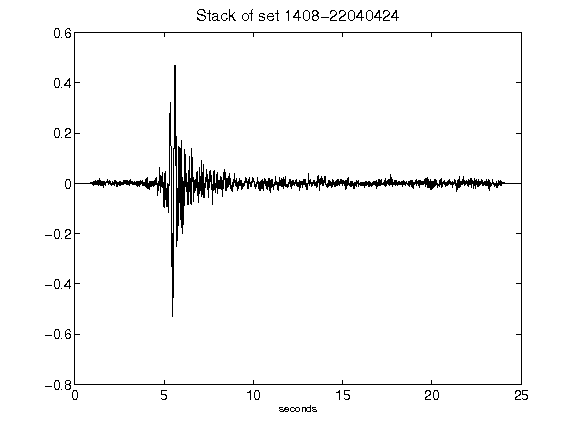](figures/1408-22040424_Stack.png)[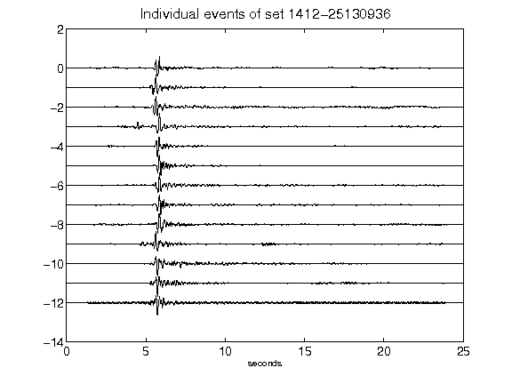](figures/1412-25130936_AllEv.png)[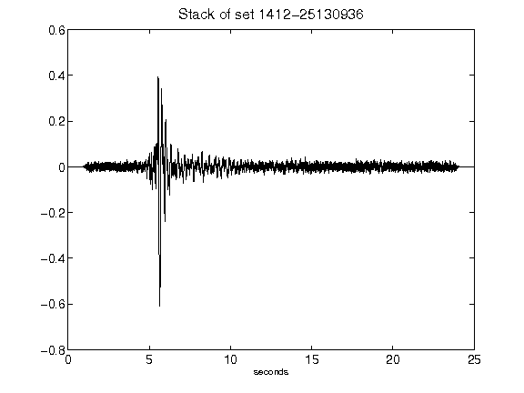](figures/1412-25130936_Stack.png)[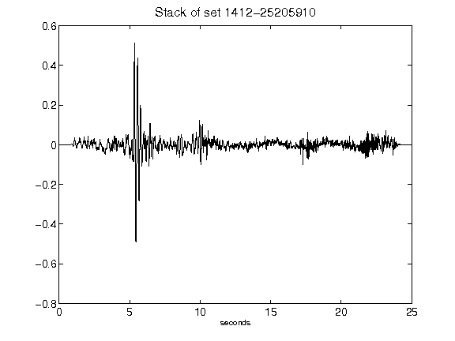](figures/1412-25205910_Stack.png)[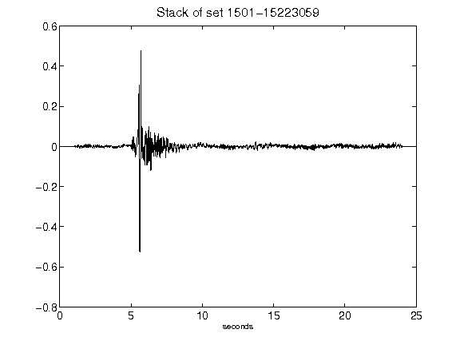](figures/1501-15223059_Stack.png)[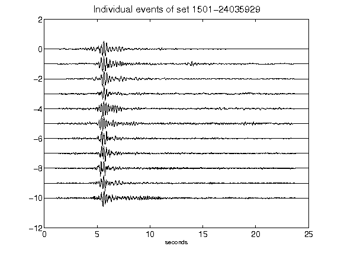](figures/1501-24035929_AllEv.png)[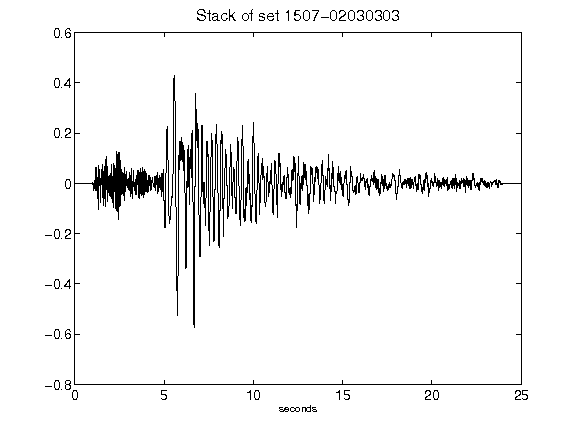](figures/1507-02030303_Stack.png)[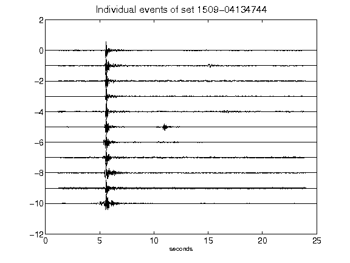](figures/1509-04134744_AllEv.png)[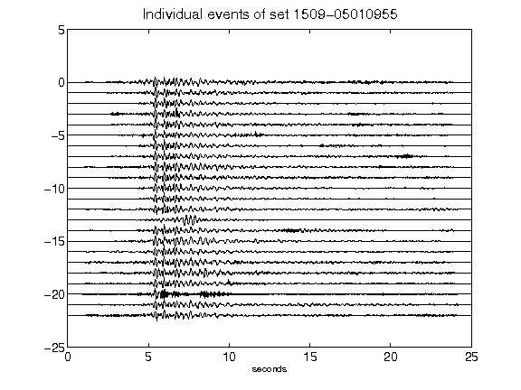](figures/1509-05010955_AllEv.png)[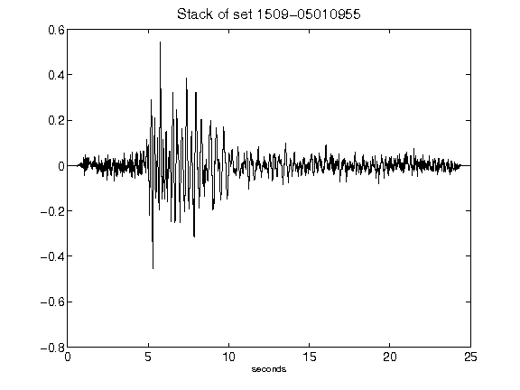](figures/1509-05010955_Stack.png)[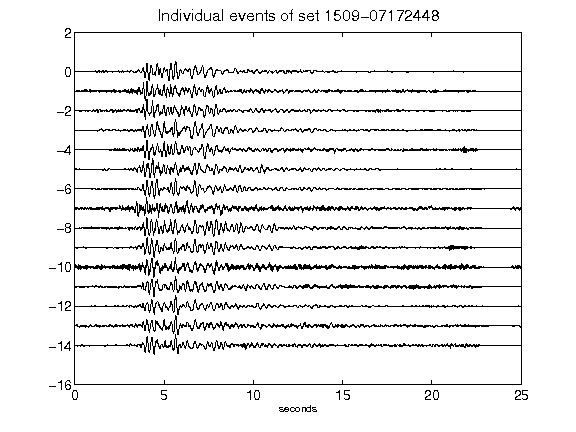](figures/1509-07172448_AllEv.png)