# Repeating Earthquake Activity at RCM

## Waveforms
[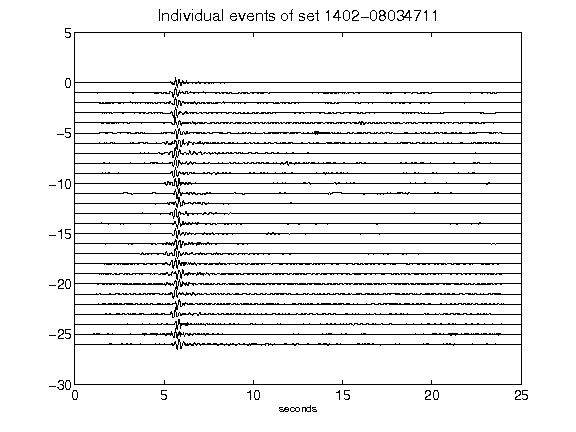](figures/1402-08034711_AllEv.png)[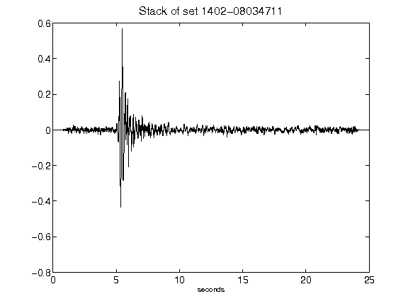](figures/1402-08034711_Stack.png)[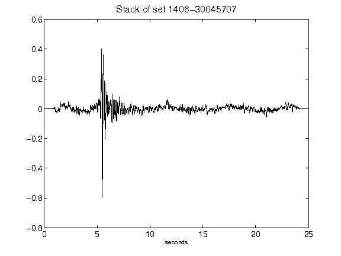](figures/1406-30045707_Stack.png)[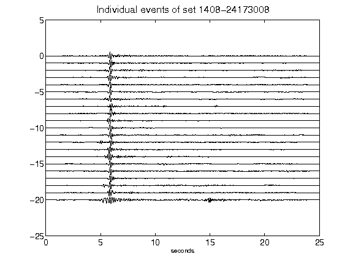](figures/1408-24173008_AllEv.png)[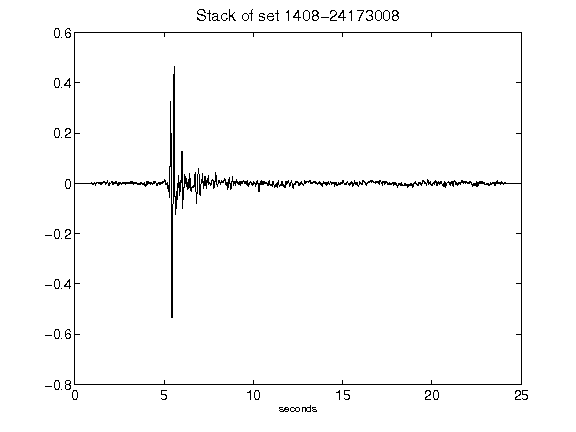](figures/1408-24173008_Stack.png)[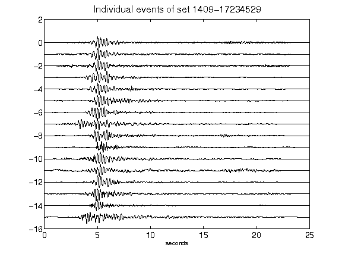](figures/1409-17234529_AllEv.png)[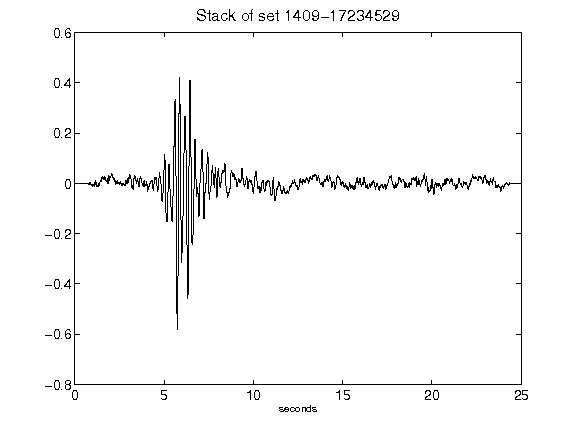](figures/1409-17234529_Stack.png)[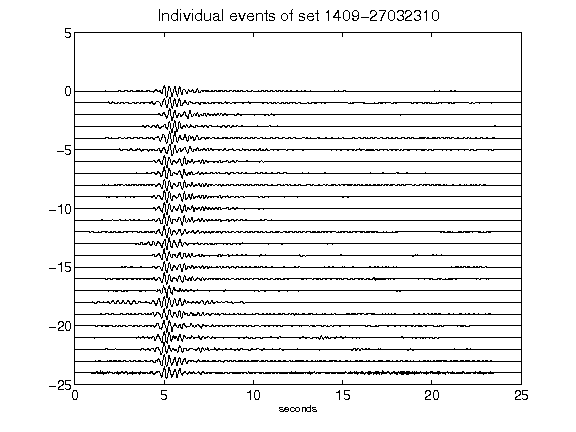](figures/1409-27032310_AllEv.png)[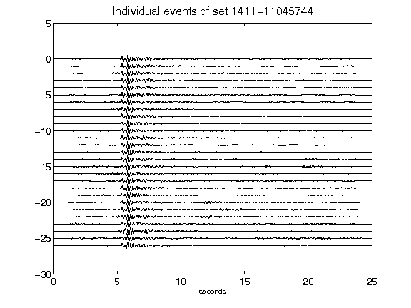](figures/1411-11045744_AllEv.png)[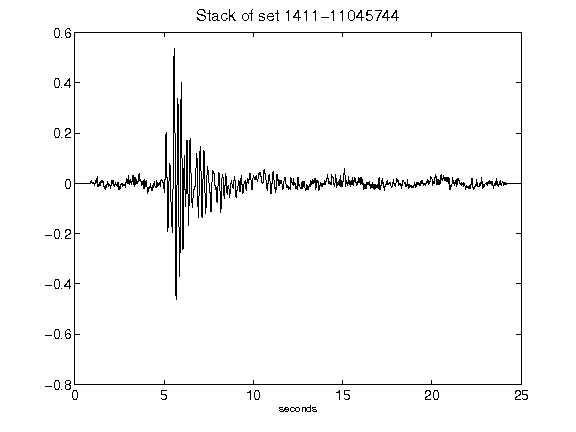](figures/1411-11045744_Stack.png)[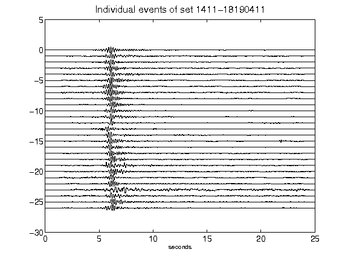](figures/1411-18190411_AllEv.png)[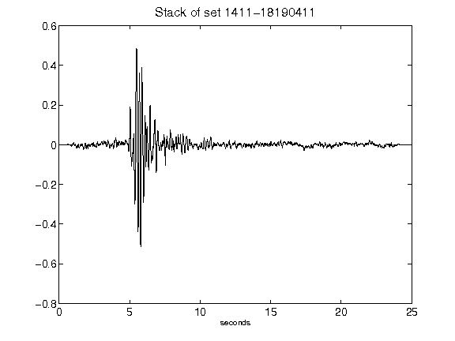](figures/1411-18190411_Stack.png)[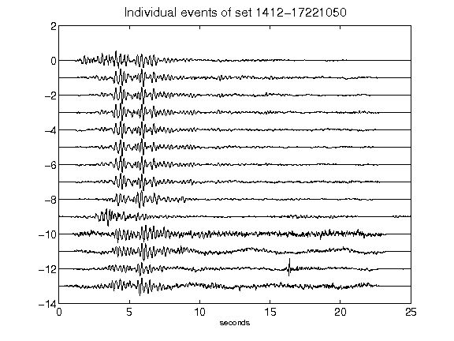](figures/1412-17221050_AllEv.png)[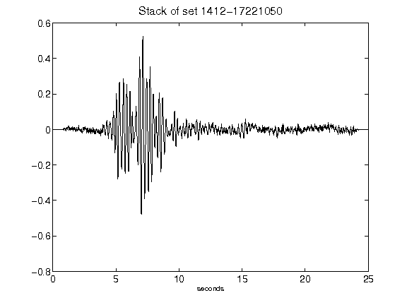](figures/1412-17221050_Stack.png)[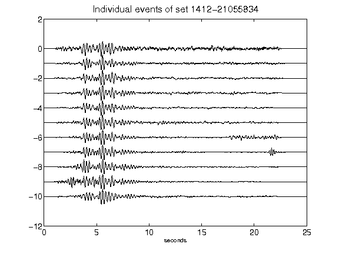](figures/1412-21055834_AllEv.png)[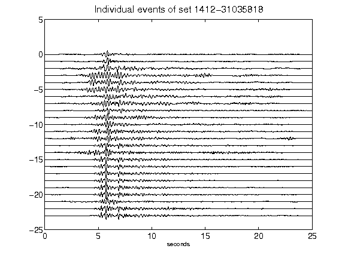](figures/1412-31035818_AllEv.png)[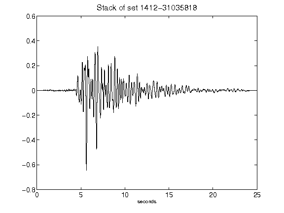](figures/1412-31035818_Stack.png)[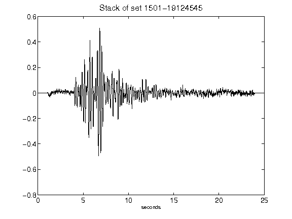](figures/1501-19124545_Stack.png)[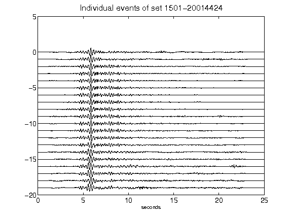](figures/1501-20014424_AllEv.png)