# Repeating Earthquake Activity at RCM

## Waveforms
[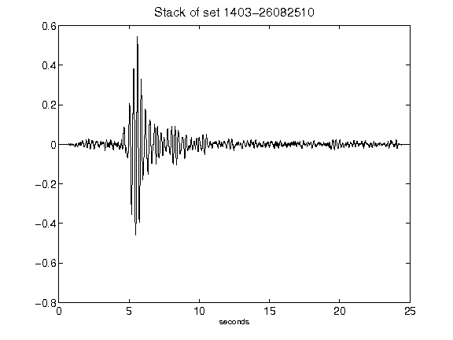](figures/1403-26082510_Stack.png)[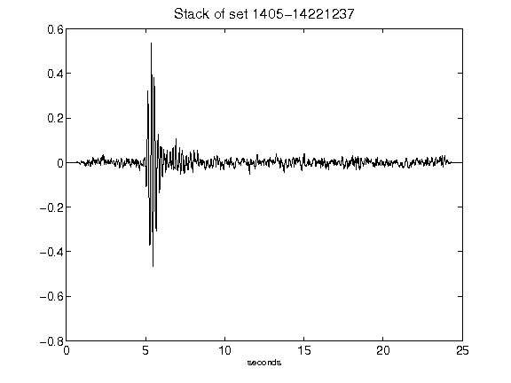](figures/1405-14221237_Stack.png)[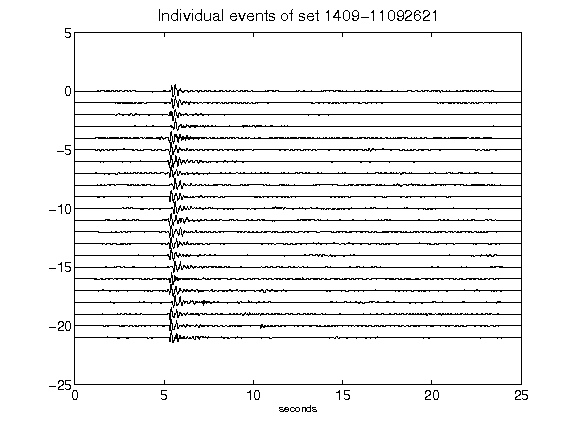](figures/1409-11092621_AllEv.png)[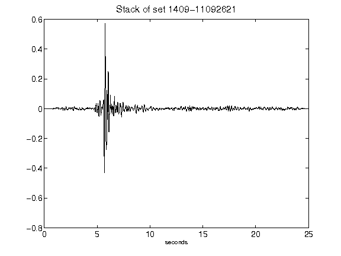](figures/1409-11092621_Stack.png)[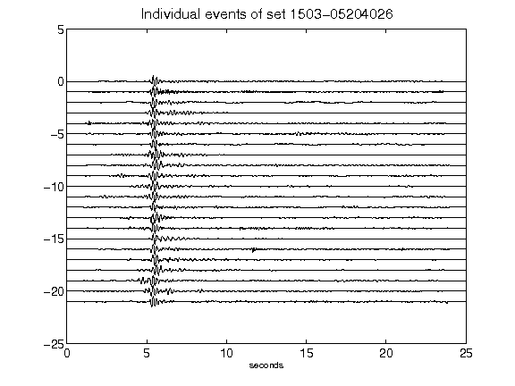](figures/1503-05204026_AllEv.png)[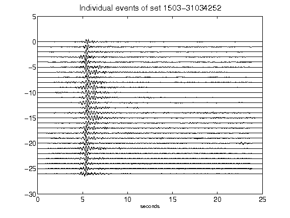](figures/1503-31034252_AllEv.png)[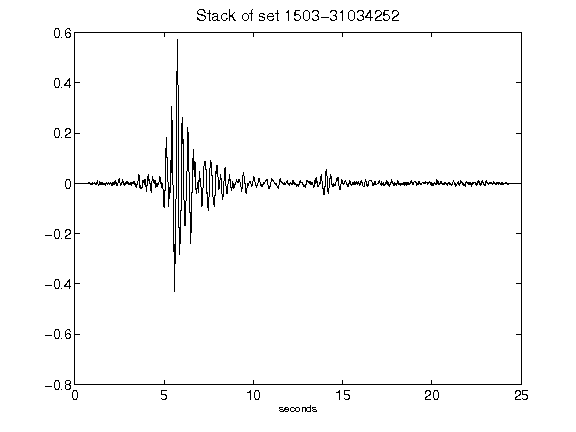](figures/1503-31034252_Stack.png)[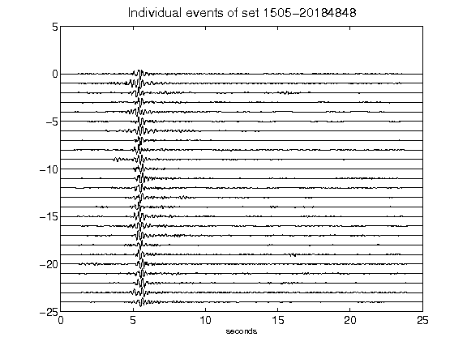](figures/1505-20184848_AllEv.png)[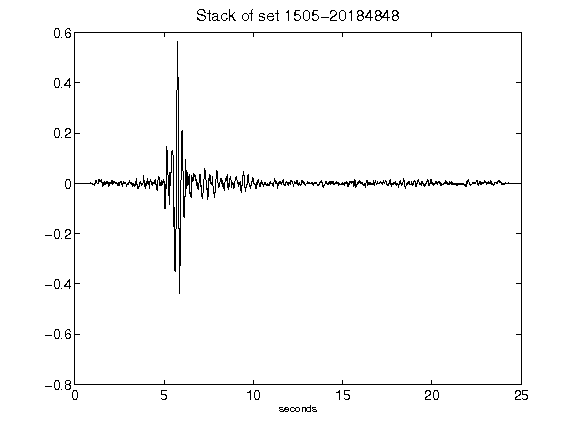](figures/1505-20184848_Stack.png)[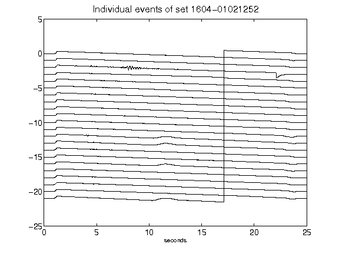](figures/1604-01021252_AllEv.png)[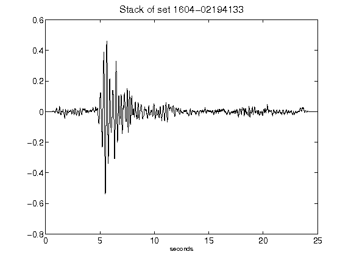](figures/1604-02194133_Stack.png)[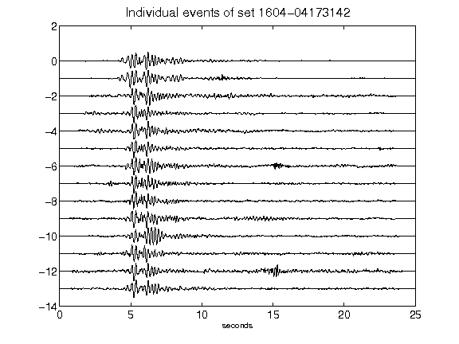](figures/1604-04173142_AllEv.png)[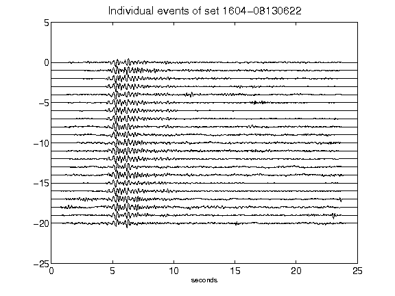](figures/1604-08130622_AllEv.png)[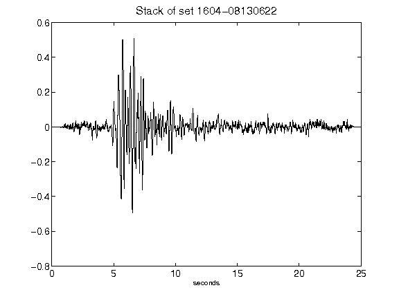](figures/1604-08130622_Stack.png)[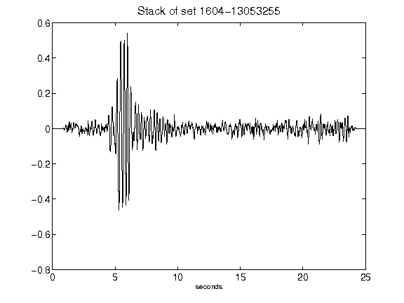](figures/1604-13053255_Stack.png)[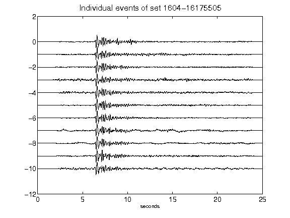](figures/1604-16175505_AllEv.png)[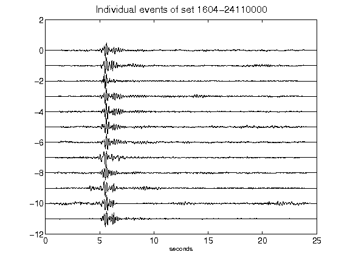](figures/1604-24110000_AllEv.png)[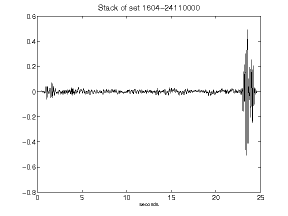](figures/1604-24110000_Stack.png)