# Repeating Earthquake Activity at RCM

## Waveforms
[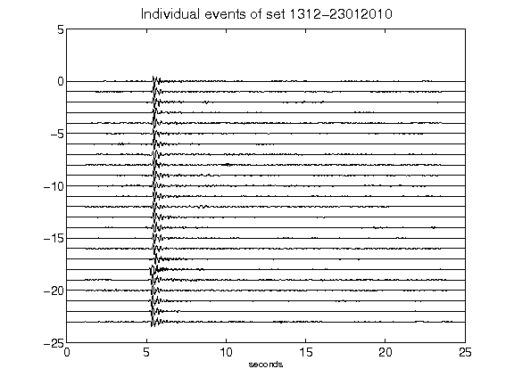](figures/1312-23012010_AllEv.png)[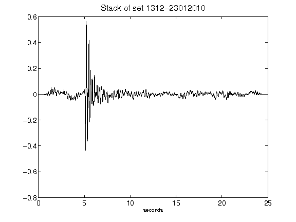](figures/1312-23012010_Stack.png)[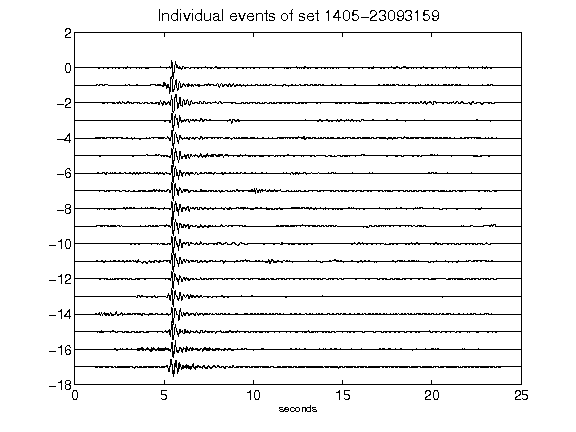](figures/1405-23093159_AllEv.png)[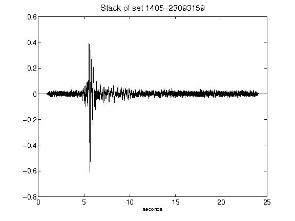](figures/1405-23093159_Stack.png)[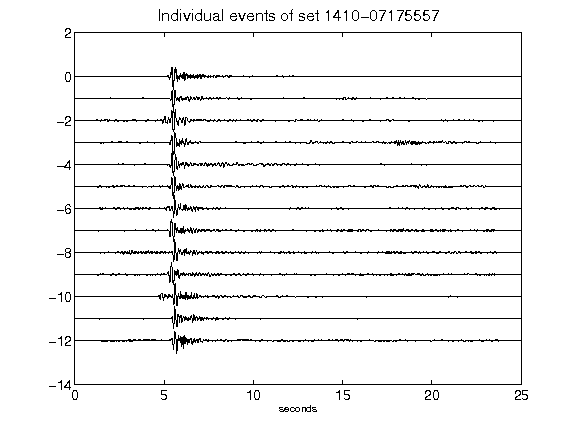](figures/1410-07175557_AllEv.png)[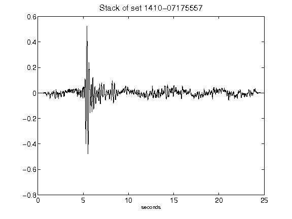](figures/1410-07175557_Stack.png)[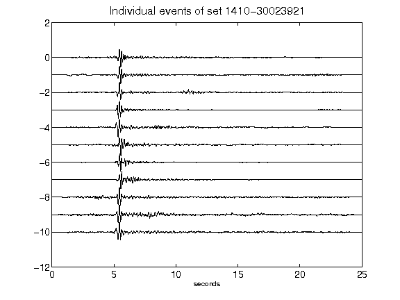](figures/1410-30023921_AllEv.png)[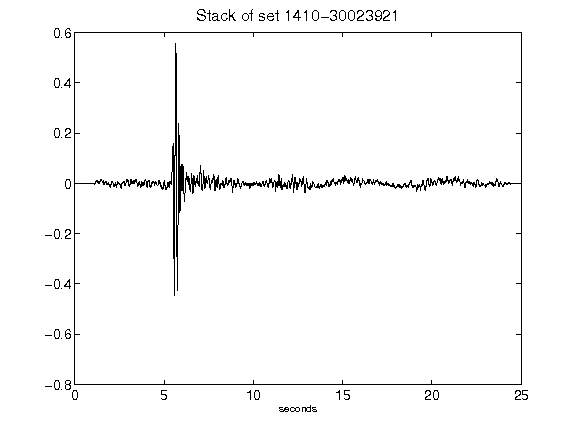](figures/1410-30023921_Stack.png)[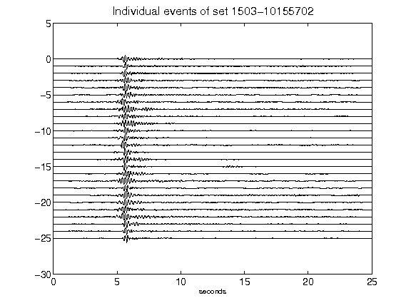](figures/1503-10155702_AllEv.png)[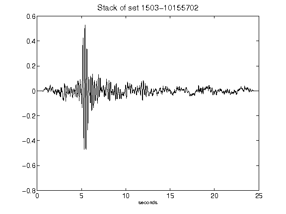](figures/1503-10155702_Stack.png)[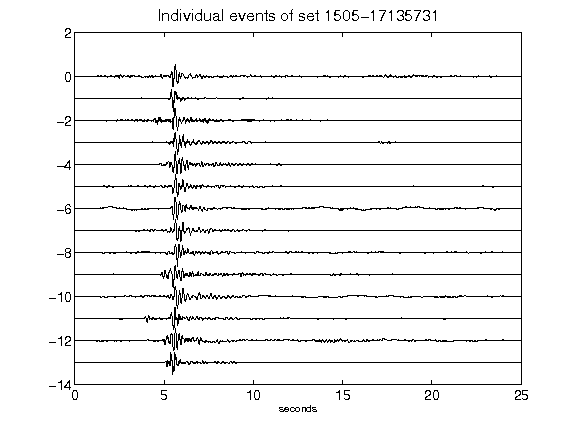](figures/1505-17135731_AllEv.png)[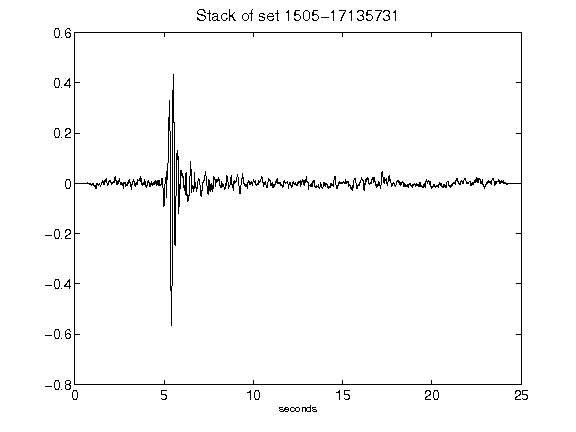](figures/1505-17135731_Stack.png)[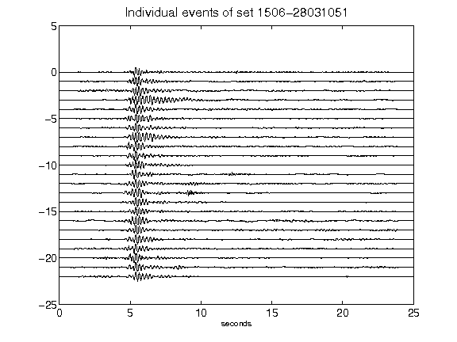](figures/1506-28031051_AllEv.png)[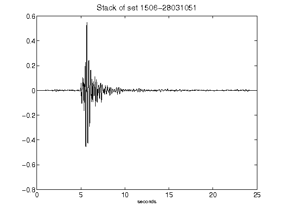](figures/1506-28031051_Stack.png)[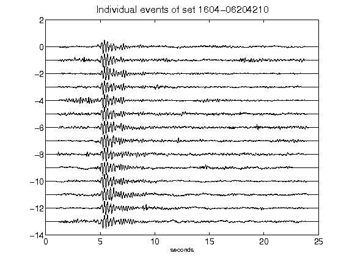](figures/1604-06204210_AllEv.png)[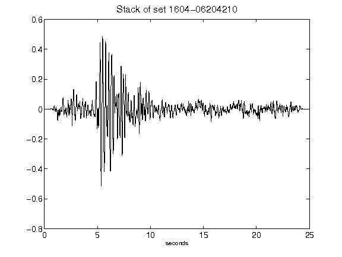](figures/1604-06204210_Stack.png)[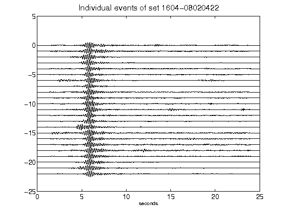](figures/1604-08020422_AllEv.png)[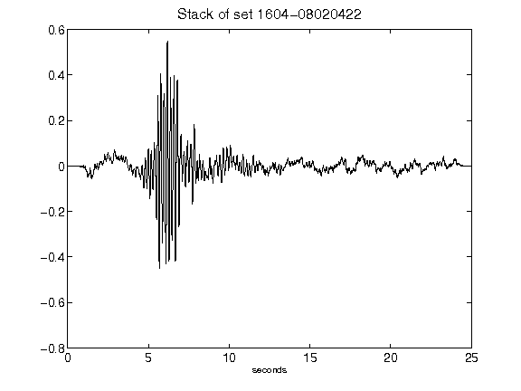](figures/1604-08020422_Stack.png)