# Repeating Earthquake Activity at RCM

## Waveforms
[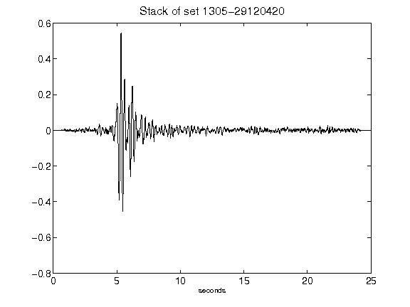](figures/1305-29120420_Stack.png)[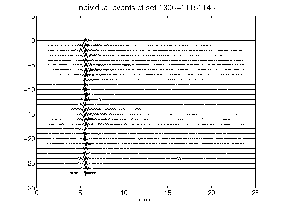](figures/1306-11151146_AllEv.png)[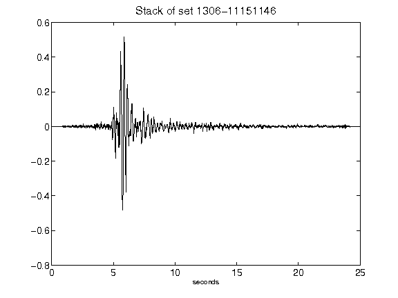](figures/1306-11151146_Stack.png)[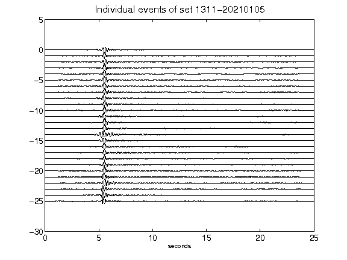](figures/1311-20210105_AllEv.png)[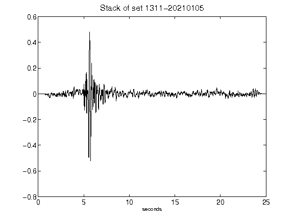](figures/1311-20210105_Stack.png)[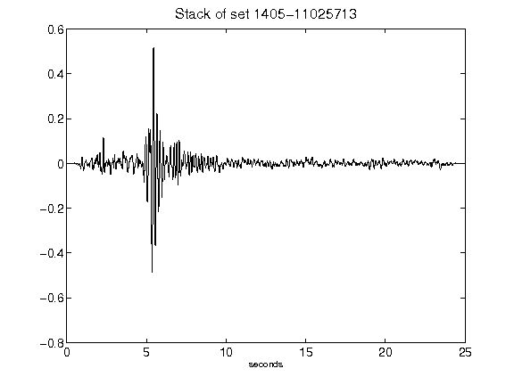](figures/1405-11025713_Stack.png)[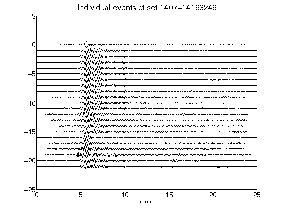](figures/1407-14163246_AllEv.png)[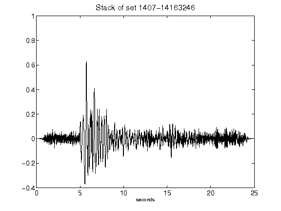](figures/1407-14163246_Stack.png)[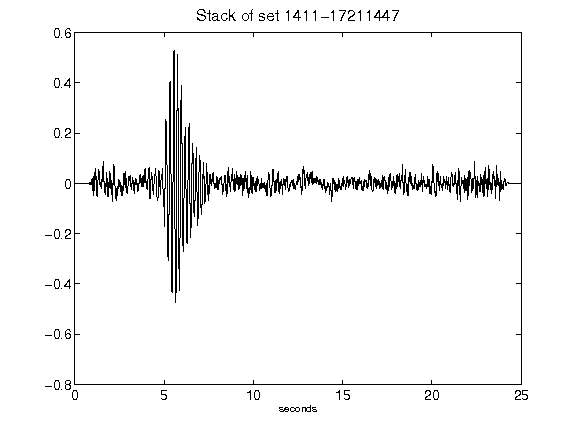](figures/1411-17211447_Stack.png)[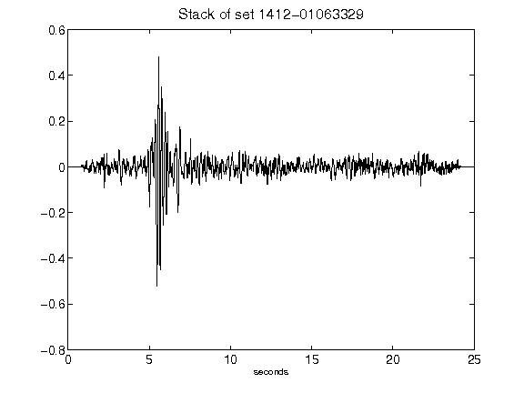](figures/1412-01063329_Stack.png)[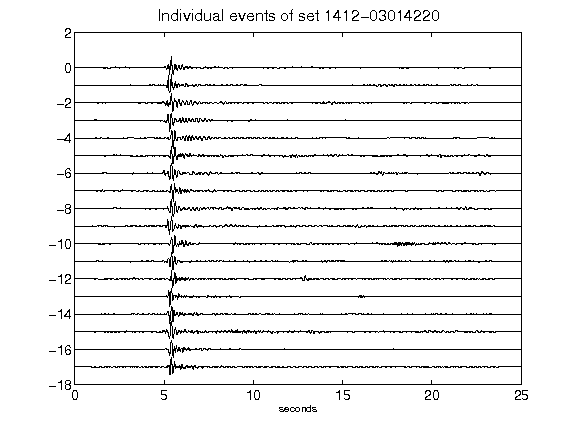](figures/1412-03014220_AllEv.png)[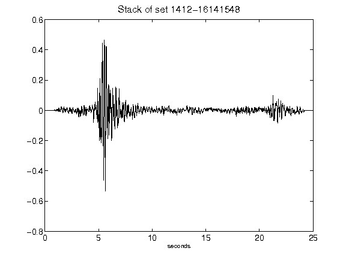](figures/1412-16141548_Stack.png)[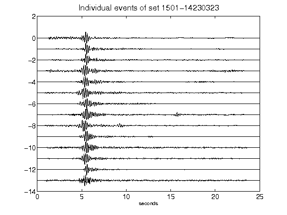](figures/1501-14230323_AllEv.png)[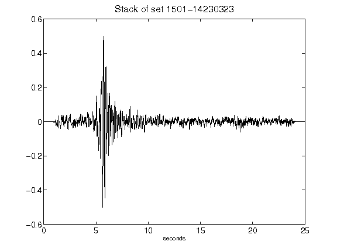](figures/1501-14230323_Stack.png)[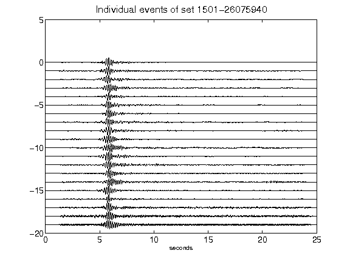](figures/1501-26075940_AllEv.png)[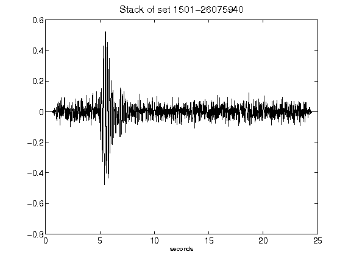](figures/1501-26075940_Stack.png)[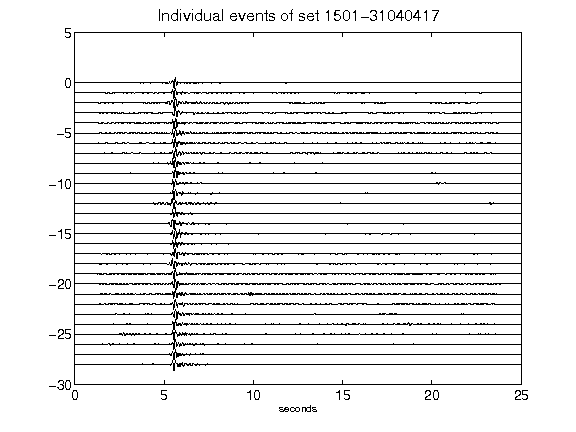](figures/1501-31040417_AllEv.png)[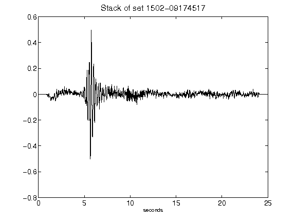](figures/1502-09174517_Stack.png)[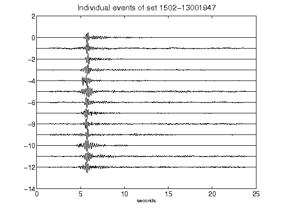](figures/1502-13001947_AllEv.png)[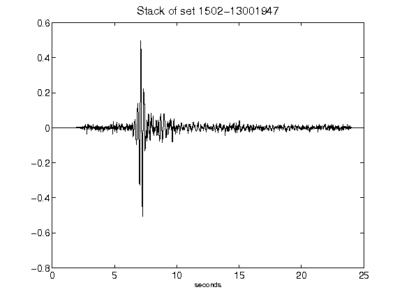](figures/1502-13001947_Stack.png)[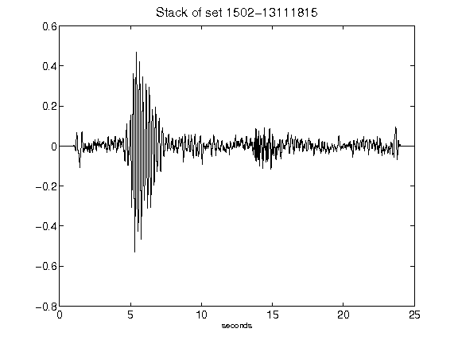](figures/1502-13111815_Stack.png)[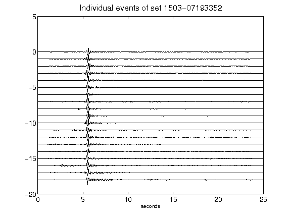](figures/1503-07193352_AllEv.png)[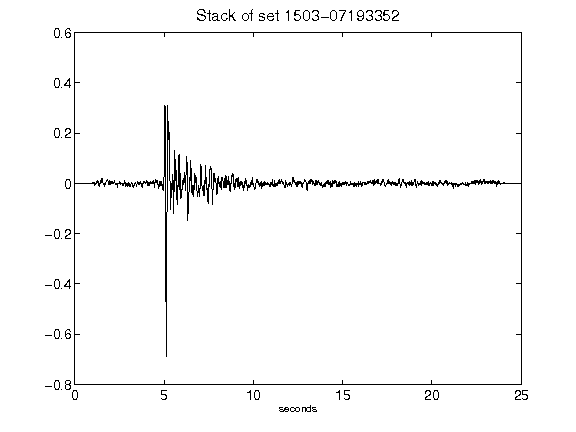](figures/1503-07193352_Stack.png)[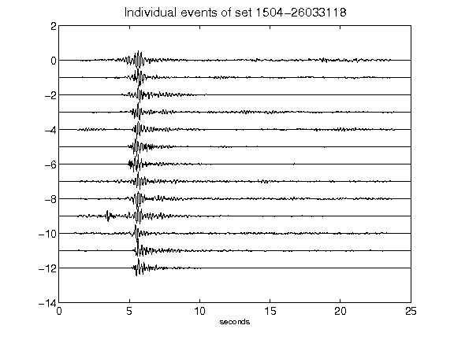](figures/1504-26033118_AllEv.png)[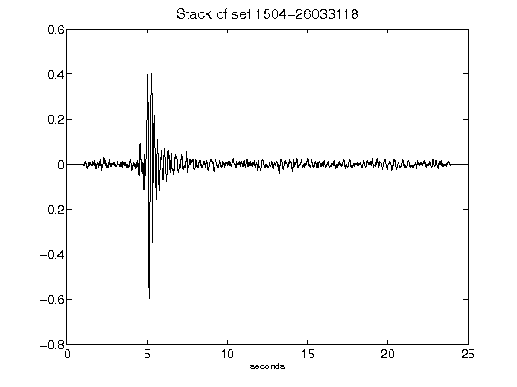](figures/1504-26033118_Stack.png)[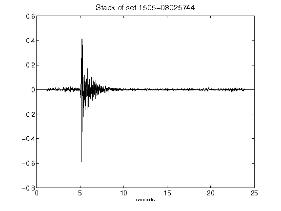](figures/1505-08025744_Stack.png)[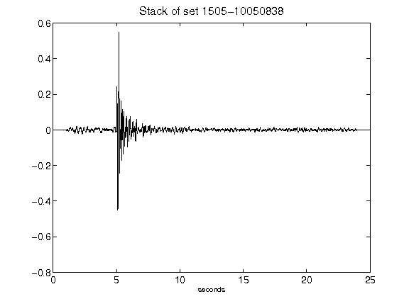](figures/1505-10050838_Stack.png)[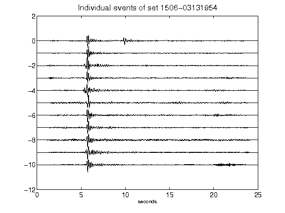](figures/1506-03131954_AllEv.png)[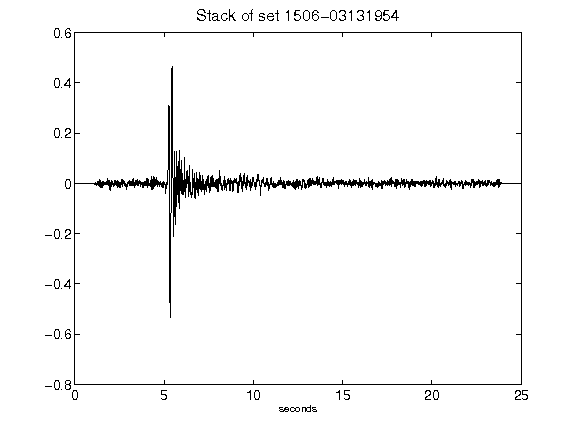](figures/1506-03131954_Stack.png)