# Repeating Earthquake Activity at RCM

## Waveforms
[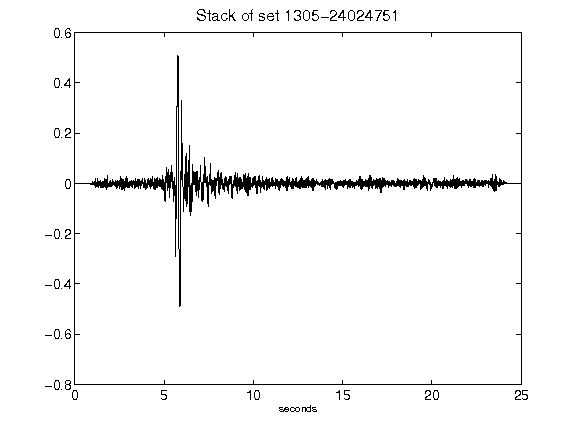](figures/1305-24024751_Stack.png)[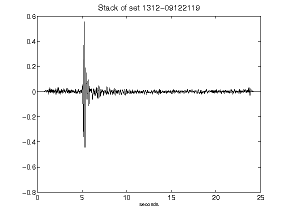](figures/1312-09122119_Stack.png)[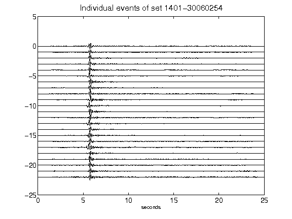](figures/1401-30060254_AllEv.png)[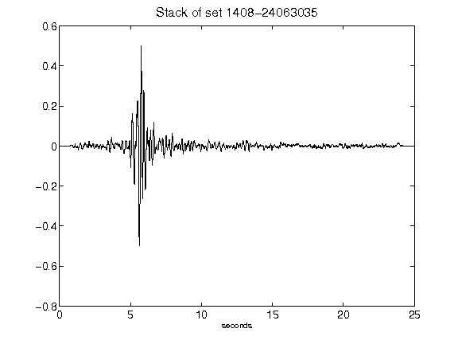](figures/1408-24063035_Stack.png)[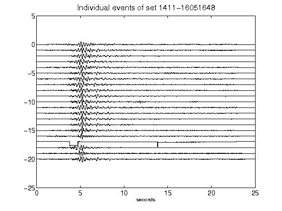](figures/1411-16051648_AllEv.png)[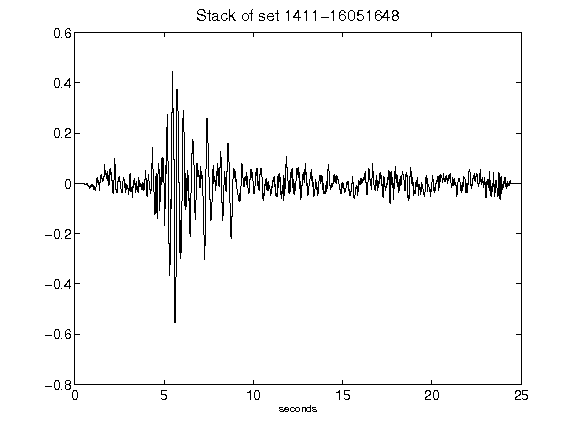](figures/1411-16051648_Stack.png)[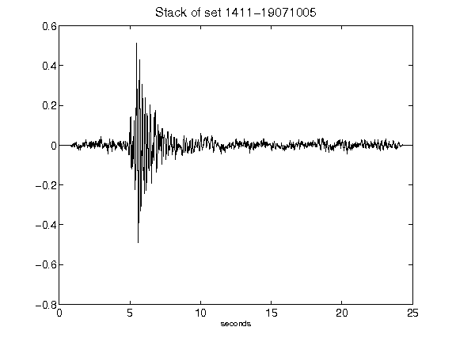](figures/1411-19071005_Stack.png)[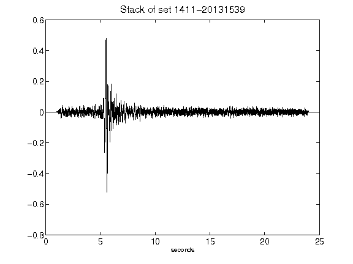](figures/1411-20131539_Stack.png)[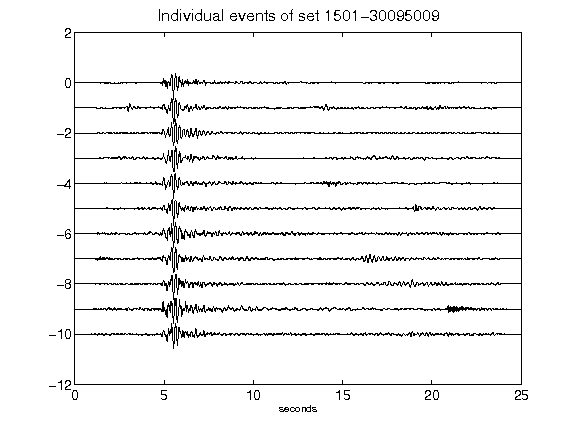](figures/1501-30095009_AllEv.png)[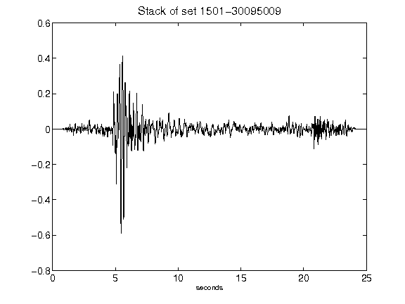](figures/1501-30095009_Stack.png)[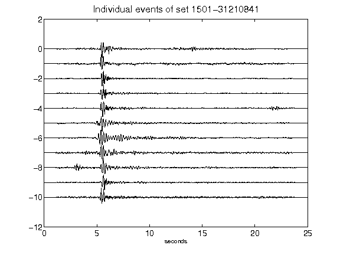](figures/1501-31210841_AllEv.png)[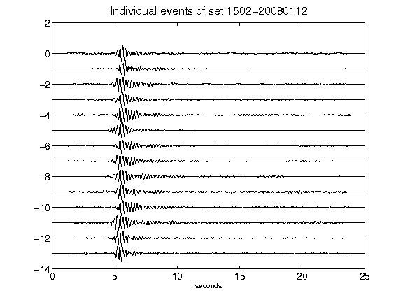](figures/1502-20080112_AllEv.png)[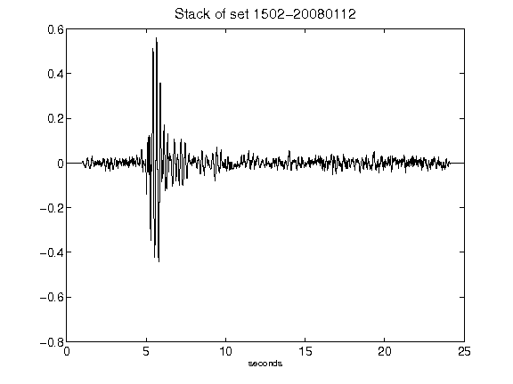](figures/1502-20080112_Stack.png)[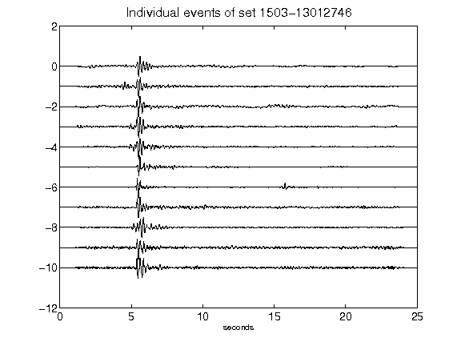](figures/1503-13012746_AllEv.png)[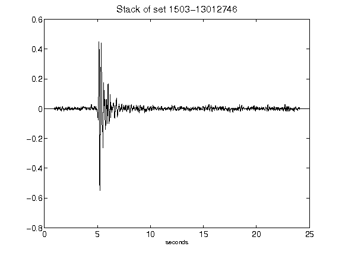](figures/1503-13012746_Stack.png)[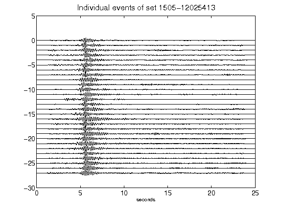](figures/1505-12025413_AllEv.png)[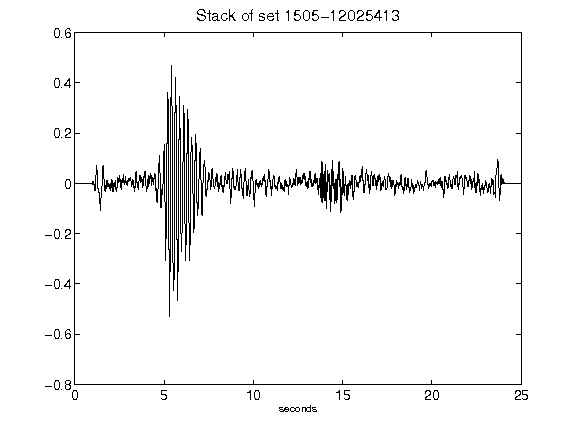](figures/1505-12025413_Stack.png)