# Repeating Earthquake Activity at RCM

## Waveforms
[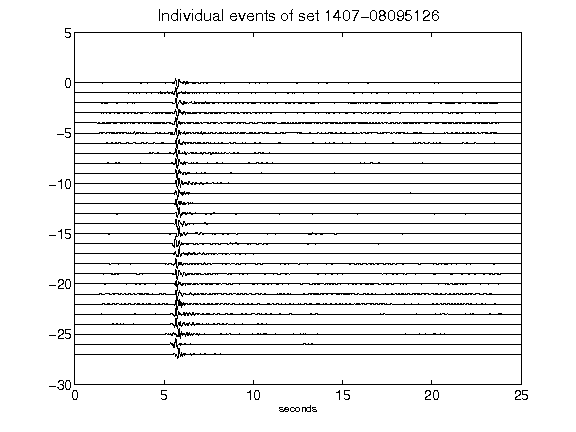](figures/1407-08095126_AllEv.png)[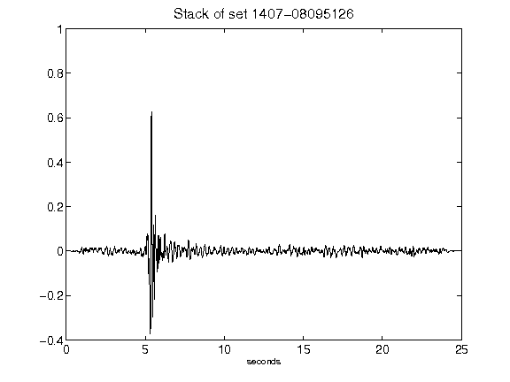](figures/1407-08095126_Stack.png)[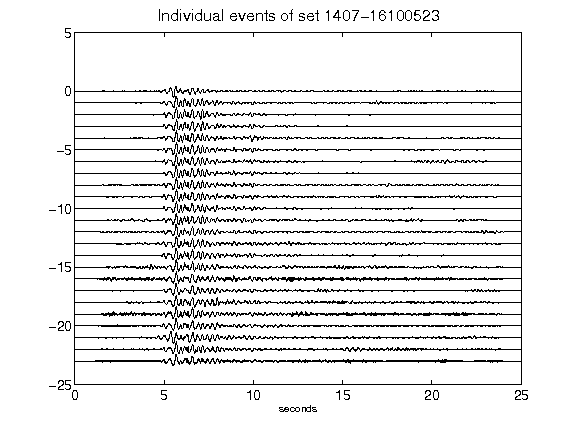](figures/1407-16100523_AllEv.png)[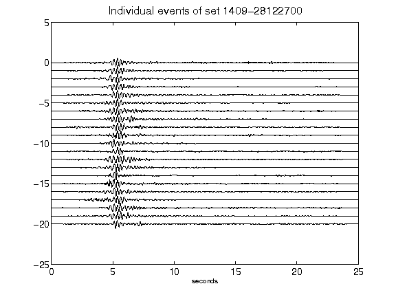](figures/1409-28122700_AllEv.png)[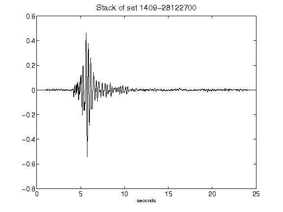](figures/1409-28122700_Stack.png)[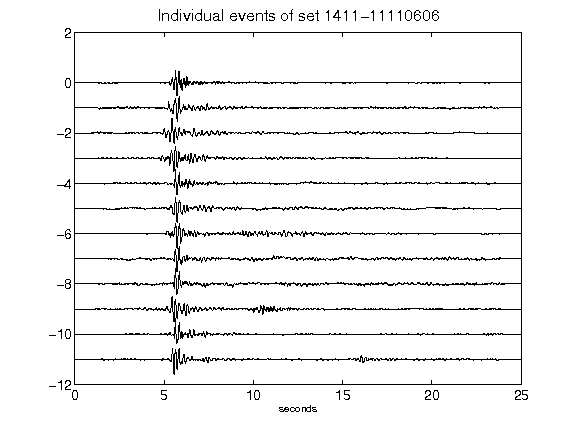](figures/1411-11110606_AllEv.png)[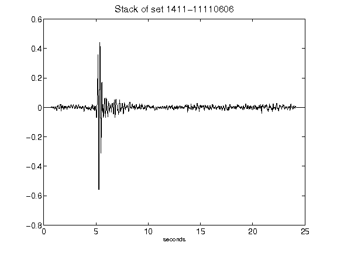](figures/1411-11110606_Stack.png)[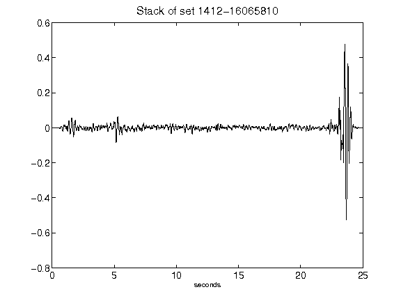](figures/1412-16065810_Stack.png)[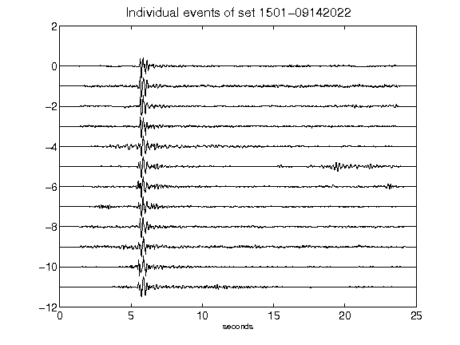](figures/1501-09142022_AllEv.png)[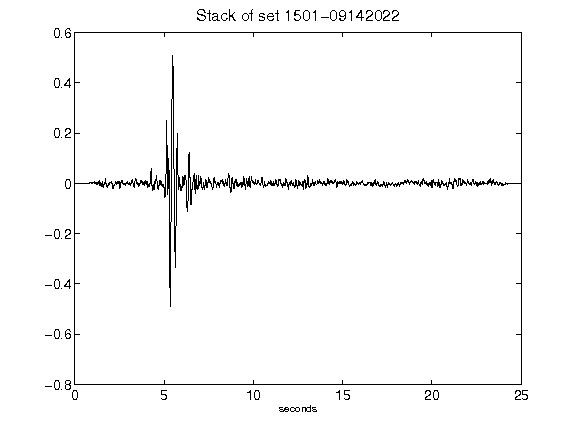](figures/1501-09142022_Stack.png)[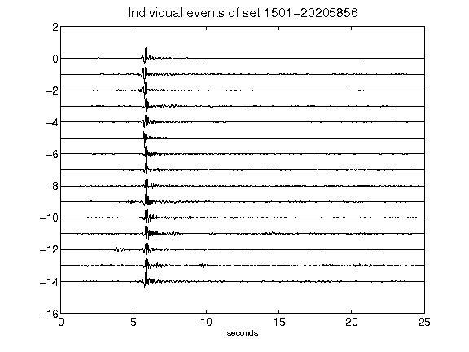](figures/1501-20205856_AllEv.png)[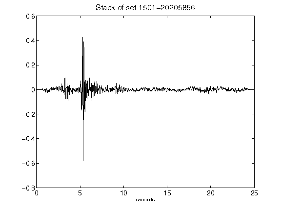](figures/1501-20205856_Stack.png)[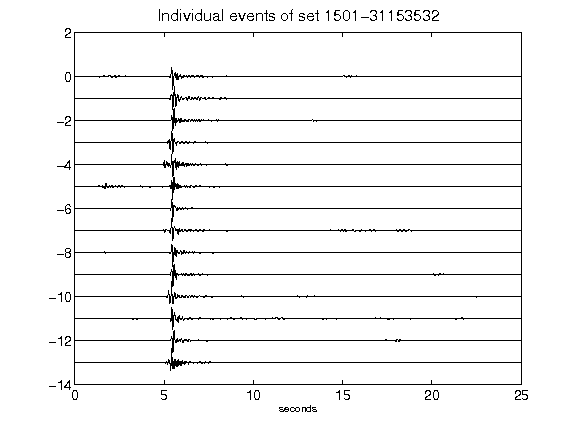](figures/1501-31153532_AllEv.png)[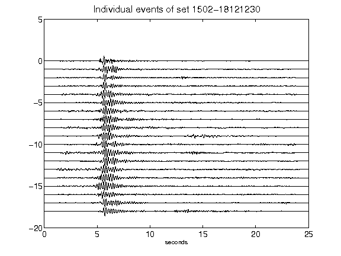](figures/1502-18121230_AllEv.png)[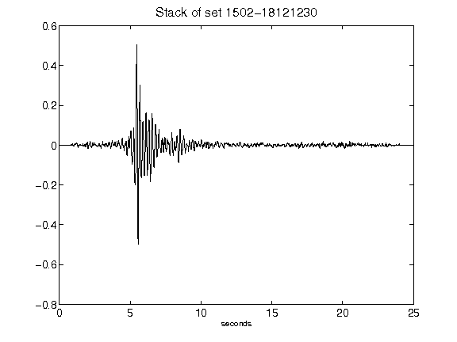](figures/1502-18121230_Stack.png)