# Repeating Earthquake Activity at RCM

## Waveforms
[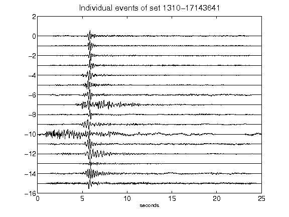](figures/1310-17143641_AllEv.png)[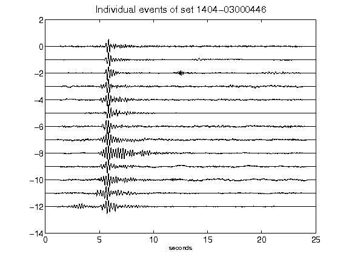](figures/1404-03000446_AllEv.png)[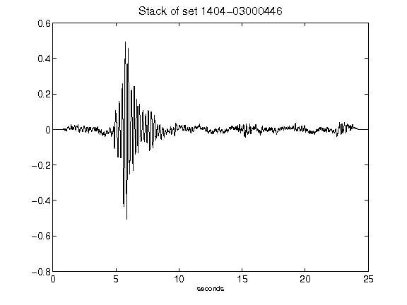](figures/1404-03000446_Stack.png)[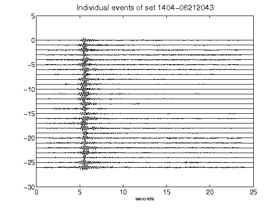](figures/1404-06212043_AllEv.png)[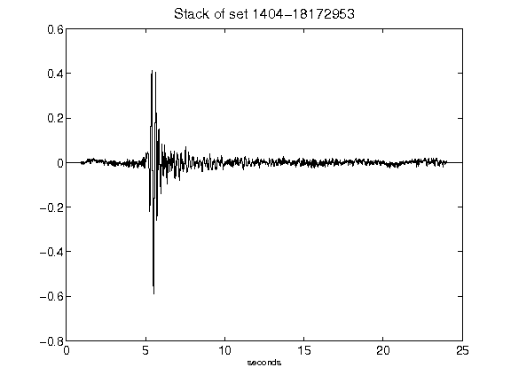](figures/1404-18172953_Stack.png)[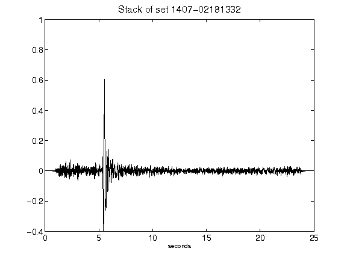](figures/1407-02181332_Stack.png)[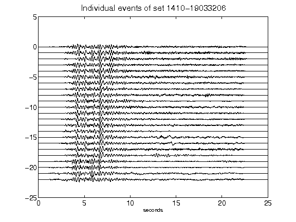](figures/1410-19033206_AllEv.png)[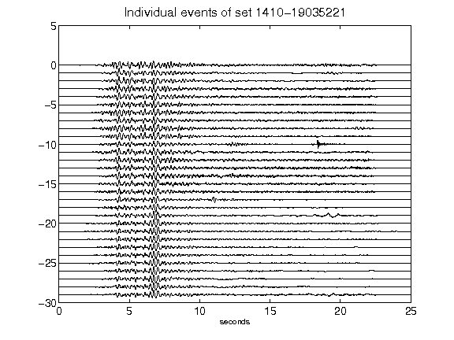](figures/1410-19035221_AllEv.png)[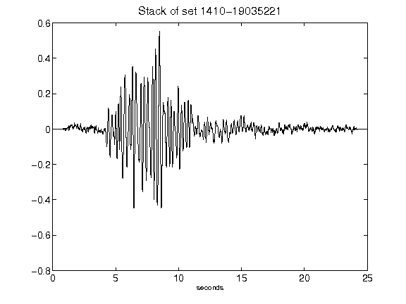](figures/1410-19035221_Stack.png)[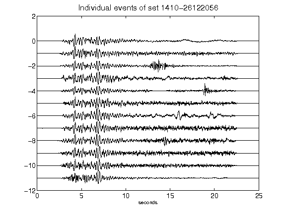](figures/1410-26122056_AllEv.png)[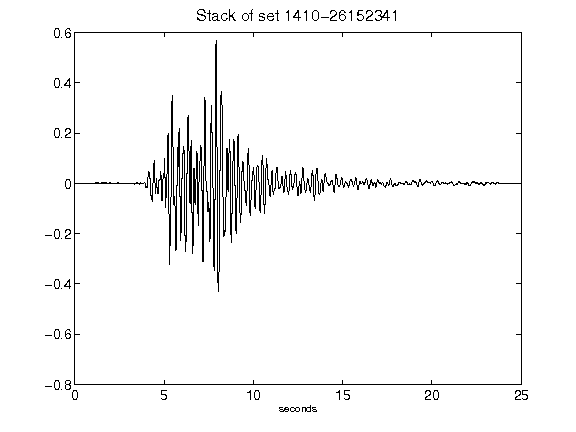](figures/1410-26152341_Stack.png)[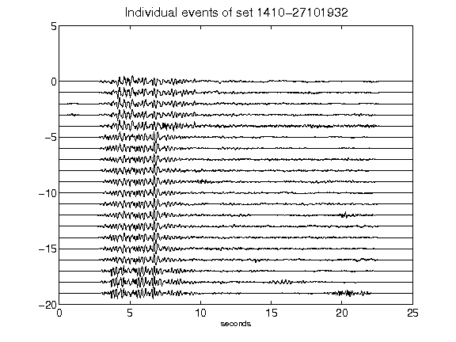](figures/1410-27101932_AllEv.png)[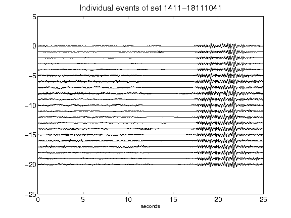](figures/1411-18111041_AllEv.png)[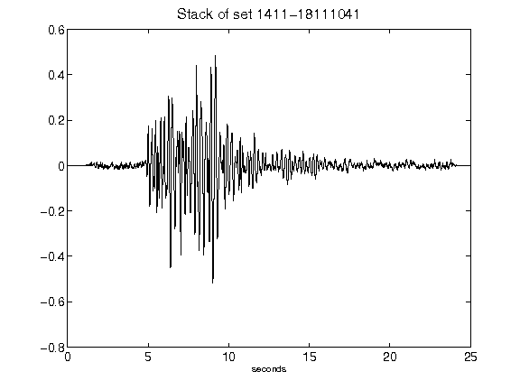](figures/1411-18111041_Stack.png)[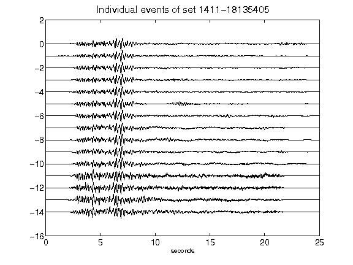](figures/1411-18135405_AllEv.png)[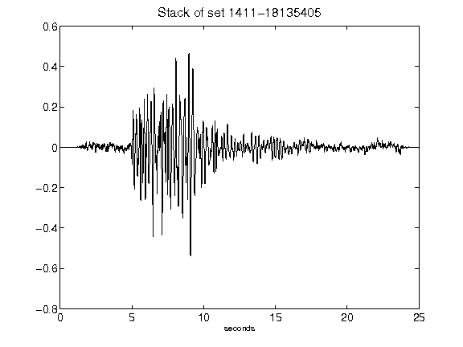](figures/1411-18135405_Stack.png)[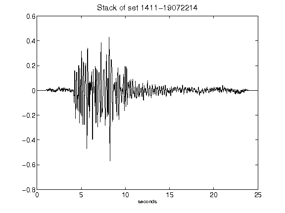](figures/1411-19072214_Stack.png)[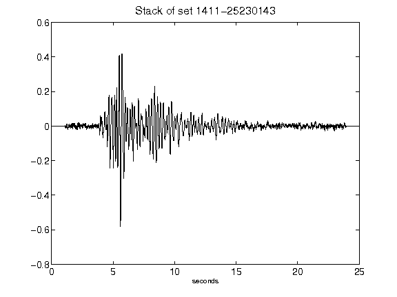](figures/1411-25230143_Stack.png)