# Repeating Earthquake Activity at RCM

## Waveforms
[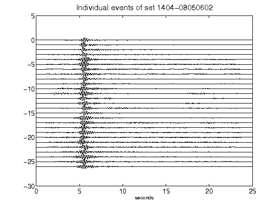](figures/1404-08050602_AllEv.png)[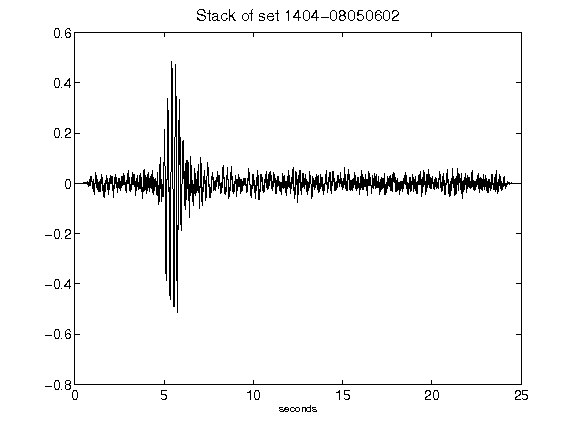](figures/1404-08050602_Stack.png)[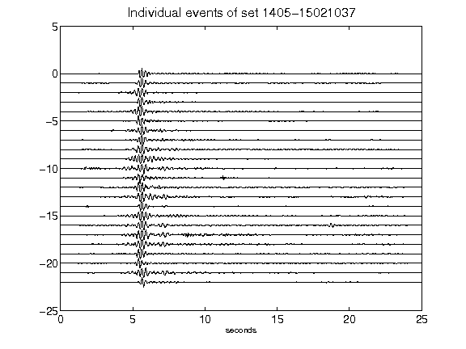](figures/1405-15021037_AllEv.png)[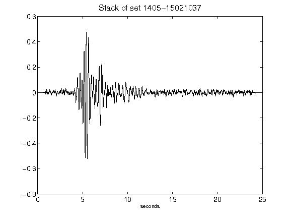](figures/1405-15021037_Stack.png)[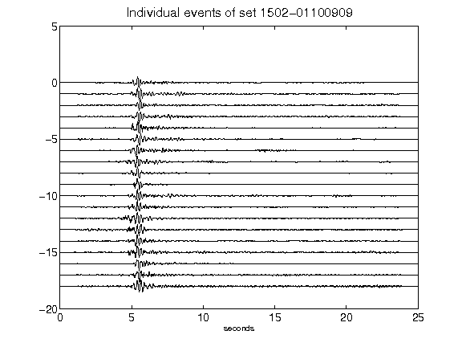](figures/1502-01100909_AllEv.png)[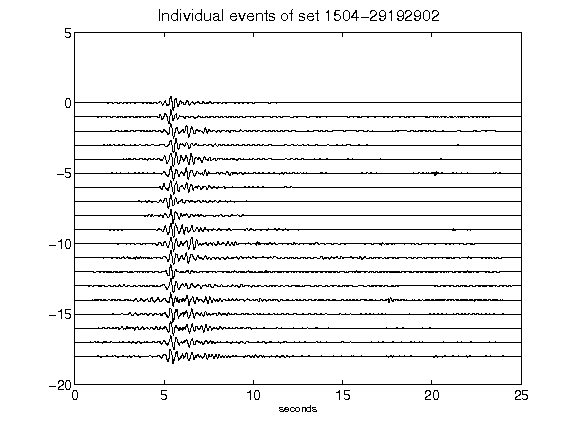](figures/1504-29192902_AllEv.png)[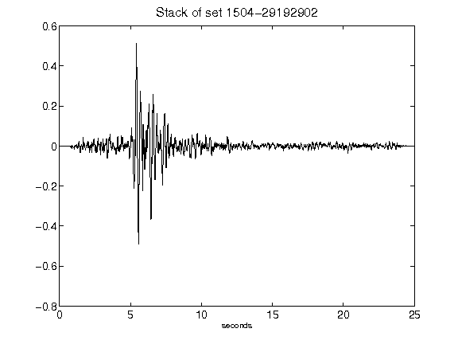](figures/1504-29192902_Stack.png)[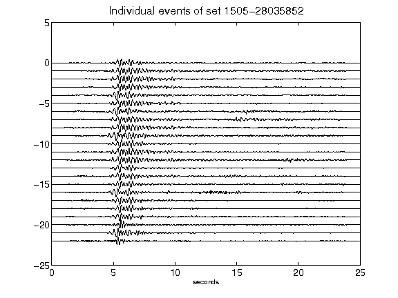](figures/1505-28035852_AllEv.png)[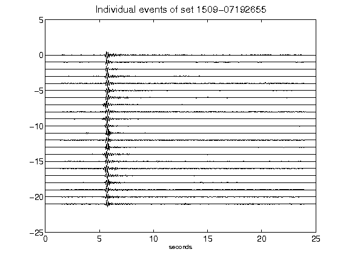](figures/1509-07192655_AllEv.png)[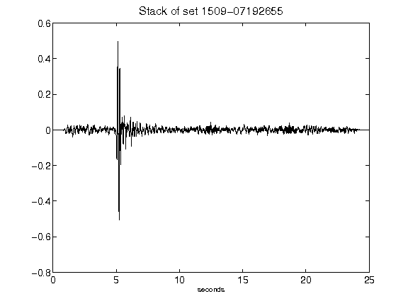](figures/1509-07192655_Stack.png)[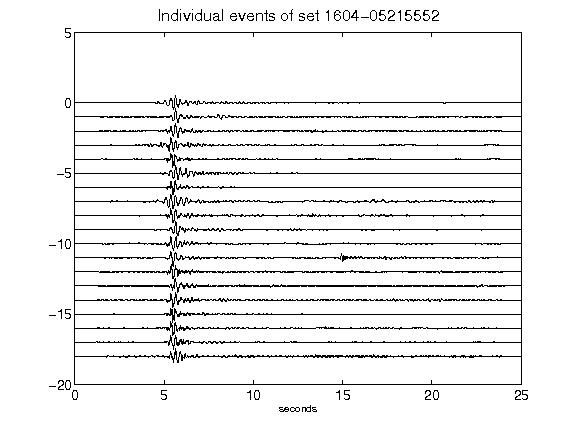](figures/1604-05215552_AllEv.png)[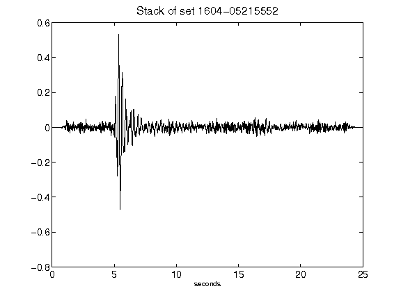](figures/1604-05215552_Stack.png)[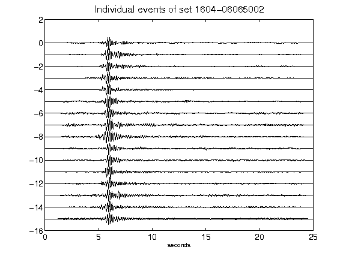](figures/1604-06065002_AllEv.png)[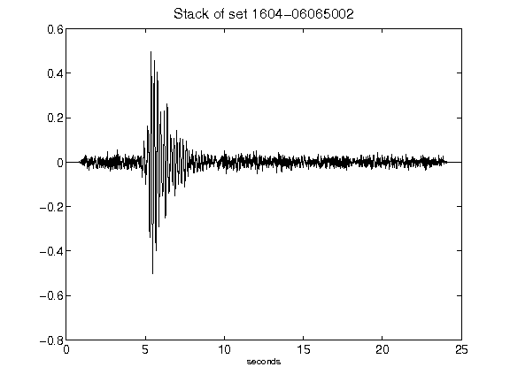](figures/1604-06065002_Stack.png)[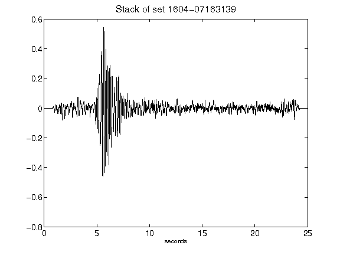](figures/1604-07163139_Stack.png)[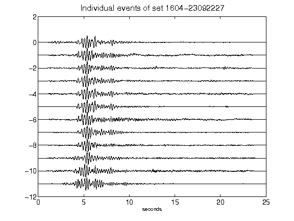](figures/1604-23092227_AllEv.png)[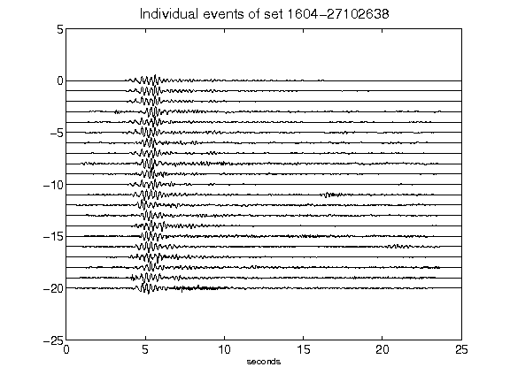](figures/1604-27102638_AllEv.png)[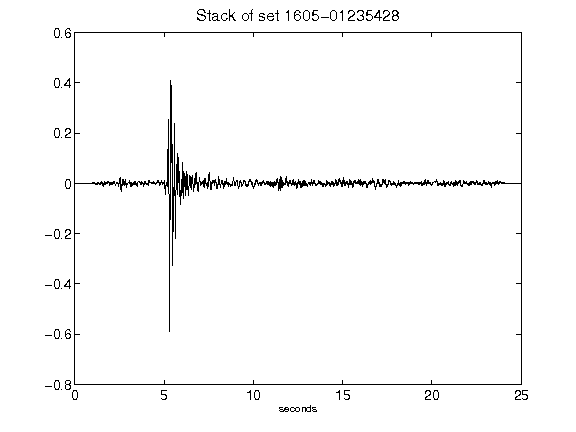](figures/1605-01235428_Stack.png)[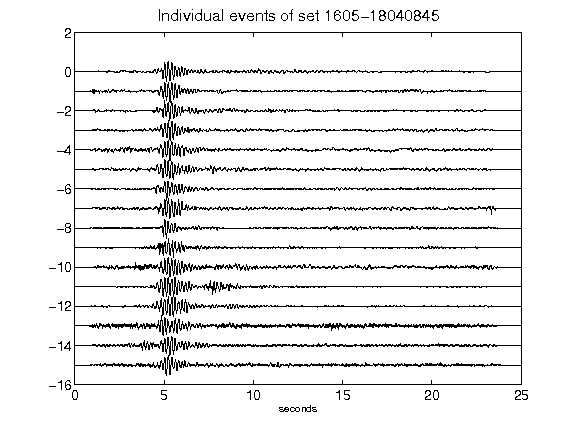](figures/1605-18040845_AllEv.png)[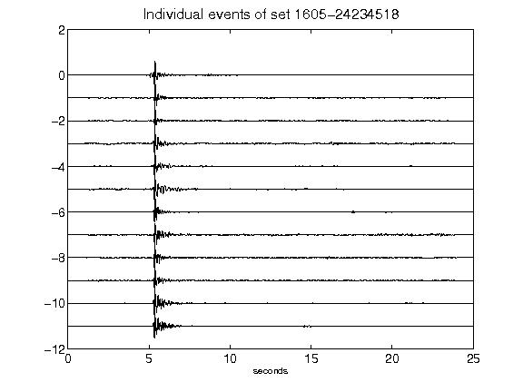](figures/1605-24234518_AllEv.png)