# Repeating Earthquake Activity at RCM

## Waveforms
[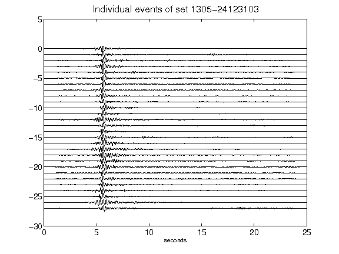](figures/1305-24123103_AllEv.png)[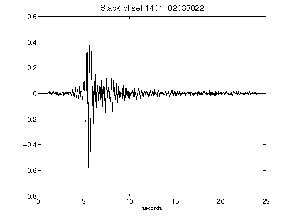](figures/1401-02033022_Stack.png)[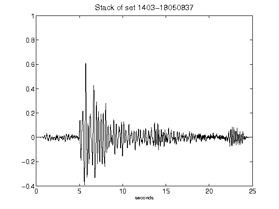](figures/1403-18050837_Stack.png)[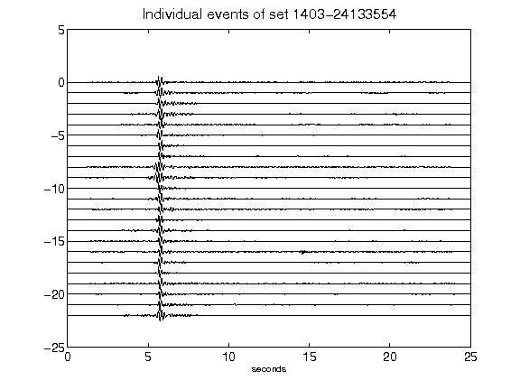](figures/1403-24133554_AllEv.png)[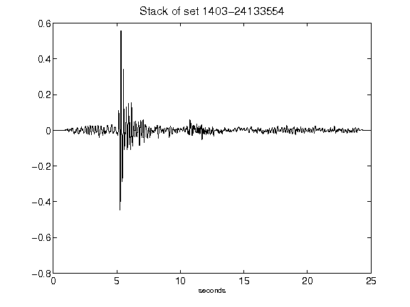](figures/1403-24133554_Stack.png)[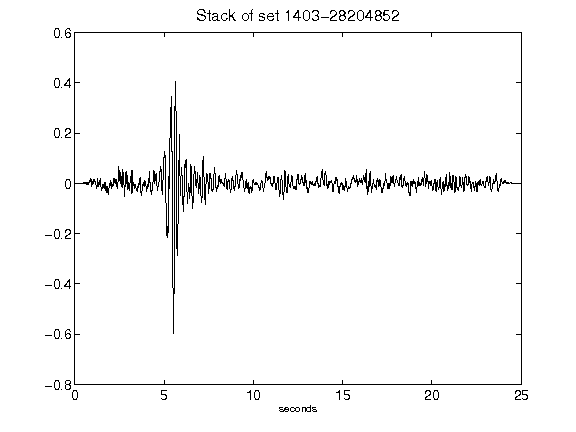](figures/1403-28204852_Stack.png)[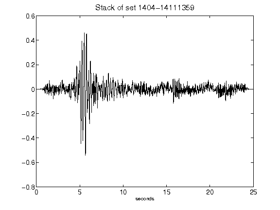](figures/1404-14111359_Stack.png)[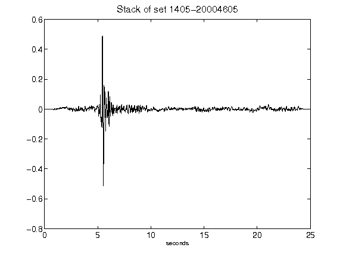](figures/1405-20004605_Stack.png)[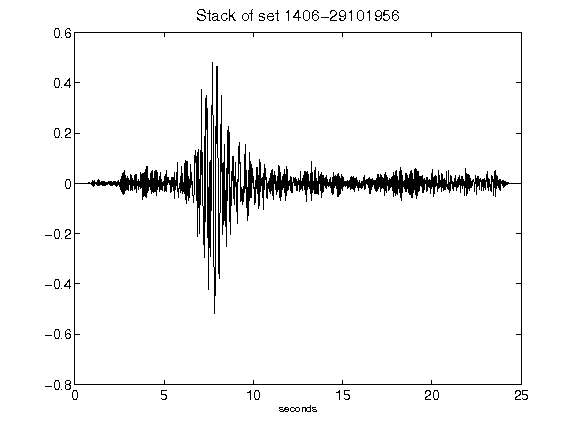](figures/1406-29101956_Stack.png)[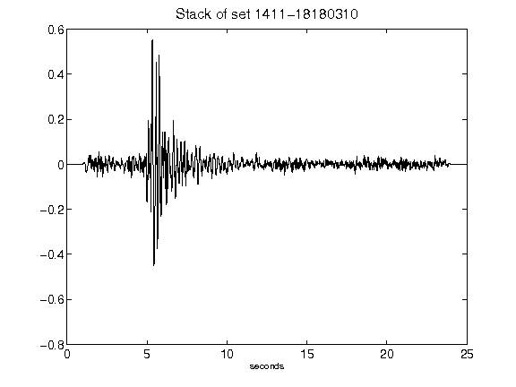](figures/1411-18180310_Stack.png)[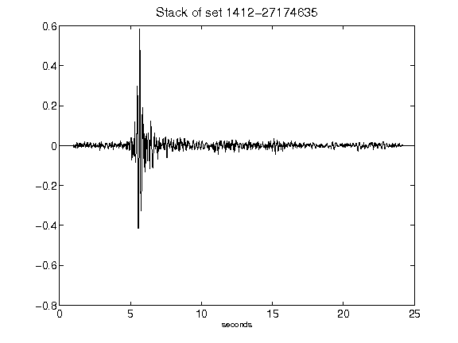](figures/1412-27174635_Stack.png)[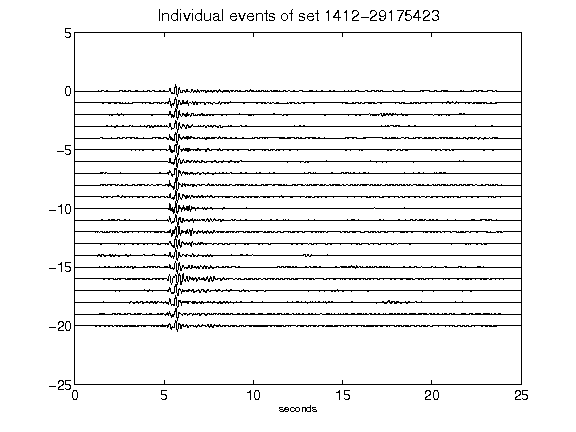](figures/1412-29175423_AllEv.png)[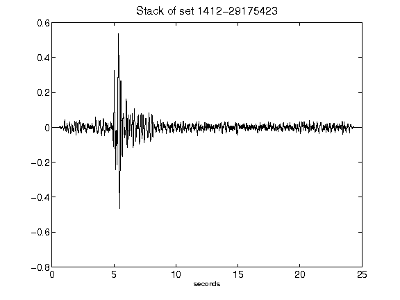](figures/1412-29175423_Stack.png)[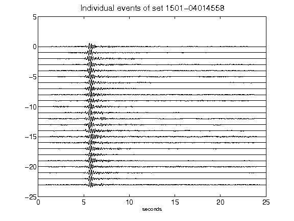](figures/1501-04014558_AllEv.png)[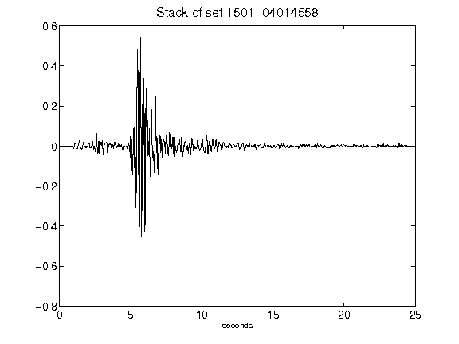](figures/1501-04014558_Stack.png)[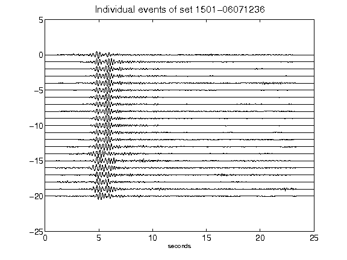](figures/1501-06071236_AllEv.png)[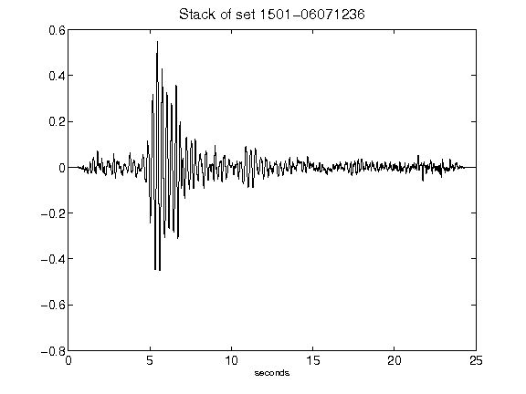](figures/1501-06071236_Stack.png)[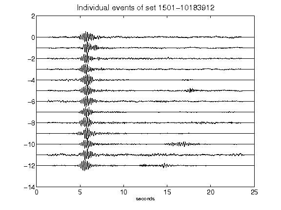](figures/1501-10183912_AllEv.png)[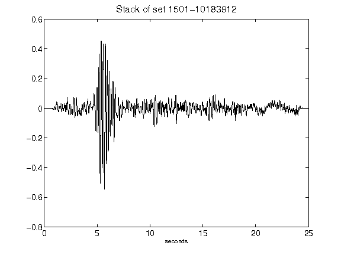](figures/1501-10183912_Stack.png)[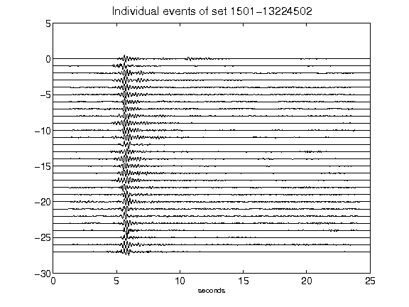](figures/1501-13224502_AllEv.png)[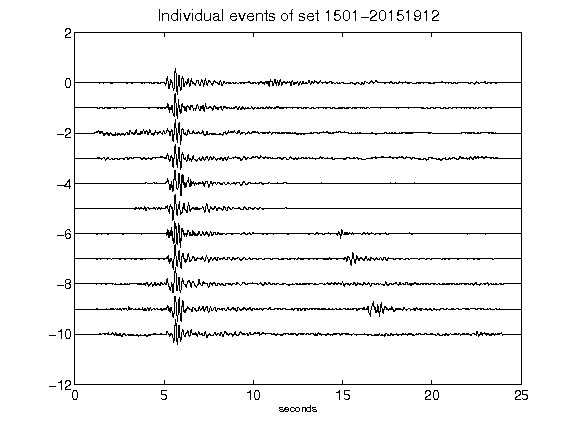](figures/1501-20151912_AllEv.png)[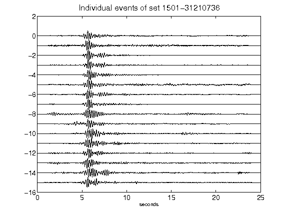](figures/1501-31210736_AllEv.png)[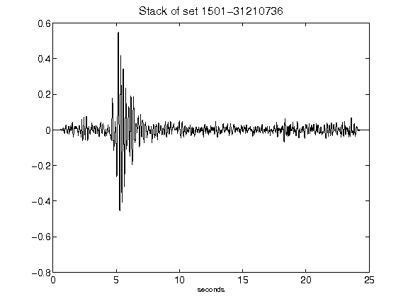](figures/1501-31210736_Stack.png)[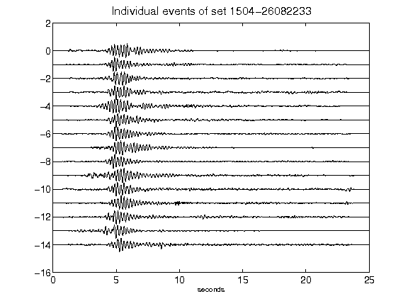](figures/1504-26082233_AllEv.png)[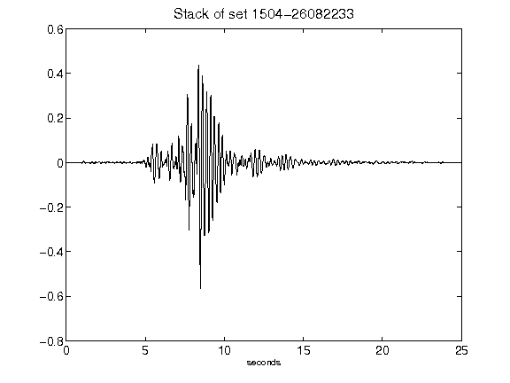](figures/1504-26082233_Stack.png)[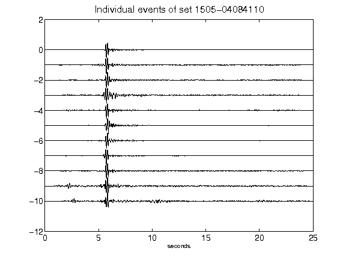](figures/1505-04084110_AllEv.png)[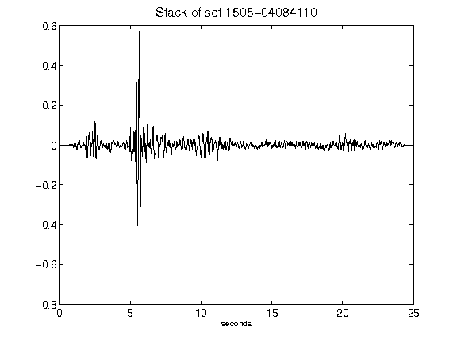](figures/1505-04084110_Stack.png)