# Repeating Earthquake Activity at RCM

## Waveforms
[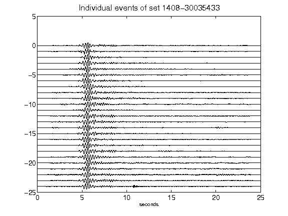](figures/1408-30035433_AllEv.png)[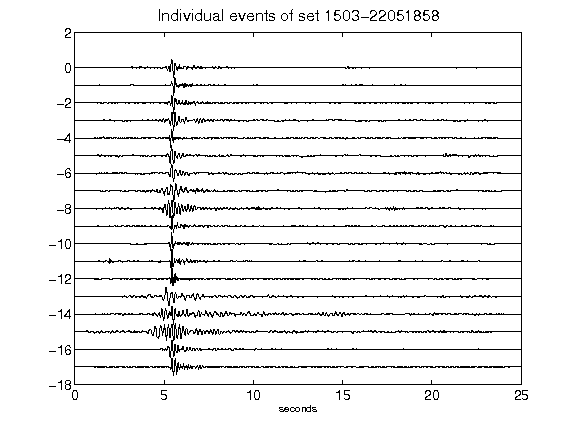](figures/1503-22051858_AllEv.png)[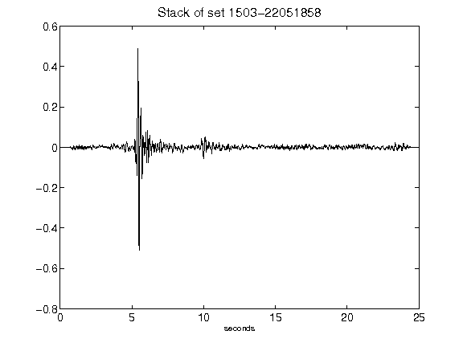](figures/1503-22051858_Stack.png)[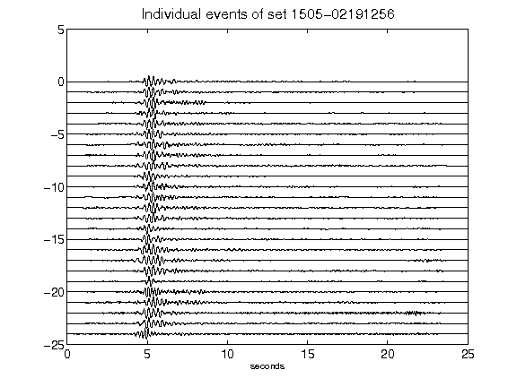](figures/1505-02191256_AllEv.png)[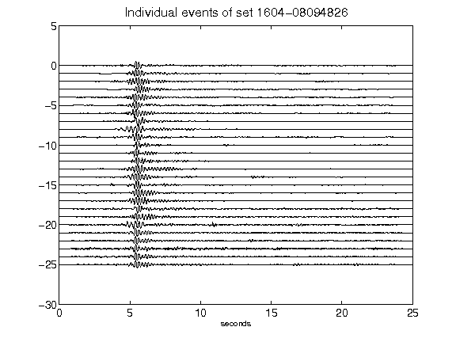](figures/1604-08094826_AllEv.png)[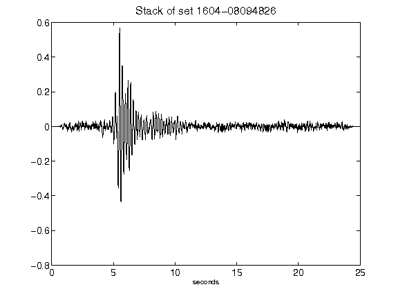](figures/1604-08094826_Stack.png)[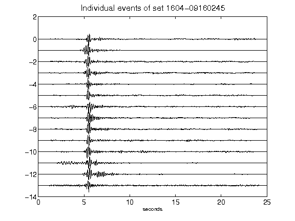](figures/1604-09160245_AllEv.png)[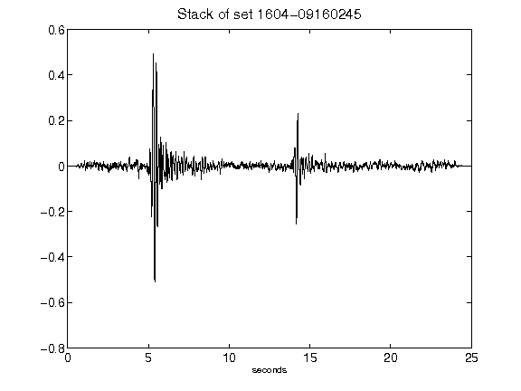](figures/1604-09160245_Stack.png)[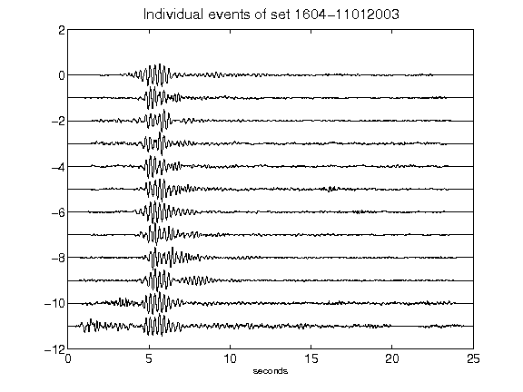](figures/1604-11012003_AllEv.png)[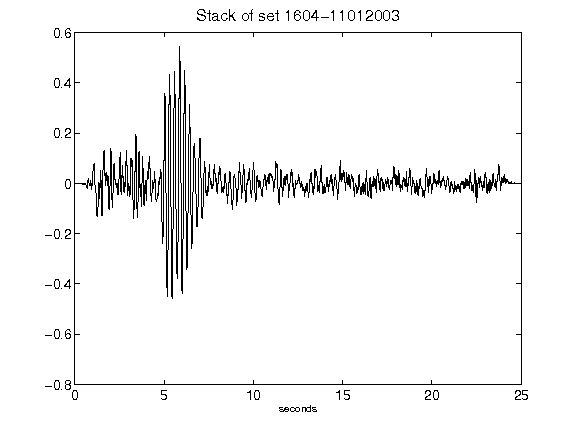](figures/1604-11012003_Stack.png)[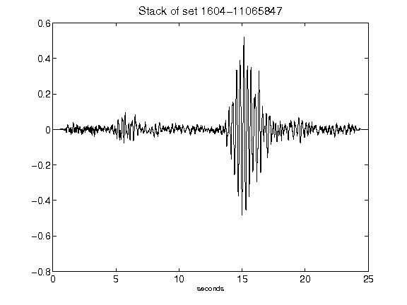](figures/1604-11065847_Stack.png)[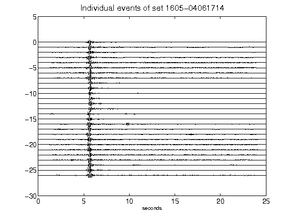](figures/1605-04061714_AllEv.png)[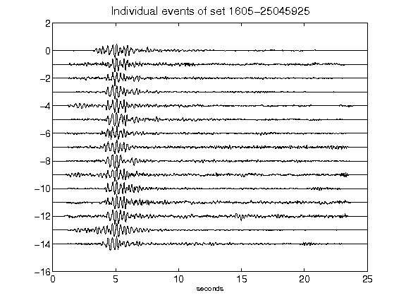](figures/1605-25045925_AllEv.png)[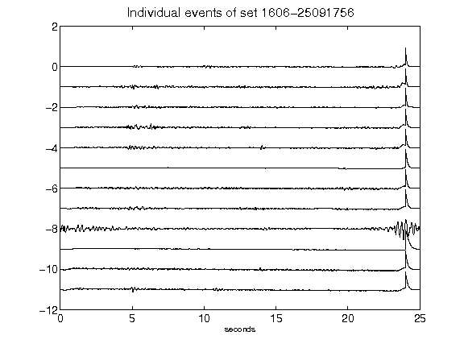](figures/1606-25091756_AllEv.png)[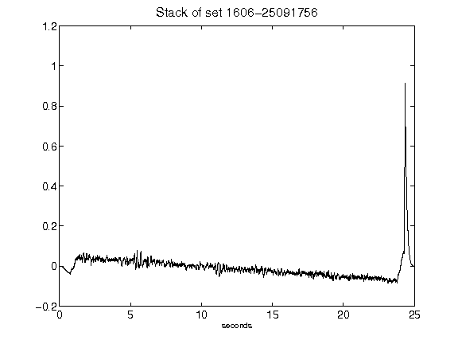](figures/1606-25091756_Stack.png)