# Repeating Earthquake Activity at RCM

## Waveforms
[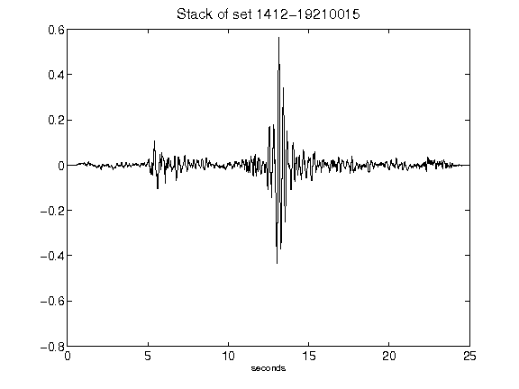](figures/1412-19210015_Stack.png)[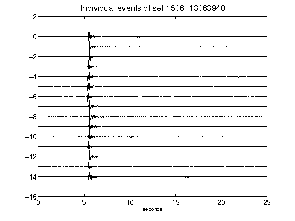](figures/1506-13063940_AllEv.png)[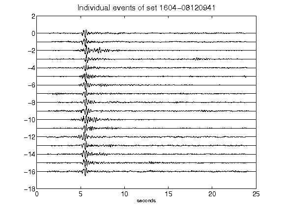](figures/1604-08120941_AllEv.png)[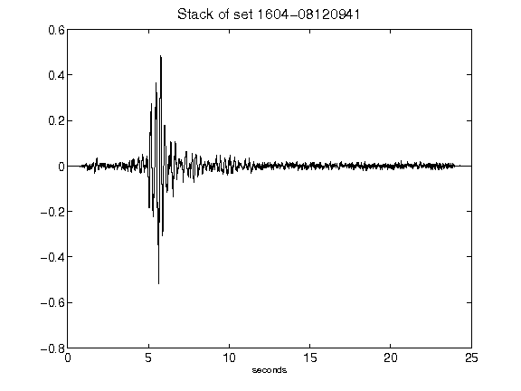](figures/1604-08120941_Stack.png)[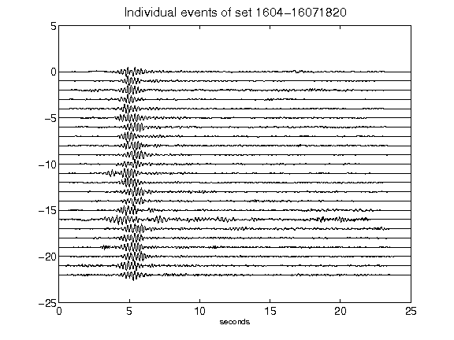](figures/1604-16071820_AllEv.png)[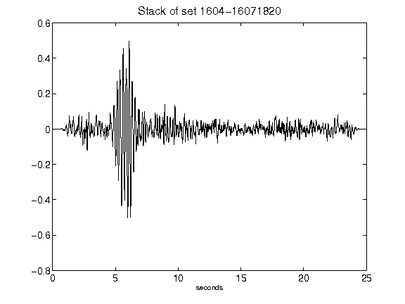](figures/1604-16071820_Stack.png)[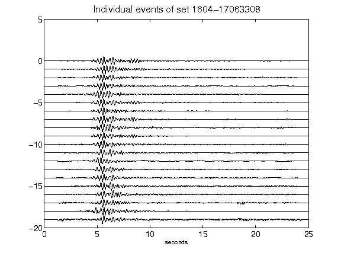](figures/1604-17063308_AllEv.png)[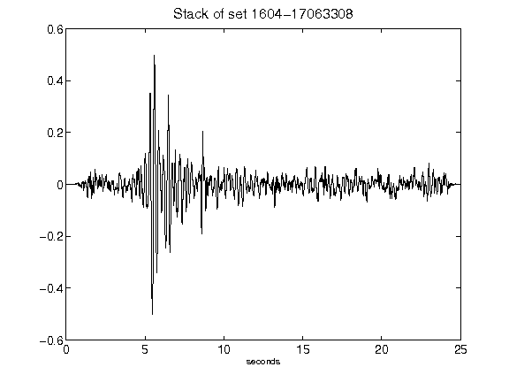](figures/1604-17063308_Stack.png)[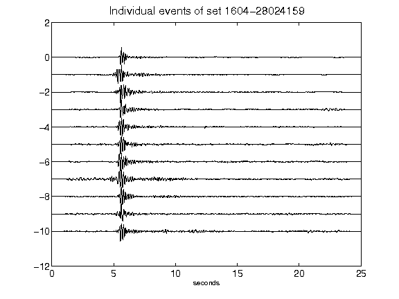](figures/1604-28024159_AllEv.png)[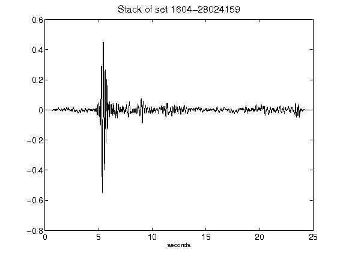](figures/1604-28024159_Stack.png)[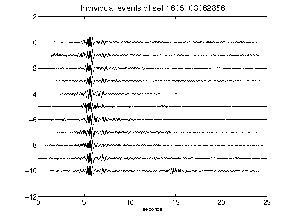](figures/1605-03062856_AllEv.png)[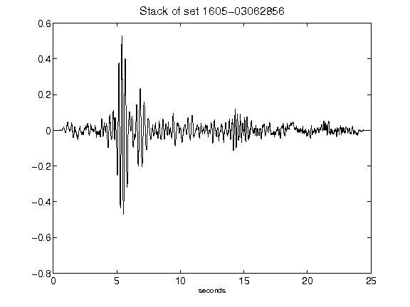](figures/1605-03062856_Stack.png)[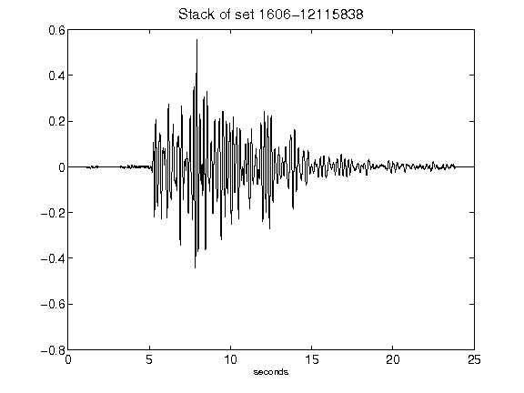](figures/1606-12115838_Stack.png)