# Repeating Earthquake Activity at RCM

## Waveforms
[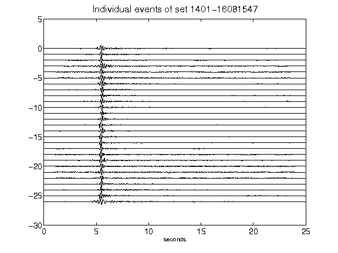](figures/1401-16081547_AllEv.png)[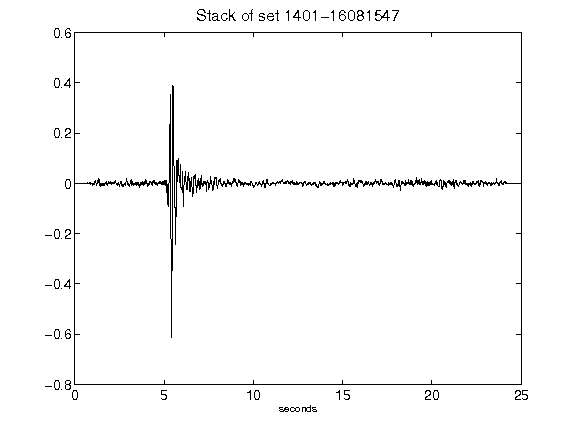](figures/1401-16081547_Stack.png)[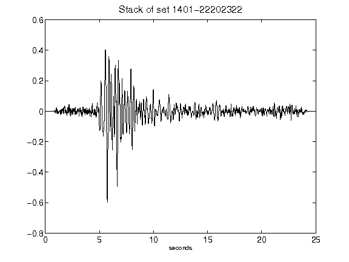](figures/1401-22202322_Stack.png)[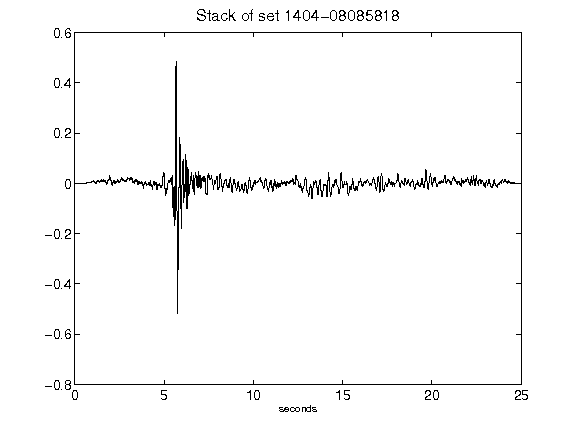](figures/1404-08085818_Stack.png)[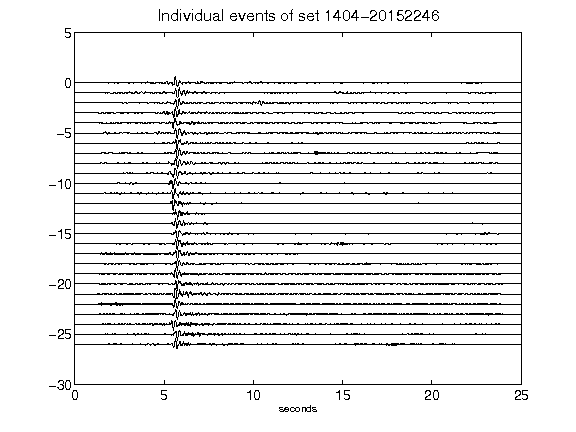](figures/1404-20152246_AllEv.png)[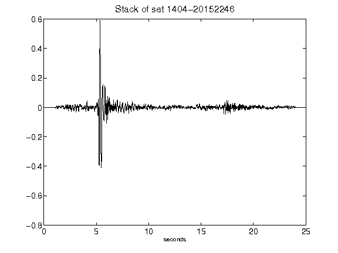](figures/1404-20152246_Stack.png)[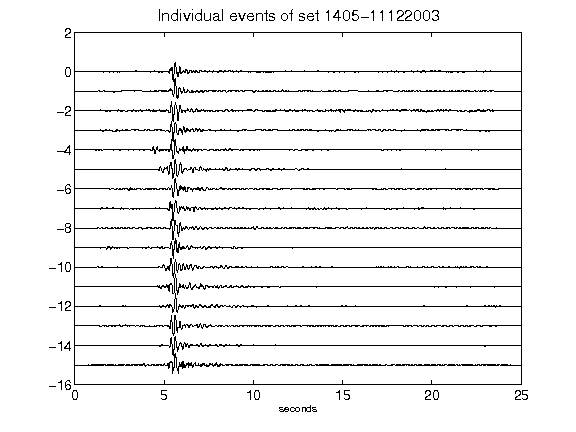](figures/1405-11122003_AllEv.png)[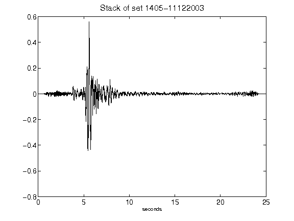](figures/1405-11122003_Stack.png)[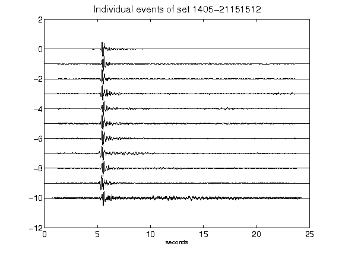](figures/1405-21151512_AllEv.png)[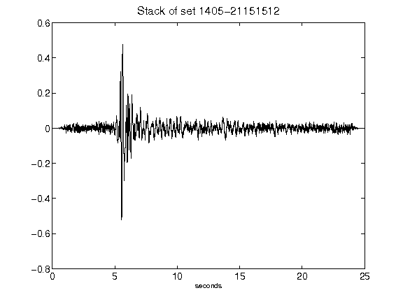](figures/1405-21151512_Stack.png)[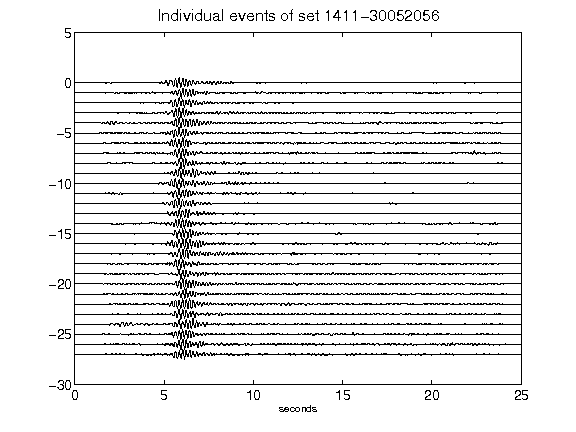](figures/1411-30052056_AllEv.png)[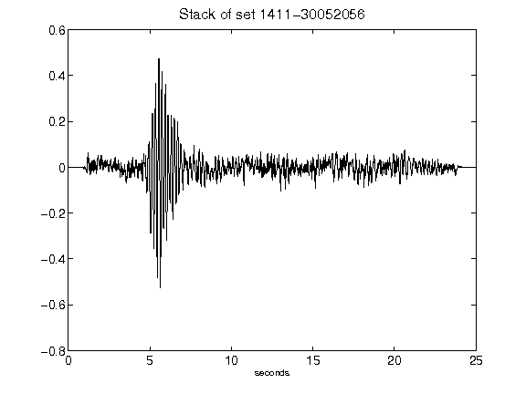](figures/1411-30052056_Stack.png)[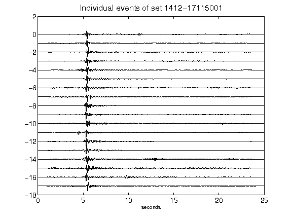](figures/1412-17115001_AllEv.png)[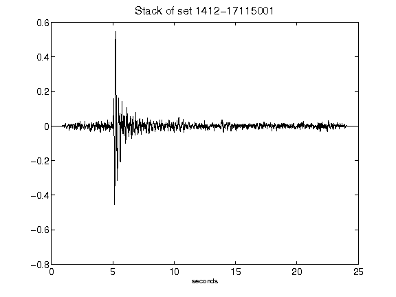](figures/1412-17115001_Stack.png)[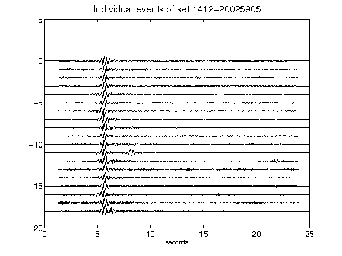](figures/1412-20025905_AllEv.png)[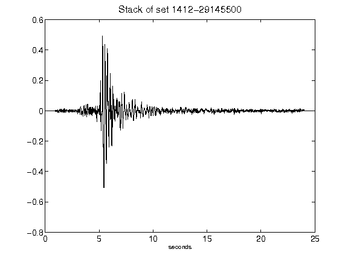](figures/1412-29145500_Stack.png)[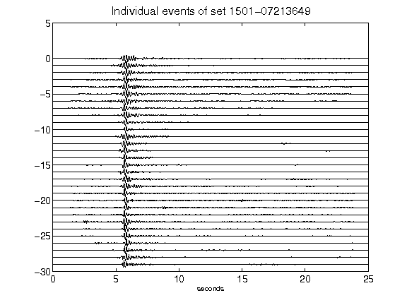](figures/1501-07213649_AllEv.png)[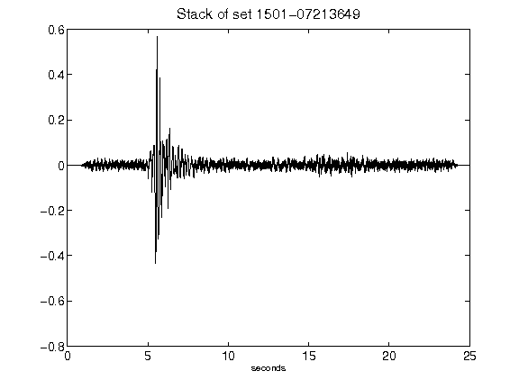](figures/1501-07213649_Stack.png)[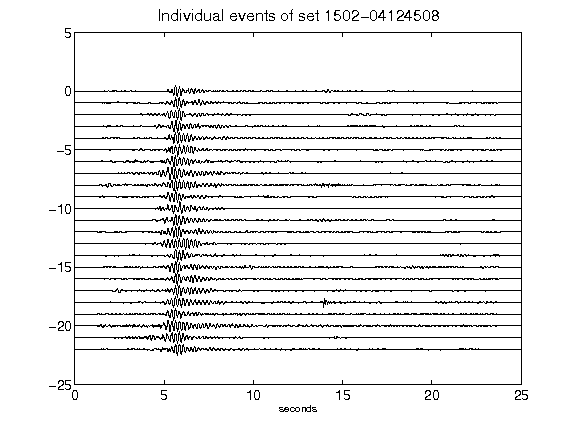](figures/1502-04124508_AllEv.png)[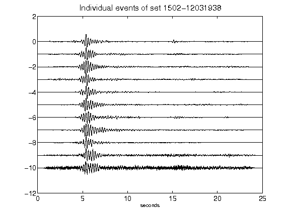](figures/1502-12031938_AllEv.png)[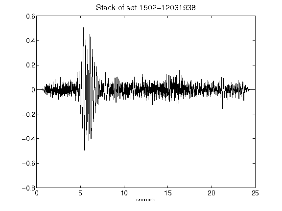](figures/1502-12031938_Stack.png)[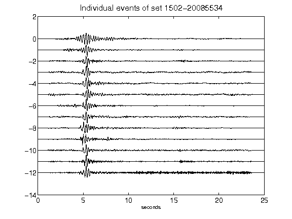](figures/1502-20085534_AllEv.png)[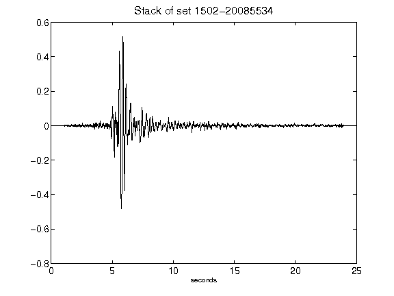](figures/1502-20085534_Stack.png)[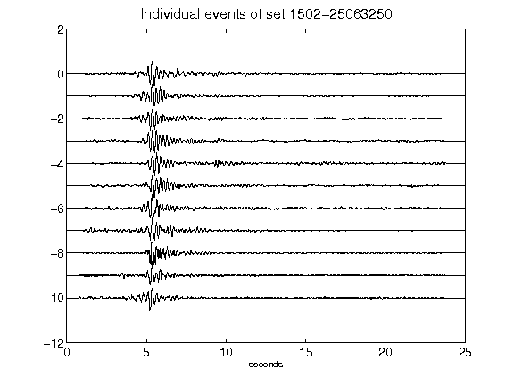](figures/1502-25063250_AllEv.png)[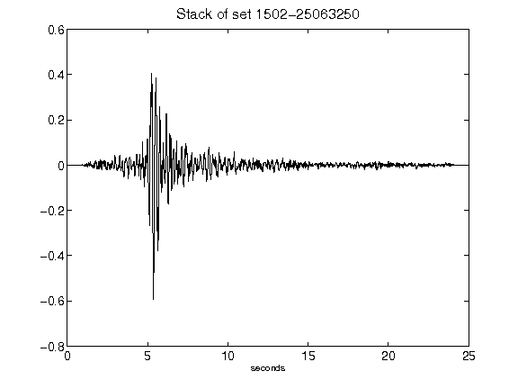](figures/1502-25063250_Stack.png)[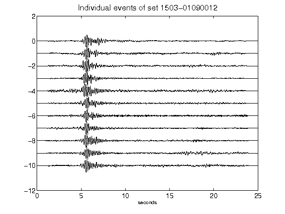](figures/1503-01090012_AllEv.png)[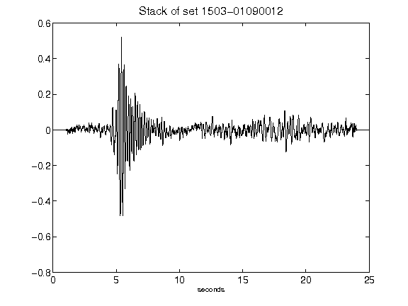](figures/1503-01090012_Stack.png)[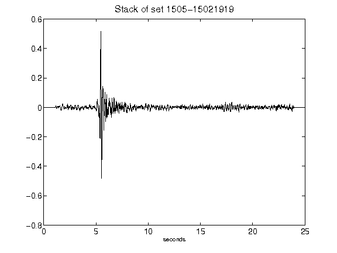](figures/1505-15021919_Stack.png)[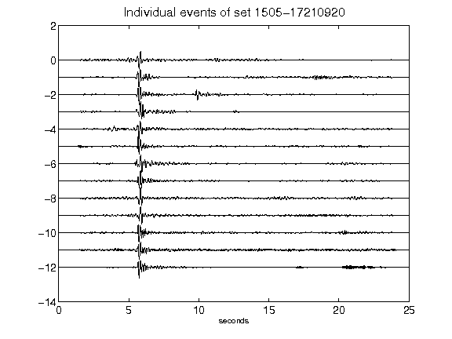](figures/1505-17210920_AllEv.png)[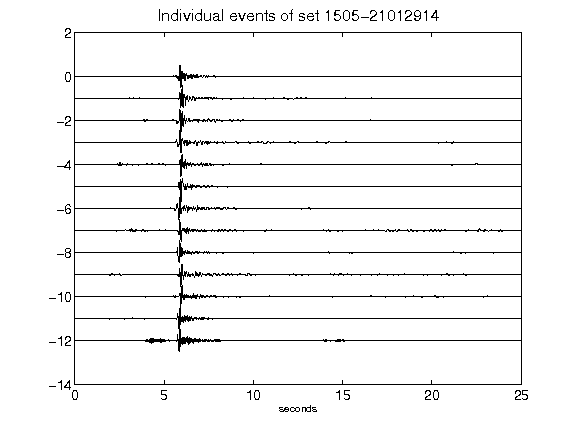](figures/1505-21012914_AllEv.png)[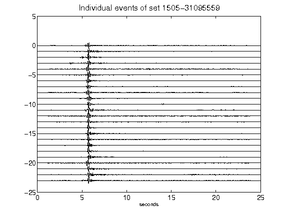](figures/1505-31095559_AllEv.png)[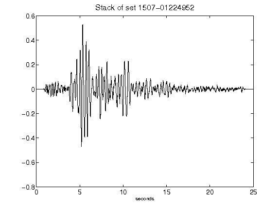](figures/1507-01224952_Stack.png)