# Repeating Earthquake Activity at RCM

## Waveforms
[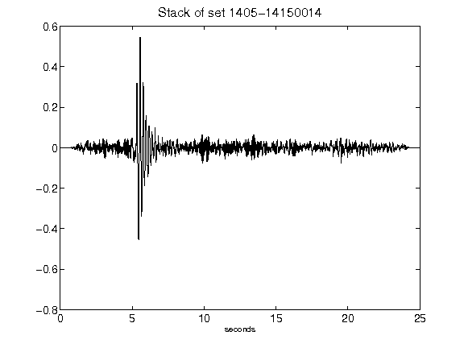](figures/1405-14150014_Stack.png)[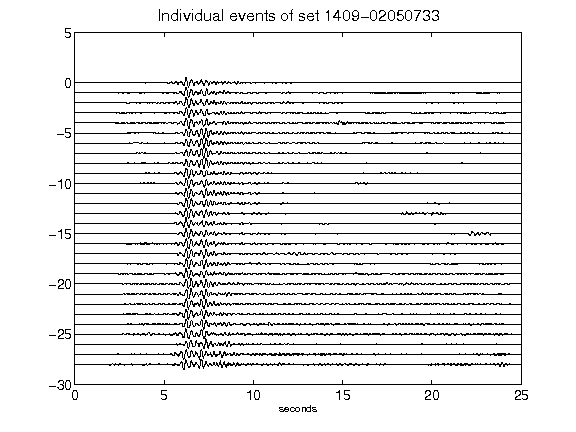](figures/1409-02050733_AllEv.png)[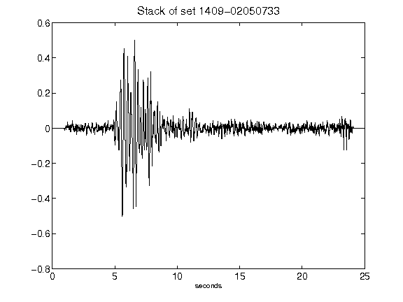](figures/1409-02050733_Stack.png)[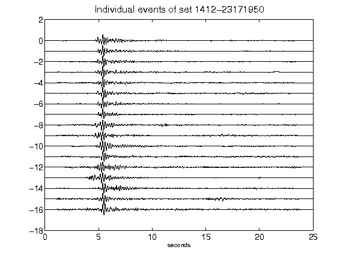](figures/1412-23171950_AllEv.png)[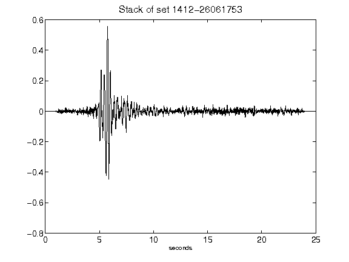](figures/1412-26061753_Stack.png)[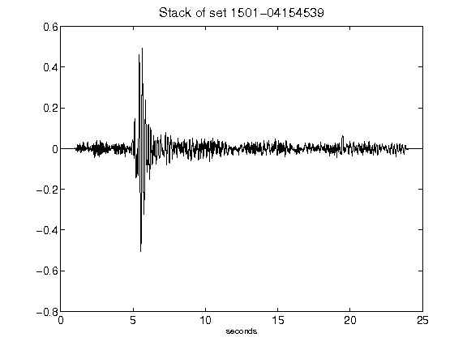](figures/1501-04154539_Stack.png)[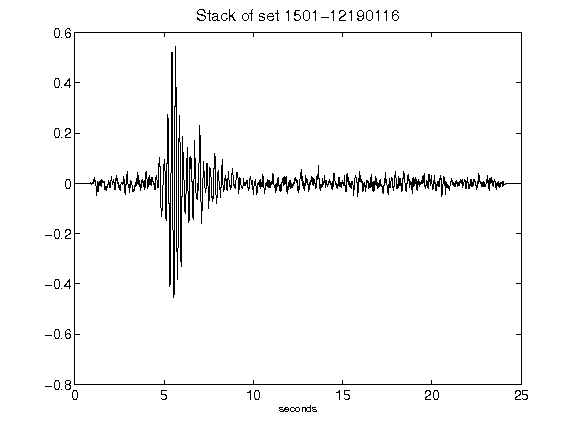](figures/1501-12190116_Stack.png)[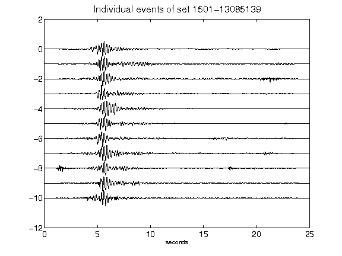](figures/1501-13085139_AllEv.png)[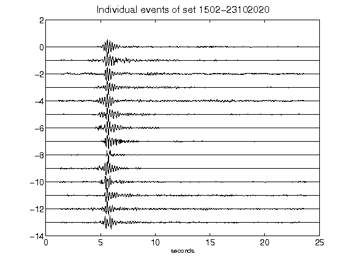](figures/1502-23102020_AllEv.png)[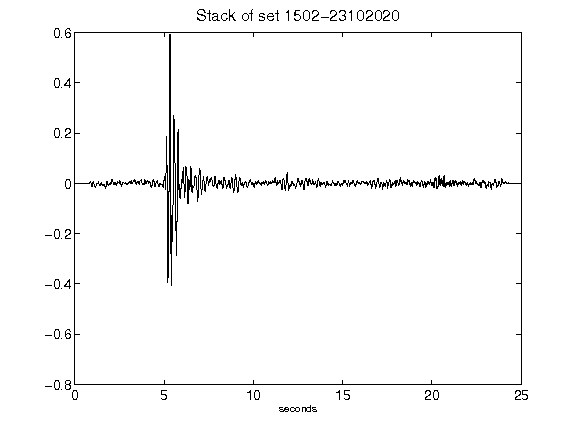](figures/1502-23102020_Stack.png)[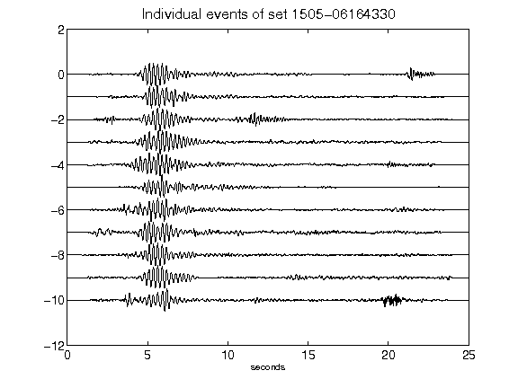](figures/1505-06164330_AllEv.png)[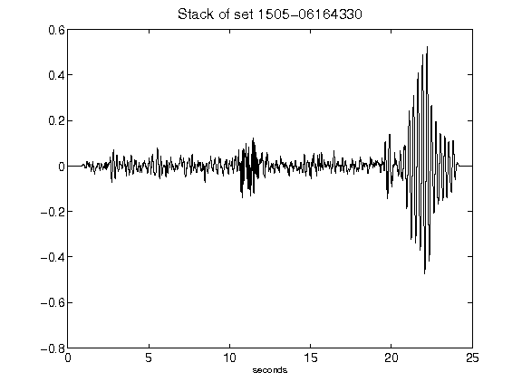](figures/1505-06164330_Stack.png)[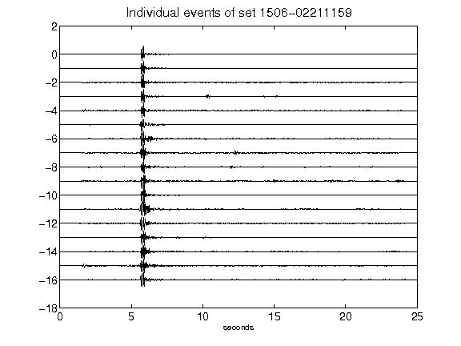](figures/1506-02211159_AllEv.png)[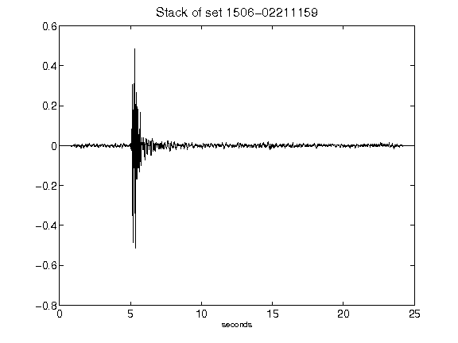](figures/1506-02211159_Stack.png)[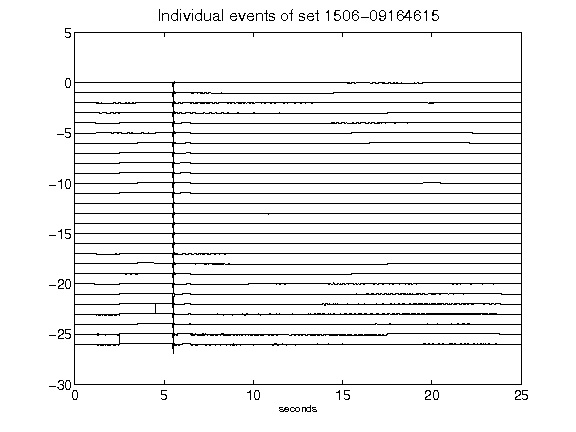](figures/1506-09164615_AllEv.png)