# Repeating Earthquake Activity at RCM

## Waveforms
[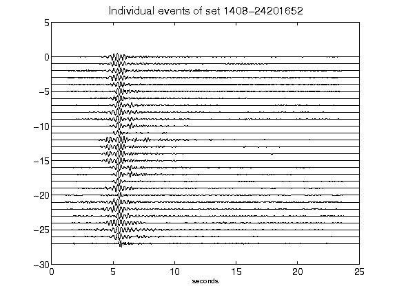](figures/1408-24201652_AllEv.png)[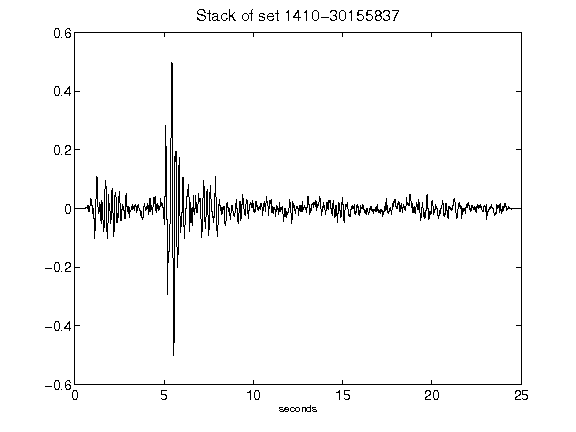](figures/1410-30155837_Stack.png)[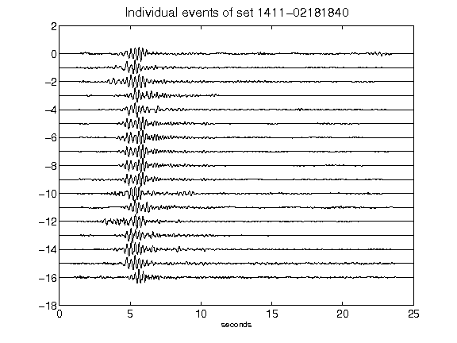](figures/1411-02181840_AllEv.png)[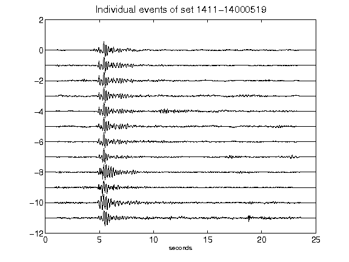](figures/1411-14000519_AllEv.png)[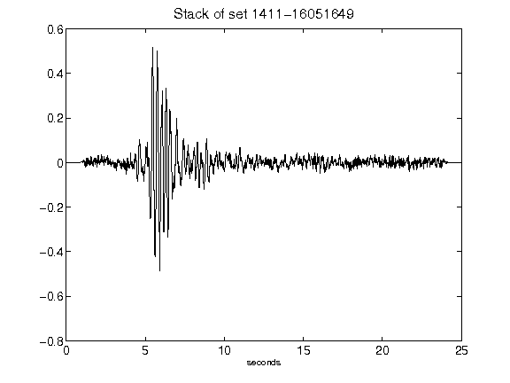](figures/1411-16051649_Stack.png)[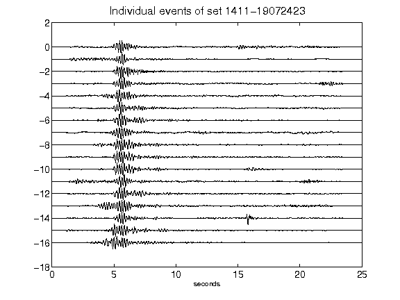](figures/1411-19072423_AllEv.png)[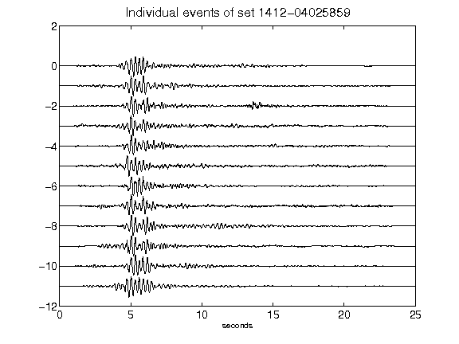](figures/1412-04025859_AllEv.png)[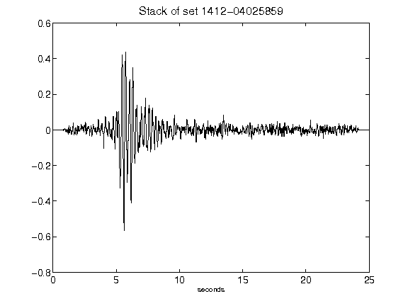](figures/1412-04025859_Stack.png)[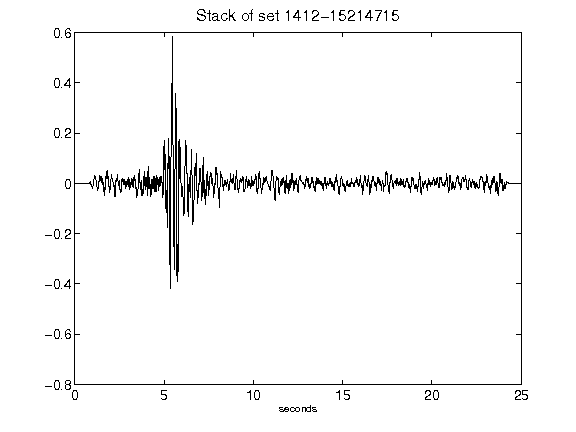](figures/1412-15214715_Stack.png)[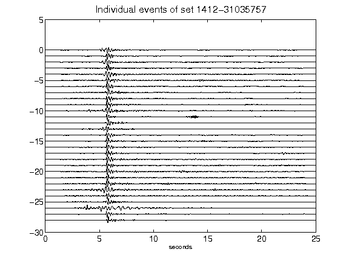](figures/1412-31035757_AllEv.png)[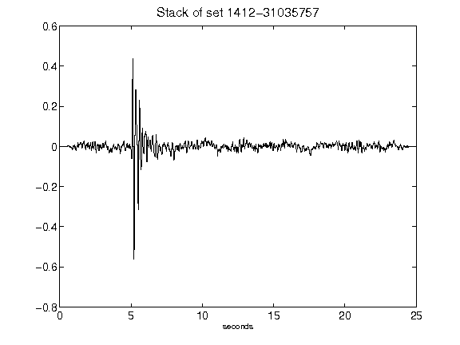](figures/1412-31035757_Stack.png)[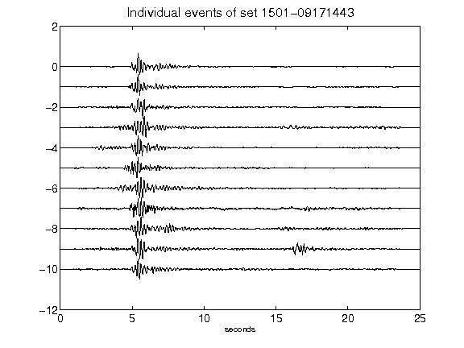](figures/1501-09171443_AllEv.png)[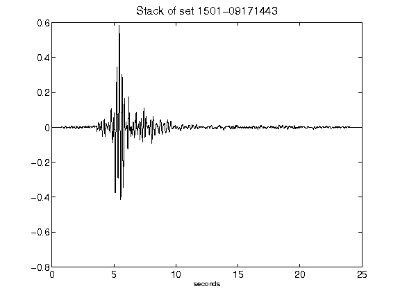](figures/1501-09171443_Stack.png)[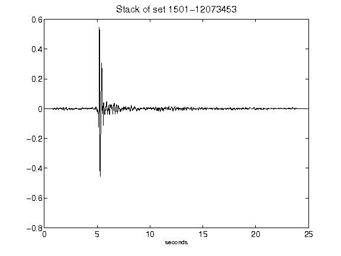](figures/1501-12073453_Stack.png)[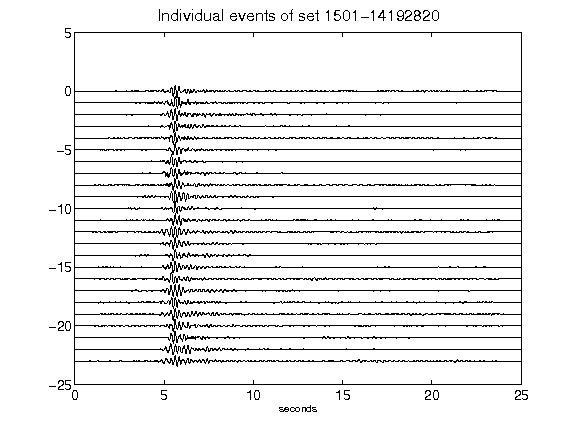](figures/1501-14192820_AllEv.png)[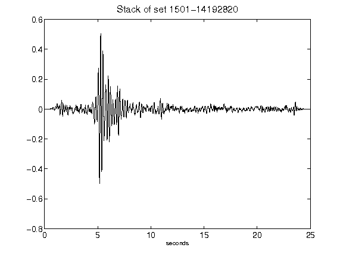](figures/1501-14192820_Stack.png)[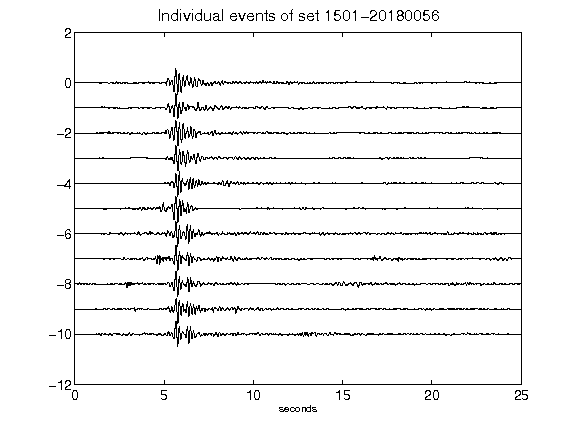](figures/1501-20180056_AllEv.png)[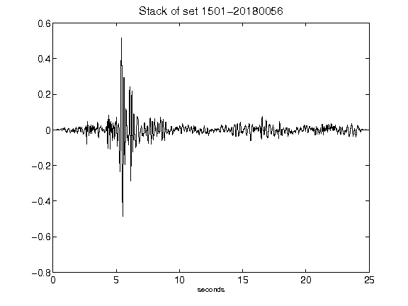](figures/1501-20180056_Stack.png)[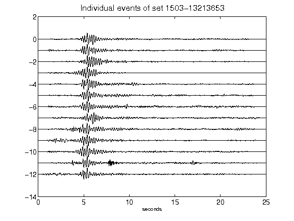](figures/1503-13213653_AllEv.png)[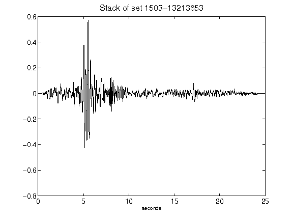](figures/1503-13213653_Stack.png)[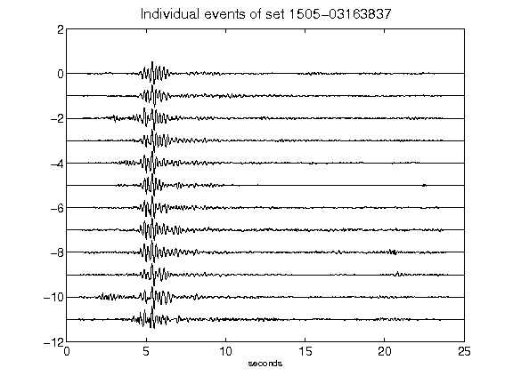](figures/1505-03163837_AllEv.png)[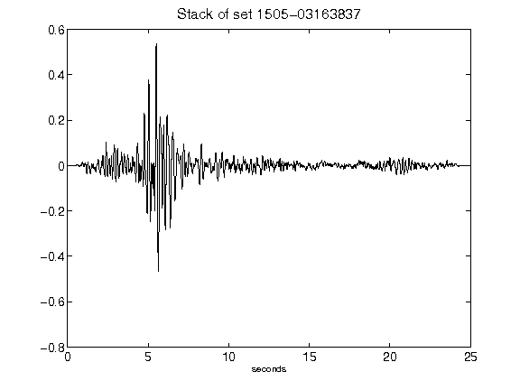](figures/1505-03163837_Stack.png)[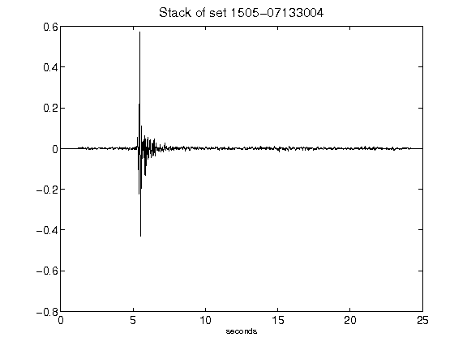](figures/1505-07133004_Stack.png)[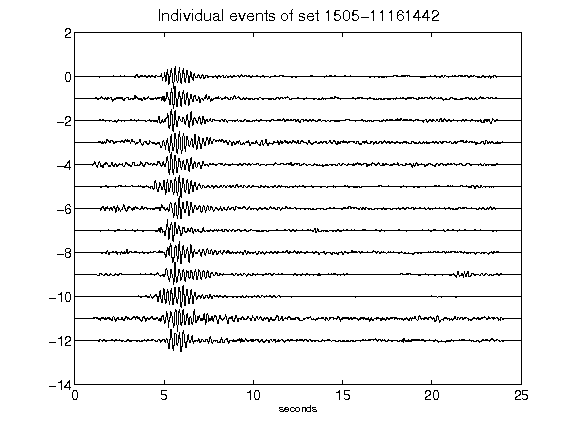](figures/1505-11161442_AllEv.png)