# Repeating Earthquake Activity at RCM

## Waveforms
[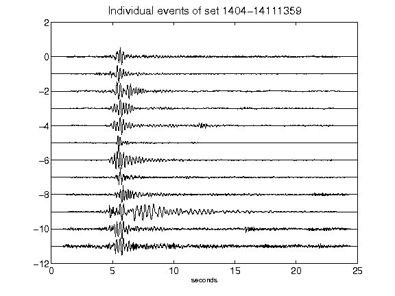](figures/1404-14111359_AllEv.png)[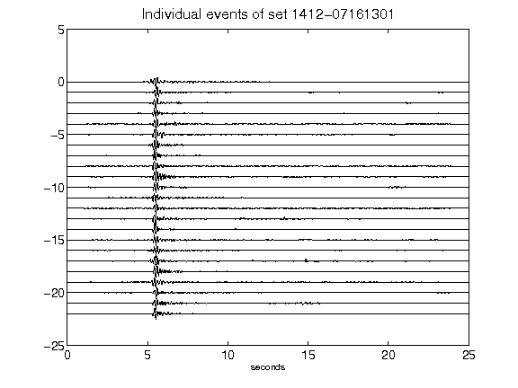](figures/1412-07161301_AllEv.png)[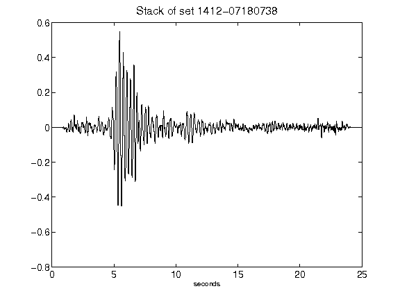](figures/1412-07180738_Stack.png)[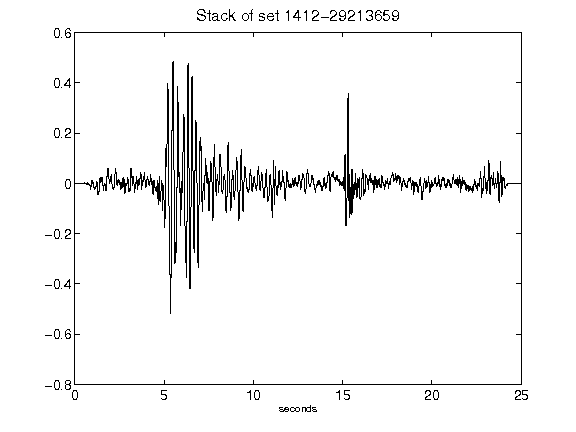](figures/1412-29213659_Stack.png)[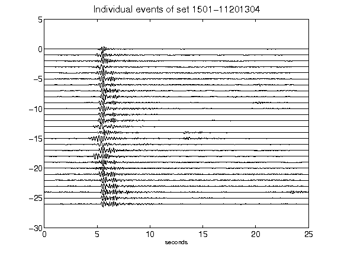](figures/1501-11201304_AllEv.png)[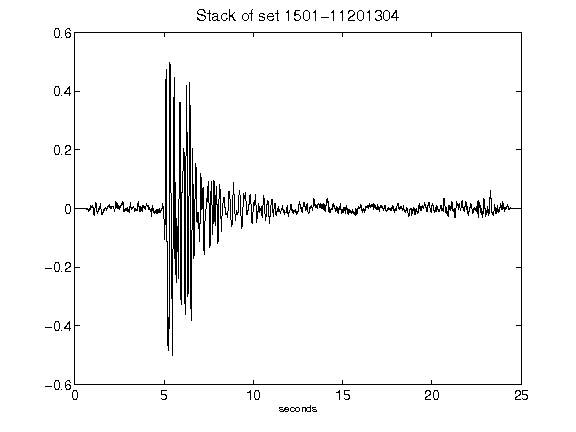](figures/1501-11201304_Stack.png)[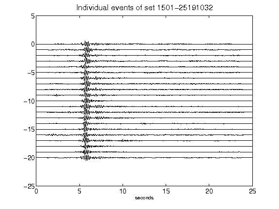](figures/1501-25191032_AllEv.png)[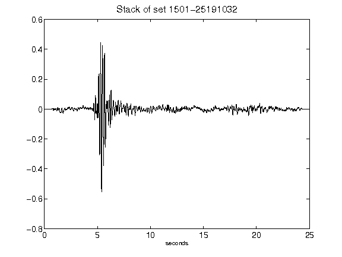](figures/1501-25191032_Stack.png)[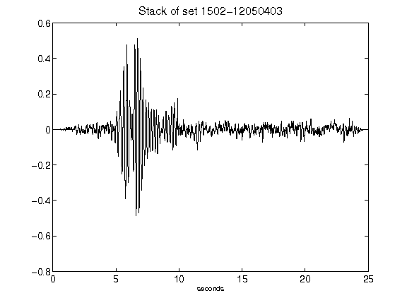](figures/1502-12050403_Stack.png)[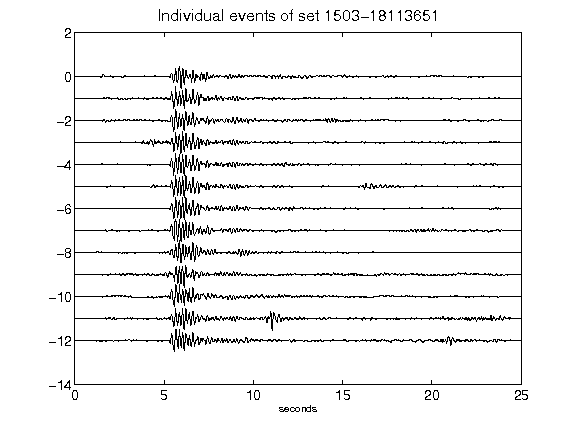](figures/1503-18113651_AllEv.png)[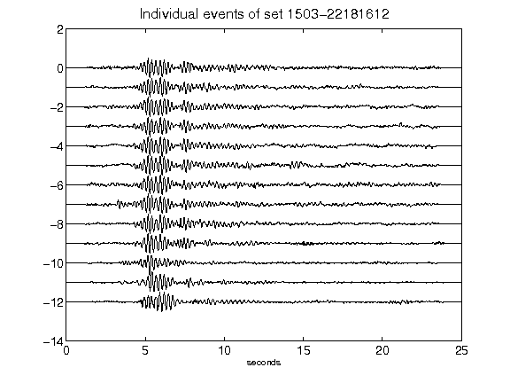](figures/1503-22181612_AllEv.png)[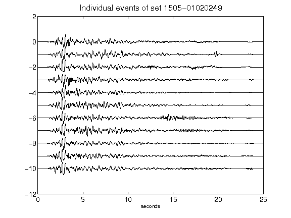](figures/1505-01020249_AllEv.png)