# Repeating Earthquake Activity at RCM

## Waveforms
[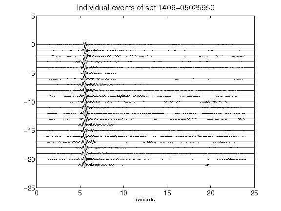](figures/1409-05025950_AllEv.png)[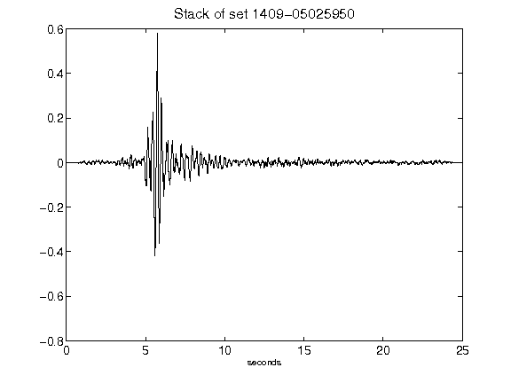](figures/1409-05025950_Stack.png)[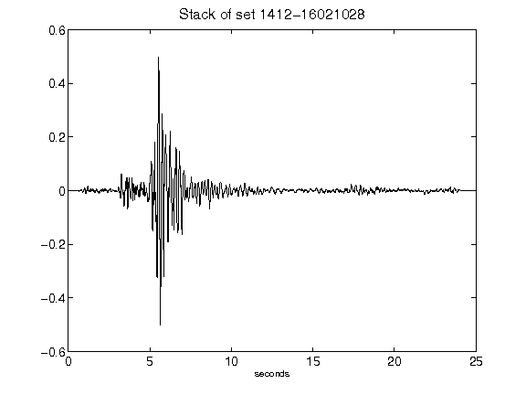](figures/1412-16021028_Stack.png)[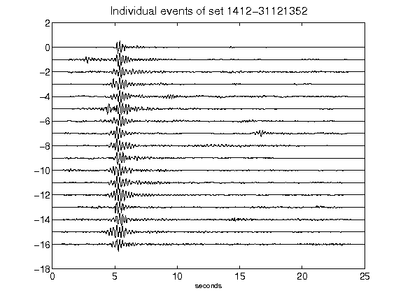](figures/1412-31121352_AllEv.png)[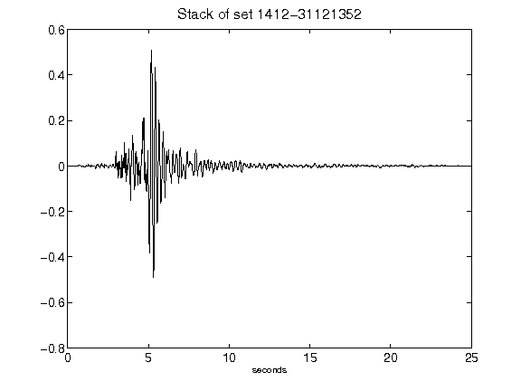](figures/1412-31121352_Stack.png)[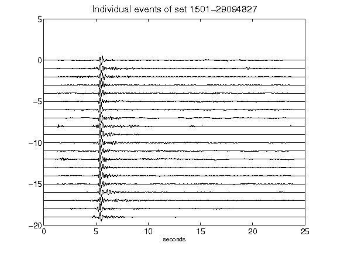](figures/1501-29094827_AllEv.png)[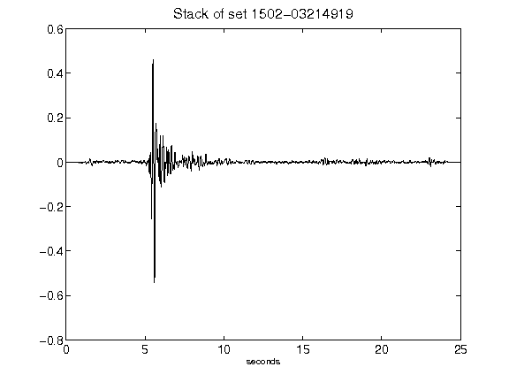](figures/1502-03214919_Stack.png)[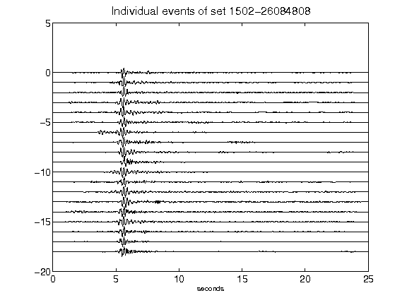](figures/1502-26084808_AllEv.png)[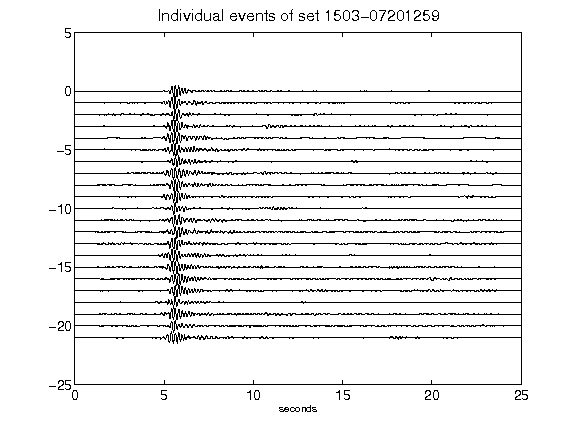](figures/1503-07201259_AllEv.png)[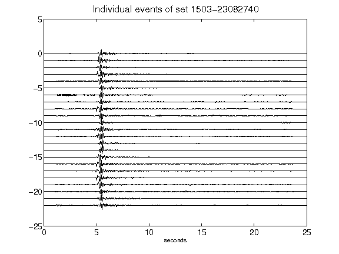](figures/1503-23082740_AllEv.png)[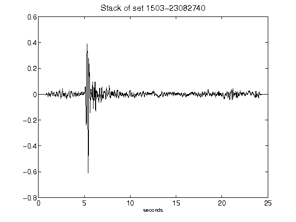](figures/1503-23082740_Stack.png)[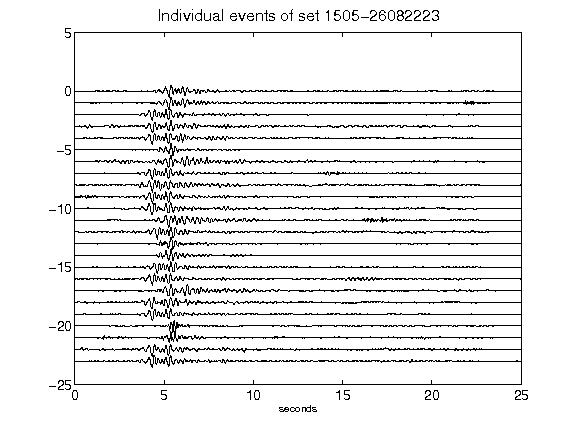](figures/1505-26082223_AllEv.png)[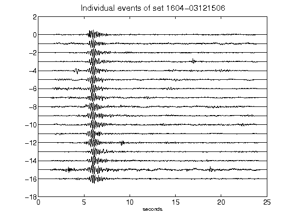](figures/1604-03121506_AllEv.png)[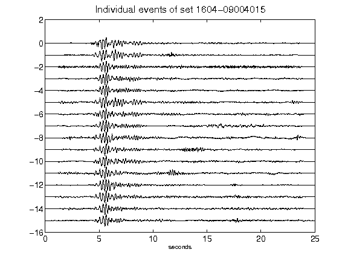](figures/1604-09004015_AllEv.png)[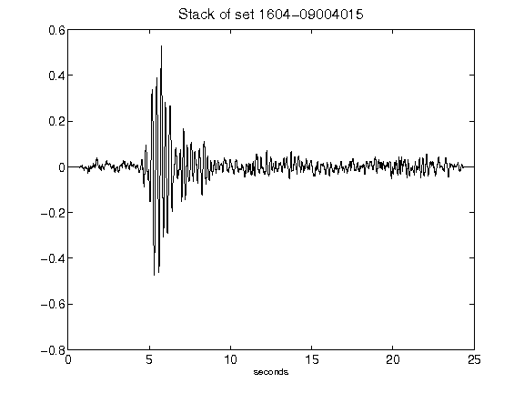](figures/1604-09004015_Stack.png)