# Repeating Earthquake Activity at RCM

## Waveforms
[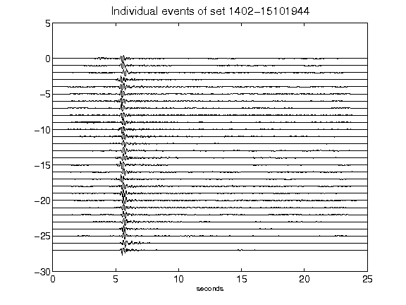](figures/1402-15101944_AllEv.png)[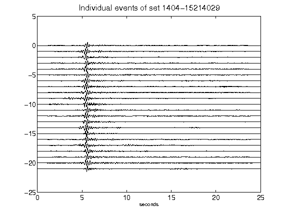](figures/1404-15214029_AllEv.png)[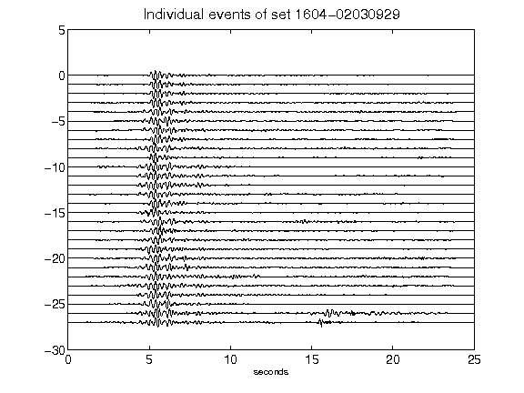](figures/1604-02030929_AllEv.png)[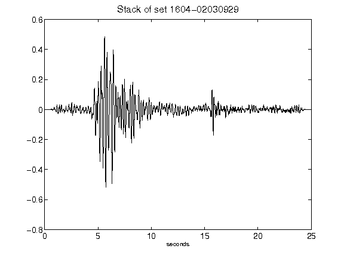](figures/1604-02030929_Stack.png)[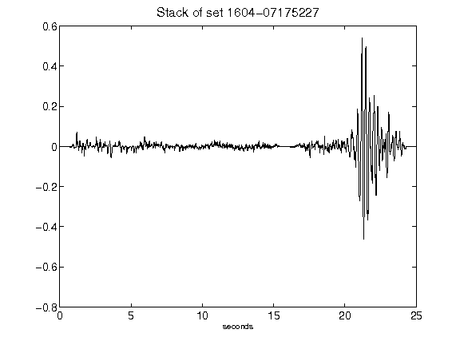](figures/1604-07175227_Stack.png)[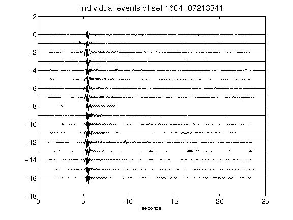](figures/1604-07213341_AllEv.png)[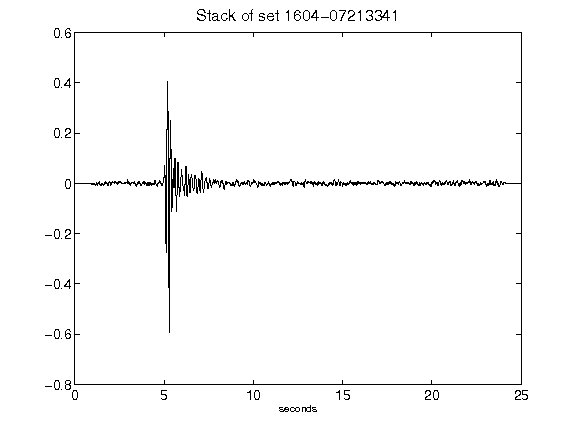](figures/1604-07213341_Stack.png)[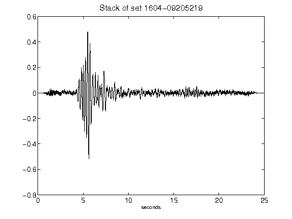](figures/1604-09205219_Stack.png)[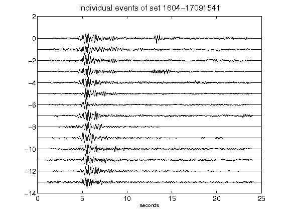](figures/1604-17091541_AllEv.png)[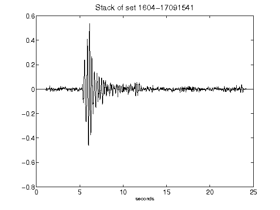](figures/1604-17091541_Stack.png)[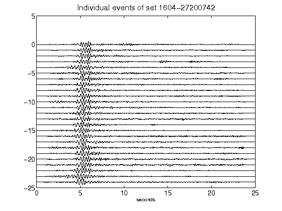](figures/1604-27200742_AllEv.png)[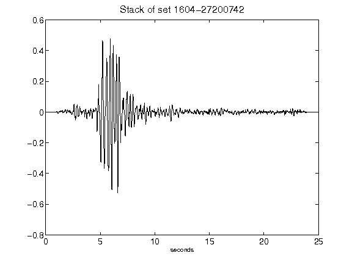](figures/1604-27200742_Stack.png)[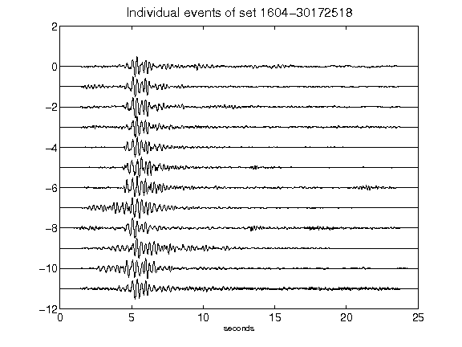](figures/1604-30172518_AllEv.png)[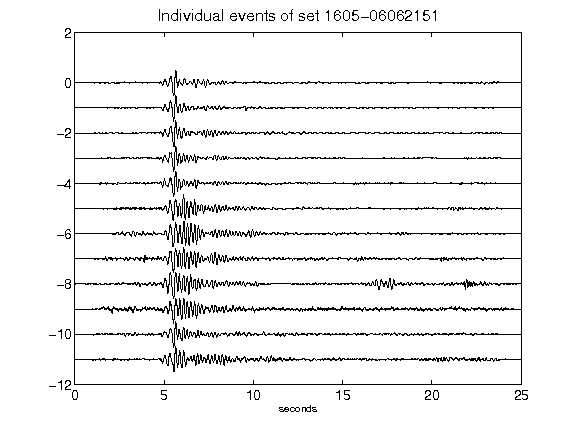](figures/1605-06062151_AllEv.png)[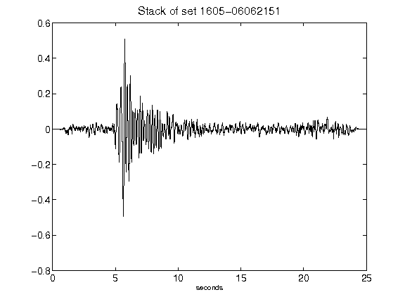](figures/1605-06062151_Stack.png)