# Repeating Earthquake Activity at RCM
[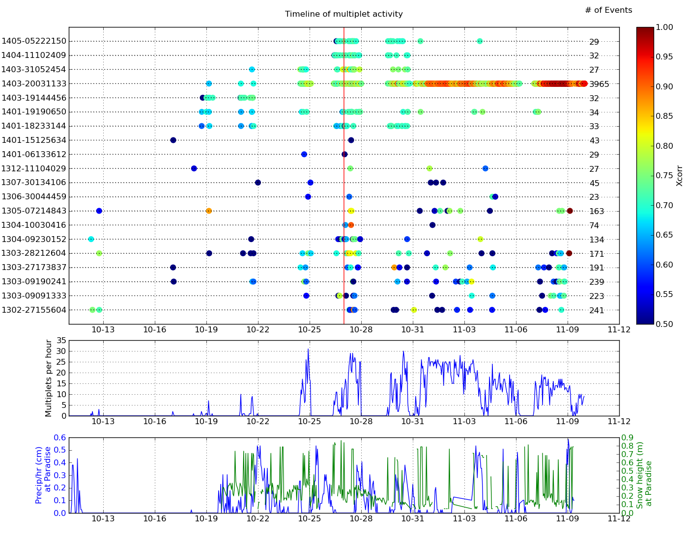](figures/multTimeline10py.png)

## Waveforms
[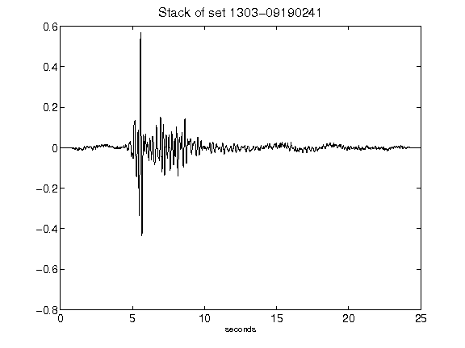](figures/1303-09190241_Stack.png)[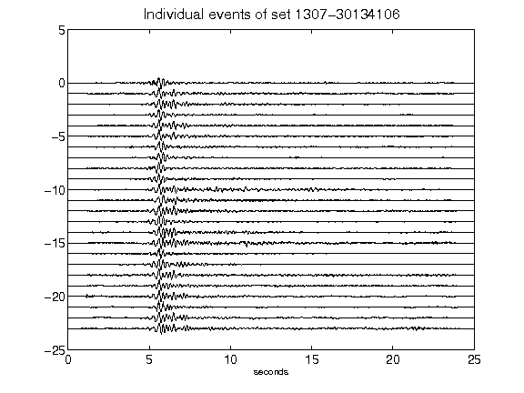](figures/1307-30134106_AllEv.png)[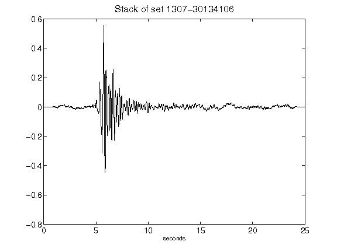](figures/1307-30134106_Stack.png)[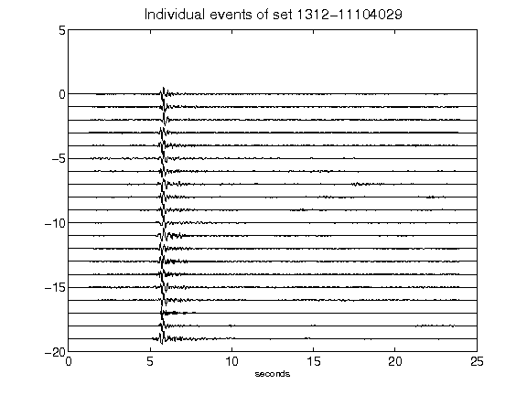](figures/1312-11104029_AllEv.png)[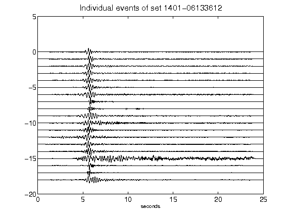](figures/1401-06133612_AllEv.png)[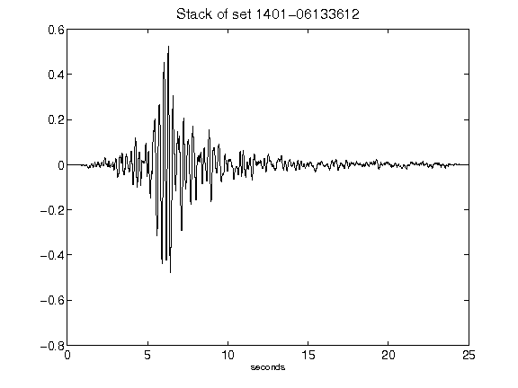](figures/1401-06133612_Stack.png)[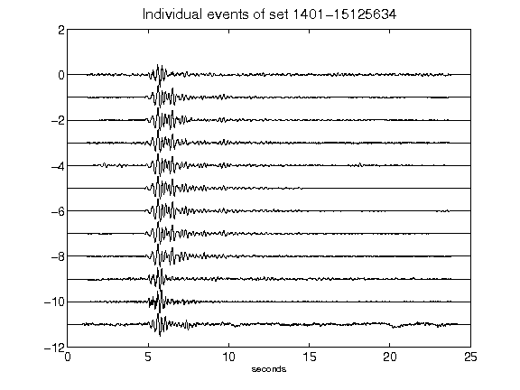](figures/1401-15125634_AllEv.png)[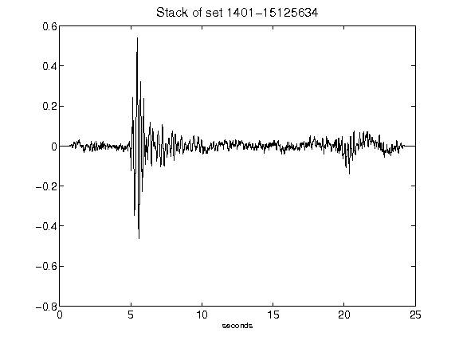](figures/1401-15125634_Stack.png)[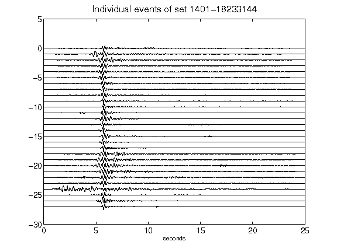](figures/1401-18233144_AllEv.png)[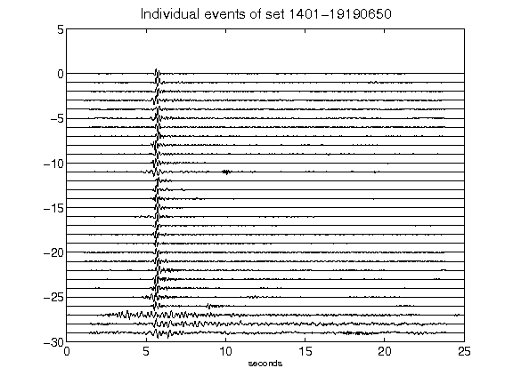](figures/1401-19190650_AllEv.png)[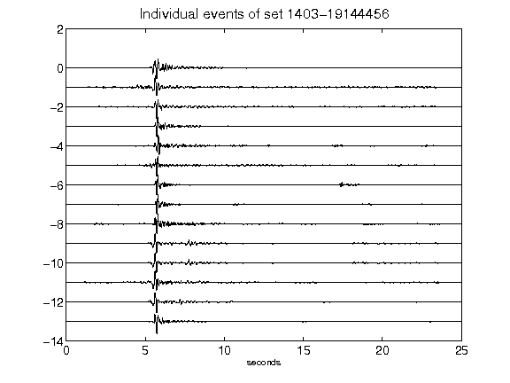](figures/1403-19144456_AllEv.png)[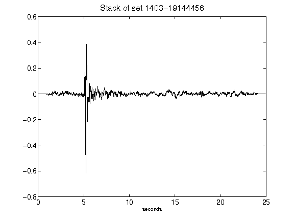](figures/1403-19144456_Stack.png)[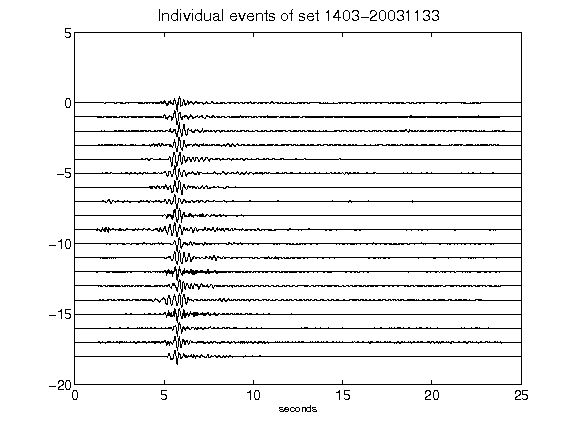](figures/1403-20031133_AllEv.png)[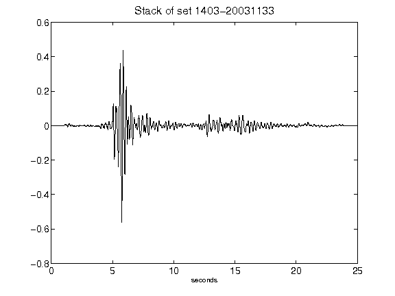](figures/1403-20031133_Stack.png)[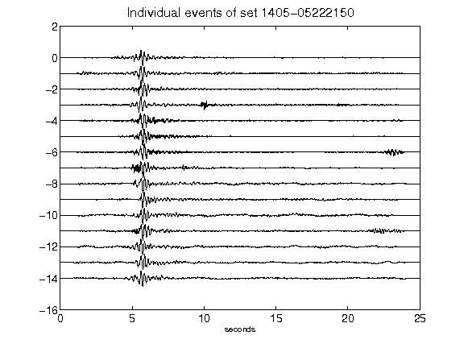](figures/1405-05222150_AllEv.png)[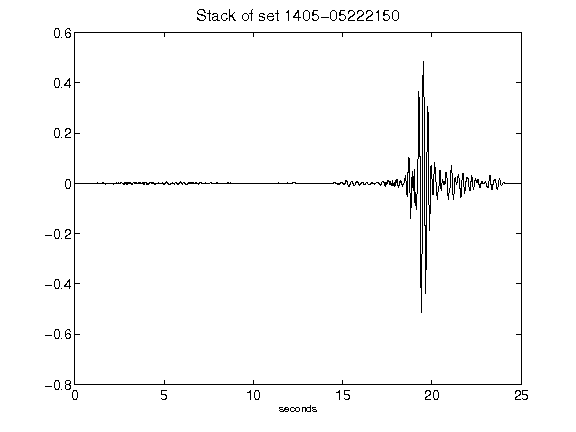](figures/1405-05222150_Stack.png)[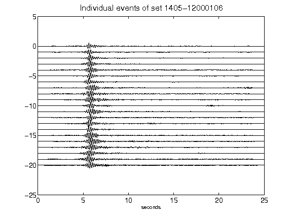](figures/1405-12000106_AllEv.png)[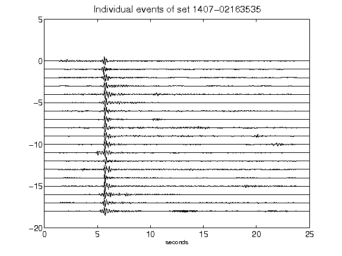](figures/1407-02163535_AllEv.png)[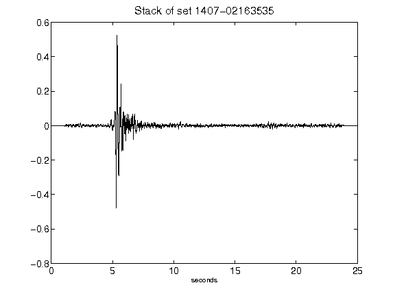](figures/1407-02163535_Stack.png)[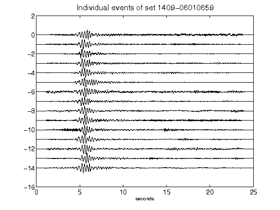](figures/1409-06010659_AllEv.png)[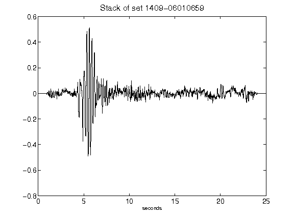](figures/1409-06010659_Stack.png)[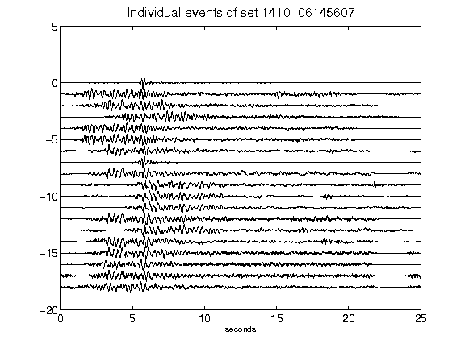](figures/1410-06145607_AllEv.png)[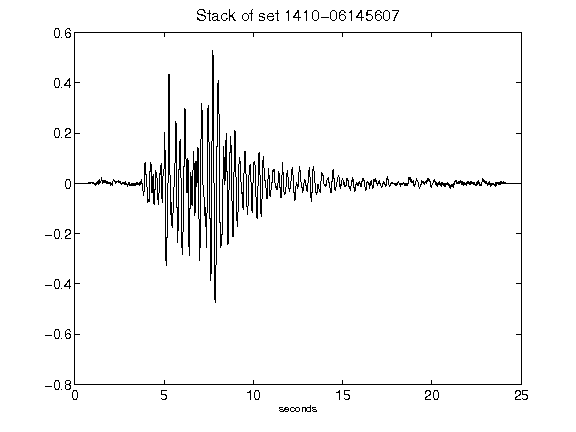](figures/1410-06145607_Stack.png)[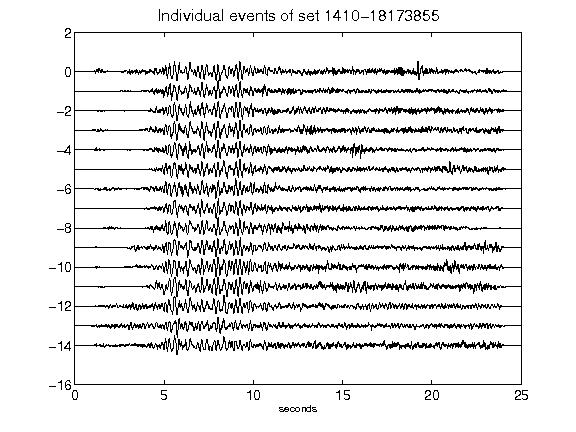](figures/1410-18173855_AllEv.png)[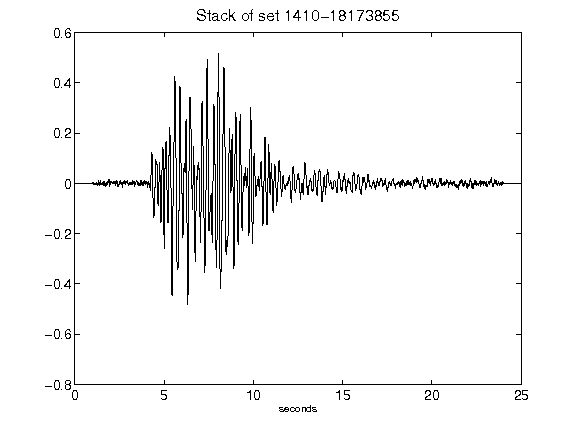](figures/1410-18173855_Stack.png)[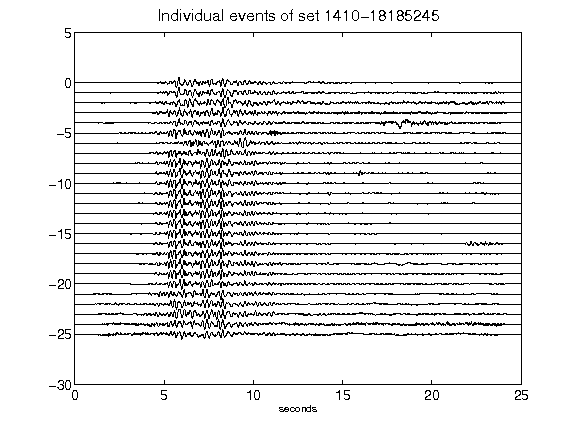](figures/1410-18185245_AllEv.png)[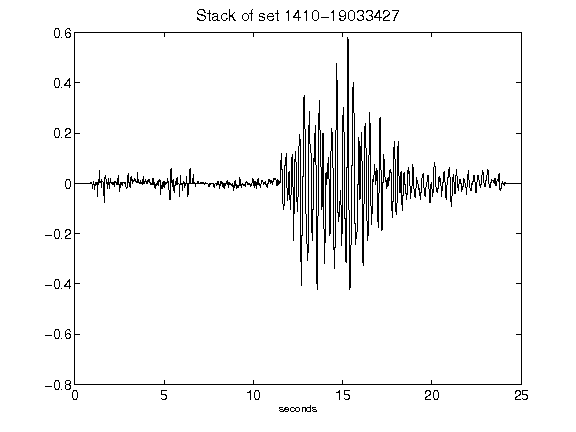](figures/1410-19033427_Stack.png)[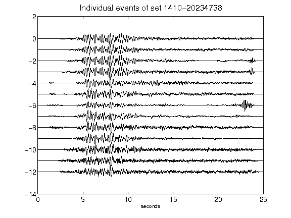](figures/1410-20234738_AllEv.png)[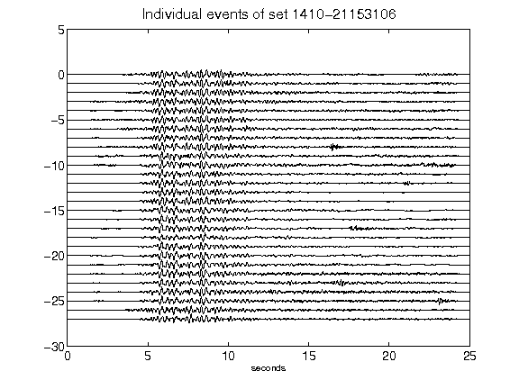](figures/1410-21153106_AllEv.png)[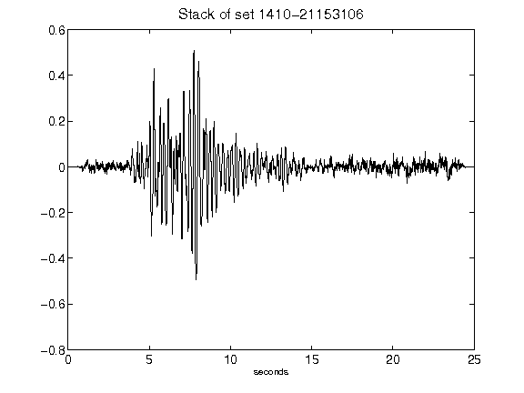](figures/1410-21153106_Stack.png)[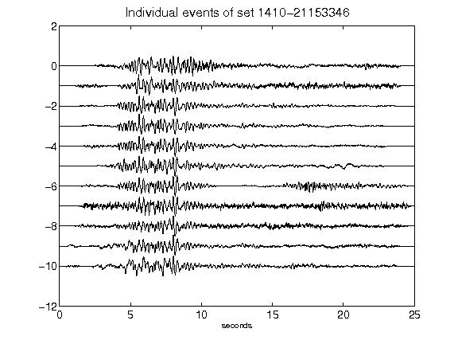](figures/1410-21153346_AllEv.png)[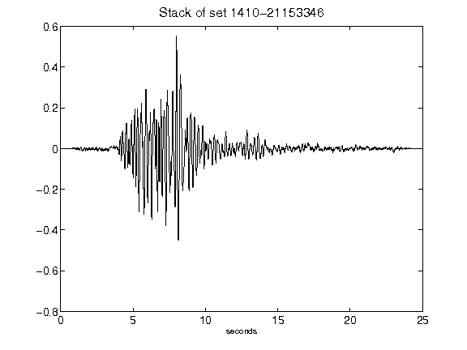](figures/1410-21153346_Stack.png)[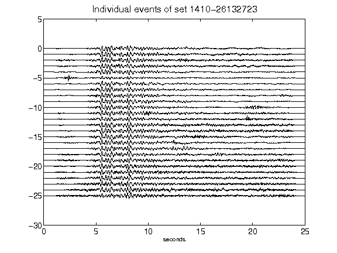](figures/1410-26132723_AllEv.png)