# Repeating Earthquake Activity at RCM

## Waveforms
[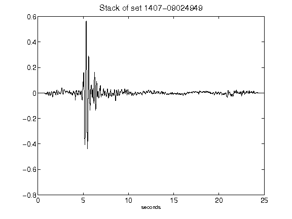](figures/1407-09024949_Stack.png)[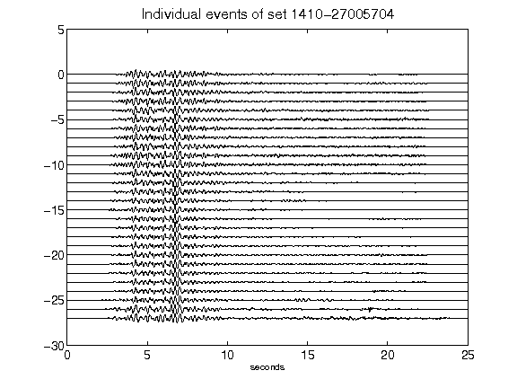](figures/1410-27005704_AllEv.png)[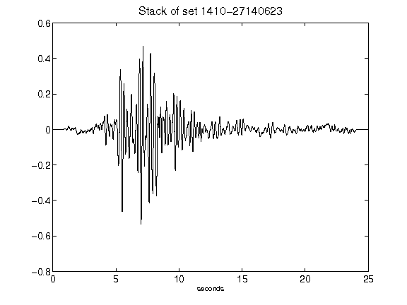](figures/1410-27140623_Stack.png)[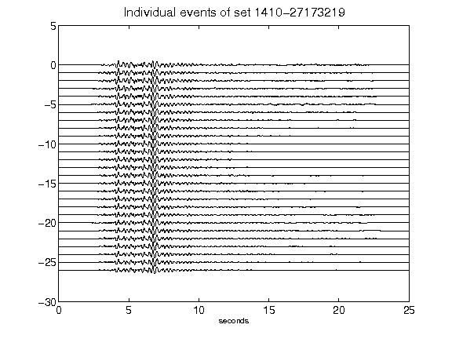](figures/1410-27173219_AllEv.png)[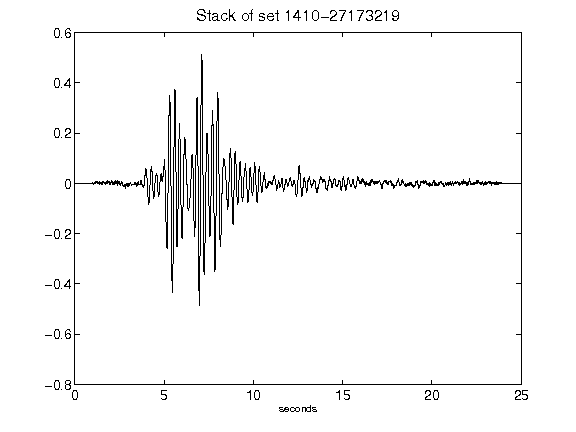](figures/1410-27173219_Stack.png)[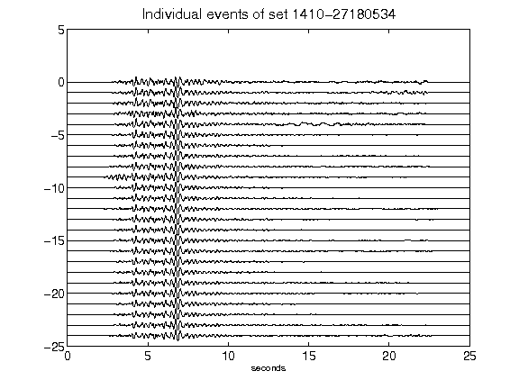](figures/1410-27180534_AllEv.png)[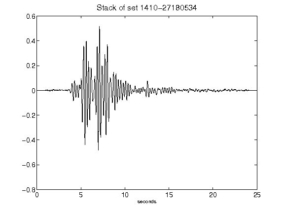](figures/1410-27180534_Stack.png)[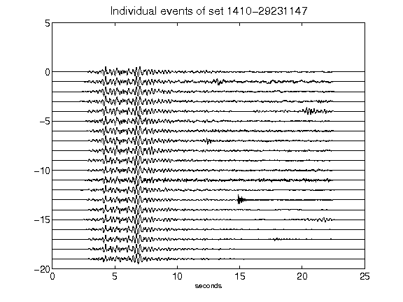](figures/1410-29231147_AllEv.png)[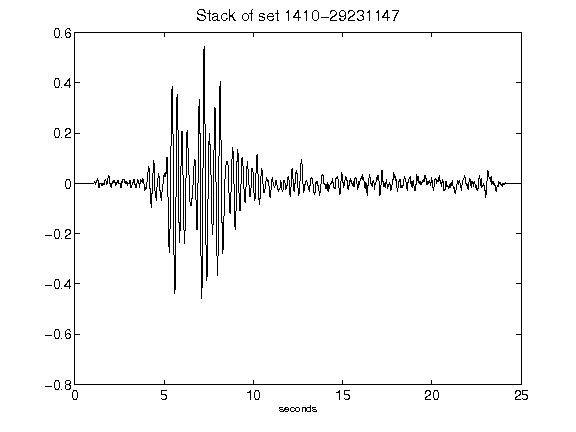](figures/1410-29231147_Stack.png)[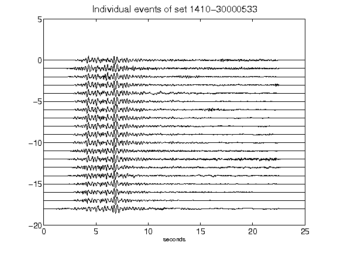](figures/1410-30000533_AllEv.png)[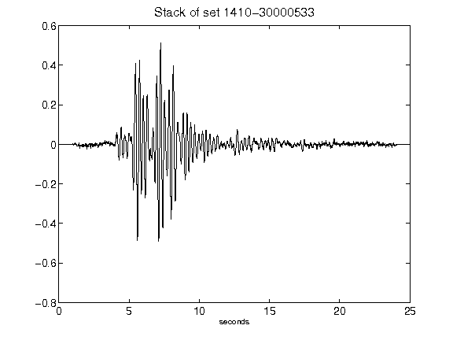](figures/1410-30000533_Stack.png)[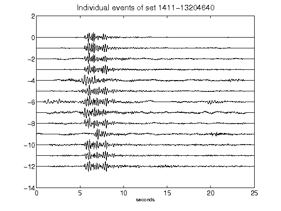](figures/1411-13204640_AllEv.png)[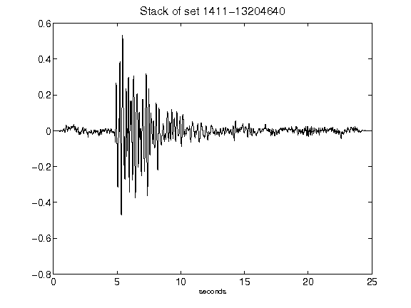](figures/1411-13204640_Stack.png)[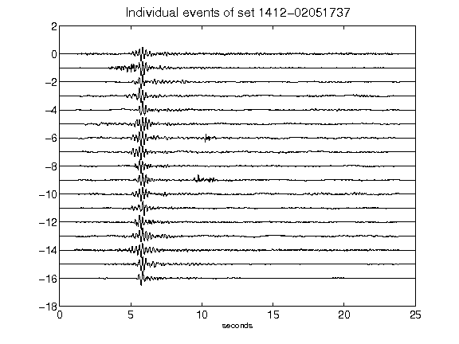](figures/1412-02051737_AllEv.png)[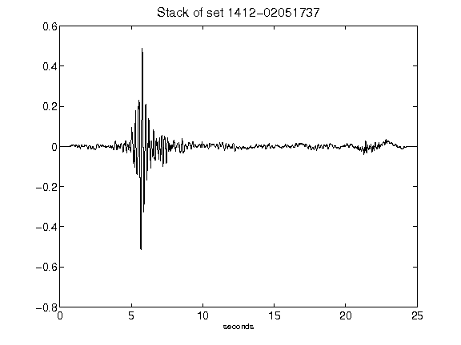](figures/1412-02051737_Stack.png)[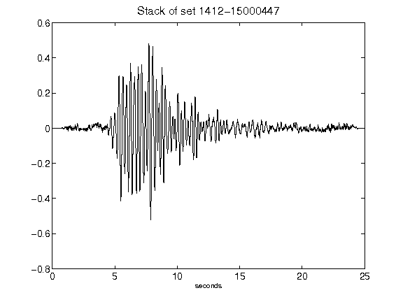](figures/1412-15000447_Stack.png)