# Repeating Earthquake Activity at RCM

## Waveforms
[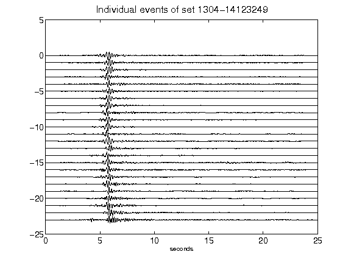](figures/1304-14123249_AllEv.png)[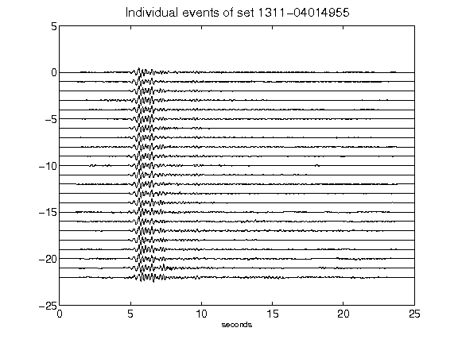](figures/1311-04014955_AllEv.png)[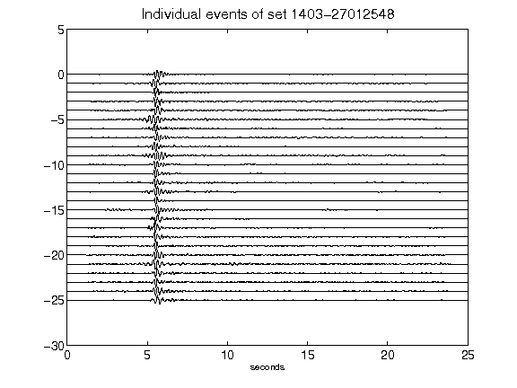](figures/1403-27012548_AllEv.png)[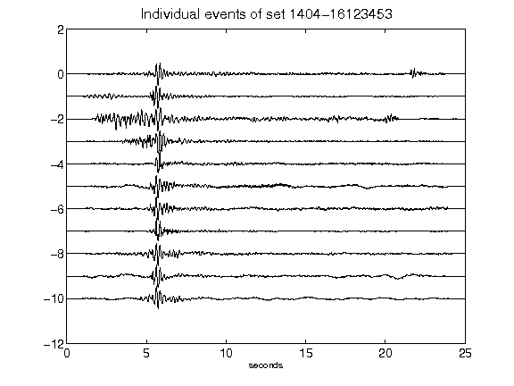](figures/1404-16123453_AllEv.png)[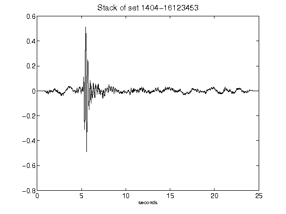](figures/1404-16123453_Stack.png)[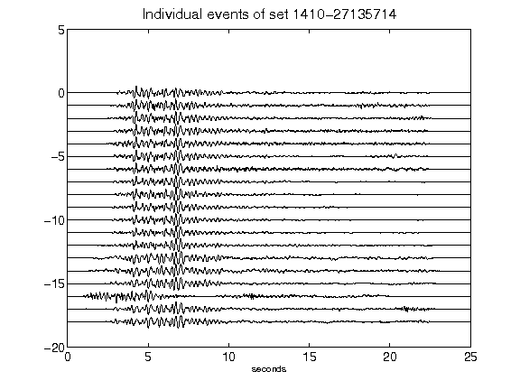](figures/1410-27135714_AllEv.png)[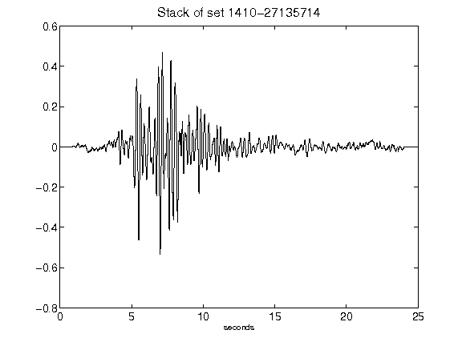](figures/1410-27135714_Stack.png)[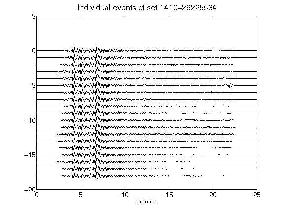](figures/1410-29225534_AllEv.png)[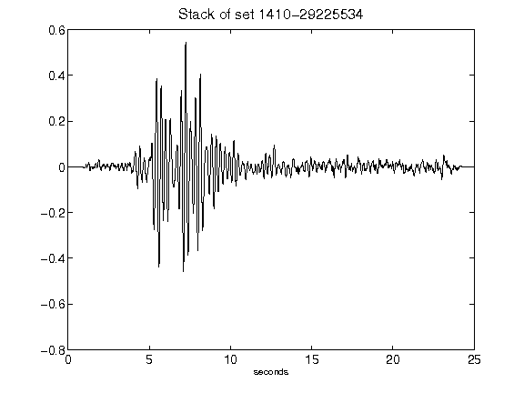](figures/1410-29225534_Stack.png)[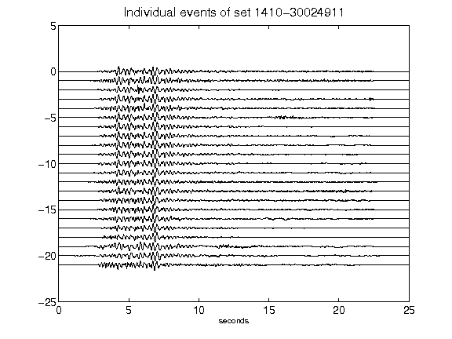](figures/1410-30024911_AllEv.png)[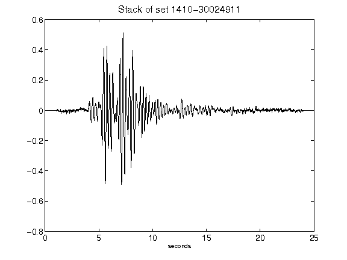](figures/1410-30024911_Stack.png)[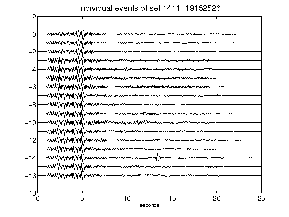](figures/1411-19152526_AllEv.png)[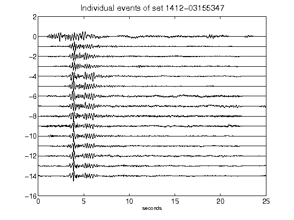](figures/1412-03155347_AllEv.png)[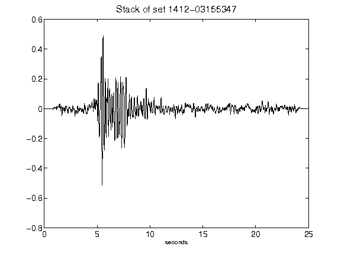](figures/1412-03155347_Stack.png)