# Repeating Earthquake Activity at RCM

## Waveforms
[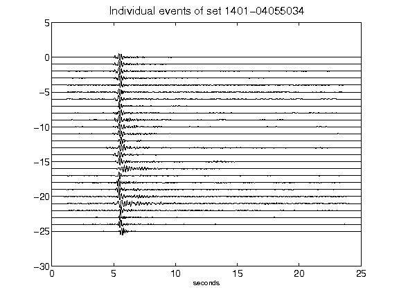](figures/1401-04055034_AllEv.png)[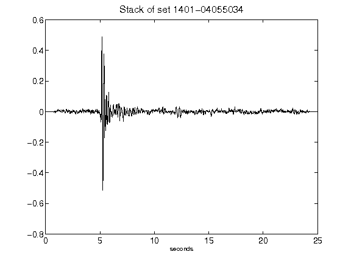](figures/1401-04055034_Stack.png)[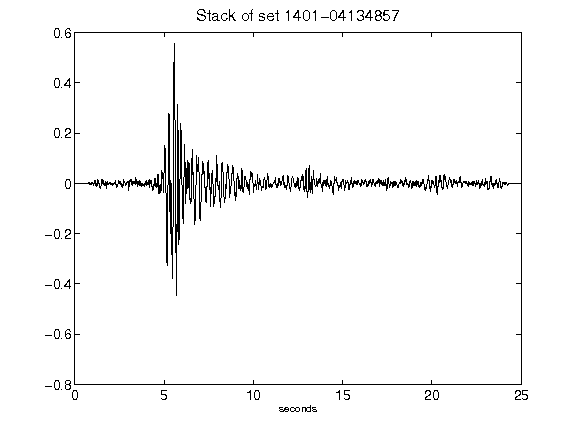](figures/1401-04134857_Stack.png)[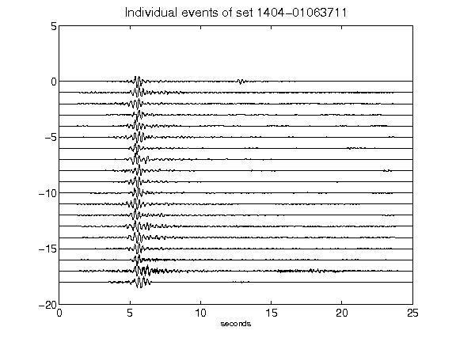](figures/1404-01063711_AllEv.png)[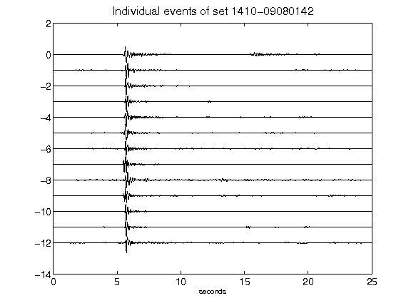](figures/1410-09080142_AllEv.png)[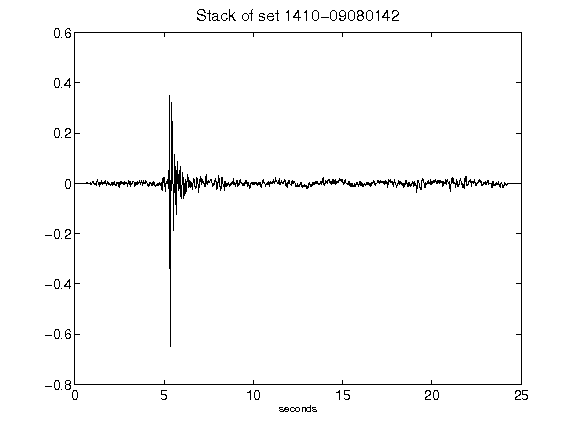](figures/1410-09080142_Stack.png)[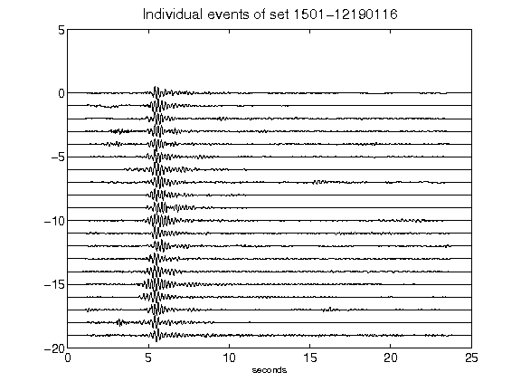](figures/1501-12190116_AllEv.png)[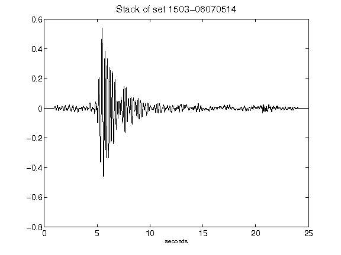](figures/1503-06070514_Stack.png)[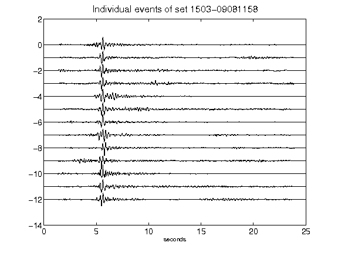](figures/1503-09081158_AllEv.png)[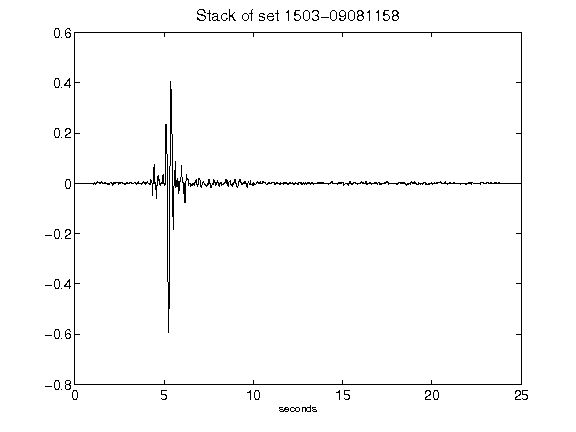](figures/1503-09081158_Stack.png)[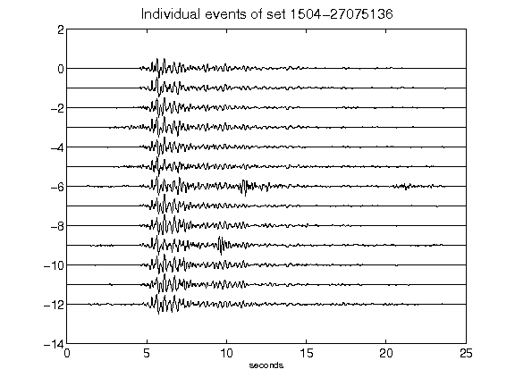](figures/1504-27075136_AllEv.png)[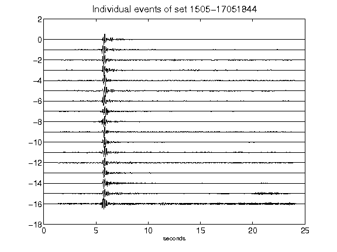](figures/1505-17051844_AllEv.png)