# Repeating Earthquake Activity at RCM

## Waveforms
[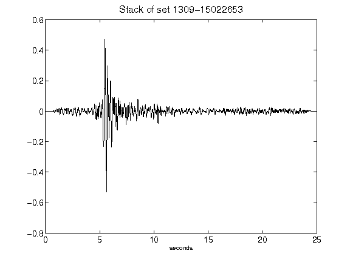](figures/1309-15022653_Stack.png)[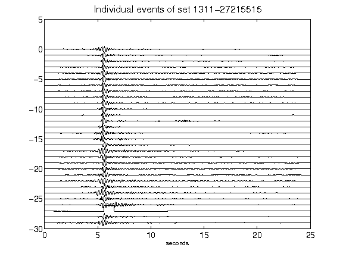](figures/1311-27215515_AllEv.png)[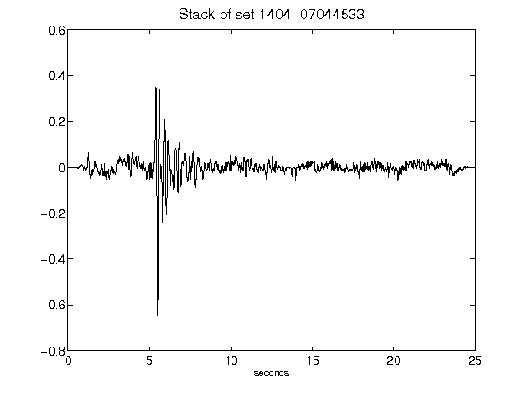](figures/1404-07044533_Stack.png)[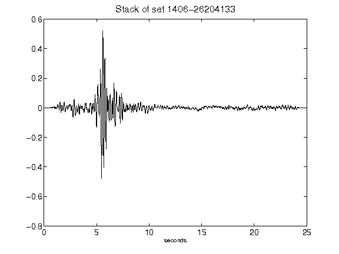](figures/1406-26204133_Stack.png)[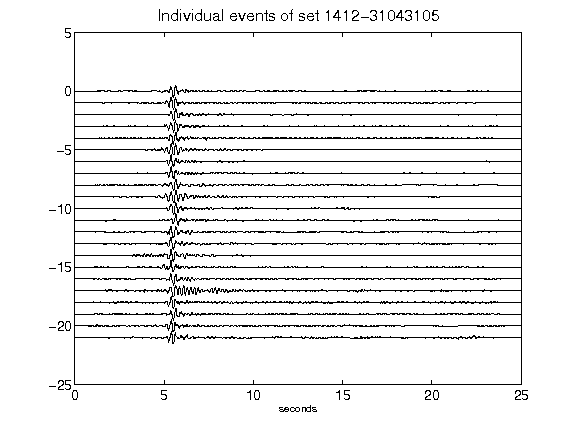](figures/1412-31043105_AllEv.png)[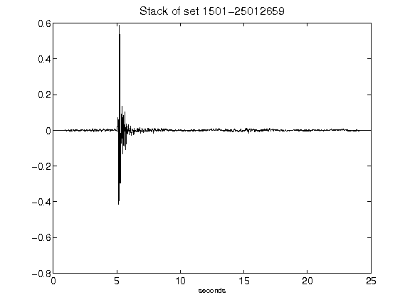](figures/1501-25012659_Stack.png)[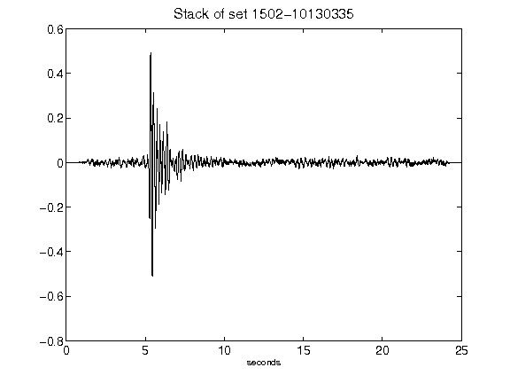](figures/1502-10130335_Stack.png)[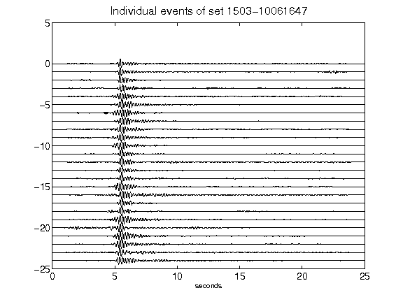](figures/1503-10061647_AllEv.png)[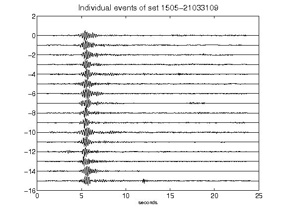](figures/1505-21033109_AllEv.png)[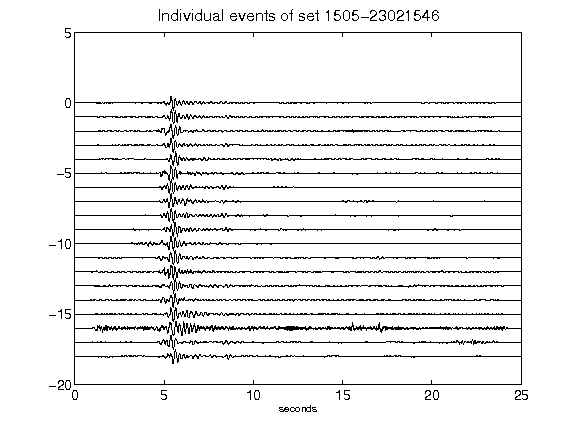](figures/1505-23021546_AllEv.png)[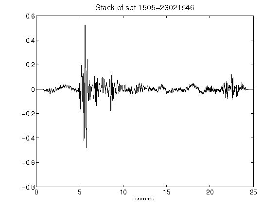](figures/1505-23021546_Stack.png)[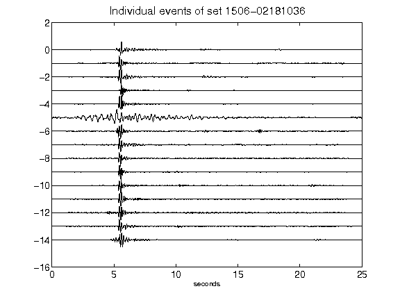](figures/1506-02181036_AllEv.png)[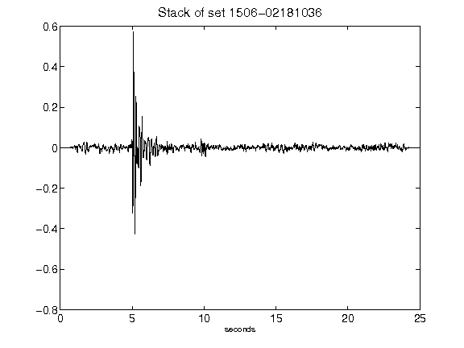](figures/1506-02181036_Stack.png)[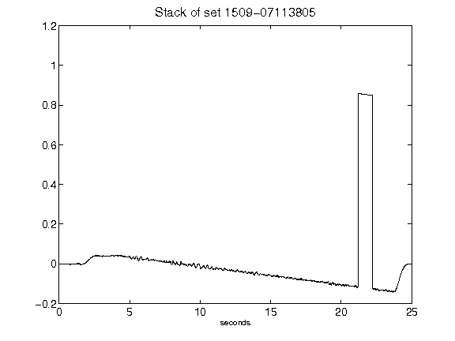](figures/1509-07113805_Stack.png)[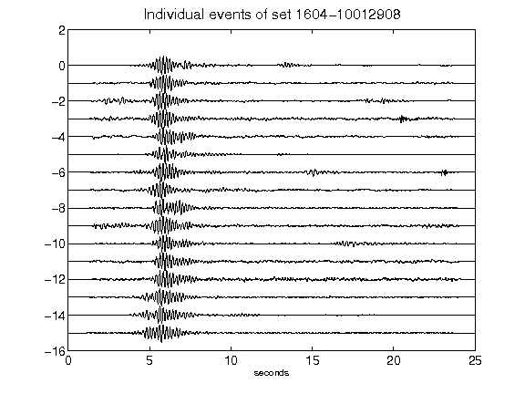](figures/1604-10012908_AllEv.png)[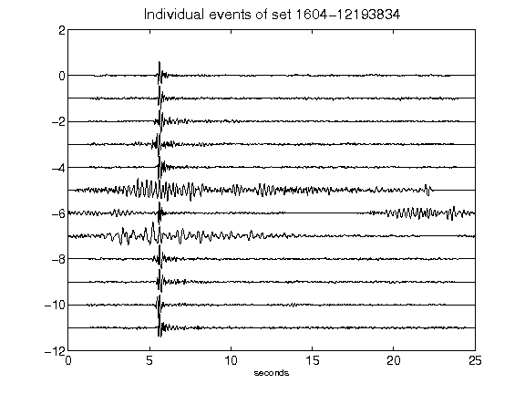](figures/1604-12193834_AllEv.png)[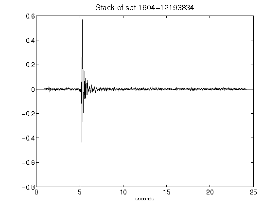](figures/1604-12193834_Stack.png)[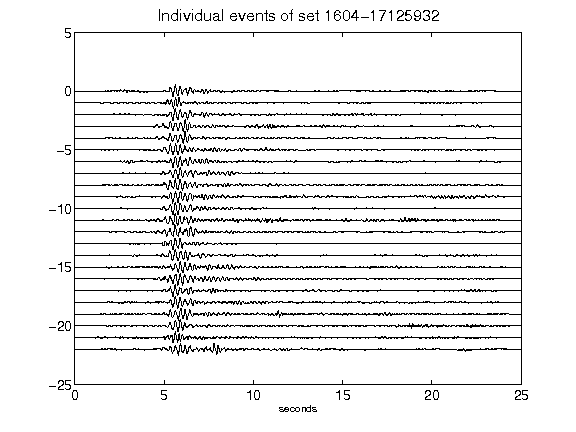](figures/1604-17125932_AllEv.png)[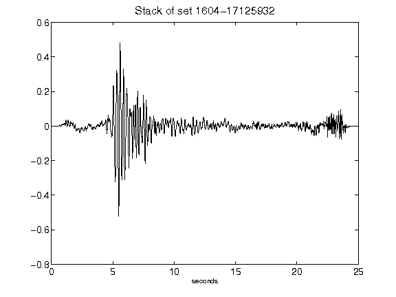](figures/1604-17125932_Stack.png)[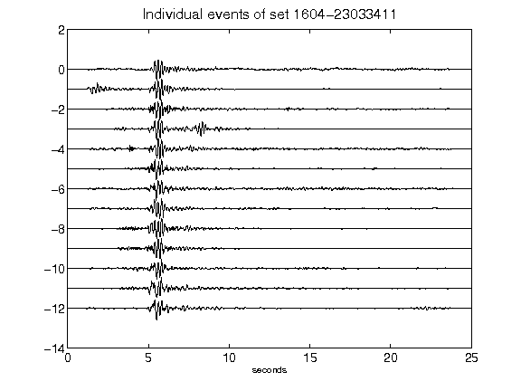](figures/1604-23033411_AllEv.png)[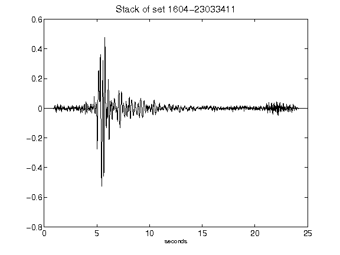](figures/1604-23033411_Stack.png)[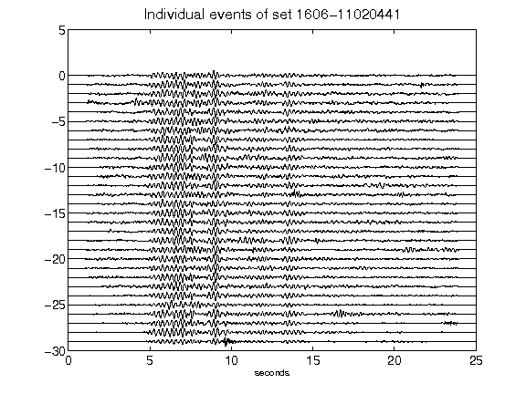](figures/1606-11020441_AllEv.png)[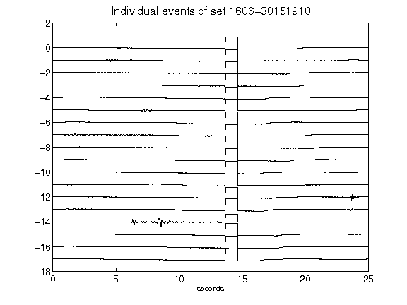](figures/1606-30151910_AllEv.png)