# Repeating Earthquake Activity at RCM

## Waveforms
[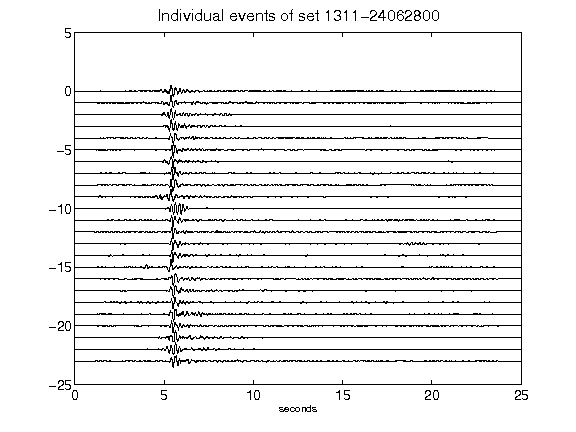](figures/1311-24062800_AllEv.png)[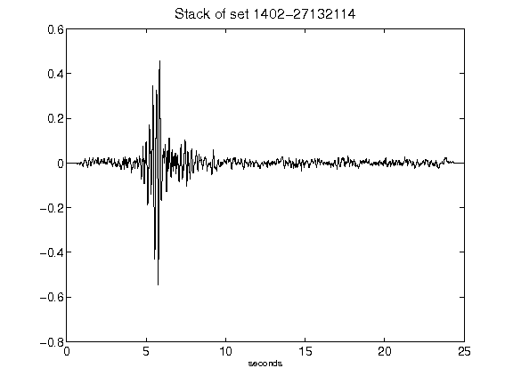](figures/1402-27132114_Stack.png)[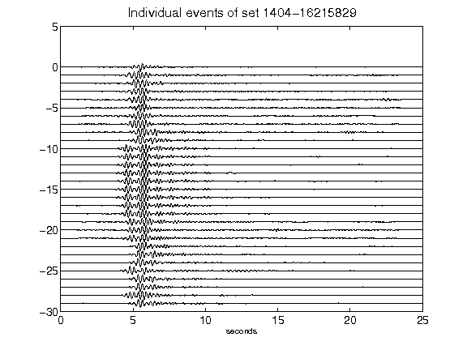](figures/1404-16215829_AllEv.png)[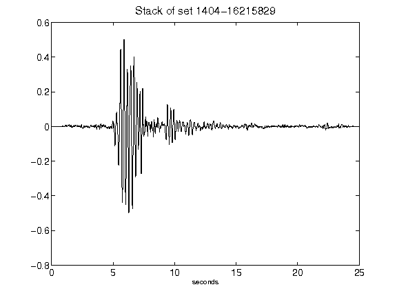](figures/1404-16215829_Stack.png)[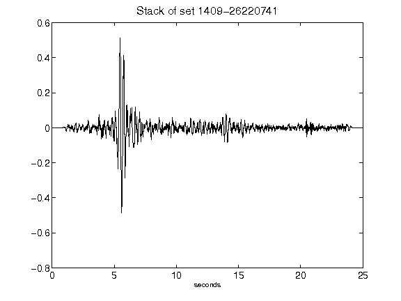](figures/1409-26220741_Stack.png)[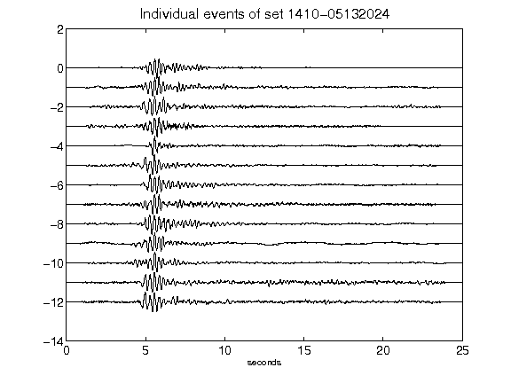](figures/1410-05132024_AllEv.png)[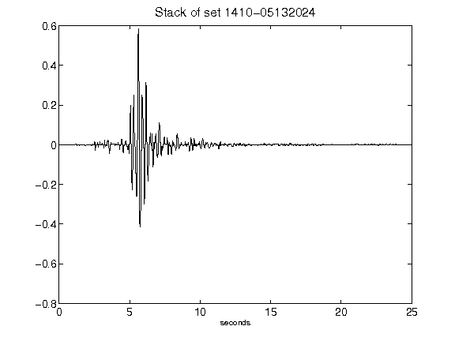](figures/1410-05132024_Stack.png)[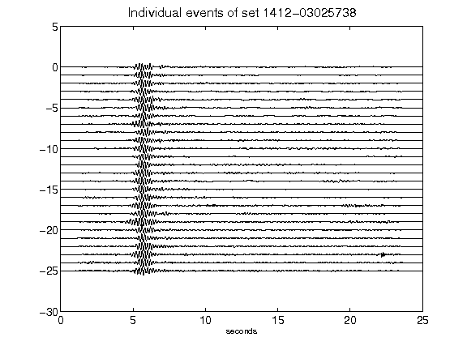](figures/1412-03025738_AllEv.png)[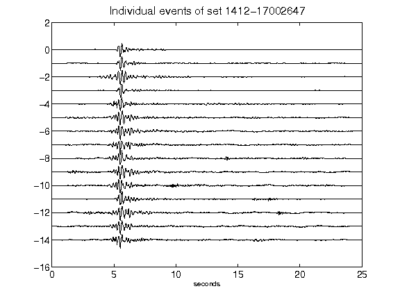](figures/1412-17002647_AllEv.png)[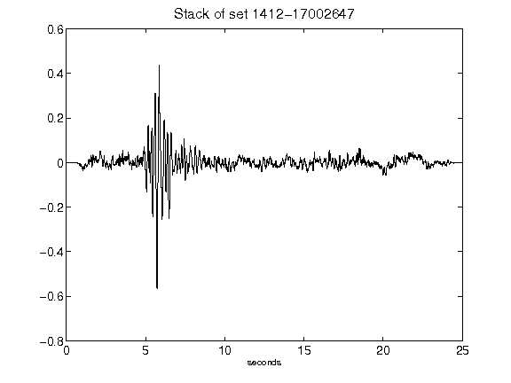](figures/1412-17002647_Stack.png)[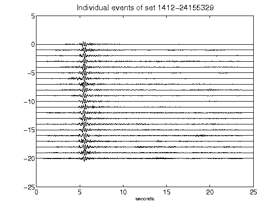](figures/1412-24155329_AllEv.png)[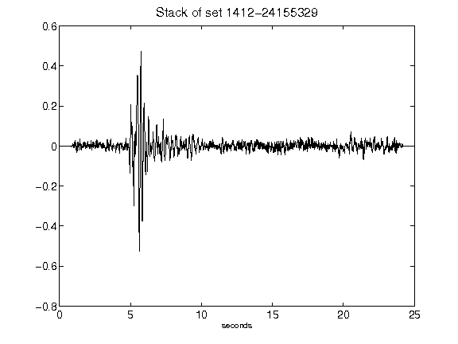](figures/1412-24155329_Stack.png)[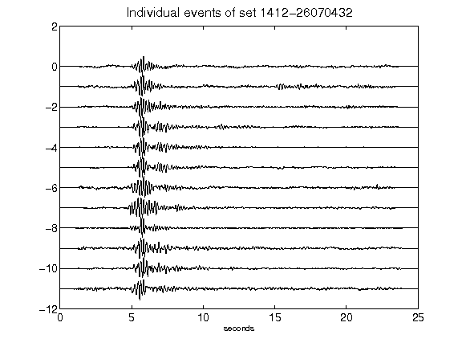](figures/1412-26070432_AllEv.png)[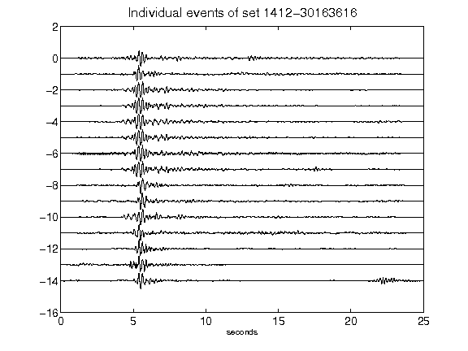](figures/1412-30163616_AllEv.png)[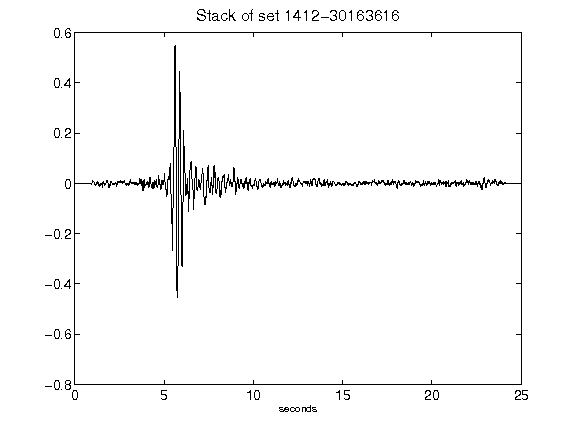](figures/1412-30163616_Stack.png)[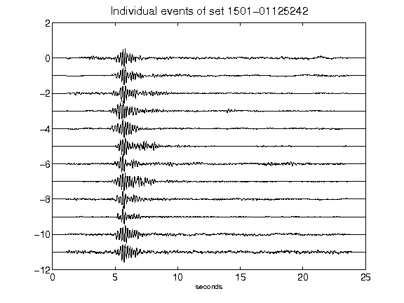](figures/1501-01125242_AllEv.png)[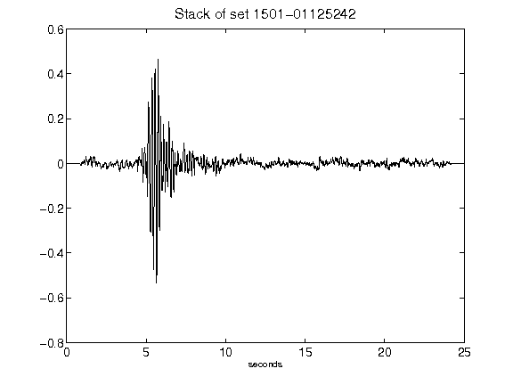](figures/1501-01125242_Stack.png)[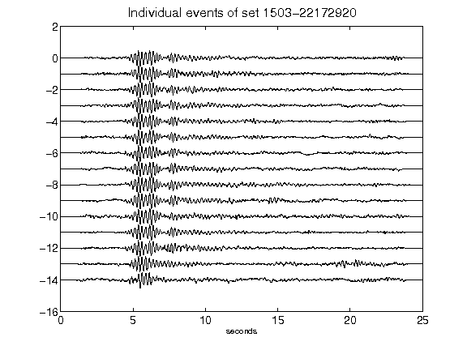](figures/1503-22172920_AllEv.png)[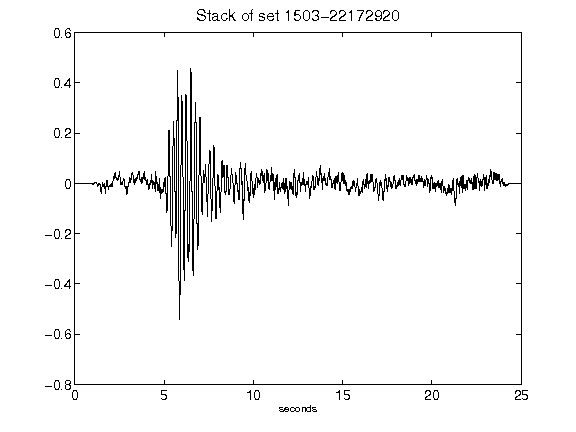](figures/1503-22172920_Stack.png)