# Repeating Earthquake Activity at RCM

## Waveforms
[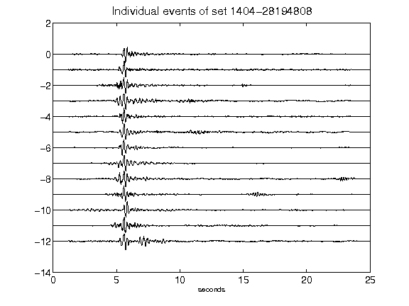](figures/1404-28194808_AllEv.png)[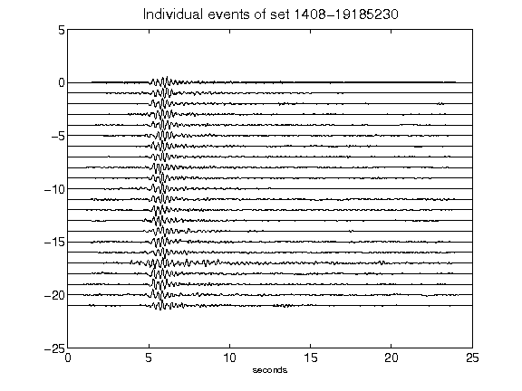](figures/1408-19185230_AllEv.png)[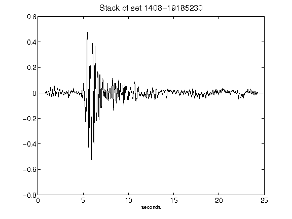](figures/1408-19185230_Stack.png)[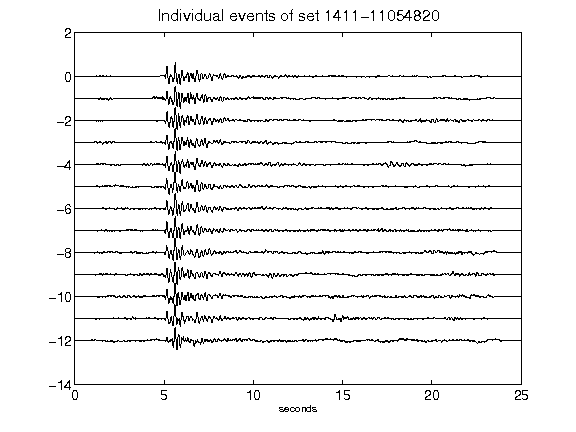](figures/1411-11054820_AllEv.png)[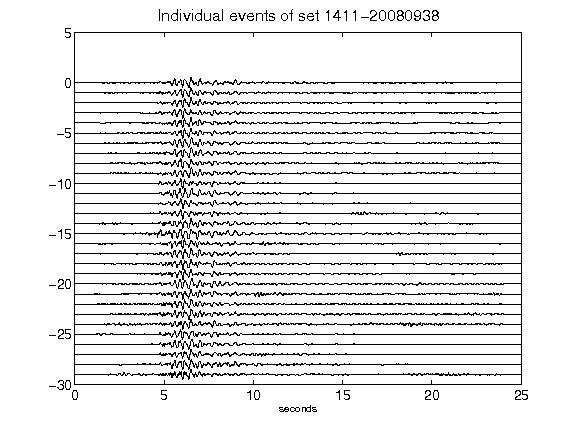](figures/1411-20080938_AllEv.png)[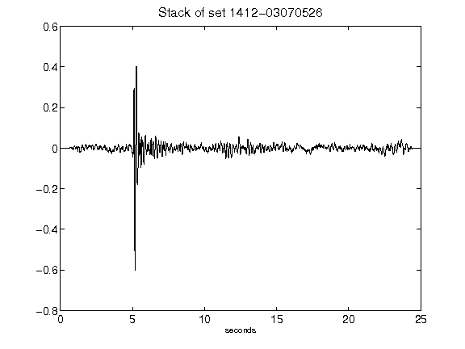](figures/1412-03070526_Stack.png)[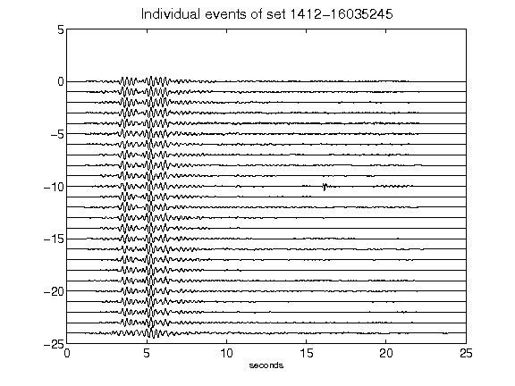](figures/1412-16035245_AllEv.png)[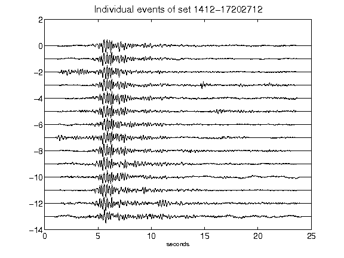](figures/1412-17202712_AllEv.png)[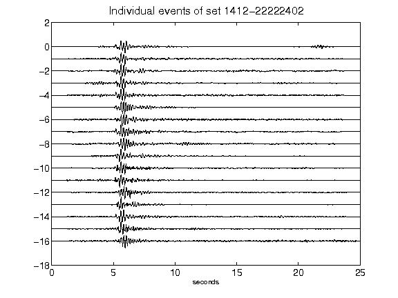](figures/1412-22222402_AllEv.png)[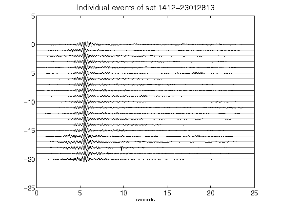](figures/1412-23012813_AllEv.png)[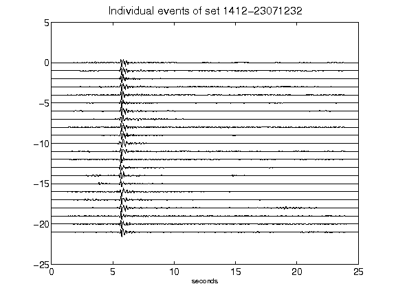](figures/1412-23071232_AllEv.png)[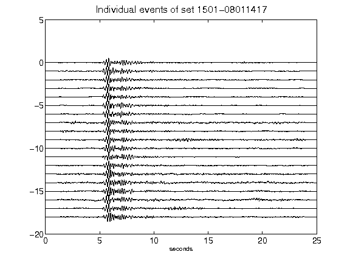](figures/1501-08011417_AllEv.png)[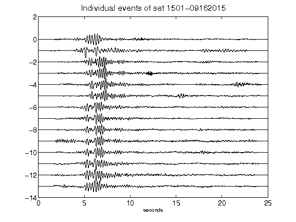](figures/1501-09162015_AllEv.png)[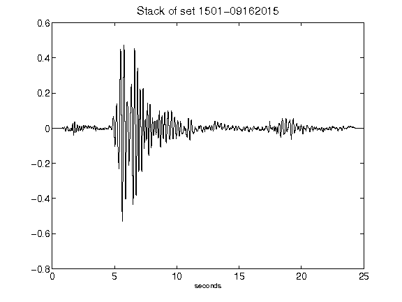](figures/1501-09162015_Stack.png)[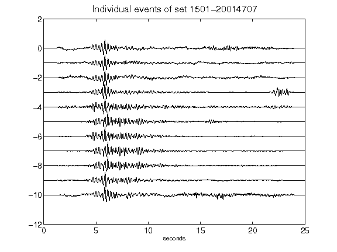](figures/1501-20014707_AllEv.png)[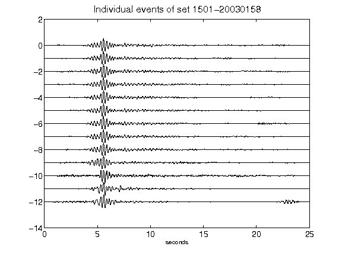](figures/1501-20030158_AllEv.png)[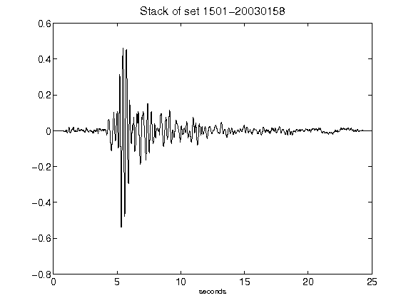](figures/1501-20030158_Stack.png)[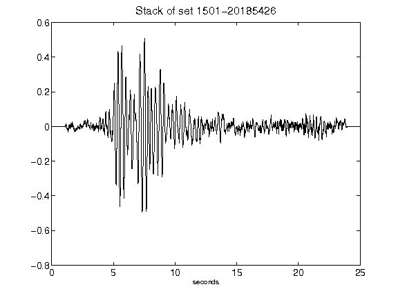](figures/1501-20185426_Stack.png)[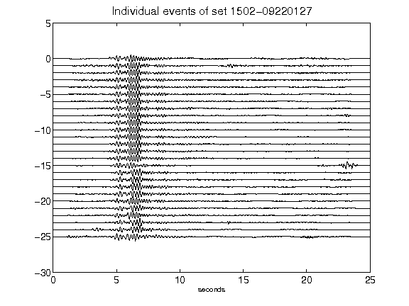](figures/1502-09220127_AllEv.png)[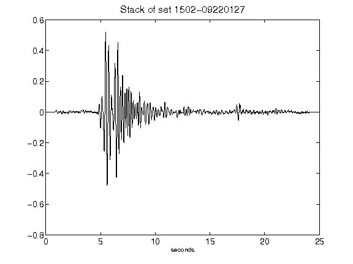](figures/1502-09220127_Stack.png)[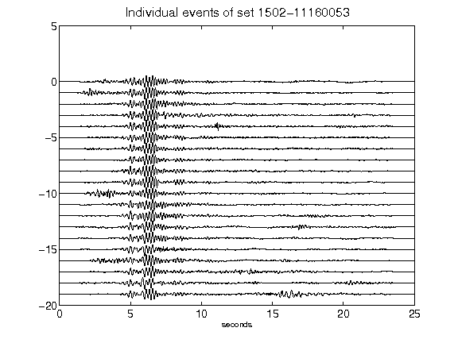](figures/1502-11160053_AllEv.png)[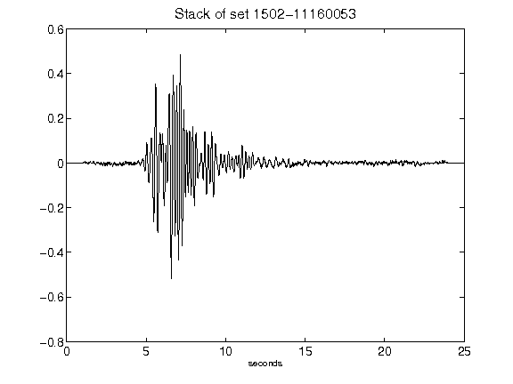](figures/1502-11160053_Stack.png)