# Repeating Earthquake Activity at RCM
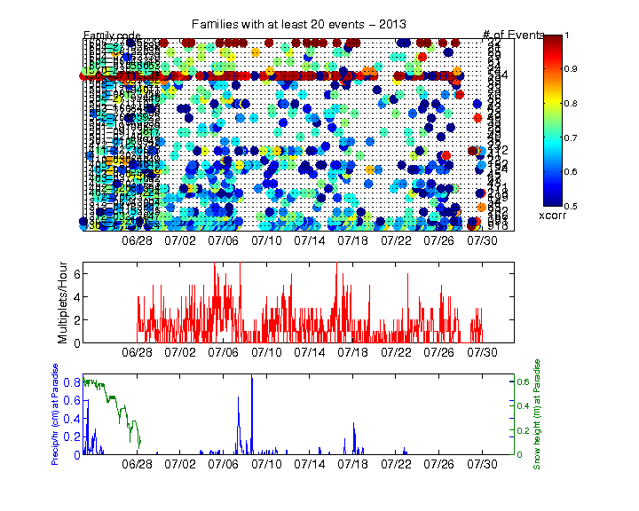  
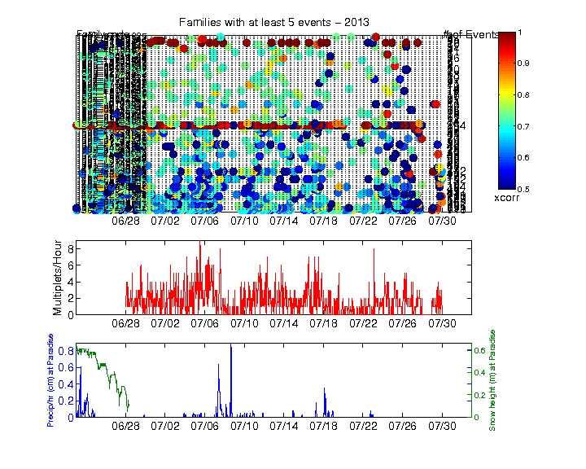  

## Waveforms
[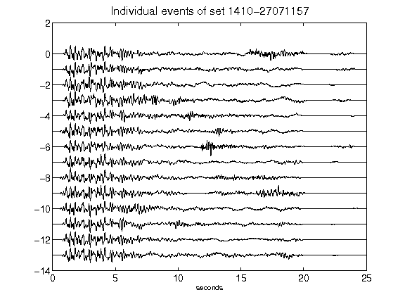](figures/1410-27071157_AllEv.png)[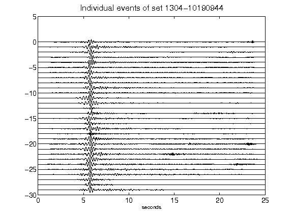](figures/1304-10190944_AllEv.png)[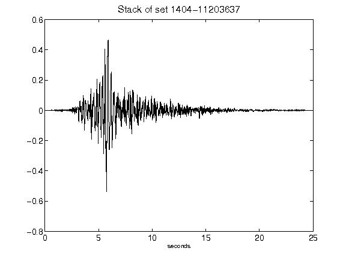](figures/1404-11203637_Stack.png)[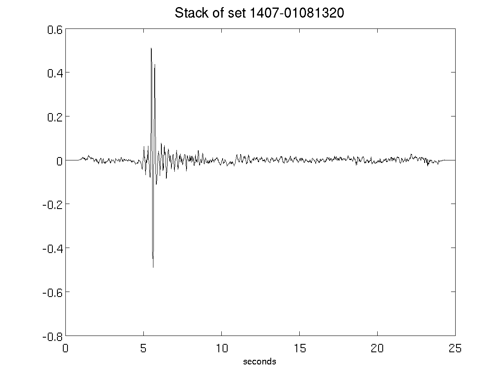](figures/1407-01081320_Stack.png)[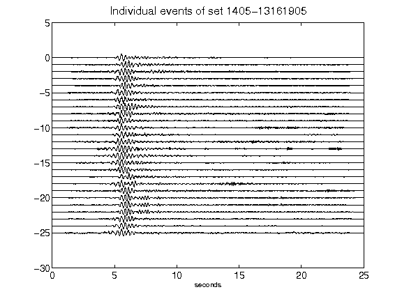](figures/1405-13161905_AllEv.png)[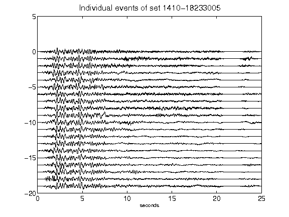](figures/1410-18233005_AllEv.png)[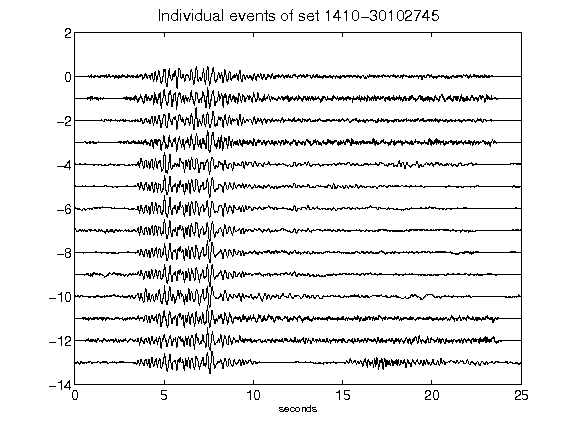](figures/1410-30102745_AllEv.png)[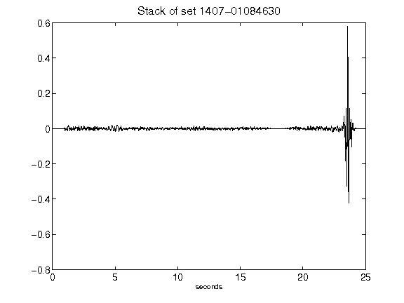](figures/1407-01084630_Stack.png)[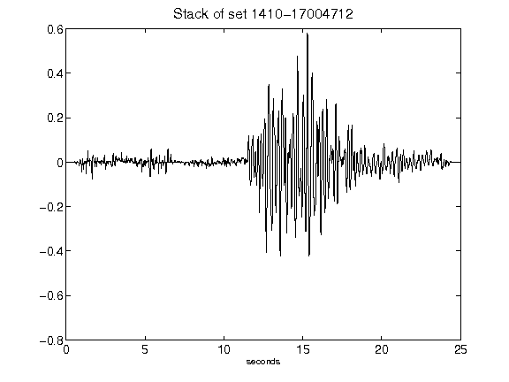](figures/1410-17004712_Stack.png)[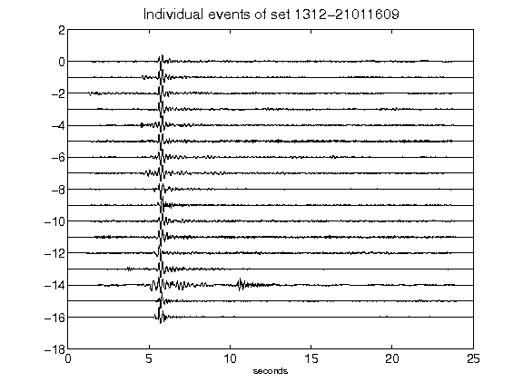](figures/1312-21011609_AllEv.png)[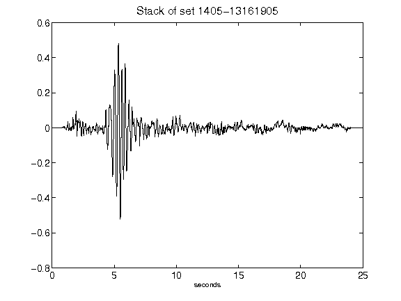](figures/1405-13161905_Stack.png)[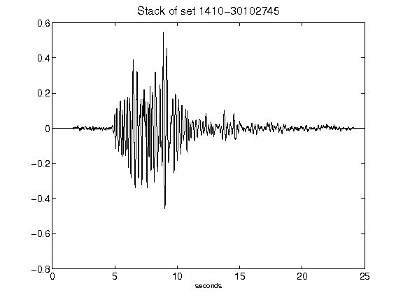](figures/1410-30102745_Stack.png)[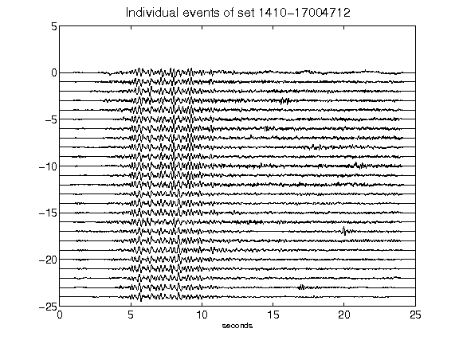](figures/1410-17004712_AllEv.png)[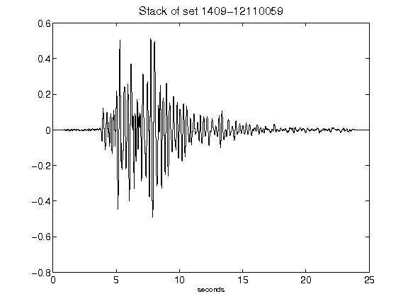](figures/1409-12110059_Stack.png)[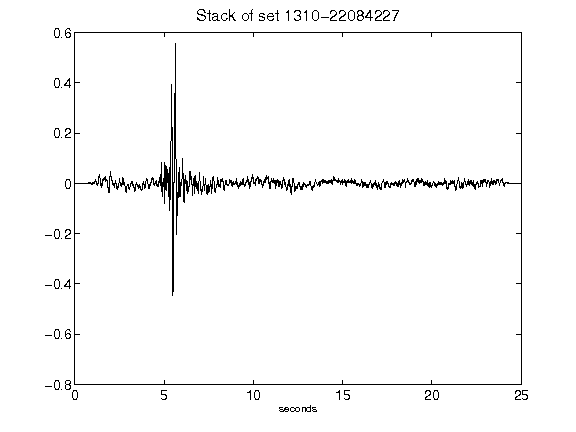](figures/1310-22084227_Stack.png)[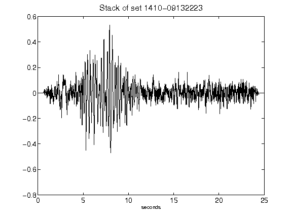](figures/1410-09132223_Stack.png)[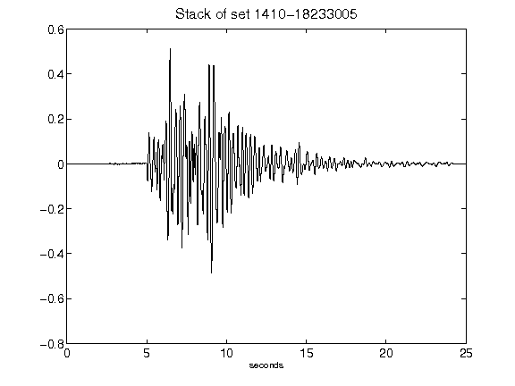](figures/1410-18233005_Stack.png)[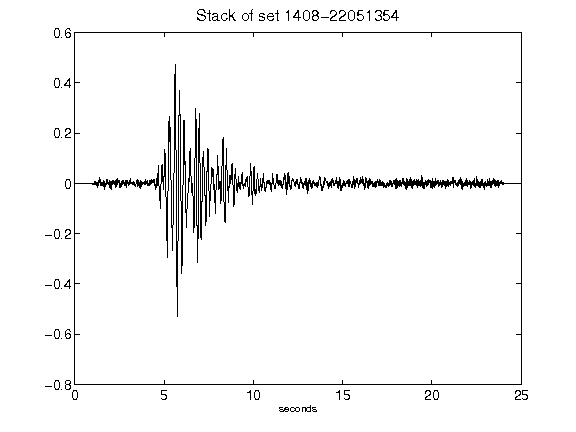](figures/1408-22051354_Stack.png)[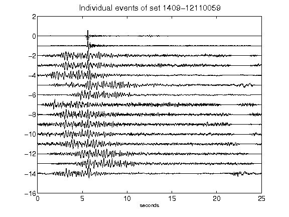](figures/1409-12110059_AllEv.png)[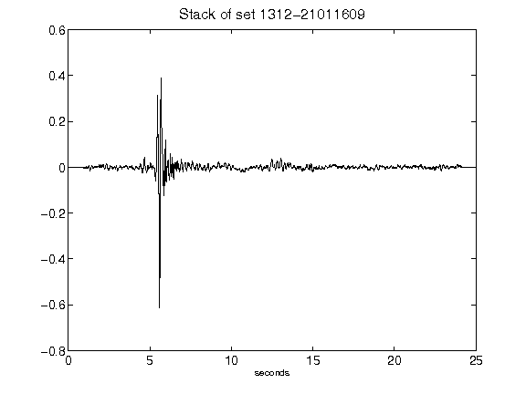](figures/1312-21011609_Stack.png)[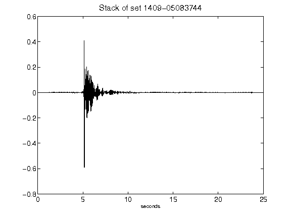](figures/1409-05083744_Stack.png)[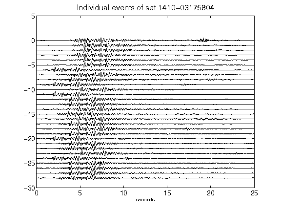](figures/1410-03175804_AllEv.png)[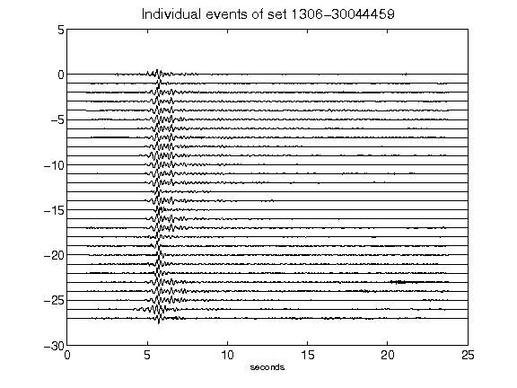](figures/1306-30044459_AllEv.png)