# Repeating Earthquake Activity at RCM

## Waveforms
[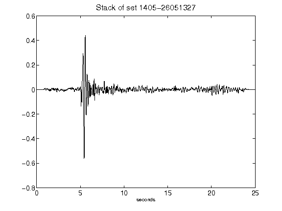](figures/1405-26051327_Stack.png)[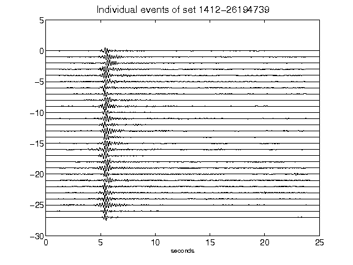](figures/1412-26194739_AllEv.png)[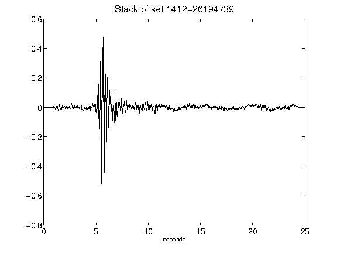](figures/1412-26194739_Stack.png)[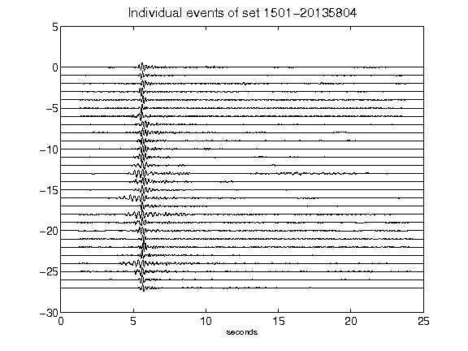](figures/1501-20135804_AllEv.png)[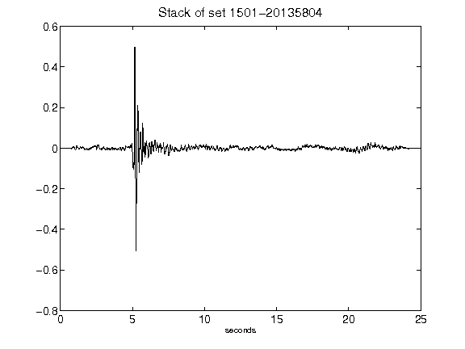](figures/1501-20135804_Stack.png)[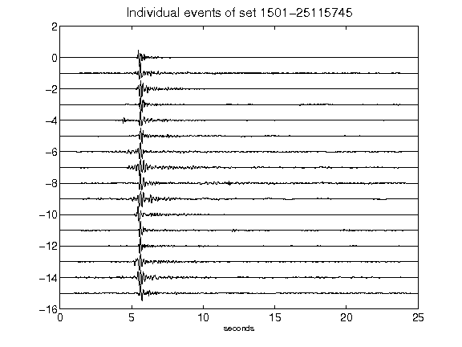](figures/1501-25115745_AllEv.png)[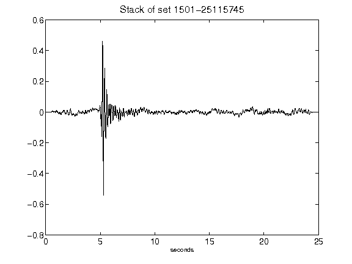](figures/1501-25115745_Stack.png)[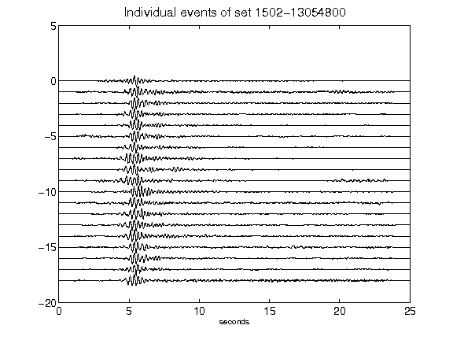](figures/1502-13054800_AllEv.png)[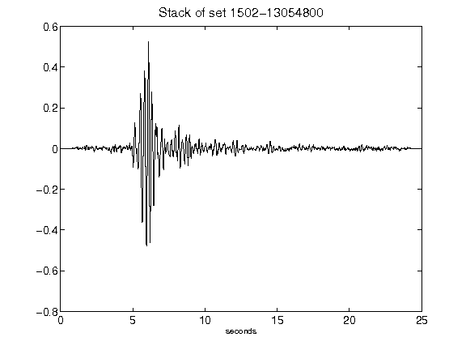](figures/1502-13054800_Stack.png)[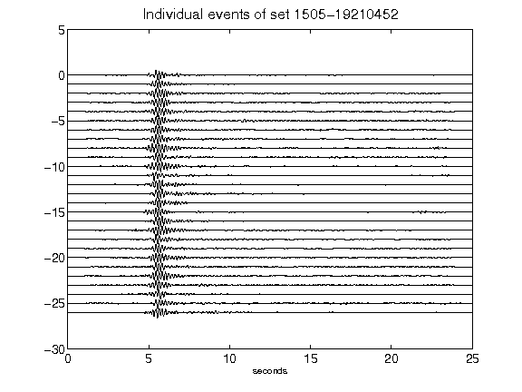](figures/1505-19210452_AllEv.png)[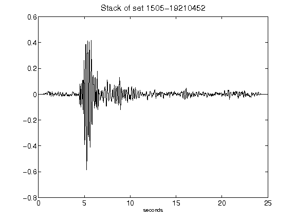](figures/1505-19210452_Stack.png)[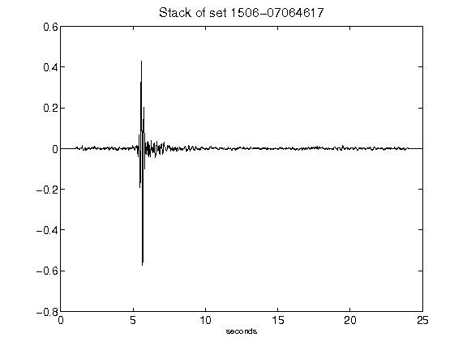](figures/1506-07064617_Stack.png)[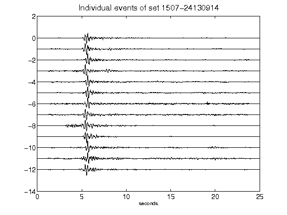](figures/1507-24130914_AllEv.png)[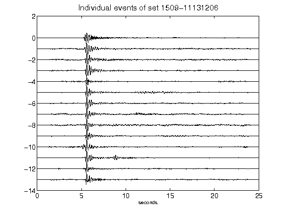](figures/1509-11131206_AllEv.png)[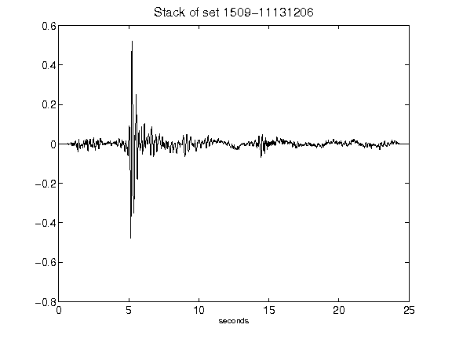](figures/1509-11131206_Stack.png)[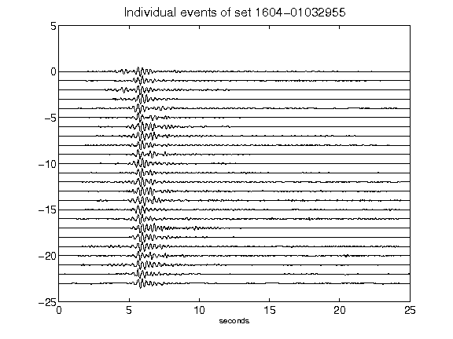](figures/1604-01032955_AllEv.png)[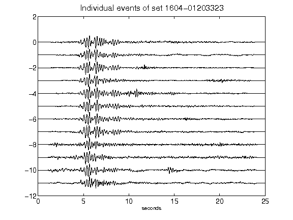](figures/1604-01203323_AllEv.png)[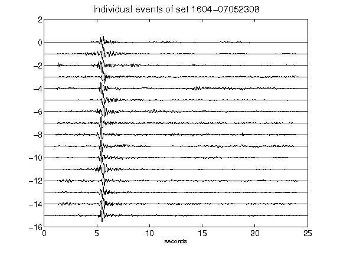](figures/1604-07052308_AllEv.png)[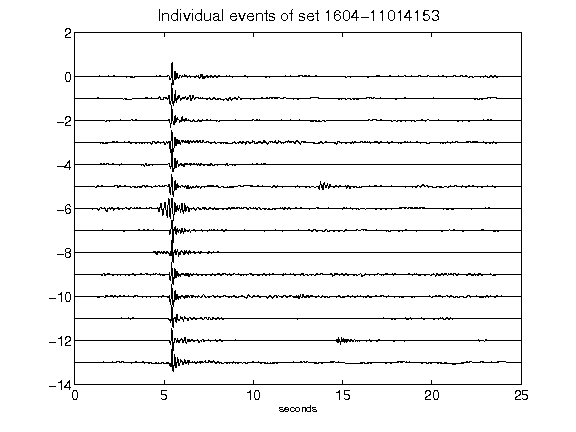](figures/1604-11014153_AllEv.png)[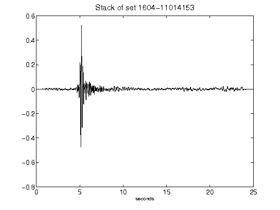](figures/1604-11014153_Stack.png)