# Repeating Earthquake Activity at RCM

## Waveforms
[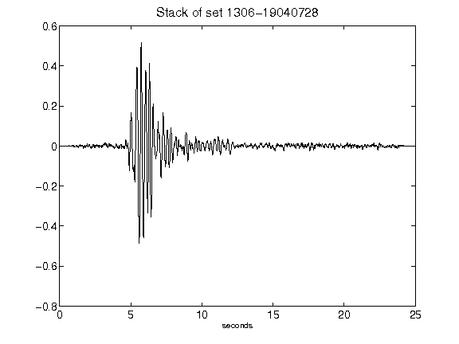](figures/1306-19040728_Stack.png)[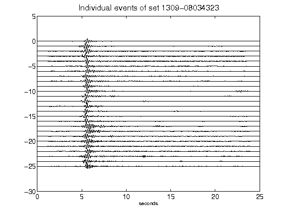](figures/1309-08034323_AllEv.png)[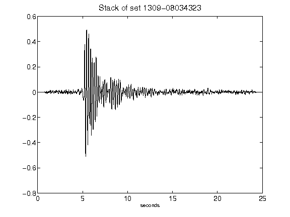](figures/1309-08034323_Stack.png)[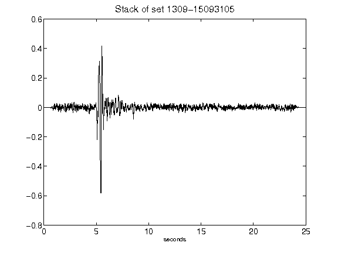](figures/1309-15093105_Stack.png)[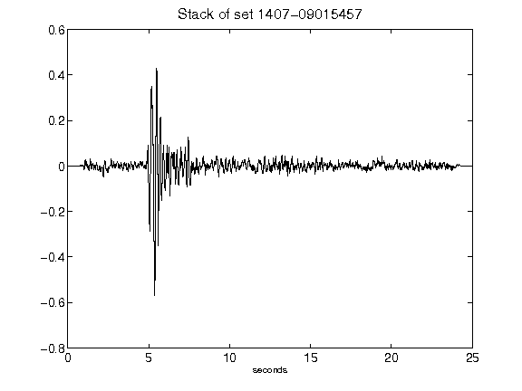](figures/1407-09015457_Stack.png)[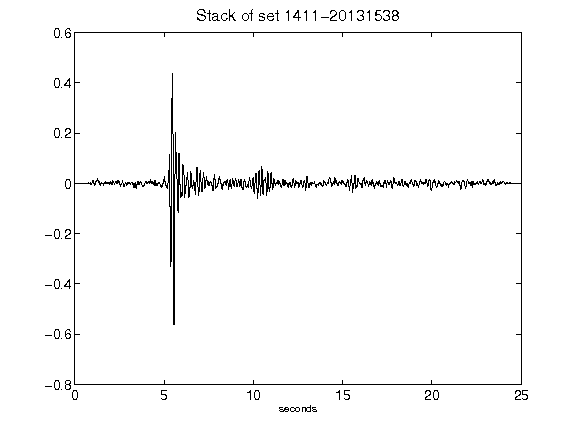](figures/1411-20131538_Stack.png)[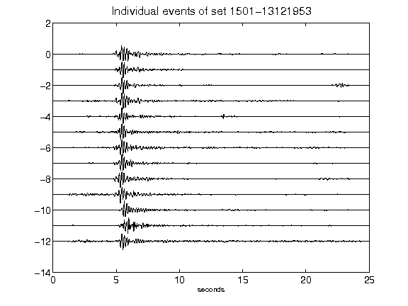](figures/1501-13121953_AllEv.png)[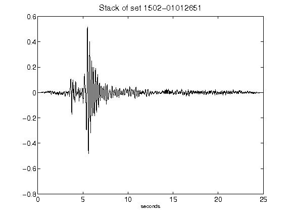](figures/1502-01012651_Stack.png)[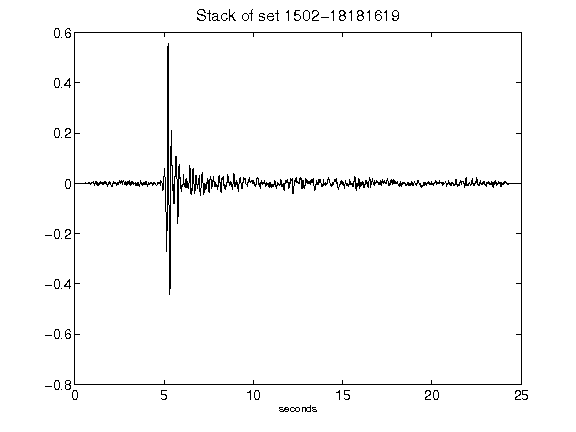](figures/1502-18181619_Stack.png)[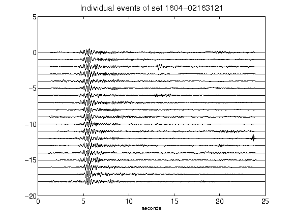](figures/1604-02163121_AllEv.png)[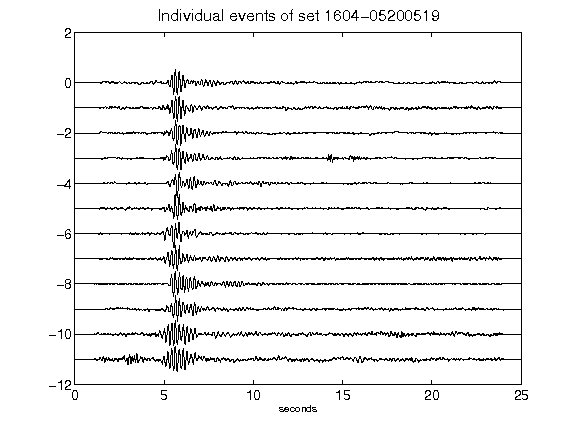](figures/1604-05200519_AllEv.png)[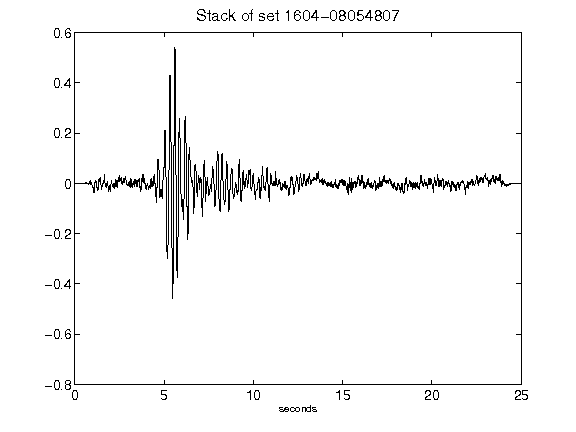](figures/1604-08054807_Stack.png)[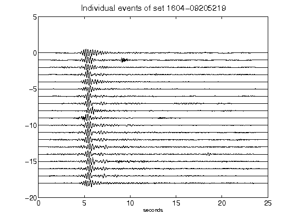](figures/1604-09205219_AllEv.png)[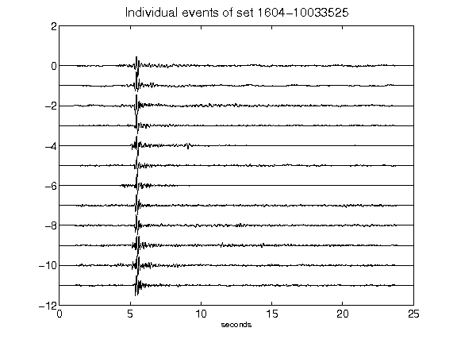](figures/1604-10033525_AllEv.png)[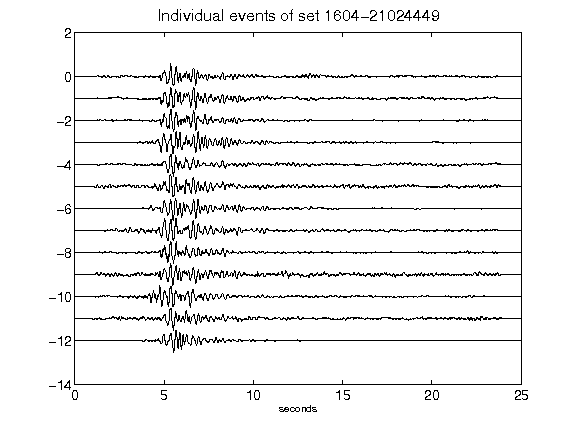](figures/1604-21024449_AllEv.png)[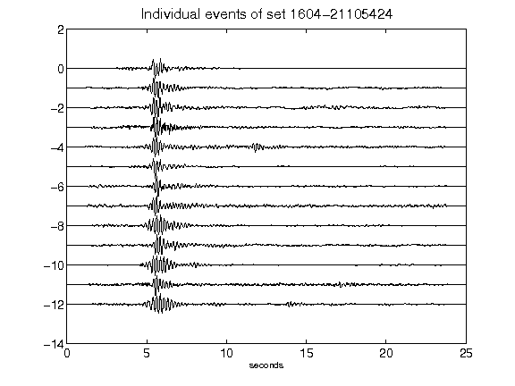](figures/1604-21105424_AllEv.png)[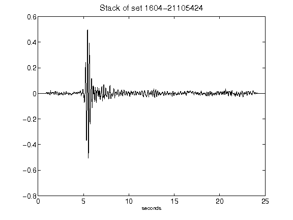](figures/1604-21105424_Stack.png)[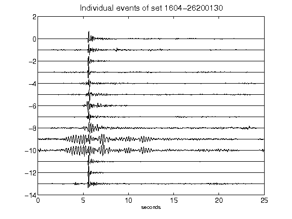](figures/1604-26200130_AllEv.png)[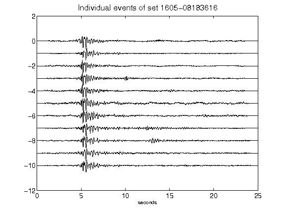](figures/1605-08183616_AllEv.png)[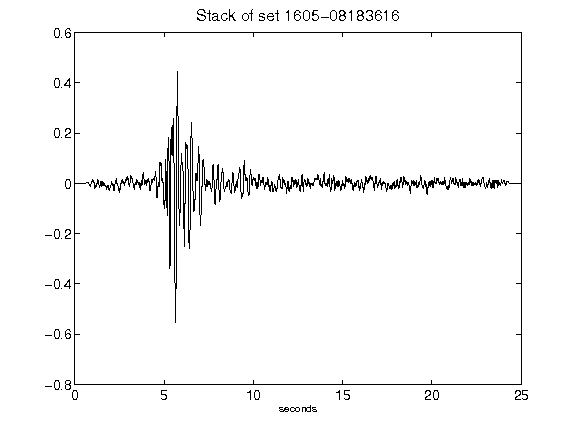](figures/1605-08183616_Stack.png)